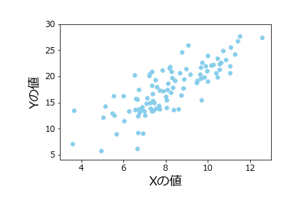

# 第10回　pandas入門

- [第10回　pandas入門](#第10回pandas入門)
  - [pandasとは](#pandasとは)
  - [データフレームの作成](#データフレームの作成)
  - [matplotlibのフォント設定](#matplotlibのフォント設定)
  - [散布図のプロット](#散布図のプロット)
  - [色の微調整](#色の微調整)
  - [回帰直線のプロット](#回帰直線のプロット)
  - [回帰直線と散布図のオーバレイ](#回帰直線と散布図のオーバレイ)
  - [補遺](#補遺)
    - [データフレーム表示行数の設定](#データフレーム表示行数の設定)
    - [matploblibフォント一覧の取得](#matploblibフォント一覧の取得)
    - [matplotlibのデフォルト設定の変更](#matplotlibのデフォルト設定の変更)

## pandasとは

前回の講義で学んだNumPyでは、配列構造を導入することにより、データ解析において必須とも言えるベクトル演算や要素への高速なアクセスを可能としていました。

しかしながら、NumPyの配列は基本的には複数のデータ型を混在させずに使用します。厳密にはオブジェクト型というデータ型を用いると混在させることができますが、高速化の利点は失われてしまいます。現実のデータは、測定する項目によってデータの型は異なるのが普通です。従って、NumPyの配列だけでは、データ解析には十分な柔軟性が得られないことが想像されます。

Rでは、こうした問題を**データフレーム**という構造を用いて解決しています。データフレームは行列、あるいは表のような構造をしており、各列内ではデータ型は固定ですが、列ごとに異なるデータ型を用いることが可能です。これによって、高速な計算と柔軟性を同時に実現することが出来ます。

**pandas**は、Pythonでデータフレームを使うためのモジュールであり、Pythonの世界におけるデータ解析ではスタンダードなツールとなっています。pandasは、**NumPy**をベースに構築されており、操作方法も似ています。

以前は機械学習モジュールのscikit-learnや可視化モジュールのmatplotlibなどの他のモジュールとの連携が十分でないイメージがありましたが、この問題は現在ではかなり解消し、他のデータ解析モジュールと高い互換性を実現しています。今や、Pythonでデータ解析をするならば、NumPyと同様、pandasを理解することは避けられないと言えます。

本講義では、前回の講義で作成した線形モデルの疑似サンプルデータを用いて、データを**pandas**のデータフレームに加工し、操作する方法を解説します。特にCSVファイルの操作と可視化に焦点を当てたいと思います。

## データフレームの作成

まずは`pandas`データフレームがどのようなものか説明するために、前回作った線形モデルの疑似データをデータフレームに格納してみましょう。まずは以下のコードを再実行し、疑似データを再作成してください。今回は、シード値を123に設定してからサンプリングしましょう。

```python
# %%
# 線形モデルからのサンプリング

import numpy as np
rng = np.random.default_rng(123)
x = rng.normal(8,2,100)
e = rng.normal(0,3,100)
y = 1 + 2 * x + e
```

念のため、`x`、`e`、`y`の内容を表示して、サイズ100のサンプルがちゃんと生成されているか確認しておいてください。

次に、`pandas`モジュールを読み込みます。`pandas`は、`pd`の別名で読み込むのが慣例となっているので、特段の理由が無い限りこれに従いましょう。

```python
# %%
import pandas as pd
```

それでは、`x`、`y`、`e`を変数とするデータフレームを作成しましょう。データフレームを作成する方法は幾つかありますが、最も簡単なのは以下のように辞書を用いる方法です。

この方法では、変数名をキー、対応するNumPyの配列を値として持つ辞書を作成し、pandasの関数DataFrameの引数に与えます。戻り値はデータフレームオブジェクトですので、これを適当な変数(ここでは`df`)に代入しておきましょう。

```python
# %%
data = {'x':x,'y':y,'e':e}
df = pd.DataFrame(data)
print(type(df))
```

```python
# 出力
<class 'pandas.core.frame.DataFrame'>
```

データフレーム`df`を表示してみましょう。

```python
# %%
print(df)
```

```python
# 出力

            x          y         e
0    6.021757  11.496212 -1.547303
1    7.264427  20.503193  4.974340
2   10.575851  21.259913 -0.891788
3    8.387949  13.625766 -4.150131
4    9.840462  19.837310 -0.843614
..        ...        ...       ...
95   5.555309  12.561268  0.450651
96   7.392817  15.309035 -0.476600
97   5.652623   9.026150 -3.279095
98   9.652547  21.696433  1.391339
99   9.700645  15.425901 -4.975388

[100 rows x 3 columns]
```

このように、途中の行は省略されていますが、100行×3列の表形式になっており、各列は`x`、`y`、`e`の値を格納していることが分かります。各行は、一つのオブザベーションであることに注意してください。

なお、上記のように、デフォルトでpandasのデータフレームはオブザベーションが一定行数を超える場合は中間のオブザベーションを省略して表示するようになっています。この表示設定を変更する方法は補遺に記載しておきます。

## matplotlibのフォント設定

次に、このデータを散布図にプロットしましょう。pandasのグラフ機能は、`matplotlib`というモジュールに依存しています。`matplotlib`のデフォルトのフォントでは日本語が文字化けしてしまうため、まずフォントの設定を行う必要があります。

次のように、`matplotlib`をインポートしてフォントを日本語フォントに変えましょう。Windowsでは"MS gothic"や"MS mincho"、"Meiryo"がありますが、ここでは"Meiryo"にしておきましょう。全てのフォント名を出力する方法は、補遺に記載しておきます。

```python
# MS ゴシックに変更
import matplotlib
matplotlib.rcParams['font.family'] = 'Meiryo'
```

また、上記のやり方では、毎回の起動時にフォントを設定する必要があります。起動時のデフォルトのフォントを変更する方法を補遺に記載しておきます。

## 散布図のプロット

散布図をプロットするには、データフレームの`plot.scatter`メソッドを使います。

```python
# %%
df.plot.scatter(x='x',y='y')
```

出力は以下のようになります。


オプション引数をつけることによって、様々な微調整が可能です。

|オプション引数|意味|
|--|--|
|`s`|マーカーサイズ|
|`c`|マーカー色|
|`marker`|マーカー形状|
|`xlim`|横軸範囲|
|`ylim`|縦軸範囲|
|`fontsize`|フォントサイズ|

これらのオプション引数は、例えば次のように使用します。

```python
# %%
df.plot.scatter(x='x',y='y',
s=30,                   # マーカーサイズ
c='skyblue',            # マーカーの色
marker='o',             # マーカーの形
xlim=(3,13),            # x軸の範囲
ylim=(4,30),            # y軸の範囲
fontsize=12             # 軸目盛のフォントサイズ
)
```

軸ラベルを変更するのは、少し手間がかかります。まず`matplotlib`のサブモジュール`pyplot`をインポートします(慣習として、`plt`という名前で読み込みます)。次に、`pyplot`モジュールの`xlabel`関数と`ylabel`関数で軸ラベルとそのサイズを次のように変更できます。

```python
# %%
import matplotlib.pyplot as plt
plt.xlabel('Xの値',size=18)
plt.ylabel('Yの値',size=18)
```

また、グラフ上下左右のマージンを設定するには、

```python
# %%
plt.subplots_adjust(left=0.1,bottom=0.2)
```

のように指定します。

ここで注意しなくてはならないのは、VS Codeの対話的モードで図を描く場合、図を描く関数の呼び出しと、図を調整する関数`plt.xlabel`等の呼び出しは、次のように**全て同じセルで行わなくてはならない**ということです(`import`は別のセルで構いません)。

```python
# %%
import matplotlib.pyplot as plt

df.plot.scatter(x='x',y='y',
s=30,                   # マーカーサイズ
c='skyblue',            # マーカーの色
marker='o',             # マーカーの形
xlim=(3,13),            # x軸の範囲
ylim=(4,30),            # y軸の範囲
fontsize=12             # 軸目盛のフォントサイズ
)
plt.xlabel('Xの値',size=18)
plt.ylabel('Yの値',size=18)
plt.subplots_adjust(left=0.1,bottom=0.1)
```

出力は次のようになります。



全てのマーカー形状と全ての色名は以下の`matplotlib`のサイトにリストアップされています。

- [全てのマーカー形状](https://matplotlib.org/stable/api/markers_api.html)
- [全ての色名](https://matplotlib.org/stable/gallery/color/named_colors.html)

また、`plot.scatter`メソッドの詳細な使い方は[pandasのリファレンス](https://pandas.pydata.org/pandas-docs/stable/reference/api/pandas.DataFrame.plot.scatter.html)を見てください。

## 色の微調整

マーカーの色はRGBもしくはRGBAでも指定可能です。RGBは、赤・緑・青の強さを0～1の数値で表したものです(0～255の1バイト整数で表すことも多いです)。三つの数値をタプルで表します。たとえば、

```cmd
(0,0,1)
```

は青原色となります。

また、RGBAは、RGBに加えて、第4の数値が不透明度を0～1で表します。1が最も不透明で、0が透明です。

`matplotlib`では、`colors.to_rgb`および`colors.to_rgba`関数によって色名からRGB値およびRGBA値を取得できます。

```python
# "coral"のRGBA値を取得
rgba_coral = matplotlib.colors.to_rgba("coral")
print(rgba_coral)
```

```python
# 出力

(1.0, 0.4980392156862745, 0.3137254901960784, 1.0)
```

たとえば、このRGBA値のアルファ値を少し減じてやることによって、透明度のある"coral"を作ることができます。

```python
# %%
rgba_coral_tr = rgba_coral[0:3] + (0.6,)
```

```python
df.plot.scatter(x='x',y='y',
s=30,                   # マーカーサイズ
color=rgba_coral_tr,            # マーカーの色
marker='o',             # マーカーの形
xlim=(3,13),            # x軸の範囲
ylim=(4,30),            # y軸の範囲
fontsize=12             # 軸目盛のフォントサイズ
)
plt.xlabel('Xの値',size=18)
plt.ylabel('Yの値',size=18)
plt.subplots_adjust(left=0.2,bottom=0.2)
```

結果は次のようになります。


ただし、RGB値やRGBA値を渡す場合は、引数名は`c`ではなく`color`にしてください。

## 回帰直線のプロット

それでは次に、単回帰の結果を散布図に重ねましょう。まずは回帰分析を再実行しておきます。

```python
# %%
# 回帰分析
from scipy import stats
res = stats.linregress(df.x,df.y)
print(res)
```

ここで、データフレーム`df`の変数`x`の配列と変数`y`の配列にアクセスするために、`df.x`、`df.y`という表記を用いていることに注意してください。このように、データフレームでは、`df.変数名`という表記によって、各列を取り出すことができます。

```python
# 出力
LinregressResult(slope=2.084996965456381, intercept=0.5997940915043358, rvalue=0.8057774353709972, pvalue=5.010945582964262e-24, stderr=0.15479582428347563, intercept_stderr=1.2937470389108192)
```

`intercept`が切片、`slope`が回帰係数であることに注意してください。

次に、この結果を用いて、回帰モデルの予測値を与えるデータフレームを用意しましょう。

まず、`x_model`を予測用のサンプルデータ点を表すNumPy配列にします。これは、グラフの定義域をカバーしていればどんな配列でもよいのですが、ここでは、3～13の範囲を100分割した数列にしておきましょう。このような操作には、NumPyの`linspace`関数を使います。

```python
# %%
x_model = np.linspace(3,13,100)
print(len(x_model))                 # 配列の長さ
print(np.round(x_model[:3],3))      # 最初の3要素
print(np.round(x_model[-3:],3))     # 最後の3要素
```

`linspace`の引数は、それぞれ、開始数値、終端数値、分割数です。

```python
# 出力
100
[3.    3.101 3.202]
[12.798 12.899 13.   ]
```

次に、`y_model`を、`y`の予測値を与える配列とします。これは、回帰分析の結果を用いて次のように計算できます。

```python
# %%
y_model = res.intercept + res.slope * x_model
```

これを用いて、100オブザベーションについての予測値を格納したデータフレーム`df_model`を次のように作成しておきます。

```python
# %%
df_model = pd.DataFrame({'x':x_model,'y':y_model})
print(df_model)
```

```python
# 出力

           x          y
0    3.00000   6.854785
1    3.10101   7.065391
2    3.20202   7.275996
3    3.30303   7.486602
4    3.40404   7.697208
..       ...        ...
95  12.59596  26.862332
96  12.69697  27.072937
97  12.79798  27.283543
98  12.89899  27.494149
99  13.00000  27.704755

[100 rows x 2 columns]
```

この予測値のデータフレームで、`x`横軸、`y`縦軸の折れ線グラフを描けば、回帰直線になっているはずです。回帰直線には、データフレームの`plot.line`メソッドを使います。`linestyle`引数で線の種類、`linewidth`で線の太さを設定できます。

```python
# %%
df_model.plot.line(x='x',y='y',
linestyle='dashed',
color='grey',
linewidth=3
)
```

`scatter`と同じく様々な微調整が可能ですが、ここでは後で散布図と重ねることを考慮して、微調整は行わないことにします。

出力は以下のようになります。


なお、

- [線の種類一覧](https://matplotlib.org/stable/gallery/lines_bars_and_markers/linestyles.html)

## 回帰直線と散布図のオーバレイ


## 補遺

### データフレーム表示行数の設定

pandasのデータフレームは、デフォルトで一部の行しか表示しないようになっています。表示行数を設定することはできますが、この設定がちょっと分かりにくいので、ここで詳しく説明しておきましょう。

pandasのオプションは、get_optionメソッドもしくは、options属性から確認できます。表示行数に関連するのは`min_rows`オプションと`max_rows`オプションです。

```python
# get_optionメソッドによる表示
print(pd.get_option('display.min_rows'))
print(pd.get_option('display.max_rows'))
```

```python
# options属性によるアクセス
print(pd.options.display.min_rows)
print(pd.options.display.max_rows)
```

```python
# 出力
20
60
```

この２つのオプションは分かりにくいですが、「データフレームの行数が`display.max_rows`を超えた場合は、`display.min_rows`行だけ表示する」という意味です。従って、デフォルトでは、60オブザベーション以下のデータフレームは全ての行を表示しますが、61オブザベーション以上のデータフレームについては途中を省略して最初と最後の20オブザベーションだけを表示することになります。

今の場合ですとデータフレームは100オブザベーションを含んでいますので、`display.max_rows`を100行以上に設定すると、全ての行が表示されるようになります。

また、省略された場合の表示行数を増やしたい場合は、`display.min_rows`を増やせばよいことになります。試しに`display.min_rows`を30に設定しましょう。オプションの設定は、set_option関数もしくは、options属性を変更することで行います。

```python
# %%
# set_option関数を用いる場合
pd.set_option("display.min_rows",30)
```

```python
# %%
# options属性によるアクセス
pd.options.display.max_rows = 60
```

```python
# %%
# データフレームの再表示
print(df)
```

```python
# 出力
            x          y         e
0    8.013504  18.317503  1.290495
1    9.896525  22.444125  1.651074
2   11.326705  26.724520  3.071111
3    8.938435  18.402628 -0.474241
4    6.862927  16.547593  1.821740
5   10.850879  22.979716  0.277957
6    9.264085  20.722213  1.194043
7    6.849750  13.762926 -0.936575
8   11.286648  22.471414 -1.101883
9   10.799512  22.553242 -0.045781
10   4.228583   7.170566 -2.286601
11  11.212478  23.096968 -0.327989
12   8.700634  17.235308 -1.165959
13   6.341005  20.754819  7.072809
14   8.717844  20.486063  2.050374
..        ...        ...       ...
85   7.623332  17.575759  1.329095
86   8.119302  16.581371 -0.657233
87   3.639397   3.949449 -4.329345
88   6.937774  19.882245  5.006697
89   3.661514  11.380440  3.057411
90   5.775179  11.460086 -1.090272
91   9.078126  19.656764  0.500513
92   7.534294  13.864200 -2.204387
93   8.182152  17.203746 -0.160558
94  10.004772  20.587155 -0.422388
95   8.927801  14.040083 -4.815520
96   5.269992  15.510429  3.970445
97  10.328037  20.252442 -1.403633
98   8.183177  18.688349  1.321994
99   5.729897  13.355884  0.896091

[100 rows x 3 columns]
```

### matploblibフォント一覧の取得

以下のコードを実行することで、自分の環境で使用可能なフォント名の一覧のリストが変数`font_names`に格納されます。

```python
# %%
import matplotlib.font_manager as fm
font_list =fm.get_fontconfig_fonts()
font_names = [fm.FontProperties(fname=name).get_name() for name in flist]
```

### matplotlibのデフォルト設定の変更

