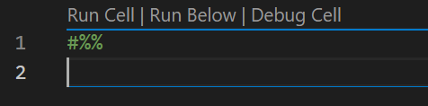
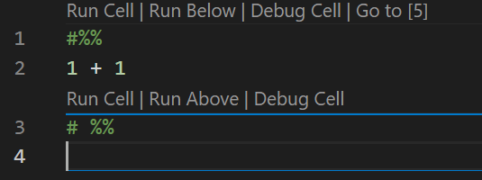
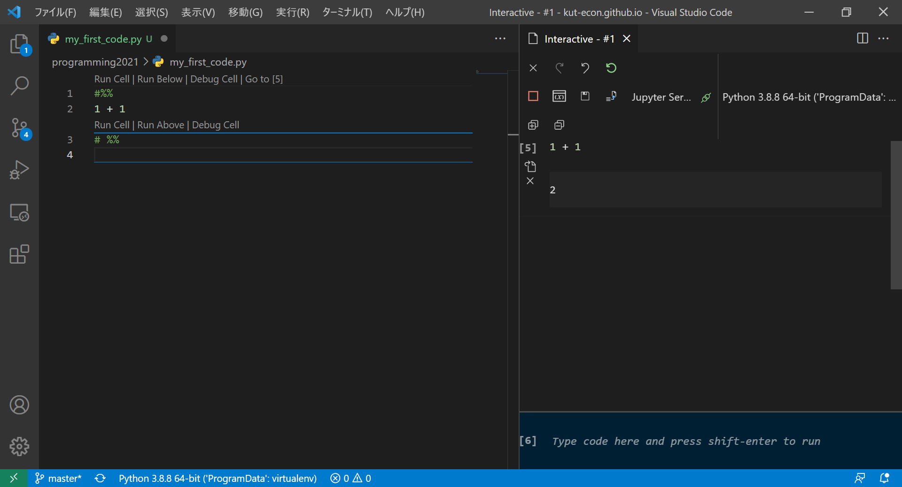
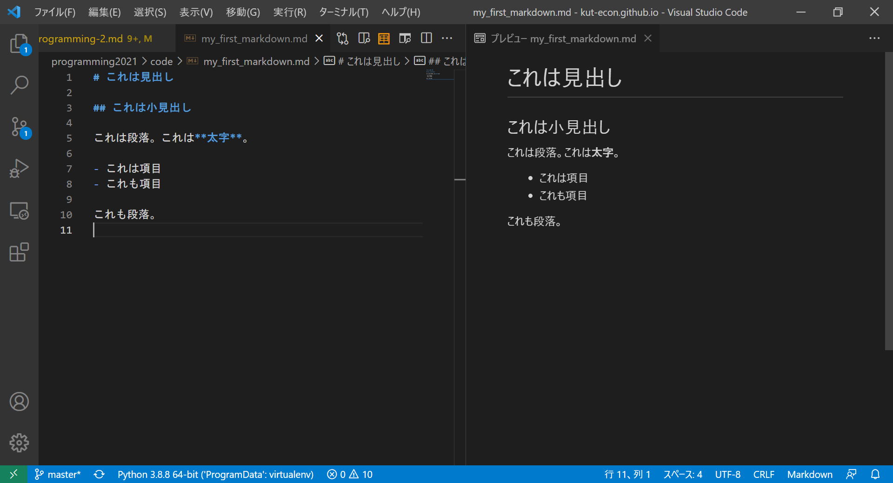
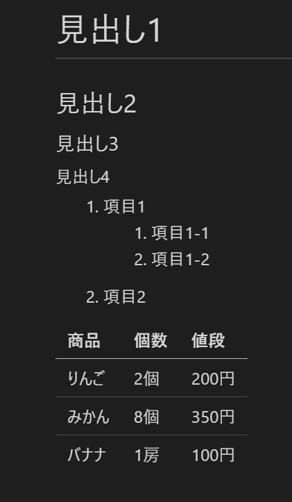

# 第2回 VS Code/仮想環境入門

- [第2回 VS Code/仮想環境入門](#第2回-vs-code仮想環境入門)
  - [VS Codeを起動する](#vs-codeを起動する)
  - [VS Code ショートカット](#vs-code-ショートカット)
  - [プロキシの設定(VS Code)](#プロキシの設定vs-code)
  - [各種エクステンションのインストール](#各種エクステンションのインストール)
  - [VS Codeインターラクティブモード](#vs-codeインターラクティブモード)
    - [練習1](#練習1)
  - [Emacsキーバインディング](#emacsキーバインディング)
    - [練習2](#練習2)
  - [マークダウン入門](#マークダウン入門)
    - [練習3](#練習3)
  - [プロキシの設定(Anaconda)](#プロキシの設定anaconda)
  - [Anaconda仮想環境](#anaconda仮想環境)
  - [仮想環境の状態チェック](#仮想環境の状態チェック)
  - [仮想環境の作成](#仮想環境の作成)
  - [VS CodeとAnacondaのインストール](#vs-codeとanacondaのインストール)
  - [VS Code以外のエディター](#vs-code以外のエディター)
    - [Emacs](#emacs)
    - [vi/vim](#vivim)
  - [まとめ](#まとめ)
  - [参考書](#参考書)

## VS Codeを起動する

プログラマにとって、ソースコードやスクリプトを編集するための**エディタ**は、料理人にとっての包丁と同じくらい重要なものです。プログラミングの練習においては、エディタの研究にも十分な時間を割きましょう。本講義では、Visual Studio Code(VS Code)という、Microsoftが開発したフリーのエディタを用いることにします。

それでは早速VS Codeを起動してみましょう。分かりやすい場所にGitHubという名前のフォルダーを作って、その中にさらにmy_first_codeという名前のフォルダーを作りましょう。（注；本講義では、「フォルダー」と「ディレクトリ」をほとんど同じ意味で用います。）my_first_codeの中身（からっぽ）をWindowsエクスプローラで表示し、右クリックすると「Codeで開く」という選択肢がありますので、それを選ぶと、VS Codeが起動します(下図)。


とりあえず覚えなくてはならないのは、左上のエクスプローラーと、それを開閉するボタンでしょう。エクスプローラーでは、現在いるフォルダmy_first_codeの中にどのようなファイルがあるかを示しています。なお本講義では、Pythonスクリプトが収められたフォルダーのことを「プロジェクト」と呼ぶこともありますのでご注意ください。VS Codeのエクスプローラーの詳しい使い方については、『独習Python』のp30-31を読んでください。

## VS Code ショートカット

VS Codeを使うに当たって、覚えたほうが良いショートカットが3つあります。

- **Ctrl+Shift+P**: コマンドパレットを開きます。VS Codeの諸々の操作は、このコマンドパレットに望みの操作に関連するキーワードを入力し、出てきた操作リストの中から望みの操作を選択するという形で行います。
- **Ctrl+Shift+X**: 拡張機能検索ウィンドウとインストール済み拡張機能の一覧を表示します。邪魔な拡張機能を無効にしたり、新しい拡張機能を探してインストールするのに使います。
- **Ctrl+,**: 設定項目検索ウィンドウを開きます。注)設定ファイルを直接編集するときは、コマンドパレットにsettings.jsonと入力してください。

その他、覚えると快適なショートカットに、

- **Ctrl+PgUp**, **Ctrl+PgDn**: タブを切り替えます。

などがあります。他にも無数のショートカットがありますので、探してみてください。

## プロキシの設定(VS Code)

VS Codeを快適に使うためには、インターネット経由で様々な**エクステンション**(拡張機能)をインストールする必要があります。大学内のPCでエクステンション（拡張機能）をインストールするためには、プロキシの設定が必要です（お家のパソコンでは必要ありません）。プロキシの設定はGUIを使う方法と、設定ファイル(settings.json)に直接書き込む方法の二通りがあります。

 **Ctrl+,**と叩くと、設定のための検索窓が立ち上がりますので、**proxy**と入力しましょう。すると、

```vscode
Http: Proxy
使用するプロキシ設定。設定されていない場合は、'http_proxy' および >'https_proxy' の環境変数から継承されます。
[                                        ]
```

というproxy設定パネルが現れますので、

```vscode
Http: Proxy
使用するプロキシ設定。設定されていない場合は、'http_proxy' および 'https_proxy' の環境変数から継承されます。
[http://proxy-server-addr:????            ]
```

のように大学のプロキシサーバーとポート番号を入力しましょう。ここで、proxy-server-addrはプロキシサーバーのアドレス、????はポート番号です(Moodleに記載してあります)。

入力できたら、設定ファイルに正しく書き込まれているか次のようにして確認しましょう。**Ctrl+Shift+P**と叩いて、コマンドパレットを開きます。**settings.json**と入力すると、幾つか候補が出てきますが、そのうち、

```vscode
基本設定：設定(JSON)を開く
Preferences: Open Settings (JSON)
```

を選択します。すると、json形式でかかれた設定ファイル**settings.json**が開かれますので、次のように、プロキシが記載されていることを確認します。

```json
{
    ...
    ...
    "http.proxy": "http://proxy-server-addr:????", 
    ...
    ...
}
```

...のところは何か色々書いてあると思いますが、プロキシの設定が見当たれば大丈夫です。

もしくは、上記のsettings.jsonを開いて、直接プロキシの行を書き込んでしまっても構いませんが、そのように直接書き込むメリットはあまり無いと思います。むしろ各種設定は、上記のsettings.jsonというjson形式のファイルに書き込まれていて、VS Codeで自由に追記・修正できるということを理解するのが重要でしょう。

## 各種エクステンションのインストール

プロキシの設定ができましたので、各種エクステンションがインストールできます。エクステンション（拡張機能）をインストールするには、**Ctrl+Shift+X**を叩きます。現れた検索ウィンドウにエクステンション名を入力すれば、候補をリストアップしてくれますので、望みのものを選んでインストールボタンを押しましょう。

以下のエクステンションが必要ですので、インストールしましょう。

- Japanese Language Pack for VS Code (VS Codeを日本語化)
- Python (これがないと論外)
- Awesome Emacs Keymap (Emacsキーバインディング)
- Pylance (Intellisenseがうまく機能しない場合、試す価値あり)
- Path Intellisense (ファイル名パス補完)
- R (Rが実行できるようになります)
- R Tools (R用のIntellisense)
- Rainbow CSV (CSVファイルが見やすくなります)
- Edit CSV (CSVが編集できる)
- Markdown All in One (マークダウン便利ツール集)
- markdownlint (Markdownの構文チェッカー)
- Markdown PDF (MarkdownファイルをPDFやHTMLに変換)

マークダウン系のエクステンションは(文字通り)無数に存在しますので、必ずしも上記のもので無くて良いですし、より良いものがあるかもしれません。ぜひ自分に合うエクステンションを探してみてください。上のエクステンションを全て一度にインストールするのは大変だと思うので、まずは**Japanese Language Pack**と**Python**エクステンションをインストールしましょう（残りは各自インストールしておいてください）。

なお以下は授業では使いませんが、AWSなどの外部サーバーで開発を行う際に大変重宝します。リモートのファイルを直接VS Codeで編集できます。

- Remote - SSH (外部サーバー等にSSH接続できる)

以下は、VS Code内で図を書くことができる便利なエクステンションです。ソフトウェアの設計図などをMarkdownで書きたい人には大変便利です。本稿の図はほとんどこのエクステンションを使って作成しました。

- Draw.io Integration (図を作成)

## VS Codeインターラクティブモード

それでは大体の準備ができたので、いよいよVS Codeでプログラミングしてみましょう。Pythonのプログラミングを行うときは、インターラクティブモードという、VS Codeの内部で**Jupyter**を起動する方法が便利です。

VS Codeのエクスプローラからmy_first_code.pyというファイルを作成し、開いてください(教科書pp.30-31参照)。1行目に次のように入力してください。

```python
#%%
```

もし編集画面が次のように変化すればインターラクティブモードの起動に成功したことを表します。



ためしに、簡単な計算を行ってみましょう。"#%%"記号のすぐ下に計算式を書いて**Shift-Enter**と叩いてみましょう。すると次のように編集画面が変化します。



この編集画面で二つの"#%%"記号と青線に挟まれた部分は**セル**と呼ばれ、この部分に記述されたPythonコードは、**Shift-Enter**によってまとめて実行されます。

一方、セルを実行して得られた結果は、画面右の**インターラクティブウィンドウ**に表示されます。



上図で右側がインターラクティブウィンドウです。1+1の結果である2が表示されています。

### 練習1

VS Codeインターラクティブモードを用いて、以下のような様々な計算を行ってみなさい。

```python
# %%
x = 1
y = 2
print(x + y)
# %%
z = x + y
print(y ** z)
# %%
print("Hello, World!")
```

いくつかセルが出来たら、"# %%"記号の横にある"Run Cell"、"Run Above"、"Run Below"などをクリックしてみましょう。何が起きたか分かりますか？("Run Debug"は難しいのでクリックしないように。)

## Emacsキーバインディング

これで自由にPythonコードを実行できるようになりました。ここで、ついでにEmacsキーバインディングの練習をしましょう。まず、上で説明した手順にしたがって、**Awesome Emacs Keymap**エクステンションをインストールしてください。

Awesome Emacs Keymapエクステンションをインストールすると、Emacsキーバインディングが使えるようになります。
my_first_code.pyを開き、コードの任意の箇所にカーソルを置いて、Ctrl-nと叩いてみましょう。カーソルが次の行に移動したらキーバインディングが正常に機能しています。Ctrl-pと叩けばカーソルが前の行に移動するはずです。このように、キーバインドを使うと、マウスを使わずにカーソルを移動できます。

主なEmacsキーバインディングは以下の通りです。

|キー操作|動作|
|--|--|
|Ctrl-n|次の行に移動|
|Ctrl-p|前の行に移動|
|Ctrl-b|前の文字に移動|
|Ctrl-f|次の文字に移動|
|Ctrl-a|行頭へ移動|
|Ctrl-e|行末へ移動|
|Ctrl-v|次のページへ移動|
|Alt-v|前のページへ移動|
|Ctrl-k|現在の行のカーソル以降を削除|
|Ctrl-d|前方一文字削除|
|Ctrl-h|後方一文字削除|
|Ctrl-s|順方向検索|
|Ctrl-r|逆方向検索|
|Ctrl-x Ctrl-s|保存|
|Ctrl-space|マーク設定|
|Ctrl-w|マーク設定地点からカーソル位置までをカット|
|Ctrl-y|貼り付け|
|Ctrl-x Ctrl-c|エディター終了|

これらのキーバインドを駆使して、可能な限りマウスに触らないでコーディングするのが**ストレスレス**プログラミングの基本です。タッチタイピングで視線の移動を減らし、Emacsキーバインディングで手の移動を減らして、ストレスレスプログラミング生活を楽しみましょう。上記の他にも多数の便利なキー操作がありますので、インターネット等で調べてみてください。また、ここでは説明しませんが、VS Codeはキーバインドを細かくカスタマイズすることもできます。気になる人は、インターネットでカスタマイズの方法を調べてみましょう。

### 練習2

my_first_code.pyの上で、上の表に上げたキーバインドを一つずつ試してみましょう。

## マークダウン入門

次に、簡単なマークダウンファイルを作成してみましょう。マークダウンとは、HTMLのようなマークアップ言語の一種で、プレーンテキスト文書に書式を付けて文書を整形するための言語です。ホームページを記述するためのHTML(HyperText Markup Language)については皆さんご存知かとおもいますが、Markdownは、HTMLよりももっと機能を限定して簡略化したようなものです。

HTMLでは、たとえば見出しや段落を作るとき、次のようなテキスト文書をつくります。

```html
<html>
<body>
    <h1>見出し</h1>
    <h2>これは小見出し</h2>
    <p>
        これは段落。これは<b>太字</b>。
        <ul>
            <li>これは項目</li>
            <li>これも項目</li>
        </ul>
    </p>
    <p>
        これも段落。
    </p>
</body>
</html>
```

しかし、HTMLには次のような欠点があります。

- 書くのが面倒
- 読みにくい
- ソースと表示が違い過ぎる

そこで、スタイルなどの細かい微調整は諦めてもっと簡潔に書式を記述できるようにしたのがマークダウンです。マークダウンでは上記と同じ文書が次のようになります。

```markdown
# これは見出し

## これは小見出し

これは段落。これは**太字**。

- これは項目
- これも項目

これも段落。
```

HTMLに比べると非常に簡潔であることが分かると思います。

マークダウン文書を作成するまえに、以下のエクステンションをインストールする必要があります。

- Markdown All in One (マークダウン便利ツール集)
- markdownlint (Markdownの構文チェッカー)
- Markdown PDF (MarkdownファイルをPDFやHTMLに変換)

エクステンションがインストールできたら、早速マークダウンを書いてみましょう。VS Codeのエクスプローラで、my_first_markdown.mdというファイルを作成し、開いてください。(マークダウン文書の拡張子は必ず.mdにします。)文書を開いたら、Emacsキーバインドなどを活用しつつ、上述のマークダウン文書を打ち込んでいきましょう。



上図で、画面の左がソースファイルの編集画面、右側にはプレビューが表示されます。ソースとプレビューを比較すると分かるように、両者に大きな違いがないことが分かります。これがマークダウンの最大の特徴です。

|記法|解説|出力|
|--|--|--|
|# 見出し|# + 半角スペース +　見出し文字列|大きい見出し|
|## 見出し|## + 半角スペース +　見出し文字列|中くらいの見出し|
|## 見出し|### + 半角スペース +　見出し文字列|小さい見出し|
|\*\*文字\*\*|\*\* + 太字にしたい文字列 + \*\*|太字|
|- 項目|マイナス記号 + 半角スペース + 箇条書き項目|箇条書き|
|1. 項目|数字 + ピリオド + 半角スペース + 箇条書き項目|数字付き箇条書き|
|----|ハイフン三つ以上|水平線|

見出しは#記号の数が多いほど小さくなります。見出しの前後は必ず1行の空行を入れます。

```markdown
# 見出し1

## 見出し2

### 見出し3

#### 見出し4
```

なお、入れ子の箇条書きをVS Codeで作る時はタブキーで字下げをすると入れ子になります。(ちなみに、**Shift+Tab**で字下げを元に戻せます。)

```markdown
1. 項目1
  1. 項目1-1
  2. 項目1-2
2. 項目2
```

表は次のように作ります。

```markdown
|商品|個数|値段|
|--|--|--|
|りんご|2個|200円|
|みかん|8個|350円|
|バナナ|1房|100円|
```

### 練習3

my_first_markdown.mdに上記の見出し、入れ子の箇条書き、表の例を記述し、プレビューを確認しなさい。以下のようになりましたか？



## プロキシの設定(Anaconda)

Windowsスタートメニューから、Anaconda Promptを起動し、次のように入力すると、Anacondaの設定が表示されます。

```
(base) C:\Users\hoge>conda config --show
```

これだと全ての設定が表示されてしまって見にくいので、以下のようにしてproxyの設定だけ表示しましょう。

```
(base) C:\Users\hoge>conda config --show proxy_servers
proxy_servers: {}
```

上記のようにproxy_serversの項目が空欄になっていたら、プロキシが設定されていません。その場合は、以下のように順次入力してhttpとhttpsの両方にnocのプロキシサーバーを設定しましょう。

```
(base) C:\Users\hoge>conda config --set proxy_servers.http http://proxy-server-addr:????
(base) C:\Users\hoge>conda config --set proxy_servers.https http://proxy-server-addr:????
```

ここで、proxy-server.addrは正しいプロキシサーバーのアドレス(Moodleに記載)に、????は正しいポート番号に置き換えてください。

もう一度設定を表示して、プロキシが正しく設定されているか確認しましょう。

```
(base) C:\Users\hoge>conda config --show proxy_servers
proxy_servers:
  http: http://proxy-server-addr:????
  https: http://proxy-server-addr:????
```

上記の用に表示されれば正しく設定されています。

## Anaconda仮想環境

Anacondaを使うと、Pythonの仮想環境を作成することができます（Anacondaが無くてもvenvモジュールを使って作ることができます）。仮想環境とは、新しくPythonがインストールされていて、自由にパッケージのインストール・アンインストールを行うことができる自分専用の環境のことです。

Pythonでは、新しいパッケージやバージョンの異なるパッケージを試してみる場合に、仮想環境を作って試してみるのが定石です。特に、情報演習室のパソコンでは、学生も教員も管理者権限をもっていませんので、仮想環境を作らない限りパッケージを自由にインストールできません。また、Anaconda環境においても、condaではパッケージがインストールできずpipパッケージマネージャを使いたい場合があります。condaとpipを混ぜて使用するのは**危険行為**ですので、こういったことをするときは、必ず新しい仮想環境を作って行うようにしましょう。

このように、仮想環境の知識はPythonを使う上で必須ですので、今から仮想環境に慣れましょう。

## 仮想環境の状態チェック

Anacondaをインストールすると、baseという名前の仮想環境が作成され、baseに入っている状態でcondaコマンドを呼び出して新たに仮想環境を作っていくことになります。

まずは現在存在している仮想環境をcondaコマンドでチェックしておきましょう。

```
(base) C:\Users\hoge>conda env list
# conda environments:
#
base                  *  E:\ProgramData\Anaconda3
```

最初は仮想環境がbaseしか存在しないので、#のある行を除けば1行しか出力されません。アスタリスク(*)は、現在自分のいる仮想環境がbaseであることを示しており、そのあとのパスはbaseがインストールされているディレクトリを表しています。全く同じ出力は、次のようにしても得られます。

```
(base) C:\Users\hoge>conda info --envs
# conda environments:
#
base                  *  E:\ProgramData\Anaconda3
```

次に、baseにはどれだけのパッケージがインストールされているのか調べてみましょう。

```
(base) C:\Users\hoge>conda list
# packages in environment at E:\ProgramData\Anaconda3:
#
# Name                    Version                   Build  Channel
_anaconda_depends         2020.07                  py38_0
_ipyw_jlab_nb_ext_conf    0.1.0                    py38_0
alabaster                 0.7.12             pyhd3eb1b0_0
anaconda                  custom                   py38_1
anaconda-client           1.7.2                    py38_0

...（中略）...

xz                        5.2.5                h62dcd97_0
yaml                      0.2.5                he774522_0
yapf                      0.31.0             pyhd3eb1b0_0
zeromq                    4.3.3                ha925a31_3
zfp                       0.5.5                hd77b12b_6
zict                      2.0.0              pyhd3eb1b0_0
zipp                      3.4.1              pyhd3eb1b0_0
zlib                      1.2.11               h62dcd97_4
zope                      1.0                      py38_1
zope.event                4.5.0                    py38_0
zope.interface            5.3.0            py38h2bbff1b_0
zstd                      1.4.5                h04227a9_0
```

ものすごく長い出力が得られたと思いますが、これらが全て予めインストールされているパッケージです。

## 仮想環境の作成

本授業では、次の三つの仮想環境を作っておくことにします。

- env_class : 通常授業のための仮想環境
- otree5 : otree(ver.5)のための仮想環境
- otree3 : otree(ver.3)のための仮想環境

まずはAnaconda promptを起動して、既存の仮想環境を確認しておきます。

## VS CodeとAnacondaのインストール

VS CodeとAnacondaのインストール方法は、『独習Python』のセクション1.3に詳しく載っていますので、こちらを参照し、自分のパソコンや研究室のパソコンにこれらのツールをインストールしてください。課題が情報演習室でしかできないのはあまりにも不便であり、学習もはかどりません。

ただし、LinuxにはAnacondaをインストールすべきでないと筆者は考えています。Linuxではpipだけで十分にpythonのバージョン・パッケージ管理ができますし、Anacondaは経験上、X Windowシステムに致命的なダメージを及ぼす危険性があります（二度と復旧しなかった経験が2度ほどあります）。Linuxには、直接Python3をインストールし、パッケージ管理はpipモジュール(パッケージマネージャ)を用いて行うことをお勧めします。

Anacondaとの相性が良いのはWindowsですので、WindowsユーザーにはAnacondaをお勧めします。Macについては良く分かりません。

## VS Code以外のエディター

### Emacs

VS Code以外にもエディターはたくさんありますが、代表的なものはvi(vimともいう)とEmacsです。プログラミングするだけならば、VS CodeはEmacsと同程度に拡張性があり、Emacsよりも使いやすいので、VS Codeがインストールされている環境ではわざわざEmacsでコーディングする理由はないと思うかもしれません。

しかしながら、VS Codeは大がかりなアプリケーションなので、慣れてくると、ちょっとしたプログラムを作成するのに一々VS Codeを立ち上げるのは面倒くさいと思うようになるでしょう。そのようなときに、より手軽なEmacsが便利ですので、覚えておいて損はありません。

また、プログラミングを好きになりたいのなら、Emacsのキーバインディングをしっかりとマスターすることを強くお勧めします。その練習のためにEmacsを使ってみるのは有益だと思います。

### vi/vim

ぜひマスターしてほしいもう一つのエディターはvi(vimともいう)です。こちらは、数多あるエディターの中でも最も軽快に動作するエディターであり、Linux/Unixに標準で搭載されています。標準で搭載されているので、どのマシンでもいきなり使えるという保証がありますし、何よりも動作が軽快なので、「ちょこっと」設定ファイル等を書き換えるのに大変重宝します。筆者は、Linuxの設定ファイルを編集したりするのにはviを、プログラミングにはVS CodeやEmacs、Pycharmといった重厚なエディターを使うというふうに使い分けています。Linuxをいじりだすとわかりますが、各種の設定ファイルをちょこちょこ書き換えるのにいちいちEmacsなどを立ち上げていられません(いわずもがな、VS Codeなどは論外です)。Gitでコミットする際のメッセージを編集するのにもviが軽快で便利です。viのマニュアルはネット上に溢れていますので、ぜひ試してみてください。

## まとめ

## 参考書

- [『Markdownライティング入門』](https://www.amazon.co.jp/Markdown%E3%83%A9%E3%82%A4%E3%83%86%E3%82%A3%E3%83%B3%E3%82%B0%E5%85%A5%E9%96%80-%E3%83%97%E3%83%AC%E3%83%BC%E3%83%B3%E3%83%86%E3%82%AD%E3%82%B9%E3%83%88%E3%81%A7%E6%B0%97%E6%A5%BD%E3%81%AB%E6%9B%B8%E3%81%93%E3%81%86%EF%BC%81-%E6%8A%80%E8%A1%93%E3%81%AE%E6%B3%89%E3%82%B7%E3%83%AA%E3%83%BC%E3%82%BA%EF%BC%88NextPublishing%EF%BC%89-%E8%97%A4%E5%8E%9F-%E6%83%9F/dp/4844398369/ref=tmm_pap_swatch_0?_encoding=UTF8&qid=&sr=)(藤原 惟)(2018) インプレスR&D. ISBN-13:978-4844398363.
