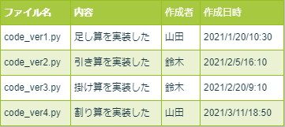
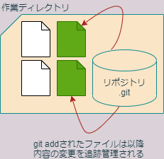
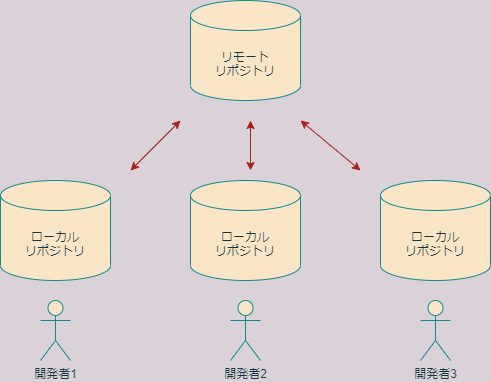
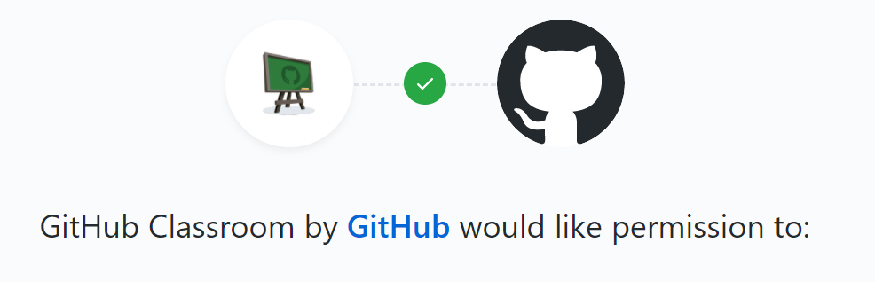
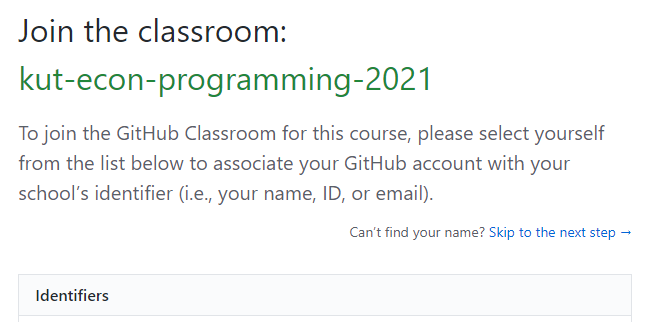
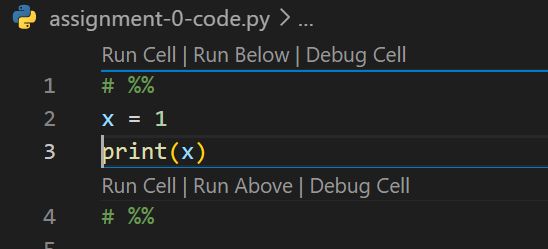
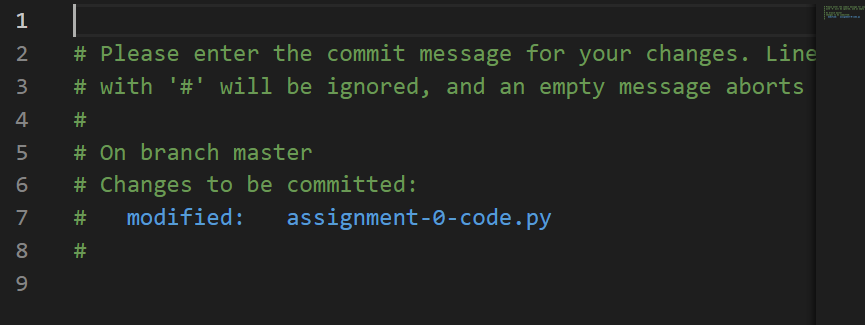
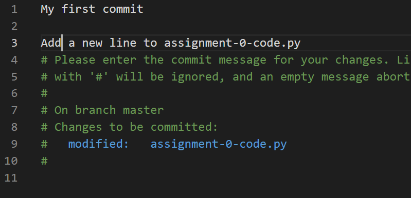

# 第3回 バージョン管理入門

- [第3回 バージョン管理入門](#第3回-バージョン管理入門)
  - [バージョン管理とは](#バージョン管理とは)
  - [ローカルとリモート](#ローカルとリモート)
  - [GitHubアカウントの作成](#githubアカウントの作成)
  - [EmailアドレスのPrivate設定](#emailアドレスのprivate設定)
  - [リモート課題レポジトリの作成](#リモート課題レポジトリの作成)
  - [Gitの初期設定](#gitの初期設定)
  - [ローカル課題リポジトリの作成(ダウンロード)](#ローカル課題リポジトリの作成ダウンロード)
  - [ローカル課題リポジトリの編集](#ローカル課題リポジトリの編集)
  - [変更のステージング](#変更のステージング)
  - [変更のコミット](#変更のコミット)
  - [リモートをローカルに同期(プッシュ)](#リモートをローカルに同期プッシュ)
  - [ローカルをリモートに同期(プル)](#ローカルをリモートに同期プル)
  - [主なGitコマンドまとめ](#主なgitコマンドまとめ)
  - [まとめ](#まとめ)
  - [参考書](#参考書)
  - [宿題(ホームワーク)](#宿題ホームワーク)
  - [課題(アサインメント)](#課題アサインメント)

## バージョン管理とは

プログラミングをしていると、しばしば、以前の状態に戻したいということがあります。これを実現する最も単純な方法は、ときどきファイルにバージョン入りで別名をつけ、別ファイルとして保存しておくことでしょう。

たとえば、code.pyというソースコードを編集している開発者がいるとします。ある時点で機能が安定したら、さらに機能を追加する前に、開発者はいつでもこのバージョンに戻ってこられるようにするために、code_ver1.pyという別名を付けてバージョン1として保存しておけば良いでしょう。同様に、code_ver2.py、code_ver3.pyというファイルが次々と出来上がっていくでしょう。

開発期間が短ければ、これでも何とかなるかもしれません。しかし、比較的小さなプロジェクトでも、時間が経つにつれてファイルの数は膨大になるのが普通です。そうすると、どのバージョンがどんな状態だったかすぐに分からなくなります。

これを解決するために、開発者は、たとえばエクセルのようなスプレッドシードに、バージョン名とその内容、作成者の氏名、作成日時を記録していくかもしれません。



これはある種のバージョン管理であると言えます。これに、さらに以下のような機能を追加すればもっと便利でしょう。

- 関連する複数のファイルのバージョンを一括して管理できる
- バージョン間の親子関係を表示できる
- 異なるバージョンの内容を比較できる
- 複数人が独立に作業できる

Gitはこうした機能を実現する仕組みです。Gitは、Linuxの開発者であるLinus TorvaldsがLinuxの共同開発を進めるために開発したツールです。Gitでは、アプリケーション開発など、一つのプロジェクトに関わる全てのファイルを**リポジトリ**という特別な装置によって管理します。

リポジトリは、通常、**作業ディレクトリ**とよばれる一つのディレクトリの中に収められた状態で存在し、作業ディレクトリの中にあるファイルの現在の状態や過去のバージョンを管理しています。リポジトリの正体は、作業ディレクトリの中にある.gitという隠しフォルダです。



## ローカルとリモート

一方GitHubはインターネット上にリポジトリを置くためのサービスです。インターネット上のリポジトリを**リモートリポジトリ**と呼びます。



一方、開発者のパソコン上に存在するリポジトリを**ローカルリポジトリ**と呼びます。GitHubを用いると、複数の開発者が共通のリモートリポジトリを介して共同開発を行うことができます。

Gitを用いると、リモートリポジトリとローカルリポジトリを同期させることができます。リモートリポジトリをローカルと同じ状態に同期させることをプッシュ、その逆をプルと言います。共同開発者は、プルによってローカルの状態を最新にしたあと、自分の担当部分の作業を進め、作業が終わったらプッシュによって作業の結果をリモートにアップロードすることができます。

|おもなGit用語|意味|
|--|--|
|プッシュ|リモートの状態をローカルの状態に同期|
|プル|ローカルの状態をリモートの状態に同期|
|コミット|作業をリポジトリの履歴に記録する|

GitHubのリモートリポジトリには、プライベートリポジトリとパブリックリポジトリがあります。パブリックリポジトリは誰でも見ることができ、パッケージ公開などに用いられます。一方パブリックリポジトリは自分と共同開発者だけが閲覧できるので、個人的な用途や、グループでの研究開発などに用いられます。

|リポジトリの種類|書き込み権限|閲覧権限|
|--|--|--|
|プライベート|自分と共同開発者|自分と共同開発者|
|パブリック|自分と共同開発者|誰でも|

本講義では、課題の提出にGitHub classroomというGitHubの教育用サービスを活用します。GitHubは、課題をリモートリポジトリとして学生に配布する機能を提供します。本講義では、課題リポジトリはプライベートリポジトリにしますので、学生個人と担当教員だけが閲覧できます。

## GitHubアカウントの作成

Gitは今すぐにでも使うことができますが、GitHubを利用するには、まずGitHubのサイトでユーザー登録をしてアカウントを作成する必要があります。以下のような方は、必ず新たにアカウントを作成してください。

- GitHubアカウントを持っていない人
- GitHubアカウントを持っているが、大学以外のメールアドレスでカウントを作成した人

大学のメールアドレスで作成したGitHubアカウントをお持ちの方は、新たに作成する必要はありません。

インターネットブラウザで[GitHub](https://github.com/)のサイトに行き、画面右上の"Sign up"をクリックします。

"Create your account"という画面になりますので、以下の項目を入力します。

   1. ユーザー名
   2. Emailアドレス(**必ず大学のアドレスを入力**)
   3. パスワード(紛失しないよう厳重に管理すること)

ユーザーネームを作成するときは、以下の点にご注意ください。

- 一度アカウントを作成したらユーザー名は(少なくとも在学中は)変更しないでください。
- 長く使うものなので、よく考えて命名してください。
- 他人の名前を使わないでください。
- プログラマのスキル証明に使われますので、本名に近いものが望ましいです。
- 生年月日などの個人情報は含まないでください。
- すべて**小文字英数字**にしてください。
- アルファベットは小文字にすることをお勧めします。
- 途中に連続しないハイフンを使うことができます。

パスワードを決めるときは、以下の点にご注意ください。

- 全て半角の英数字もしくは記号で構成してください。
- 次の条件の少なくともどちらかを満たしてください。
  - 15文字以上。
  - 8文字以上で数字と小文字アルファベットを両方含む。
- パスワードは紛失しないように管理してください。


ユーザー名等の入力を終えたら、"Verify your account"の項目でロボットでないことを証明し、"Creat account"をクリックします。

"Welcome to GitHub"というページになりますので、以下のように入力してください。

What kind of work do you do, mainly?はStudentを選択してください。


How much programming experience do you have?はA littleなどご自身のプログラミング経験のレベルにあったものを選択してください。


What do you plant to use GitHub for?については、Learn to code、Learn Git and GitHub、School work and student projectsなどを選択しておけば良いでしょう。(3つまで選択可)


I am interested inのところは、pythonと入力し、"Complete setup"をクリックします。


"Please verify your email address"という画面になったら無事アカウント作成に成功です。


アカウント作成の後、認証作業が必要になります。登録した大学のEmailにGitHubから"Please verify your email address"という件名のメールが来ているはずですので、内容を確認してください。"Verify email address"というボタンがあるはずなので、これをクリックします。

インターネットブラウザが起動し、"What do you want to do first?"というページになりますので、一番下の"Skip this for now"をクリックしてください。これでアカウント作成・認証とも完了です。いつでもGitHubが使える状態になりました。


今後GitHubにログインするときは、GitHubのページの右上の"Sign in"をクリックしてユーザー名とパスワードを入力してください。

## EmailアドレスのPrivate設定

アカウントを作成したら、Emailの公開設定をします。GitHubにログインして、[GitHubのemail設定](https://github.com/settings/emails)を開き、Keep my email address privateをONにしてください。これにより、Emailアドレスは非公開になります。Primary email addressの欄に次のように表示されていることを確認してください。

>Because you have email privacy enabled, xxxx@xxxx.xx.xx will be used for account-related notifications as well as password resets. ????????+kouka-taro@users.noreply.github.com will be used for web-based Git operations, e.g., edits and merges.

ここで、xxxx@xxxx.xx.xxは大学のメールアドレスで、各種認証やGitHubからの連絡に用いられます。一方、????????+kouka-taro@users.noreply.github.comは、Gitのemailアドレスに設定するためのものです。

なお、授業では非公開設定を推奨しますが、公開する必要がある場合は自己責任で行ってください。

## リモート課題レポジトリの作成

GitHub classroomの課題を行うに当たっては、まず課題の招待を受け入れ、自分専用の課題リポジトリをGitHub上に作成する必要があります。Moodleに記載されている「課題0の招待リンク」をクリックしましょう。

以下のような画面になり、GitHub ClassroomがあなたのGitHubアカウントにアクセスする許可を求めてきますので、Authorize Classroomをクリックして許可します。



"Join the classroom"という画面に切り替わりますので、"Identifiers"の一覧から自分の名前を選択します。(万が一自分の名前がない場合はご連絡ください。Moodleにユーザー登録されていない可能性があります。)**ここで間違った名前を選択すると、教員による取り消し操作が必要になりますのでご注意ください**。



画面が切り替わりますので、"Accept this assignment"をクリックして課題を受け入れます。


これであなた専用の課題のリモートリポジトリが作成されました。リモートリポジトリの名前は、アカウント名がkouka-taroならば、

```none
assignment-pr21-0-kouka-taro
```

のようになっているはずです。
[KUT Econ Programming Course](https://github.com/kut-econ)にアクセスして、自分の課題リポジトリが出来ているか確認してください。

## Gitの初期設定

次は、GitHubのアカウント上に作成したリモートのリポジトリをパソコン(ローカル)にダウンロードしましょう。これ以降は、Gitというアプリケーションを使っていくことになります。

以前作成したGitHubフォルダを開いて、右クリックし、"Git bash here"を選びます。すると、画像のようなコンソールが開きます。bashというのは元々Linuxのコンソールで用いられているコマンド入力システム([コマンドラインシェル](https://ja.wikipedia.org/wiki/%E3%82%B7%E3%82%A7%E3%83%AB)と呼ばれます)であり、Git bashはgitをWindows上で使いやすくするためにWindowsに移植されたWindows版bashです。Gitには色んな操作方法がありますが、Git bashのようなコンソールからコマンドを打ち込んで操作するのが最も基本的な操作方法ですので、ここではそれに従います。(使える機能は限定されていますが、VS Code上でGitの操作を行うこともできます)

Gitは使用前に以下の項目に関する初期設定が必要です。

- ユーザー名
- Emailアドレス（GitHubのダミーemail）
- エディタ
- プロキシ

ユーザー名、Emailアドレス、プロキシを設定するには次のようにコンソールに打ち込みます。

```bash
# ユーザー名設定
git config --global user.name "Taro Kouka"
```

ここで、Taro Koukaは自分の本名です。

```bash
# Email設定
git config --global user.email xxxxxxxx+kouka-taro@users.noreply.github.com
```

ここで、????????+kouka-taro@users.noreply.github.comは、githubが作成したダミーのemailアドレスです。ここに大学のemailアドレスを入力しても構いませんが、公開されるものですので、自己責任で行ってください。(いつでも好きなときに変更できます。)

```bash
# proxy設定
git config --global http.proxy http://proxy.addr:0000
git config --global https.proxy http://proxy.addr:0000
```

proxy.addrは適切なプロキシサーバー名、0000は適切なポート番号に設定してください。

Gitでは、「コミット」という操作を行う際にエディタを起動する必要があります。その際に用いるエディタをcodeにしておきましょう。デフォルトではviですので、viのままで良い人は設定の必要はありません。

```bash
# エディタの設定
git config --global core.editor "code --wait"
```

"--wait"オプションをつけないとうまく動作しないので気を付けてください。

なお、**VS Codeのパス**を通していない人は、この設定も必要です。これについては、[前回資料](./programming-2.md)末尾の覚書を参考にしてください。

設定がうまく行ったか次のコマンドで調べておきましょう。

```bash
# 設定項目をリストアップ
$ git config --global --list
user.name=Taro Kouka
user.email=????????-kouka-taro@users.noreply.github.com
core.editor=code --wait
proxy.http=http://proxy.addr:0000
proxy.https=http://proxy.addr:0000
```

上記のようになっていれば設定完了です。

## ローカル課題リポジトリの作成(ダウンロード)

基本設定が完了したら、先ほど作成したリモート課題リポジトリをローカルにコピーしましょう。課題リポジトリをリモートからローカルにコピーするにはbashコンソールに次のように入力します。

```bash
git clone https://github.com/kut-econ/assignment-pr21-0-kouka-taro.git
```

kouka-taroのところはご自身のGitHubアカウント名にしてください。これによってリモートのリポジトリが、ローカルのGitHubディレクトリ下に作成されますので、エクスプローラで確認してみましょう。GitHubディレクトリの下に、assignment-...という名前のディレクトリが作成されていれば成功です。

このように、リモートリポジトリをローカルにコピーする操作を**クローン**と呼びますので覚えておきましょう。クローンするコマンドの一般形は次のようになります。

```bash
git clone repository_url
```

repository_urlはリモートリポジトリのurlです。このurlは、自分のリモート課題リポジトリにインターネットブラウザでアクセスすることにより調べることができます。[KUT Econ Programming Course](https://github.com/kut-econ)のサイトで自分のリモート課題リポジトリのリンクを見つけ、クリックしてください。以下のようにリポジトリの内容が表示されます。


右上の緑色の"Code"というボタンから、クローンのためのリポジトリのurlをコピーできます。(sshではなく、httpsリンクを選んでください。)

## ローカル課題リポジトリの編集

ローカルにリポジトリをクローンできたら、編集してみましょう。一度git bashを閉じてください(exitと入力します)。Windowsエクスプローラでローカルにコピーした課題リポジトリのフォルダを開いてください。以下三つのファイルがあるはずです。

- README.md
- assignment-text-0.md
- assignment-code-0.py

エクスプローラ上で右クリックして「Codeで開く」を選択し、VS Codeを起動しましょう。上記3つのファイルをVS Codeで開いて内容を確認してみましょう。

さて、これから、これらのファイルに編集を加えて、リモートリポジトリに変更をアップロードするという作業を行いますが、Gitの挙動を理解するために、慎重におこなってください。

ここでリポジトリの構造を説明しておきます。クローンによって作成されたディレクトリは**作業ディレクトリ**と呼ばれ、リポジトリの本体はその中にあります。実際には、リポジトリの本体は.gitという隠しフォルダとして存在しています。リポジトリは、作業ディレクトリ内のファイルの過去の状態を記録しており、現在の状態と過去の状態を比較したり、作業ディレクトリの内容を過去の状態に戻したりする機能を提供します。この意味で、作業ディレクトリは、リポジトリの**管理下にある**と表現されることがあります。

リポジトリの管理下にある作業ディレクトリの内部は、次の三つの領域から構成されています。

- 作業エリア
- ステージングエリア
- コミット履歴


Windowsエクスプローラによって閲覧できる作業ディレクトリ内のファイルは、(隠しフォルダ.gitを除き)すべて**作業エリア**内に存在します。ステージングエリアとコミット履歴は、gitコマンドによってのみ内容を確かめることができます。

上記のうち、**コミット履歴**がリポジトリの中核部分であり、過去に記録したファイルの状態を全て収めています。

一方ステージングエリアは作業エリアとコミット履歴を結ぶ中間的な領域であり、しばしば**インデックス**と(いう若干分かりにくい名前で)呼ばれることもあるので注意してください。ステージングエリアは、ファイルの変更をコミット履歴に記録するまえに、一時的に待機させる役割を持ちます。

## 変更のステージング

それでは、作業エリア内のファイルを修正して、ステージングエリアに入れてみましょう。現在皆さんは、ローカル課題リポジトリの作業ディレクトリの中でVS Codeを起動ている状態にあるかと思います。assignment-0-code.pyを開いて、若干の修正を加えます。



これは変数xに1を代入してその値を画面に出力するだけのコードです。x=1の下にy=2という行を挿入してみましょう。


すると、画面左のサイドバーにある三つ目のボタンが変化して、1というマークがつきます。これは、変更箇所が1箇所存在するということを表します。


このボタンをクリックしましょう。すると、エクスプローラに変更のあったファイルの一覧が表示されますので、assignment-0-code.pyを選択します。すると、ウィンドウが二つに分かれて、変更前と変更後を比較する画面になります。このように、リポジトリの管理下にある作業ディレクトリでファイルを変更すると、どこに変化があったのかいつもチェックすることができます。


それでは、この変更をステージングエリアに登録しましょう。bashコンソールで次のように入力してみてください。

```bash
$ git status
On branch master
Changes not staged for commit:
  (use "git add <file>..." to update what will be committed)
  (use "git restore <file>..." to discard changes in working directory)
        modified:   assignment-0-code.py

no changes added to commit (use "git add" and/or "git commit -a")
```

"Changes not staged for commit"と表示されていますが、これは、「まだステージングされていない変更」という意味です。modified:の行には、変更があったファイル名(assignment-0-code.py)が表示されます。

ステージングするファイルは個別に選択することもできますが、ここでは変更の有ったファイルを全てステージングすることにしましょう。そのためには、次のように入力します。

```bash
git add -A
```

これでステージング完了です。ためしにgit statusしてみましょう。

```bash
$ git status
On branch master
Changes to be committed:
  (use "git restore --staged <file>..." to unstage)
        modified:   assignment-0-code.py
```

上記のように表示が"Changes to be comitted"に変わっています。これは、「ステージングされたけど、まだコミットされていない変更」という意味です。

この時点で、assignment-0-code.pyの変更は、作業ディレクトリからステージングエリアに入れられました。この状態では、まだ変更はリポジトリに記録されていません。記録する変更の候補としてノミネートされただけです。ステージングエリアに入れられた変更をリポジトリに記録するには、コミットという作業によって変更をコミット履歴に登録する必要があります。

ステージングエリアに入ったがまだコミットされていない変更は次のようにリセット(アンステージ)することができます。

```bash
$ git reset
Unstaged changes after reset:
M       assignment-0-code.py
```

ためしにgit statusして、状態がもとに戻っていることを確認してください。確認をおえたら、もう一度git add -Aによりステージングしておきましょう。

なお、新しく作成したファイルは、作業エリア内にのみ存在しますが、一度もステージングしていないと、リポジトリはこのファイルに関する記録を何も持たないことになります(それが存在するということを除いて)。従って、新規ファイルはステージングして初めて内容の変更を追跡管理されることを覚えておいてください。

## 変更のコミット

ステージングエリアに入れた変更をリポジトリに記録するには、コミットする必要があります。コミットには、常に1行以上のメッセージを付ける必要があります。1行だけのメッセージをつけるときは、次のようにします。

```bash
$ git commit -m "My first commit"
[master c70dbc9] My first commit
 1 file changed, 1 insertion(+)
```

ここで"My first commit"がメッセージです。メッセージは、後からコミット履歴を調べたときに、個々のコミットが何のためのコミットであったか分かりやすくするためのものです。

では状態がどのように変化したか、git statusで調べてみましょう。

```bash
$ git status
On branch master
nothing to commit, working tree clean
```

"nothing to commit"、つまり、コミットすべきものはもう何もない、と表示されています。これにより、ステージングエリア、コミット履歴が全て最新の状態、すなわち作業スペースと同じ状態になったことが分かります。

コミットを取り消してコミット前(ステージングした状態)に戻すには、次のようにします。

```bash
$ git reset --soft HEAD^
Unstaged changes after reset:
M       assignment-0-code.py
```

ここで"--soft"は、「コミット履歴だけ戻すけど、ステージングエリアまでは元にもどさない」という意味です。HEAD^は大雑把に言うと「現在地点より一つ前」という意味です。ステージングエリアも元に戻したい場合はさらにgit resetすれば良いでしょう。

それではせっかくもとに戻したので、別の方法でコミットしてみます。メッセージなしでgit commitしてみてください。

```bash
git commit
```

すると、VS Codeが起動して、コミットメッセージの入力を求められます。この状態では、複数行のメッセージをつけることができます。



その際、最初の1行にはシンプルなメッセージを書き、1行あけてより詳しいメッセージを書くようにしてください。



メッセージを書き終わったら、保存してVS Codeを終了すると、bashに戻ります。git statusしてコミット履歴とステージングエリアがともに最新になっているか確かめておいてください。

なお、「面倒くさいのでステージングとコミットをまとめてやってしまいたい」という場合は、次のようにします。

```bash
git commit -a
```

同様に、1行メッセージで済ませるときは、

```bash
git commit -a -m "My message"
```

です。

## リモートをローカルに同期(プッシュ)

リポジトリの変更をコミットしたら、次はこれをリモートリポジトリにアップロードして課題提出完了となります。この作業を**プッシュ**といいます。言い変えると、リモートの状態をローカルに同期させる作業ということになります。

プッシュする前に、次のコマンドを実行しておくと便利です。

```bash
$ git branch --set-upstream-to=origin/master
Branch 'master' set up to track remote branch 'master' from 'origin'.
```

このコマンドを正確に説明するのは難しいですが、ごく大雑把にいうとoriginはリモートリポジトリを、masterはリモートの最新のコミットを表します。上記のコマンドは、(大雑把に言うと)「このリポジトリは、リモートリポジトリoriginのmasterと繋げてくださいね」といった意味合いになります。ちょっと不正確ですが、正しく説明しようとすると**ブランチ**の概念が必要になってきます(本講義ではブランチを詳しく説明することはしません)。

プッシュは次のコマンドでおこないます。

```bash
$ git push
Enumerating objects: 5, done.
Counting objects: 100% (5/5), done.
Delta compression using up to 4 threads
Compressing objects: 100% (2/2), done.
Writing objects: 100% (3/3), 379 bytes | 379.00 KiB/s, done.
Total 3 (delta 0), reused 0 (delta 0), pack-reused 0
To https://github.com/kut-econ/assignment-pr21-0-kouka-taro.git
   cb907d6..16ae7e9  master -> master
```

なお"--set-upstream-to"の設定を行わなかった場合は、代わりに

```bash
git push origin master
```

と入力する必要があります。プッシュの際にパスワードを尋ねられた場合は、GitHubのパスワードを入力してください。

上記で、originはリモートリポジトリを表します。masterはリモートリポジトリの最新のコミットを表します。"git push origin master"は、リモートリポジトリ(origin)に保存されている最新のコミット(master)に、ローカルリポジトリの最新版をプッシュして上乗せ更新せよ、という意味になります。

プッシュが完了すれば、課題提出成功となります。ちゃんとプッシュできたか確認するには、GitHubのサイトで確認するのが最も確実です。全ての課題リポジトリが保存されている[KUT Econ Programming Course](https://github.com/kut-econ)のサイトにアクセスして、目当ての課題リポジトリ名を見つけましょう。課題リポジトリ名をクリックすると、リモートの中身を閲覧できますので、ちゃんとプッシュが成功しているか確かめておいてください。

## ローカルをリモートに同期(プル)

2台以上のパソコン(たとえば家と大学など)で同じ課題を行う場合、両方のパソコンで同じリモートリポジトリをクローンし、2台の作業を同期させたい場合があります。そのためには、プッシュするだけではなく、ローカルの状態をリモートの状態に同期させる逆の作業が必要になります。これをプルといいます。


プルは非常に簡単です。

```bash
git fetch
git pull
```

これだけです。fetchはリモートの状態を確かめるコマンドです。もしリモートのほうが新しければ、git pullによってローカルをリモートに同期させることができます。

## 主なGitコマンドまとめ

最後に主要なGitコマンドをリストアップしておきましょう。

|コマンド|用途|
|--|--|
|`git clone`|リモートリポジトリをローカルにコピー|
|`git status`|リポジトリの状態をチェック|
|`git add -A`|作業エリアの変更をすべてステージ|
|`git add filename`|ファイルfilenameの変更をステージ|
|`git commit -m "Message"`|メッセージ"Message"をつけてコミット|
|`git commit`|コミット(メッセージはエディタで入力)|
|`git --set-upstream-to=origin/master`|ローカルと同期させるリモートを設定|
|`git push`|リモートをローカルに同期|
|`git pull`|ローカルをリモートに同期|
|`git reset`|ステージングエリアをコミットせずに破棄|
|`git reset --hard HEAD`|作業エリアとステージングエリアをコミットせずに共に破棄|
|`git reset --soft HEAD^`|コミット履歴だけ一つ前に戻す|
|`git reset --mixed HEAD^`|コミット履歴と一緒にステージングエリアも一つ前に戻す|
|`git reset --hard HEAD^`|作業エリア、ステージングエリア、コミット履歴を全て一つ前に戻す|
|`git log`|コミット履歴を閲覧する|

Gitには便利なコマンドが無数に存在しますので、インターネット等で調べ、少しずつGitの構造を理解していきましょう。

## まとめ

本講義では、以下のことを学びました。

- バージョン管理の意義
- GitHubの登録
- リポジトリの操作
  - クローン
  - ステージング
  - コミット
  - プッシュ
  - プル
  - 各種リセット

今回の講義では、課題を提出するために必要最低限のGitコマンドだけ学びました。本格的な開発にGitを使うためには、参考書を手に入れてより深く学ぶことをお勧めします(『独習Git』がお勧めです)。

## 参考書

- [『1日で基本が身に付く!Git超入門』](https://www.amazon.co.jp/%E3%81%9F%E3%81%A3%E3%81%9F1%E6%97%A5%E3%81%A7%E5%9F%BA%E6%9C%AC%E3%81%8C%E8%BA%AB%E3%81%AB%E4%BB%98%E3%81%8F-Git%E8%B6%85%E5%85%A5%E9%96%80-%E3%83%AA%E3%83%96%E3%83%AD%E3%83%AF%E3%83%BC%E3%82%AF%E3%82%B9/dp/4297114402) (リブロワークス著) (2020) 技術評論社. ISBN-13 : 978-4297114404.
- [『独習Git』](https://www.amazon.co.jp/%E7%8B%AC%E7%BF%92Git-%E3%83%AA%E3%83%83%E3%82%AF%E3%83%BB%E3%82%A6%E3%83%9E%E3%83%AA/dp/4798144614/ref=tmm_other_meta_binding_swatch_0?_encoding=UTF8&qid=1621179493&sr=8-1) (Rick Umali著、吉川邦夫 訳) (2016) 翔泳社. ISBN-13 : 978-4798144610.

## 宿題(ホームワーク)

1. GitHubを研究し、新しいリモートリポジトリを作ってみなさい。また、新しく作成したリモートリポジトリをローカルにクローンし、変更を加えてプッシュしてみなさい。
2. 自作したリモートリポジトリを別のパソコンでクローンし、2台のパソコンで相互にプッシュ・プルを試してみなさい。
3. リポジトリの状態を特定時点のコミットに戻す方法を調べなさい。
4. リポジトリ内のファイル名を変更する方法について調べなさい。すなわち、ファイルの内容ではなく「ファイル名の変更」をステージするにはどうすればいいか？
5. リポジトリ内のファイルを削除する方法について調べなさい。すなわち、「ファイルの削除」をステージするにはどうすればいいか？
6. git checkoutコマンドについて調べなさい。HEADとmasterが分離する(detach)とはどのような状態を表すか？
7. Gitの「ブランチ」について調べなさい。それはどのようなものか？

## 課題(アサインメント)

1. 課題0のassignment-0-text.mdをVS Codeで開き、学籍番号と氏名を記入しなさい。(Emailは必要ありません。)
2. 上記の変更をリモートリポジトリに"Update assignment-0-text.md"というメッセージをつけてコミットしなさい。
3. 上記のコミットをリモートにプッシュして提出しなさい。
