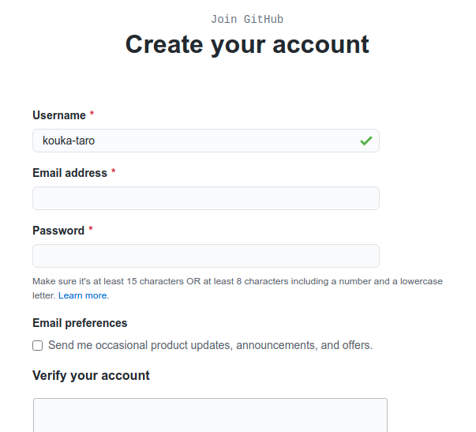

# 第3回 バージョン管理入門

- [第3回 バージョン管理入門](#第3回-バージョン管理入門)
  - [GitHubアカウントの作成](#githubアカウントの作成)
  - [リモート課題レポジトリの作成](#リモート課題レポジトリの作成)
  - [Gitの初期設定](#gitの初期設定)
  - [ローカル課題レポジトリの作成(ダウンロード)](#ローカル課題レポジトリの作成ダウンロード)
  - [ローカル課題リポジトリの編集](#ローカル課題リポジトリの編集)
  - [変更のステージング](#変更のステージング)
  - [変更のコミット](#変更のコミット)
  - [変更のプッシュ(アップロード)](#変更のプッシュアップロード)
  - [Git Bashの起動](#git-bashの起動)
  - [課題遂行に用いる主なGitコマンド](#課題遂行に用いる主なgitコマンド)
  - [Gitの初期設定](#gitの初期設定-1)
    - [ユーザー名の設定](#ユーザー名の設定)

## GitHubアカウントの作成

GitHubを利用するには、まずGitHubのサイトでユーザー登録をしてアカウントを作成する必要があります。以下のような方は、必ず新たにアカウントを作成してください。

- GitHubアカウントを持っていない人
- GitHubアカウントを持っているが、大学以外のメールアドレスでカウントを作成した人

大学のメールアドレスで作成したGitHubアカウントをお持ちの方は、新たに作成する必要はありません。

インターネットブラウザで[GitHub](https://github.com/)のサイトに行き、画面右上の"Sign up"をクリックします。

"Create your account"という画面になりますので、以下の項目を入力します。

   1. ユーザー名
   2. Emailアドレス(**必ず大学のアドレスを入力**)
   3. パスワード(紛失しないよう厳重に管理すること)

ユーザーネームを付ける際には、**必ず授業中に説明するルールに従って命名してください**。既存のアカウントを持っている人は事前にユーザー名を教えてください(ユーザー名の変更は必要ありません)。



ユーザー名等の入力を終えたら、"Verify your account"の項目でロボットでないことを証明し、"Creat account"をクリックします。

"Welcome to GitHub"というページになりますので、以下のように入力してください。

What kind of work do you do, mainly?はStudentを選択してください。


How much programming experience do you have?はA littleなどご自身のプログラミング経験のレベルにあったものを選択してください。


What do you plant to use GitHub for?については、Learn to code、Learn Git and GitHub、School work and student projectsなどを選択しておけば良いでしょう。(3つまで選択可)


I am interested inのところは、pythonと入力し、"Complete setup"をクリックします。


"Please verify your email address"という画面になったら無事アカウント作成に成功です。


アカウント作成の後、認証作業が必要になります。登録した大学のEmailにGitHubから"Please verify your email address"という件名のメールが来ているはずですので、内容を確認してください。"Verify email address"というボタンがあるはずなので、これをクリックします。

インターネットブラウザが起動し、"What do you want to do first?"というページになりますので、一番下の"Skip this for now"をクリックしてください。これでアカウント作成・認証とも完了です。いつでもGitHubが使える状態になりました。


今後GitHubにログインするときは、GitHubのページの右上の"Sign in"をクリックしてユーザー名とパスワードを入力してください。

## リモート課題レポジトリの作成

GitHub classroomの課題を行うに当たっては、まず課題の招待を受け入れ、課題リポジトリを自分のGitHubアカウント上に作成する必要があります。Moodleに記載されている「課題0の招待リンク」をクリックしましょう。

以下のような画面になり、GitHub ClassroomがあなたのGitHubアカウントにアクセスする許可を求めてきますので、Authorize Classroomをクリックして許可します。


"Join the classroom"という画面に切り替わりますので、"Identifiers"の一覧から自分の名前を選択します。(万が一自分の名前がない場合はご連絡ください。Moodleにユーザー登録されていない可能性があります。)**ここで間違った名前を選択すると、教員による取り消し操作が必要になりますのでご注意ください**。


画面が切り替わりますので、"Accept this assignment"をクリックして課題を受け入れます。


これであなた専用の課題のリモートリポジトリが作成されました。リモートリポジトリの名前は、アカウント名がyamada-taro-1234567ならば、

```github
assignment-pr21-0-yamada-taro-1234567
```

のようになっているはずです。GitHubのホーム画面では、画面の左端にこのリポジトリの名前が表示されていることを確認してください。

## Gitの初期設定

次は、GitHubのアカウント上に作成したリモートのリポジトリをパソコン(ローカル)にダウンロードしましょう。これ以降は、Gitというアプリケーションを使っていくことになります。

以前作成したGitHubフォルダを開いて、右クリックし、"Git bash here"を選びます。すると、画像のようなコンソールが開きます。bashというのは元々Linuxのコンソールで用いられているコマンド入力システム([コマンドラインシェル](https://ja.wikipedia.org/wiki/%E3%82%B7%E3%82%A7%E3%83%AB)と呼ばれます)であり、Git bashはgitをWindows上で使いやすくするためにWindowsに移植されたWindows版bashです。Gitには色んな操作方法がありますが、Git bashのようなコンソールからコマンドを打ち込んで操作するのが最も基本的な操作方法ですので、ここではそれに従います。(使える機能は限定されていますが、VS Code上でGitの操作を行うこともできます)

Gitは使用前に以下の項目に関する初期設定が必要です。

- ユーザー名
- Emailアドレス
- エディタ
- プロキシ

ユーザー名、Emailアドレス、プロキシを設定するには次のようにコンソールに打ち込みます。

```git
# ユーザー名設定
git config --global user.name "Taro Yamada"
```

ここで、Taro Yamadaは自分の本名です。

```git
# Email設定
git config --global user.email yamada@email-addr.com
```

yamada@email-addr.comは大学のEmailアドレスにしてください。

```git
# proxy設定
git config --global http.proxy http://proxy.addr:0000
git config --global https.proxy http://proxy.addr:0000
```

proxy.addrは適切なプロキシサーバー名、0000は適切なポート番号に設定してください。

Gitでは、「コミット」という操作を行う際にエディタを起動する必要があります。その際に用いるエディタをcodeにしておきましょう。デフォルトではviですので、viのままで良い人は設定の必要はありません。

```git
# エディタの設定
git config --global core.editor code
```

これで基本設定は完了です。

## ローカル課題レポジトリの作成(ダウンロード)

基本設定が完了したら、先ほど作成したリモート課題リポジトリをローカルにコピーしましょう。課題リポジトリをリモートからローカルにコピーするにはbashコンソールに次のように入力します。

```git
git clone https://github.com/kut-econ/assignment-pr21-0-yamada-taro.git
```

もちろんyamada-taroのところはご自身のGitHubアカウント名にしてください。これによってリモートのリポジトリが、ローカルのGitHubディレクトリ下に作成されますので、エクスプローラで確認してみましょう。GitHubディレクトリの下に、assignment-...という名前のディレクトリが作成されていれば成功です。

このように、リモートリポジトリをローカルにコピーする操作を**クローン**と呼びますので覚えておきましょう。クローンするコマンドの一般形は次のようになります。

```git
git clone repository_url
```

repository_urlはリモートリポジトリのurlです。このurlが分からなくなったときは、Github上で確認することができます。

## ローカル課題リポジトリの編集

ローカルにリポジトリをクローンできたら、編集してみましょう。一度git bashを閉じてください(exitと入力します)。Windowsエクスプローラでローカルにコピーした課題リポジトリのフォルダを開いてください。以下三つのファイルがあるはずです。

- README.md
- assignment-text-0.md
- assignment-code-0.py

エクスプローラ上で右クリックして「Codeで開く」を選択し、VS Codeを起動しましょう。上記3つのファイルをVS Codeで開いて内容を確認してみましょう。

さて、これから、これらのファイルに編集を加えて、リモートリポジトリに変更をアップロードするという作業を行いますが、Gitの挙動を理解するために、慎重におこなってください。

ここでリポジトリの構造を説明しておきます。クローンによって作成されたディレクトリは**作業ディレクトリ**と呼ばれ、リポジトリの本体はその中にあります。実際には、リポジトリの本体は.gitという隠しフォルダとして存在しています。リポジトリは、作業ディレクトリ内のファイルの過去の状態を記録しており、現在の状態と過去の状態を比較したり、作業ディレクトリの内容を過去の状態に戻したりする機能を提供します。この意味で、作業ディレクトリは、リポジトリの**管理下にある**と表現されることがあります。

リポジトリの管理下にある作業ディレクトリの内部は、次の三つの領域から構成されています。

- 作業エリア
- ステージングエリア
- コミット履歴

Windowsエクスプローラによって閲覧できる作業ディレクトリ内のファイルは、(隠しフォルダ.gitを除き)すべて**作業エリア**内に存在します。ステージングエリアとコミット履歴は、gitコマンドによってのみ内容を確かめることができます。

上記のうち、**コミット履歴**がリポジトリの中核部分であり、過去に記録したファイルの状態を全て収めています。

一方ステージングエリアは作業エリアとコミット履歴を結ぶ中間的な領域であり、しばしば**インデックス**と(いう若干分かりにくい名前で)呼ばれることもあるので注意してください。ステージングエリアは、ファイルの変更をコミット履歴に記録するまえに、一時的に待機させる役割を持ちます。

## 変更のステージング

それでは、作業エリア内のファイルを修正して、ステージングエリアに入れてみましょう。現在皆さんは、ローカル課題リポジトリの作業ディレクトリの中でVS Codeを起動ている状態にあるかと思います。assignment-text-0.mdを開いて、若干の修正を加えます。

## 変更のコミット

## 変更のプッシュ(アップロード)

## Git Bashの起動

それではGitHubのアカウントが

## 課題遂行に用いる主なGitコマンド

GitとGitHubには様々な機能が備わっていますが、それらを全て1回の講義で説明するのは不可能です。そこで、まずは皆さんが今後の講義を受講するにあたって最低限必要になる機能に絞って解説をすることにします。

皆さんがこの授業でGitとGitHubを使用する主な目的と、それに対応するGitコマンドは以下の通りです。

|目的|使用するGitコマンド|
|--|--|
|課題のダウンロード|clone, fetch, status, pull|
|課題の遂行|add, commit, reset, statusなど|
|課題のアップロード|fetch, status, push|

以下、これらのコマンドを一つずつ説明しましょう。

## Gitの初期設定

Gitを用いるには、以下の初期設定が必要です。

- ユーザー名の設定
- Emailアドレスの設定
- プロキシの設定
- エディタの設定

### ユーザー名の設定
