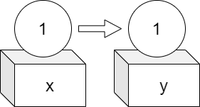
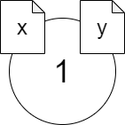

# 第4回 変数とメモリ

- [第4回 変数とメモリ](#第4回-変数とメモリ)
  - [Rの付値操作](#rの付値操作)
  - [箱型代入](#箱型代入)
  - [ラベル型代入](#ラベル型代入)
  - [参照カウンタ](#参照カウンタ)
  - [練習](#練習)
  - [課題(アサインメント)](#課題アサインメント)

## Rの付値操作

本講義の受講者にとって、Rの次のような操作は至極ありふれたものだと思います。

```R
# コード1
x <- c(1,2,3)
y <- x
x[2] <- 5
print(x)
print(y)
```

上記のコマンドを実行したときに、どのような結果が出力されるかを答えられない人はいないでしょう。実際にRの対話的インタープリタを起動するか、VS Code上で実行してみれば良いでしょう。

```R
> print(x)
[1] 1 5 3
> print(y)
[1] 1 2 3
> 
```

しかし、コード1で実際に何が起きているのかを正しく説明できる人はほとんどいないのではないかと思います（できたら素晴らしい！）。

多くの人が次のように考えているのではないでしょうか？

1. 変数xにベクトル(1,2,3)が代入される
2. 変数yに変数xの値、つまり(1,2,3)がコピーされる
3. 変数xの第2要素が5に書き換えられる
4. 変数xの値が出力される
5. 変数yの値が出力される

しかし、実際には、**上記のようなことは起きていません**。これを今日は理解して欲しいと思います。これを理解できるかどうかが、Pythonを理解する鍵であり、もっというなら、Pythonを含む様々な**動的型付け言語**を理解する鍵となります。

## 箱型代入

どのように間違っているかを説明する前に、なぜ上記のような間違いを犯しがちであるのかを説明しましょう。間違いの理由は、初学者向けにありがちな、「箱の比喩」を用いた代入の説明にあるものと思われます。

箱を用いた説明とは、次のようなものです。

>下図のように、変数xに1を代入するということは、xという箱に1という値を入れることであり、yにxを代入するということは、xに入っている値1をコピーしてyという箱に入れることである。



このような説明は、C言語のようなプログラミング言語では正しい比喩ですが、RやPythonではミスリーディングです。Pythonでは特にミスリーディングであるだけでなく完全に間違いであり、害悪ですらあります。

C言語では、次のようにして、予めxやyが整数であることをプログラムの最初に宣言します。

```C
int x,y; // x,yが整数であることを宣言
```

ソースファイルにこの宣言を見つけたCのコンパイラは、メモリの特定の位置に整数用の場所を2か所確保し、それらにxとyという名前をつけます。xやyが最初に割り当てられた場所以外を指し示すことは基本的に無く、「うごかない箱」であると見なすことができます。

```C
y = x;  // xの値をyに代入
```

という代入操作は、xの箱（メモリの特定領域）に入っている値をyの箱にコピーするという操作に他なりません。

## ラベル型代入

一方、Rでは何が起きているのでしょうか。正しい比喩は以下のようなものです。

>下図のように、変数xに1を代入するということは、1という**モノ**([**オブジェクト**](https://ja.wikipedia.org/wiki/%E3%82%AA%E3%83%96%E3%82%B8%E3%82%A7%E3%82%AF%E3%83%88_(%E3%83%97%E3%83%AD%E3%82%B0%E3%83%A9%E3%83%9F%E3%83%B3%E3%82%B0)))にxというラベルを貼り付けることであり、変数yにxを代入するという操作は、ラベルxがついているオブジェクトにもう一つyという別のラベルを貼り付けることである。



この正しい見方では、1という一つのオブジェクトにx、yという二つのラベルが貼り付けられています。

それでは、Rでの代入操作(y <- x)がこのような「ラベル張り」であるということを確かめてみましょう。そのために、[Hadley Wickham](http://hadley.nz/)が作った[pryr](https://cran.r-project.org/web/packages/pryr/index.html)パッケージをインストールしましょう。

```R
install.packages('pryr')
```

pryrを読み込むと関数addressを使うことができるようになります。addressは、引数として与えた変数が指し示しているオブジェクトのアドレスを返す関数です…と言っても良く分からないかもしれないので、実際に使ってみましょう。

```R
library(pryr)
x <- c(1,2,3)
address(x)
y <- x
address(y)
```

上のように対話的インタープリタで入力すると、次のような出力が得られます。

```R
> address(x)
[1] "0x183f3110"
> y <- x
> address(y)
[1] "0x183f3110"
> 
```

出力が二つ得られていますが、一つ目の値**0x183f3110**は、xというラベルが貼り付けられているベクトル(1,2,3)というオブジェクトが格納されているメモリのアドレスを16進数で表したものです（具体的なアドレスの値は、実行時ごとに異なります）。また、二つ目の出力は、yというラベルが貼り付けられているオブジェクトのメモリ上のアドレスですが、これも**0x183f3110**となっており、xと同じオブジェクトにyが貼り付けられているということが分かります。

もしもC言語のように、x、yという別々の箱がメモリ上に存在するならば、上記の出力は説明がつきませんよね。

このように、Rでの代入は「ラベル張り」であり、「箱入れ」ではないことが分かります。その意味でRでは代入のことを**付値**(assignment)と呼びますが、これは名が体を表す正しい呼び名であり、推奨される言葉遣いです。それから、Rでは、付値を表す記号として、わざわざ二文字の「<-」という記号を使いますが、これも素晴らしい計らいであると言えます。代入に「=」記号を使うと、ついつい自分は箱への代入をしていると思ってしまいがちですが、二文字の「<-」記号が生み出す左辺と右辺の微妙な距離感は、自分が「箱入れ」ではなく「ラベル張り」をしているということを思い出させてくれます。

## 参照カウンタ

ところが、Rは**Copy on modify**という機構を備えていて、ラベル張りであることを余り意識させない作りになっています。Copy on modify機構について説明するために、まずは**参照カウンタ**(リファレンスカウンタ）について説明しましょう。以下、Rのヴァージョン3系列(3.5,3.6等)を仮定して話を進めます。(ヴァージョン4との違いは課題で取り扱います。)

ベクトルのようなRのオブジェクトは、自分に何枚のラベルがついているかをおおまかに把握しています。換言すると、Rオブジェクトは、自分がいくつの変数(xやy)に**参照されているか**を知っています。オブジェクトを参照している変数の数の事を**参照カウント**と呼びます。Rオブジェクトは、内部に自分自身の参照カウントを記憶する**参照カウンタ**を持っています。

たとえば次のようにxに代入したベクトル(1,2,3)の内容を書き換えようとするとき、参照カウントが1の場合とそれ以上の場合では、Rは異なる挙動を示します。

```R
rm(list=ls())
x <- c(1,2,3)
address(x)
x[2] <- 5
address(x)
```

上記を実行すると、次のような出力が得られます。

```R
> x <- c(1,2,3)
> address(x)
[1] "0x17f14dd8"
> x[2] <- 5
> address(x)
[1] "0x17f14dd8"
> 
```

上記のように、xの内容を書き換える前後で、xは同じオブジェクトを参照しています。ところが、xと同じオブジェクトを参照する変数yが存在するとき、異なる挙動が起きます。次を実行してみましょう。

```R
rm(list=ls()) #名前空間をクリア
x <- c(1,2,3)
y <- x
address(x)
address(y)
x[2] <- 5
address(x)
address(y)
```

上記を実行すると、次のような出力が得られます。

```R
> rm(list=ls()) #名前空間をクリア
> x <- c(1,2,3)
> y <- x
> address(x)
[1] "0x17ecbc78"
> address(y)
[1] "0x17ecbc78"
> x[2] <- 5
> address(x)
[1] "0x17ecb598"
> address(y)
[1] "0x17ecbc78"
> 
```

どこが変わったか気づきましたか？

## 練習

1. 次のRコードは、二つの参照を持つリストオブジェクトの内容を変更するものである。pryr::address関数を用いて、上記のコードでCopy on modify機構が働いているかどうか確かめなさい。

  ```R
  rm(list=ls()) # 名前空間をクリア
  x <- list(a='A',b='B')
  y <- x
  x['a'] <- 'AA'
  ```

2. 次はさらに複雑な例である。

## 課題(アサインメント)

1. 講義で説明したように、Pythonでは、ある特定の範囲に含まれる絶対値の小さな整数については、プログラムの実行中ずっとメモリの中に保持され、何回でも再利用されるようになっています。そのような「再利用される」整数のうち、最も値の小さな整数（これは負の整数）と最も値の大きな整数を答えなさい。自分で調べても構わないし、インターネットで検索しても構わない。

2. Copy on modifyメカニズムの挙動に関して、Rのヴァージョン3系統(ヴァージョン3.5,3.6など)と、ヴァージョン4.0の違いを「参照カウント」もしくは「参照カウンター」などの言葉を用いて説明しなさい。
