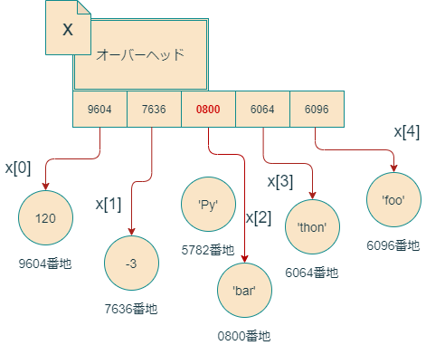

# 第5回 データ型と制御構文

- [第5回 データ型と制御構文](#第5回-データ型と制御構文)
  - [リストのしくみ](#リストのしくみ)
  - [リスト要素の修正](#リスト要素の修正)
  - [再帰的リスト](#再帰的リスト)
  - [リストのコピー](#リストのコピー)
    - [練習1(シャローコピー)](#練習1シャローコピー)
  - [スライス記法](#スライス記法)
  - [ループ処理](#ループ処理)
  - [rangeオブジェクト](#rangeオブジェクト)
  - [リストの占有メモリサイズ](#リストの占有メモリサイズ)
  - [条件分岐](#条件分岐)
  - [字下げの注意](#字下げの注意)
  - [まとめ](#まとめ)
  - [参考書](#参考書)
  - [宿題(ホームワーク)](#宿題ホームワーク)
  - [課題(アサインメント)](#課題アサインメント)
  - [練習問題回答](#練習問題回答)
    - [練習1(シャローコピー)回答](#練習1シャローコピー回答)

## リストのしくみ

今回の講義では、Pythonのデータ型の代表格であるリストをじっくりと研究してみましょう。リストを研究することで、Pythonのデータ構造の特徴がより一層深く理解できるようになります。また、リストを研究していく過程で、ループ処理や条件分岐といった制御構文について学んでいきましょう。

まず、次のように長さ5のリストを作成してxに代入すると何が起きるか考えてみましょう。

```python
x = [120,-3,'Py','thon','foo']
```

上記を実行すると、Pythonは、リストオブジェクトを保存するための96バイトのメモリ領域を確保して、それにxという名前をつけます。この96バイト程度のメモリ領域がリストオブジェクトの正体です(具体的なバイト数は処理系やPythonのバージョンにより異なります)。

オブジェクトが占有するメモリ領域のサイズは、**sysモジュール**のgetsizeof関数によって調べることができます。ここで**モジュール**について簡単に説明しておきます。モジュールというのは、通常Pythonの関数や特殊な変数を定義したファイルです。たとえば、module_nameという名前のモジュールで定義されたfunction_nameという関数を用いる場合は、次のように記述します。

```python
import module_name  #　モジュール読み込み
module_name.function_name()   # 関数呼び出し
```

モジュールについては、後の講義で詳しく取り上げます。

さて**sysモジュール**は、ビルトインモジュールという特殊なモジュールであり、ファイルとしては存在しておらず、Pythonインタープリタに埋め込まれています。sysの関数群を用いると、Pythonの非常に基本的な機能にアクセスすることができます。ここでは、getsizeofという、引数に与えたオブジェクトの占有メモリサイズをバイト単位で返してくれる関数を使いましょう。

```python
>>> import sys
>>> sys.getsizeof([120,-3,'Py','thon','foo'])
96
```

96バイトのうち56バイトには、参照カウンタやら何やらが保存されており、からっぽのリストにすら存在する領域で、**オーバーヘッド**と呼ばれることもあります。オーバーヘッドの具体的なサイズはPythonのバージョンや環境によって若干異なりますので、各自調べてみましょう。オーバーヘッドの容量は空のリストのサイズを調べることにより確かめられます。

```python
>>> sys.getsizeof([])
56
```

メモリの効率的利用について研究しているのでないかぎり、オーバーヘッドの機能を意識することはあまり重要ではありません。重要なのは残り40バイトの**配列**と呼ばれる部分です。


この合計40バイトの配列はメモリ上で一続きになっており、各8バイトの5つの区画に分かれています。それぞれの区画には、リストの要素になっているオブジェクトのアドレスが格納されています。(第1回の講義で学んだように、4GiB以上のメモリ空間を管理する64ビット処理系ではメモリアドレスを8バイト数値で表すことに注意しましょう。)

たとえば第1要素である120という整数オブジェクトは、メモリ上の9604番地に存在します（実際にはアドレスはもっと大きな整数ですが、面倒なので下4桁だけ使っています）が、それに対応して、リストオブジェクトの配列の第1番目の区画には、オブジェクト120のアドレスである9604が書き込んであります。他の要素についても同じで、配列の第k番目の区画には、リストの第k番目の要素であるオブジェクトのアドレスが格納されています。

このように、リストオブジェクトは、その要素そのものを直に格納しているのではなく、要素オブジェクトのアドレスを格納しています。このおかげで、リストオブジェクトには、整数、小数、文字列などの様々なデータ型のPythonオブジェクトを好きな順番で詰め込めるようになっています。なぜなら、どんなオブジェクトでも、アドレスは8バイトの数値だからです。

リストが要素オブジェクトそのものを含んでいないことは、getsizeofを使っても間接的に確かめることができます。

```python
>>> x = [1,2,3]
>>> y = [1,2,[3,4,5,6]]
>>> z = [1,2,[3,4,5,6,7,8,9,10]]
>>> sys.getsizeof(x)
80
>>> sys.getsizeof(y)
80
>>> sys.getsizeof(z)
80
```

上のコードでは、x、y、zが含んでいる要素の数はすべて異なるように見えますが、実際にはどのリストもオブジェクト三つ分の参照しかもっていないので、占有するメモリの大きさは同じになっています。もしリストが要素オブジェクトそのものを含んでいるとしたら、メモリの占有サイズは

```python
x < y < z
```

となることが期待されますが、そうはなっていません。

なお、この性質は、リストだけでなく、より広い**コンテナ**というクラスのデータ型すべてに当てはまる性質ですので、これから論じることは、多くが全てのコンテナ型のデータ型に当てはまります。コンテナ型については教科書のセクション6に詳しいので、良く読んでおいてください。

たとえば

```python
>>> x = [120,-3,'Py','thon','foo']
>>> x[1]
-3
>>> 
```

のように入力するときPythonは、xというリストオブジェクトの中にある配列領域の2番目の要素に書いてあるアドレスをチェックして、次にそのアドレスに行ってどんなオブジェクトがあるのかチェックします。するとそこには-3という整数オブジェクトがあったので、それを出力してくれているわけです。

## リスト要素の修正

では次に、リストの要素の書き換えについて考えてみます。たとえば第3要素を'Py'から'bar'に書き換えたいとします。この場合、次のように書きます。

```python
x[2] = 'bar'
```

するとPythonは何をするかというと、'bar'という文字列オブジェクトをメモリ上に作成して、そのアドレス0800をリストxの配列の第3要素に上書きで格納します。これによって、オブジェクト'Py'はリストxからは忘れ去られ、代わりに'bar'がリストのメンバーとして参入します。



ここで重要なのは、もともと'Py'が存在していた5782番地の内容が書き換えられるわけではないということです。そうではなく、単にリストxが覚えているアドレスが付け替えられるだけです。

このように、x[2]という表記は、第3要素オブジェクトへの**参照**として機能します。言い変えると、x[2]='bar'という代入は、ハコ型代入ではなくラベル型代入になっているということです。Pythonリストは、要素オブジェクトへの参照を格納していると考えることができ、通常Pythonプログラマはそのような表現を使います。

## 再帰的リスト

Pythonリストが格納しているのは要素オブジェクトそのものではなく要素オブジェクトへの参照であることから、リストは自分自身を要素にもつという奇妙なことができてしまいます。次のようにしてみましょう。

```python
>>> x = [1,2,3]
>>> x[2] = x
>>> x
[1, 2, [...]]
```

ここでは、リストxを作成したあと、その第3要素に自分自身を代入しています。これにより、xの内部にある配列の最後の要素には、x自身の参照が格納されることになります。最後の[...]という表現は、仮に自分自身をここに表示すると無限に入れ子になったリストを表示することになってしまうので、それを避けるために導入された略記表現です。

こうした自分自身への参照を要素にもつ再帰的リストを積極的に作るべき場面はすこし思いつきませんが、似たような状況はPythonプログラミングにおいて容易に生じ得ます。それは、複数のリストオブジェクトが互いに相手への参照を要素にもつ以下のような場合です。

```python
>>> x = [1,2,3]
>>> y = [4,5,6]
>>> x[2] = y
>>> x
[1, 2, [4, 5, 6]]
>>> y[2] = x
>>> x
[1, 2, [4, 5, [...]]]
>>> y
[4, 5, [1, 2, [...]]]
```

詳しくは解説しませんが、このような**循環参照**は**ガベージコレクション**というメモリ管理において重要なトピックとなります。興味がある人はインターネット等で調べてみてください。

## リストのコピー

PythonにはRのCopy on modifyがないため、リストの複製を作るためには、明示的にプログラマが複製操作を行う必要があります。

Pythonでは、それぞれのデータ型は、それを操作するための専用の一連の関数をもっています。このような関数群を、そのデータ型の**メソッド**と呼びます。(メソッドについては、後の講義で詳しく解説します。)

たとえば、リスト型がどのようなメソッドを持つかを調べたいときは、REPLにおいてlist.と入力してタブキーを叩くと一覧が表示されます。

```python
>>> list.
list.append(  list.copy(    list.extend(  list.insert(  list.pop(     list.reverse(
list.clear(   list.count(   list.index(   list.mro(     list.remove(  list.sort(
```

もしくはVS Code上でlist.と入力してしばらく待つと、メソッド一覧が表示されます(ただしインテリセンスという拡張機能がインストールされている必要があります)。

上記のリストのメソッド一覧の中に、copyという自身の複製を作成するメソッドが有ります。これを呼び出すには、次のようにします。

```python
>>> x = [1,2,3]
>>> y = x.copy()    # xの複製を作ってyに代入
>>> x
[1, 2, 3]
>>> y
[1, 2, 3]
>>> x is y    # xとyは異なるオブジェクト
>>> id(x)
2510581312768
>>> id(y)
2510581325056
```

確かに、xのコピーが作成され、yに代入されています。xとyは異なるアドレスを指しており、異なるオブジェクトを参照していることが分かります。

注意しなくてはならないのは、copyメソッドを呼び出すと、**実際にコピーされるのは、要素オブジェクトへの参照であって、要素オブジェクト自体はコピーされない**ということです。参照がコピーされるということは、アドレスがコピーされるということです。xとyは、それ自体はメモリの違う場所にありながら、全く同じ要素オブジェクトを参照していることになります。

```python
>>> x = [1,2,3]
>>> y = x.copy()
>>> x is y
False
>>> x[0] is y[0]    # 第1要素を共有
True
>>> x[1] is y[1]    # 第2要素を共有
True
>>> x[2] is y[2]    # 第3要素を共有
True
```

こうした性質をもったコピーをpythonでは**シャローコピー**(shallow copy)と呼びます。シャローコピーは、要素がイミュータブルな場合には全く問題になりません。シャローコピーが問題になるのは、リストがミュータブルな要素を持つときです。

たとえば次の例を考えてみましょう。ここでは、zというリストを作成したうえで、リストxの第2要素にzへの参照を持たせています。さらにxのコピーを作ってyに代入すると、xとyは異なるオブジェクトとなりましたが、当然第2要素のzを共有したままです。従って、x[2]の要素を変更すると、yにまで影響が及びます。

```python
>>> z = [1,2,3]
>>> x = [120,-3,z,'thon','foo']
>>> y = x.copy()
>>> x
[120, -3, [1, 2, 3], 'thon', 'foo']
>>> y
[120, -3, [1, 2, 3], 'thon', 'foo']
>>> x is y  # xとyは異なるオブジェクト
False
>>> x[2] is y[2]  # だがzオブジェクトを共有
True
>>> x[2][1] = 5   # x経由でzに修正を加える
>>> x
[120, -3, [1, 5, 3], 'thon', 'foo']
>>> y             # yも変わってしまった
[120, -3, [1, 5, 3], 'thon', 'foo']
```

これは図に書くと何が起きているのか分かりやすいでしょう。


### 練習1(シャローコピー)

次の2つのコードについて、xの変更(ともに3行目)はyに影響を及ぼすか?結果を予想してから実際に確かめなさい。

```python
# コード1
x = [1,[4,5,6],3]
y = x.copy()
x[1] = [7,8,9]
```

```python
# コード2
x = [1,[4,5,6],3]
y = x.copy()
x[1][:] = [7,8,9]
```

このようにシャローコピーは、意図せぬ挙動を引き起こす可能性がありますので、それを避けたい場合はディープコピーという操作を行います。ディープコピーをすると、参照だけでなく要素オブジェクトも再帰的にコピーされます。ディープコピーは、copyモジュールによって提供されるdeepcopy関数で行うことができます。

```python
>>> import copy
>>> x = [1,[4,5,6],3]
>>> y = copy.deepcopy(x)
>>> x is y
False
>>> x[1] is y[1]
False
```

ただし、次のコードで分かるように、何もかもコピーされてしまうわけではありません。"末端"のイミュータブルオブジェクトなど、オリジナルと複製で共有しても問題が起きないような場合は、複製を行いません。

```python
>>> x = [1000,[4000,5000,6000],3000]
>>> y = copy.deepcopy(x)
>>> x is y
False
>>> x[1] is y[1]
False
>>> x[0] is y[0]
True
>>> x[1][0] is y[1][0]
True
```

従って、特に入れ子の構造がないオブジェクトでは、シャローコピーとディープコピーの動作は全く同じです。

## スライス記法

シャローコピーはスライス記法によっても行うことができます。

```python
>>> x = [1,2,3]
>>> y = x[:]
>>> x is y
False
```

このように、スライス記法は通常はシャローコピーとなりますが、代入の**左辺**で使うときは意味合いが異なりますので注意が必要です。前回の講義でも論じたように、左辺で使うと、コピーを作るのではなく、オリジナルのリストオブジェクトを変更することになります。

```python
>>> x = [1,2,3]
>>> y = x
>>> x is y
True
>>> x[:] = [4,5,6]
>>> x
[4, 5, 6]
>>> y
[4, 5, 6]
>>> x is y
True
```

このように、代入の左辺で使うスライス記法とそれ以外のスライスは分けて考えた方が良いでしょう。なお、これはスライス記法だけでなく、x[0]と言ったような、単一要素のインデクシングでも同じことが言えます。

ちなみに、スライス記法は、リストの1部分のシャローコピーを作るのにも使えます。下では、xの第2～第4要素のコピーをyに代入しています。

```python
>>> x = [1000,2000,3000,4000,5000]
>>> y = x[1:4]      # スライスによるコピー
>>> x is y
False
>>> x[1] is y[0]
True
>>> x[2] is y[1]
True
>>> x[3] is y[2]
True
```

ここで、x[1:4]という表現は、xの第2要素から第4要素までを取り出す表現ですが、これはなれないと分かりにくいかと思います。まず基本的な事項として、リストのインデックスは0からはじまることに注意しましょう。たとえば上の場合ですと、インデックスと要素オブジェクトの対応は次のようになります。

|インデックス|0|1|2|3|4|
|--|--|--|--|--|--|
|要素オブジェクト|1000|2000|3000|4000|5000|
|x[1:4]||始点|-->|終点||
|x[0:3]|始点|-->|終点|||
|x[:2]|始点|終点||||
|x[2:]|||始点|-->|終点|

x[i:j]という表現では、インデックスiからj-1の位置までスライスすることになります。上の表には幾つかの例を挙げておきました。0および末尾インデックス(この場合4)は省略することができます。

さて部分的なスライスを代入の左辺で使うと、やはりオブジェクト本体の変更になります。なお、左辺のスライスの長さと右辺のリストの長さは違っても構いません。

```python
>>> x[1:5] = ['foo','bar']
>>> x
[1, 'foo', 'bar']
>>> y
[1, 'foo', 'bar']
>>> x is y
True
```

スライスには非常に多くの用法があります。教科書のセクション6.1.2に詳しい解説があるので、良く読んでおいてください。

## ループ処理

それではここで、リストオブジェクトが占有するメモリのサイズが、要素の数とともにどのように増加していくか調べてみましょう。理論的予測に基づけば、1つの要素オブジェクトあたり、オブジェクトの参照を格納するのに8バイト使います。従って、要素の数をnとすれば、リストの占有メモリサイズは(オーバーヘッド容量)+8nとなるはずです。

この実験を行うために、繰り返しのための制御構文である**forループ**を使ってみましょう。皆さんはRのforループをすでにご存じだと思います。次のような構文でしたね。

```R
# 1:10はベクトルc(1,2,3,4,5,6,7,8,9,10)と同じ意味

for (i in 1:10) {
  print(i)  #forブロック
}
print('End')
```

上記のコードは、1から10までの整数を画面に出力したあと、最後に'End'と出力するRコードです。中括弧の中身は**forブロック**と呼ばれ、ここに記述された内容が繰り返されます。iは**ループカウンタ**と呼ばれる変数で、ループが1回実行されるごとに1ずつ増加していきます。iの初期値と最終的な値はinの後に記述されたベクトル1:10が決定します。この場合は、初期値がi=1、最後のループではi=10となります。

Pythonのforループもよく似ているので、Rのforを知っている皆さんならば即座に理解できます。

```python
# ループはi=0からi=3まで繰り返して欲しい
index_range = [0,1,2,3]

for i in index_range:
    print(i)        # 
    print('FOO')    # ここは
    print('BAR')    # 全部
    print('BAZ')    # forブロック
    print('')       #

print('End')
```

上記のPythonコードは0から3までの整数を画面に印字します(ついでに'FOO'、'BAR'、'BAZ'も印字します)。

Rとの違いをまとめると、次のようになります。

1. forブロックが中括弧ではなく**インデント**(字下げ)によって表現される。
2. 先頭行の行末にコロン(:)が必要。
3. forのあとの丸カッコは必要ない。

なかでも重要なのは1です。print(i)やprint('FOO')のまえにタブキー1つ分の字下げが入っていることに注意してください。これによって、print(i)やprint('FOO')はforブロックの中の要素であるとPythonインタープリタによって解釈されます。一方、print('End')は字下げしていないので、ブロックの外にあると見なされ、繰り返されることはありません。

それでは上記のコードをVS Codeのインターラクティブモードで実行してみてください。

```python
0
FOO
BAR
BAZ

1
FOO
BAR
BAZ

2
FOO
BAR
BAZ

3
FOO
BAR
BAZ

End
```

forループについては、教科書のセクション4.2.3に詳しく解説されていますので、良く読んでおいてください。

## rangeオブジェクト

残念ながらPythonにはRのように1:10といった連続整数値のベクトルを表す便利な表記がありません。Pythonでは代わりに、**rangeオブジェクト**という特殊なオブジェクトを用います。

rangeオブジェクトは、リストではありませんが、forループにおいて連続する数値のリストと同じ働きをするオブジェクトです。rangeオブジェクトを用いると、先のコードは次のようになります。

```python
# range(4)は[0,1,2,3]と同じように機能する

for i in range(4):    # rangeオブジェクトを使った
    print(i)        
    print('FOO')    
    print('BAR')    
    print('BAZ')    
    print('')       

print('End')
```

上のコードにおいて、rangeはrangeオブジェクトを生成する関数であり、range(4)は0から3までの連続する整数のリストと全く同じように機能します。一般に、0からnまでの連続する整数を表したいときはrange(n+1)と書きます。

rangeオブジェクトから、リストを作成することも可能です。そのためには、次のように関数listを使います。

```python
>>> x = list(range(4))
>>> x
[0, 1, 2, 3]
```

range関数については、教科書のセクション4.2.4に詳しく解説されていますので、良く読んでおいてください。

## リストの占有メモリサイズ

それでは、forループを使ってリストのサイズと占有メモリサイズの関係を調べましょう。以下のプログラムはリストのサイズを0(空っぽ)から50まで変化させたときに、リストの占有メモリサイズがどのように変化するかを調べるためのものです。

```python
# リストのサイズが0から50まで変化するとき
# メモリの占有サイズはどう変化するか?

import sys

for i in range(51):
    temp_l = list(range(i))             # リストを作成
    s_temp_l = sys.getsizeof(temp_l)    # サイズ計算
    print(s_temp_l,end=' --> ')         # 結果の出力

```

forブロックの中を1行ずつ見ていきましょう。

まず1行目ですが、

```python
temp_l = list(range(i))
```

これは、0で始まりi-1で終わるリスト[0,1,2,3,...,i-1]を作成してtemp_lという変数に代入しています。iはループインデックスですので、k回目のループでは、長さkのリストが作成されることに注意しましょう。よってforブロックが1回実行されるごとに、作成されるリストの長さは要素1個ぶん長くなります。

ちなみに、最初のループではi=0です。したがって最初のループでは

```python
temp_l = list(range(0))
```

を実行していることになりますが、これは空のリストを作成することに注意してください。

2行目は、

```python
s_temp_l = sys.getsizeof(temp_l)
```

ですが、これは先ほど作成したtemp_lのサイズを計算してs_temp_lという変数に代入しています。最後に、

```python
print(s_temp_l,end=' --> ')
```

ですが、これは上記で計算したメモリサイズs_temp_lを出力しています。print関数は、デフォルトで改行するようになっていますが、**オプション引数**endによって改行以外の文字を出力することができます。ここでは、サイズを出力したあとに、' --> 'という文字列を出力しています。

それでは、VS Codeで上記のコードを実行してみましょう。

```python
56 --> 64 --> 72 --> 80 --> 88 --> 96 --> 104 --> 112 --> 120 --> 128 --> 136 --> 144 --> 152 --> 160 --> 168 --> 176 --> 184 --> 192 --> 200 --> 208 --> 216 --> 224 --> 232 --> 240 --> 248 --> 256 --> 264 --> 272 --> 280 --> 288 --> 296 --> 304 --> 312 --> 320 --> 328 --> 336 --> 344 --> 352 --> 360 --> 368 --> 376 --> 384 --> 392 --> 400 --> 408 --> 416 --> 424 --> 432 --> 440 --> 448 --> 456 --> 
```

たしかに、オーバーヘッド容量からはじまって、リストの長さが1増加するごとにメモリサイズが8バイト増加していることが分かります。

## 条件分岐

ところで、上記の"実験"プログラムは、出力が'-->'記号で終わっていて美しくありません。この最後の矢印を消す方法を考えてみましょう。

forブロックの最後の文で、print関数を用いていますが、そのオプション引数endを、forブロックが最後に実行される時以外は' --> 'に設定し、最後の実行のときだけは改行に設定すれば良さそうです。これを言葉で書くと次のようになるでしょう。

```python
もし i < 50 ならば、end_str = ' --> '
さもなくば、end_str = 改行文字
```

ただしend_strはprint関数のend引数に与える文字列です。

ところで、Rでの条件分岐を覚えているでしょうか?代表的な条件分岐の構文であるif-else文を思い出してみましょう。

```R
if (i < 50) {
  end_str = ' --> '   # ifブロック
} else {
  end_str = '\n'      # elseブロック
}
```

上記のコードで、'\n'は様々なプログラミング言語で改行文字を表す記号です。このようなバックスラッシュを使ってあらわされる特殊文字をエスケープシーケンスと呼びます。エスケープシーケンスについては、教科書のセクション2.2.7に詳しく説明されているので、良く読んでおいてください。

さて、ifの後の中括弧に挟まれたコード領域は**ifブロック**と呼ばれ、丸カッコの中の条件がTRUEの場合のみ実行されます。一方elseの後の中括弧に挟まれたコード領域は**elseブロック**と呼ばれ、条件がFALSEの場合のみ実行されます。従って、上記Rコードは、

```R
もし i < 50 ならば、end_str = ' --> '
さもなくば、end_str = '\n'
```

となり、意図した通りのコードになっています。

全く同じことをPythonで書くと、次のようになります。

```python
if i < 50:
    end_str = ' --> ' # ifブロック
else:
    end_str = '\n'    # elseブロック
```

Rでのif-elseと比べると、次の違いがあります。

1. ifブロック、elseブロックが字下げによって表現される
2. if行とelse行はコロン(:)で終わる
3. 条件節を囲む丸カッコは必要ない

ここでもやはり1が最も重要です。条件分岐でも、やはりコードブロックは字下げによって表現されます。

なおRと同様に、else:節は必須ではありません。else:節を省略すると、条件が不成立の場合には何もしません。したがって、たとえば次のように書いても、結果は同じになります。

```python
# 先にend_strを' --> 'に設定し、
# 最後のループだけend_str = '\n'に再設定する
end_str = ' --> '

if i == 50:
    end_str = '\n' # ifブロック
```

それでは条件分岐を用いて、メモリサイズ計算プログラムを改良しましょう。

```python
import sys

for i in range(51):
    temp_l = list(range(i))
    s_temp_l = sys.getsizeof(temp_l)
    if i < 50:
        end_str = ' --> '
    else:
        end_str = '\n'
    print(s_temp_l,end=end_str)
```

なお、実際にはもっとパフォーマンスの良い書き方はありますが、ここでは条件分岐の説明のために上記のコーディングを採用しました。

ところで、上記のコードでは、50や51といった具体的な値がコードのなかに埋め込まれています。これでは、値を変更したくなったときに一々50と51の両方を修正しなくてはなりません。また、もっとプログラムが大きくなると、どこの値を修正すれば良いのか分からなくなりそうです。従って、具体的な数値をソースコードの途中に色々と書き込むのは良くなさそうです。

具体的な値は、次のように、ソースコードの最初のほうで変数に置き換えてしまうのが望ましいです。ついでに、以下の改良を付け加えてみましょう。

- 結果が見やすいように5つごとに改行
- オーバーヘッド分を差し引く

```python
import sys

max_size = 50   # max_sizeは最大のリスト長
overhead = sys.getsizeof([]) # オーバーヘッド計算

for i in range(max_size+1):
    temp_l = list(range(i))
    s_temp_l = sys.getsizeof(temp_l)
    if i < max_size:
        end_str = ' --> '
    else:
        end_str = '\n'
    print(s_temp_l-overhead,end=end_str) # オーバーヘッド除去
    if i%5 == 4:  # 5つごとに改行
        print()
```

これを実行すると以下のようになります。ずいぶんと結果が分かりやすくなりました。

```python
0 --> 8 --> 16 --> 24 --> 32 --> 
40 --> 48 --> 56 --> 64 --> 72 --> 
80 --> 88 --> 96 --> 104 --> 112 --> 
120 --> 128 --> 136 --> 144 --> 152 --> 
160 --> 168 --> 176 --> 184 --> 192 --> 
200 --> 208 --> 216 --> 224 --> 232 --> 
240 --> 248 --> 256 --> 264 --> 272 --> 
280 --> 288 --> 296 --> 304 --> 312 --> 
320 --> 328 --> 336 --> 344 --> 352 --> 
360 --> 368 --> 376 --> 384 --> 392 --> 
400
```

## 字下げの注意

Pythonでは、字下げによってコードブロックを表現するという、他の言語にはない際だった特徴があります。このおかげで、Pythonは非常に見やすいコードを書くことが可能になっています。ただ、インデントの幅を間違えるだけで、全く異なる意味になることがあるので注意が必要です。

たとえば次のような三つのコードを考えてみましょう。

```python
for i in range(10):
    if i%2 == 0:
        print(i) 
print("Hello, World!")  # ブロックの外
```

```python
for i in range(10):
    if i%2 == 0:
        print(i) 
    print("Hello, World!") # forブロックの中
```

```python
for i in range(10):
    if i%2 == 0:
        print(i) 
        print("Hello, World!")　# ifブロックの中
```

これらのコードは、3行目のインデントが異なるだけでそれ以外は全く同じですが、全て全く異なる挙動をします。3行目の所属するブロックが異なるからです。やっかいなのは、どれもエラーがでないことです。

このように、forやifブロックがあると、コーディング中にうっかりタブキーを一つ挿入すると、エラーが出ない上にコードを破壊してしまう可能性があるので、ブロックの字下げには十分に注意しなくてはなりません。特にブロックが入れ子になっている場合はこういった失敗に気づきにくいので注意しましょう。

## まとめ

本講義では、以下のことを学びました。

- リストの構造
- シャローコピー
- ディープコピー
- スライス記法
- ループ処理
- rangeオブジェクト
- 条件分岐

今回の講義では、リストや制御構文のごく基本的な事柄しか扱えませんでした。リストや制御構文には非常に多くの押さえておくべき事柄がありますので、教科書のセクション4とセクション6を良く読んでおきましょう。

## 参考書

## 宿題(ホームワーク)

## 課題(アサインメント)

## 練習問題回答

### 練習1(シャローコピー)回答

1. 及ぼさない
2. 及ぼす
