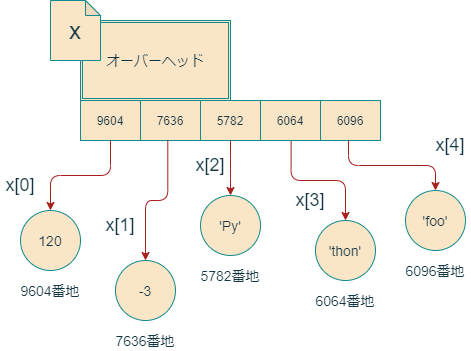

# 第5回 データ型と制御構文

- [第5回 データ型と制御構文](#第5回-データ型と制御構文)
  - [ミュータブルとイミュータブル](#ミュータブルとイミュータブル)
  - [リストのしくみ](#リストのしくみ)

## ミュータブルとイミュータブル

Pythonには、初学者を混乱させる**ミュータブル**なオブジェクトと**イミュータブル**なオブジェクトという概念があります。ミュータブルなオブジェクトは書き換え可能なオブジェクトであり、イミュータブルなオブジェクトとは、書き換え不可能なオブジェクトです。

| 分類            | データ型           |
| -------------- | ------------------ |
| ミュータブル   | リスト、辞書、集合 |
| イミュータブル | 整数、文字列、ブール値、タプル|

ミュータブルとイミュータブルが紛らわしい概念であるのは、それが**変数**と**定数**の概念に、一見似ているからです。

**定数**という概念はC言語などに現れる概念で、**値の変更を禁止された変数**のことです。C言語では、次のようにして定数aを宣言します。

```C
const int a=5;
```

このように書くと、aは定数を表し、代入を受け付けなくなります。

```C
a = 6; //これはコンパイルエラーになる
```

```C
test.c: In function ‘main’:
test.c:7:4: error: assignment of read-only variable ‘a’
   a=6;
```

Pythonには定数の概念は存在しません。どの変数も、いつでも好きなオブジェクトに貼り付けられる**ラベル**です(箱ではありません)。箱ではなくラベルですから、イミュータブルなオブジェクトからイミュータブルなオブジェクトに付け替えられますし、イミュータブルなオブジェクトからミュータブルなオブジェクトに付け替えることも可能です。

実際、文字列はイミュータブルですが、次のコードは全く正常であり、何のエラーも起きません。

```python
x = "First"
x = "Second"
x = "Third"
```

一方、イミュータブルやミュータブルは、ラベルが参照しているオブジェクトの性質であり、定数や変数とは異なる概念です。文字列はイミュータブルなので、その内容を変更することはできません。

```python
x = "Immutable"
x[0] = "i" #エラーが起きる
```

上記2行目は、"Immutable"という文字列オブジェクトの最初の要素"I"を"i"に入れ替えよ、という許されない命令です。したがってエラーが出ます。

```python
Traceback (most recent call last):
  File "test.py", line 2, in <module>
    x[0] = "i"
TypeError: 'str' object does not support item assignment
```

よくある初学者のミスは、次のように、文字列の一部をスライスで変更しようというものです。

```python
>>> x = "This is Python."
>>> x[0:4] = "It"
Traceback (most recent call last):
  File "<stdin>", line 1, in <module>
TypeError: 'str' object does not support item assignment
```

しかし同じことをリストで行うのは、全く正しい操作です。

```python
>>> x = [1,2,3,4,5,6]
>>> x[0:4] = [1,2]
>>> x
[1, 2, 5, 6]
>>>
```

初学者からしてみれば、全く不可解と言わざるを得ません。(全く、プログラミング初心者をわざと混乱させようとしているとしか思えませんね。)なぜこんなことになっちゃったのでしょうか。

## リストのしくみ

この謎を解き明かすには、急がばまわれ、Pythonのデータ型をじっくり観察してみるのがよろしいです。まずはリストを見ていきましょう。

次のように長さ5のリストを作成してxに代入すると何が起きるか考えてみましょう。

```python
x = [1,2,3,4,5]
```


