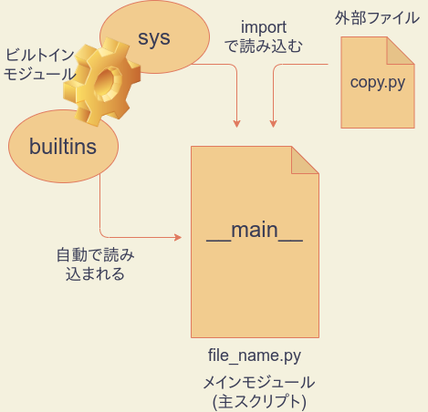

# 第7回　関数とモジュール

- [第7回　関数とモジュール](#第7回関数とモジュール)
  - [関数](#関数)
  - [ジェネレータ](#ジェネレータ)
  - [内包表記](#内包表記)
  - [if/if-elseつき内包表記](#ifif-elseつき内包表記)
  - [モジュールの種類](#モジュールの種類)
    - [外部ファイル](#外部ファイル)
    - [ビルトインモジュール](#ビルトインモジュール)
    - [builtinsモジュール](#builtinsモジュール)
    - [mainモジュール](#mainモジュール)
  - [モジュールを作る](#モジュールを作る)
  - [モジュールのリロード](#モジュールのリロード)
  - [モジュールのバイトコード](#モジュールのバイトコード)
  - [名前空間](#名前空間)
    - [グローバル名前空間](#グローバル名前空間)
    - [ローカル名前空間](#ローカル名前空間)
    - [ビルトイン名前空間](#ビルトイン名前空間)
  - [スコープ](#スコープ)
    - [グローバルスコープ](#グローバルスコープ)
    - [ローカルスコープ](#ローカルスコープ)
    - [ビルトインスコープ](#ビルトインスコープ)
  - [LEGBルール](#legbルール)
  - [global/nonlocal宣言](#globalnonlocal宣言)
    - [練習](#練習)
  - [記号テーブル](#記号テーブル)

## 関数

まずRにおける関数の作成を思い出しましょう。一例として、2つの引数の和を返すだけのmyadd関数を定義するには、次のように書くのでしたね。

```R
myadd <- function(a,b) {
    z <- a + b
    return(z)
}
```

上記において、関数の中身(ボディ)は、中括弧の中で与えられます。`a`、`b`が引数であり、任意の数値を想定しています。関数`return`を呼び出すことで関数の実行は終了し、returnの引数が戻り値として返されます。作成された関数は、無名のまま使うこともできますが、通常は何度も再利用するものです。そのため、`myadd`という名前(**識別子**)に、作成した関数オブジェクトを`<-`演算子によって付値しています。これにより、識別子myaddに関数オブジェクトが結び付けられ、次のようにこの関数を何度でも呼び出せるようになります。

```R
> res = myadd(2,8)
> print(res)
[1] 10
```

なお上記では、`return(a+b)`としても構いませんが、関数のボディの存在をわかりやすくするために、あえて複数行で記述しました。

一方、Pythonの関数は、以下の`def`命令を用いて作成し、必ず識別子への代入が行われます。(Pythonにも**lambda式**という無名関数はありますが、全く違う方法で作ります。残念ながらlambda式では複数行ブロックをもつ関数を作ることはできません。lambda式については教科書のセクション8.4.4に詳しく説明がありますのでよく読んでおいてください。)上記のRコードはPythonで書き直すと次のようになります。

```python
def myadd(a,b):
    z = a + b       # 関数ブロック
    return z        #

print(myadd(5,4))
print(myadd(10,-2))
```

```python
# 出力
9
8
```

ifブロックやforブロックと同じように、関数の内容もまた、インデントを用いたブロックによって表現します。戻り値は`return`命令で返します。Pythonのdefやdelとおなじような命令であって、関数ではないことに注意しましょう。したがって、returnにはカッコは必要ありません。

return命令を省略すると、関数はNoneオブジェクトを返します。Noneは「空っぽ」を意味するオブジェクトであり、メモリ上に常駐していて常に再利用されます。たとえば次の関数helloは、return命令を呼び出しませんので、その戻り値はNoneとなります。

```python
def hello():
    print('Hello, World!')

x = hello()
print(x is None)
```

```python
# 出力
Hello, World!
True
```

また、関数を終了させたいが、戻り値はいらないという場合は、単にreturnと書くと、Noneを返して終了します。何らかの理由で関数の実行を途中で終了したい場合に有用です。

```python
# %%
def hello(name):
    if name == '':
        print('hello,world!')
        return
    print('hello,' + name)

hello('')
hello('taro')
```

```python
# 出力
hello,world!
hello,taro
```

## ジェネレータ

`return`命令の代わりに`yield`命令を使うと、関数は**ジェネレータ関数**という特別な関数になります。ジェネレータ関数は、戻り値として、**ジェネレータオブジェクト**を返します。(ジェネレータ関数とジェネレータオブジェクトのどちらも**ジェネレータ**と呼ぶことがあるので注意してください。)

ジェネレータオブジェクトは、イテラブルなオブジェクトであり、主にループ処理で用いることができます。ループ処理でループインデックスに代入されるのは、yieldの戻り値です。ただし、注意しなくてはならないのは、yieldは作業を中断するだけで、関数ブロックの処理を終了しないということです。

たとえば、次のようなジェネレータは、10までの偶数を順番にループインデックスに返します。

```python
# %%
# ジェネレータ関数の定義
def yield_even():
    for i in range(20):
        if i%2 == 0:
            yield i

# ジェネレータの活用
for i in yield_even():
    print(i)
```

```python
# 出力
0
2
4
6
8
10
12
14
16
18
```

次に説明する**内包表記**を用いると、ジェネレータから簡単にリストを作成できます。

```python
def yield_even():
    for i in range(20):
        if i%2 == 0:
            yield i

# 内包表記
x = [i for i in yield_even()]
print(x)
```

```python
# 出力
[0, 2, 4, 6, 8, 10, 12, 14, 16, 18]
```

## 内包表記

脱線しますが、せっかくですので、ここで**内包表記**についてお話ししておきます。内包表記は、ループ処理の結果をリスト、辞書、集合などのコンテナ型オブジェクトにまとめるためのPython特有の構文であり、なれるとコードをコンパクトに書くのに非常に有用です。

```python
# リスト内包表記
[iの関数 for i in ループ範囲]
# セット(集合)内包表記
{iの関数 for i in ループ範囲}
# 辞書内包表記
{iの関数:iの関数　for i in ループ範囲}
```

例えば、100までの偶数の自乗をすべて収めたリストを作るときは、次のように書きます。

```python
>>> [i**2 for i in range(0,100,2)]
[0, 4, 16, 36, 64, 100, 144, 196, 256, 324, 400, 484, 576, 676, 784, 900, 1024, 1156, 1296, 1444, 1600, 1764, 1936, 2116, 2304, 2500, 2704, 2916, 3136, 3364, 3600, 3844, 4096, 4356, 4624, 4900, 5184, 5476, 5776, 6084, 6400, 6724, 7056, 7396, 7744, 8100, 8464, 8836, 9216, 9604]
```

同じことをforループでやるとすると、たとえば次のようになります。

```python
# %%
x = []
for i in range(0,100,2):
    x.append(i**2)

print(x)
```

セット内包表記は`[]`を`{}`にするだけですが、リストと違い重複を除去できます。次のコードは、100までの偶数の自乗を5で割った余りを集めたリストと集合を計算するためのものです。

```python
>>> [i**2 % 5 for i in range(0,100,2)]
[0, 4, 1, 1, 4, 0, 4, 1, 1, 4, 0, 4, 1, 1, 4, 0, 4, 1, 1, 4, 0, 4, 1, 1, 4, 0, 4, 1, 1, 4, 0, 4, 1, 1, 4, 0, 4, 1, 1, 4, 0, 4, 1, 1, 4, 0, 4, 1, 1, 4]
>>> {i**2 % 5 for i in range(0,100,2)}
{0, 1, 4}
```

辞書内包表記は少し特徴的です。たとえば次は、"hello,world!"という文字列のそれぞれの文字をキーとし、キーの大文字を値とする辞書を作成するコードです。やはりこの場合も、キーの重複は取り除かれます。

```python
>>> x = {c:c.upper() for c in "hello,world!"}
>>> x
{'h': 'H', 'e': 'E', 'l': 'L', 'o': 'O', ',': ',', 'w': 'W', 'r': 'R', 'd': 'D', '!': '!'}
```

辞書で内包表記でキーの重複が取り除かれる際には、最新の値が採用されるので注意が必要です。たとえば、次のコードは、キーと値を入れ替えた辞書を作るものです。値は一意とは限らないので、重複部分は除去され、最新のペアだけが残ります。

```python
# %%
x = {'foo':1,'bar':2,'baz':1}
{j:i for i,j in x.items()}
```

```python
# 出力
{1: 'baz', 2: 'bar'}
```

## if/if-elseつき内包表記

先に挙げた、100までの偶数の自乗を含むリストは、次のようにifと組み合わせた内包表記によっても作成できます。

```python
# %%
x = [i**2 for i in range(100) if i%2 ==0]
print(x)
```

```python
# 出力

[0, 4, 16, 36, 64, 100, 144, 196, 256, 324, 400, 484, 576, 676, 784, 900, 1024, 1156, 1296, 1444, 1600, 1764, 1936, 2116, 2304, 2500, 2704, 2916, 3136, 3364, 3600, 3844, 4096, 4356, 4624, 4900, 5184, 5476, 5776, 6084, 6400, 6724, 7056, 7396, 7744, 8100, 8464, 8836, 9216, 9604]
```

上記では、`i`が2で割り切れるときのみ`i**2`をリストに加える、という意味になります。

ところが、`i`が2で割り切れるときは`i**2`をリストに加え、そうでないときは0を加えよ、という命令にしたいときは、下のようにかなり異なる表現になります。

```python
# %%
x = [i**2 if i%2==0 else 0 for i in range(100)]
print(x)
```

実はこの表現においては、単文の**if-else**構文が使われています。単文のif-elseは次のように用います。

```python
式A if 条件 else 式B
```

このように書くと、「条件が成り立っていれば式A、さもなくば式B」という意味になります。本来内包表記とは直接関係がなく、どこでも用いることができます。たとえばxにiの絶対値を代入したい場合は次のように書くことができます。(実際には`abs`という絶対値を返すビルトイン関数があります。)

```python
x = i if i>=0 else -i
```

このように、ifつき内包表記とif-elseつき内包表記は全く別のものですので、両者を組み合わせることもできます(おすすめはしませんが)。たとえば、「5で割り切れる数のうち、偶数は自乗し、奇数は0で置き換えたリスト」は次のように表現できます。

```python
# %%
x = [i**2 if i%3==0 else i for i in range(100) if i%7==0]
print(x)
```

```python
# 出力

[0, 7, 14, 441, 28, 35, 1764, 49, 56, 3969, 70, 77, 7056, 91, 98]
```

このように、内包表記はかなり高い表現力をもっています。forループの結果をリストに格納したい、ということはプログラミングをやっていると頻発しますので、この機会にぜひ覚えておきましょう。

## モジュールの種類

さて、自作した関数を複数のプログラムで再利用したい場合には、モジュールの仕組みを活用するのが便利です。これまでにも、`sys`モジュールや`copy`モジュールを随所で活用してきましたが、ここでモジュールとはどのようなものかを明確にしておきましょう。

モジュールは、Pythonスクリプトから読み込んで使用できる関数や変数、データ型、Pythonコードの集合のことを広く指します。

Pythonには以下の4種類のモジュールがあります。

|種類|説明|例|
|--|--|--|
|外部ファイル|PythonやCで作成され、importで呼び出して使う|copy|
|ビルトインモジュール|インタープリタに組み込まれ、importで呼び出して使う(`builtins`モジュールは例外)|sys、math|
|`builtins`モジュール|ビルトイン関数・定数を定義している特別なビルトインモジュールで、起動時に自動で読み込まれる|builtins|
|`main`モジュール|主スクリプトの属するモジュール|任意のスクリプト|



### 外部ファイル

全てのPythonスクリプトは他のPythonスクリプトに`import`命令で読み込めるので、モジュールとして機能します。その他にも、たとえばCPythonインタープリタであれば、C言語やCythonと言った言語でモジュールを作成できます。こういった外部ファイルで提供されたモジュールは、import命令によって主プログラムに読み込んで使用することができます。たとえば`copy`モジュールはcopy.pyというPythonスクリプトとして存在しており、import命令で読み込めます。

### ビルトインモジュール

それに対して、ファイルの形では存在していないビルトインモジュールという特別なタイプのモジュールがあります。たとえば`sys`はビルトインモジュールであり、インタープリタに埋め込まれています。その他、数学関数を収めた`math`もビルトインモジュールです。こういったものもimport文で読み込んで使うことができます。

importしたモジュールがビルトインかどうかは単にそのオブジェクトをprintしてみればわかります。

```python
>>> import sys
>>> print(sys)
<module 'sys' (built-in)>
>>> import copy
>>> print(copy)
<module 'copy' from '/usr/lib/python3.8/copy.py'>
```

ビルトインモジュールの場合は、`sys`のように`(built-in)`と表示されます。一方、ファイルの場合は、`copy`のようにモジュールファイルのある場所が表示されます。

### builtinsモジュール

ビルトインモジュールの中には、ただ一つだけ`builtins`という特別なモジュールがあります。これは、たとえば`print`など、ビルトイン関数や`True`などのビルトイン定数を定義しているモジュールです。builtinsだけは、importを必要とせず、`__builtins__`という別名でPythonの起動と同時に自動的に読み込まれます。試しに、`__builtins__`をprintしてみてください。

```python
>>> print(__builtins__)
<module 'builtins' (built-in)>
```

このように、`__builtins__`という名前がすでに定義されていて、その正体は`builtins`というビルトインモジュールであることがわかります(とてもややこしいので混乱しないように注意してください)。これは、`builtins`モジュールが`__builtins__`という別名で読み込まれているということを意味します。モジュールの別名読み込みは一般に次のようなimport-as文で行います。

```python
import モジュール名 as 別名
```

つまり、builtinsモジュールだけは、起動時に次のように読み込まれたのと同じ状態になるということです。

```python
import builtins as __builtins__
```

なぜこのようになっているかというのは、名前空間の節で説明します。

### mainモジュール

最後に、**main**というモジュールがあります(正確には`__main__`)。これは、実行時の主スクリプトの別名です。たとえばコマンドプロンプトで次のようにfile.pyスクリプトを実行したとします。

```cmd
python file.py
```

このとき、file.pyに記述された変数、関数、コード、データ型は全て`main`モジュールに属することになります。

このように、Pythonスクリプトは全てモジュールとして機能しますが、その逆は必ずしも成り立ちません。モジュールはスクリプトよりも広い概念です。

## モジュールを作る

それでは折角ですので、モジュールを自作してみましょう。といっても、二つのPythonスクリプトを作成し、一方をもう一方からimportするだけです。importする側がmainモジュールとなります。

GitHubディレクトリの中にmy_first_moduleというフォルダを作ってVS Codeで開きましょう。そして、mymod1.pyというファイルを作って開きましょう。この中に、次のように記述します。

```python
x = 5
def hello():
    print("Hello,World!")
```

記述を終えたら保存します。ここでの目的は、mymod1.pyの中で定義された変数`x`と関数`hello`を再利用することです。

次に、mymain.pyというファイルを作成して開き、次のように記述して**インタラクティブモード**で実行してみましょう。

```python
# %%
import mymod1

print(mymod1.x)
mymod1.hello()
```

ここで、`mymod1.x`によって、mymod1.pyで定義された変数xにアクセスしていることに注意してください。上手くimportできれば、次のように表示されるはずです。

```python
# 出力
5
Hello,World!
```

ここで2点注意事項があります。

1. `import`での読み込みは初回のみ有効であり、モジュールの再読み込み(リロード)には使えない。
2. 一度読み込まれたモジュールはバイトコンパイルされ、変更がない限り再利用され続ける。

## モジュールのリロード

上記1は、モジュールを変更したら、一旦Pythonを再起動しないと、変更したモジュールをimportで読み込み直せないということを意味します。これを覚えておくことは大変重要です。

たとえば、まずmymain.pyをインタラクティブモードで実行したあと、**インタラクティブモードを起動したまま**で、mymod1.pyを次のように変更して保存してみましょう。

```python
x = 100
def hello():
    print("Good bye,World!")
```

そして、mymain.pyをインタラクティブモードでもう一度実行してみてください。次のように、mymod1.pyの変更が反映されていないはずです。

```python
# 出力

5
Hello,World!
```

それでは、一度インタラクティブモードを終了してください(Pythonを停止する)。それからもう一度同じmymain.pyのコードを実行してください。次のように、変更が反映されるはずです。

```python
100
Good bye,World!
```

Pythonを終了せずにモジュールの再読み込みをするには、次のように`importlib`モジュールの`reload`関数を使う方法もあります。モジュールの開発中は、一々Pythonを再起動するよりもこちらのほうが便利でしょう。一度読み込まれたmymod1モジュールを再び読み込むには、次のように記述します。

```python
import importlib
importlib.reload(mymod1)
```

## モジュールのバイトコード

import文によって読み込まれたPythonスクリプトのモジュールは、通常インタプリタによってバイトコンパイルされ__pycache__というディレクトリに保存されます。__pycache__はmainモジュールファイル(主スクリプト)が置かれていた場所に作られます。VS Code上で閲覧できるはずなので、開いてみてください。

中には、mymod1.cpython-38.pycというバイナリファイルが作られているはずです。これがmymod1.pyをバイトコンパイルして出来たバイトコードです。

通常、mainモジュールとして実行されるファイルは、実行のたびにバイトコンパイルされ、バイトコードがファイルに保存されることはありません(強制的にバイトコードを作ることは可能です)。一方、importされたファイルは(可能な限り)バイトコードを保存し、ファイル内容に変更がない限り再コンパイルしません。

このようにして、モジュールのバイトコンパイルにかける時間を節約することで、Pythonは実行までの時間を短縮する工夫をしています。通常モジュールのバイトコンパイルを意識する必要はありませんが、教養として知っておきましょう。

## 名前空間

名前空間とは、mainを始めとするモジュールの中で定義された記号(識別子)の一覧および、それらの記号が参照するオブジェクトの対応表のことです。一つのモジュールには、次の3種類の名前空間が存在します。

|名前空間|含まれる記号|
|--|--|
|ローカル名前空間|関数のなかで定義された記号|
|グローバル名前空間|モジュールファイルのトップレベル(関数の外)で定義された記号
|ビルトイン名前空間|__builtins__で定義されている記号|

### グローバル名前空間

それぞれの名前空間は、具体的に辞書の形で取り出すことができます。グローバル名前空間の辞書はビルトイン関数globalを使って取得できます。

まず、Pythonを起動してすぐglobalを呼び出すと次のようになります。

```python
>>> globals()
{'__builtins__': <module '__builtin__' (built-in)>, '__name__': '__main__', '__doc__': None, '__package__': None}
>>> len(globals())
4
```

このように、グローバル名前空間には起動直後にすでに4つの変数が定義されていることが分かります。

|変数名|意味|
|--|--|
|`__builtins__`|ビルトイン名前空間|
|`__name__`|モジュールの名前|
|`__doc__`|このモジュールの説明|
|`__package__`|パッケージ名|

このうち重要なのは、`None`でない`__builtins__`と`__name__`です。モジュールがmainモジュールとして直接Pythonによって実行された場合、`__name__`には`"__main__"`が設定されますが、他のファイルによってimportされた場合には`__name__`にはモジュールのファイル名が設定されます。これにより、モジュールは自分が主スクリプトとして実行されているのか、他のモジュールにimportされているのかを見分けることができます。

一方、`__builtins__`はビルトイン名前空間を表します。これについては、ビルトイン名前空間のところで解説します。

### ローカル名前空間

ローカル名前空間は、各関数につき一つずつ存在しており、関数内で定義された記号とそれが参照するオブジェクトの対応を与えます。ローカル名前空間を辞書として取り出すには、関数内でビルトイン関数のlocalsを呼び出します。

```python
# %%

x = 1
def f(y):
    z = 3
    print(locals())

f(2)
```

```python
# 出力

{'y': 2, 'z': 3}
```

上記では、関数`f`の中で`locals`を呼び出したので、`f`の名前空間が辞書として出力されました。この名前空間には、`f`の中で定義されている変数である`y`と`z`が登録されています。

なお、[Pythonのリファレンスマニュアル](https://docs.python.org/3/library/functions.html)にあるように、locals()の戻り値である辞書を**編集してはいけません**。locals()の戻り値は名前空間を辞書にコピーしたものであって名前空間そのものではないため、locals()に加えた変更はローカル名前空間に反映されません。

### ビルトイン名前空間

ビルトイン名前空間は、`True`や`None`といった全てのビルトイン定数とビルトイン関数を定義している名前空間です。ビルトイン名前空間は、`builtins`モジュールの`__dict__`属性(変数)に辞書として格納されています。`builtins`は起動時にすでに`__builtins__`という別名で読み込まれているため、これを使うことができます。

```python
>>> __builtins__.__dict__
{'__name__': 'builtins', '__doc__': "Built-in functions, exceptions, and other objects.\n\nNoteworthy: None is the `nil' object; Ellipsis represents `...' in slices.", '__package__': '', '__loader__': <class '_frozen_importlib.BuiltinImporter'>, ...(以下省略)
>>> len(__builtins__.__dict__)
154
```

上記のように、154個のビルトイン関数・定数が定義されていることがわかります(具体的な数はPythonバージョンや処理系に依存しえます。)

ここで、`__builtins__`という名前の働きについて説明します。
(`__builtins__`の働きは、現在のモジュールがmainかどうかによって少し違います。以下では、話を単純にするため、現在のモジュールがmainであると仮定します。)

上述のように、モジュールがmainとして実行されると、`builtins`モジュールが`__builtins__`という別名で読み込まれます。Pythonがビルトイン関数の名前を参照するとき、実際には、この`__builtins__`という名前で読み込まれたモジュールのグローバル名前空間が検索されます。(したがって、研究目的以外では絶対に行うべきではありませんが、別のモジュールを`__builtins__`という名前で上書きインポートすることにより、Pythonはそのモジュールのグローバル名前空間をビルトイン名前空間と『誤認』することになります。)

[Pythonのリファレンスマニュアル](https://docs.python.org/3/reference/executionmodel.html)によると、Pythonが`__builtins__`という名前をどのように使うかはPythonの実装に依存しているようです。リファレンスマニュアルには、以下のようにこの`__builtins__`をプログラムの中で使うべきでないと明記されています。

>Users should not touch `__builtins__`; it is strictly an implementation detail. Users wanting to override values in the builtins namespace should import the **builtins** module and modify its attributes appropriately.

上記にあるように、ビルトイン名前空間を操作したいときは、`builtins`モジュールを別途importしてそれを操作するのが正しい方法です。

たとえば次のようにすると、ビルトイン名前空間に`x`という変数を追加することができ、`print`などのビルトイン関数と同じようにプログラムのどこからでも呼び出すことができるようになります。

```python
>>> import builtins
>>> builtins.x = 5
>>> __builtins__.__dict__['x']
5
>>> x
5
```

## スコープ

Pythonで変数名や関数名がどのように使われるかを理解するには、名前空間だけでなく**スコープ**の概念を理解する必要があります。**スコープ**と名前空間はしばしば混同され、同じ意味で用いられることもありますが、厳密には異なる概念です。

**スコープ**とは、モジュールファイルのなかで、ある名前空間の記号が、**記号単体で参照できるコードの範囲**を指します。ここで**記号単体**とは、たとえば`x`のように書くことです。`sys.x`のように書くことは記号単体とは言いません。スコープは、それぞれの名前空間に一つずつ存在します。変数`x`のスコープというと、通常`x`が属する名前空間のスコープを指します。

グローバル名前空間のスコープを**グローバルスコープ**、ローカル名前空間のスコープを**ローカルスコープ**、ビルトイン名前空間のスコープを**ビルトインスコープ**と呼びます。

|スコープ名|対応する名前空間|範囲|
|--|--|--|
|グローバルスコープ|グローバル名前空間|モジュール全体|
|ローカルスコープ|各関数のローカル名前空間|関数ブロック|
|ビルトインスコープ|ビルトイン名前空間|プログラム全体|

### グローバルスコープ

グローバルスコープは、モジュールのトップレベルで代入された記号を**記号単体**で使うことができるコードの範囲です。トップレベルで代入された変数や関数は、モジュールファイルのどこからでも記号単体で参照できますので、**グローバルスコープはモジュールファイル全体**ということになります。**グローバル**という言葉が紛らわしいですが、グローバル名前空間の記号はモジュールの外からは参照できません。

### ローカルスコープ

一方関数内で定義された記号はその関数の中でしか記号単体で参照できないので、**ローカルスコープ**は対応する関数の関数ブロックに等しくなります。

### ビルトインスコープ

ビルトイン名前空間の記号は文字通り、どこからでも記号単体で参照できます。従って**ビルトインスコープ**はプログラム全体を指す最も広いスコープです。

## LEGBルール

一般にスコープは入れ子の関係にあります。たとえば関数のローカルスコープは、モジュールのグローバルスコープに含まれています。内側のスコープでは、両方の名前空間が参照できるので、ある記号が参照されたとき、Pythonはどちらの名前空間を先に検索するのかを決定する必要があります。

Pythonは、内側から外側へ向かって名前空間を検索します。具体的には、以下のような順番で、名前空間を検索します。

1. ローカル名前空間(**L**ocal)
2. 外側の関数のローカル名前空間(**E**nclosing)
3. グローバル名前空間(**G**lobal)
4. ビルトイン名前空間(**B**uilt-in)

1〜4のどの名前空間を参照しても記号が見つからなかったとき、Pythonはエラー(NameError)を出します。この検索パターンを**LEGBルール**と呼びます。

注意しなくてはならないのは、**関数の内側では、一つの記号は関数ブロックを通して必ず同じ名前空間を参照**するということです。

たとえば、次のコードのコードは、間違ったコードとして非常に有名なものです。

```python
# %%
x = 5

def f():
    print(x)
    x = 3
    print(x)

f()
```

これを書いたプログラマは、関数`f`の中で、まず5を出力し、次に3を出力することを意図していますが、これを実行すると、次のようなエラーが出ます。

```python
# 出力

---------------------------------------------------------------------------
UnboundLocalError                         Traceback (most recent call last)

...(中略)...

      239 
      240 def f():
----> 241     print(x)
      242     x = 3
      243     print(x)

UnboundLocalError: local variable 'x' referenced before assignment
```

最後の`UnboundLocalError`の行に注目しましょう。このエラーは、「値が割り当てられる前に`x`が参照された」というものです。

なぜこのようなエラーが出たかというと、`x=3`という`x`への代入操作が関数内に存在していることにより、`x`が`f`のローカル名前空間にエントリーし、関数ブロックの全域でローカル変数とみなされるからです。従って、1回目の`print(x)`で、`x`が定義されていない、というエラーが出るわけです。

同様ですが、もっと分かりにくいコードは次のようなものです。

```python
# %%
x = 5

def f():
    x += 1
    print(x)

f()
```

出力は以下の通りです。

```python
# 出力

---------------------------------------------------------------------------

...(中略)...
      249 
      250 def f():
----> 251     x += 1
      252     print(x)
      253 

UnboundLocalError: local variable 'x' referenced before assignment
```

`x += 1`は、`x = x + 1`と同じ意味です。これは`x`への代入を伴いますが、その時点で、`x`は`f`のローカル名前空間に属するローカル変数とみなされます。`x = x + 1`の右辺は、`x`の値を参照していますので、「まだ定義されていないローカル変数が参照された」というエラーが出るわけです。

## global/nonlocal宣言

関数の内側で、グローバル変数を編集したり、外側の関数のローカル変数を編集することも可能です。そのためには、`global`命令と`nonlocal`命令を使います。

```python
# %%
# %%
x = 5

def f():
    global x
    x += 1

f()
print(x)
```

```python
# 出力
6
```

また、入れ子になった関数で外側の名前空間の変数を編集するには、`nonlocal`命令を使います。

```python
# %%
x = 0

def outer():
    x = 0

    def inner():
        nonlocal x
        x += 1
        print("At inner:",x)

    inner()
    print("At outer:",x)

outer()
print("At global:",x)
```

```python
# 出力

At inner: 1
At outer: 1
At global: 0
```

残念ながら、関数の入れ子において2つ以上上の階層の名前空間を指定する命令は存在しません。したがって、次の例において、`f`の名前空間を直接していする命令はありません。

```python
x = 0

def f():
    x = 0
    
    def g():
        x = 0
        
        def h():
            nonlocal x
            x += 1
            print("At h:",x)

        h()
        print("At g:",x)

    g()
    print("At f:",x)

f()
print("At global:",x)
```

```python
At h: 1
At g: 1
At f: 0
At global: 0
```

### 練習

上記の3重入れ子関数において、`nonlocal`を`global`に変えたときにどうなるか予測し、実際に実行して結果を確かめなさい。

## 記号テーブル

このように、Pythonでは、入れ子になったスコープのせいで関数内のある記号がどの名前空間を指しているのかがプログラマからみて分かりにくくなるという問題が生じ得ます。

この問題を研究するにあたって役に立つのが**記号テーブル**です。記号テーブルは、関数ブロックで使われている各記号と名前空間の関係を表した表であり、各関数ブロックとモジュールのトップレベルに対して一つずつ存在します。ローカル名前空間が、「関数内で**定義**されている記号の一覧」を与えるのに対して、関数の記号テーブルは、「関数内で**使われている**記号の一覧」を与えることに注意してください。したがって、ある関数の記号テーブルには、その関数の名前空間には属さない記号も現れます。

記号テーブルはPythonコードの構文解析後、バイトコンパイルの直前にインタープリタによって作成され、これを用いてバイトコンパイルが行われます。

PythonにはsymtableというPythonコードの記号テーブルを取得するモジュールがあります(Pythonのバージョンは3.8.8以上を使ってください。それより前だと変な挙動をする可能性があります。)。たとえば次のようなPythonコードにはグローバル名前空間が一つとローカル名前空間が2つあります。

```python
# %%
x = 1
def f():
    x = 2
    y = 3

def g():
    y = x + 1
    print(y)
```

このコードにおいて、まずトップレベルの記号表を取得するには次のようにします。

```python
# %%
import symtable

code = """
x = 1
def f():
    x = 2
    y = 3

def g():
    y = x + 1
    print(y)
"""

tbl = symtable.symtable(code,"main.py","exec")
print(tbl)      # トップレベルの記号表を出力
print()

top_syms = tbl.get_symbols()
print(top_syms) # 記号表の中の記号の一覧
```

ここで、`symtable`モジュールの`symtable`関数を使っていますが、この関数は第1引数にPythonコード、第2引数に仮想的な主スクリプトの名前を与えます。第3引数は通常"exec"を指定すれば良いです。戻り値は`SymbolTable`型のオブジェクトですが、これがモジュールmainのトップレベルの記号表です。上記のコードでは変数`tbl`に代入しています。

記号表(`SymbolTable`)オブジェクトは、`get_symbols`メソッドにより、記号の一覧をリストで取得できます。上記では、このリストを変数`top_syms`に代入しています。各記号は、`Symbol`型のオブジェクトです。

```python
# 出力

<SymbolTable for top in main.py>

[<symbol 'x'>, <symbol 'f'>, <symbol 'g'>]
```

上記のように、トップレベルの記号表は、グローバルで定義された記号`x`、`f`、`g`のエントリーを持っていることが分かります。
