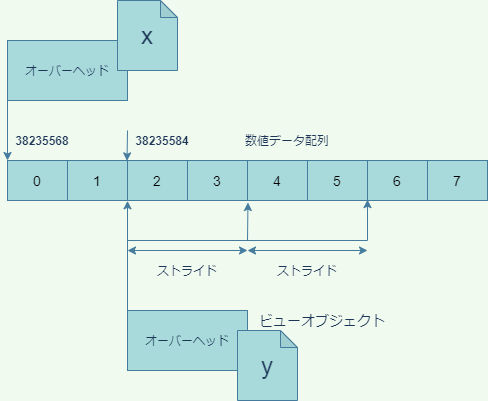

# 第9回 NumPy/SciPy入門

## NumPy/SciPyとは

これまで見てきたように、Pythonには、Rのベクトルのような数値計算に適したデータ型が標準で備わっていません。それはPythonが**汎用プログラミング言語**だからです。Pythonは、一つの仕事に特化した機能を標準で提供するのではなく、標準機能は柔軟性が高く、汎用性の高いものだけを提供し、専門的な機能については、全てモジュールあるいはパッケージの形で、拡張機能として提供する仕組みを採用しています。そのおかげで、世界中の有志のプログラマによって、Pythonの様々な拡張機能が提供され、機械学習、ウェブアプリケーション、GIS、経済実験など、多様な分野で成功を収めて来ました。

今回取り上げる**NumPy**はPythonに高度な数値計算ライブラリを提供するモジュールで、他の様々なライブラリがNumPyに依存しています。Pythonでデータ解析をするならば、NumPyは絶対に避けて通れませんので、今回の講義でしっかりと基礎を押さえましょう。

また、NumPyをベースにした科学計算ライブラリである**SciPy**についても簡単に取り上げます。NumPyの機能は非常に高度で強力ですが、科学の個別の分野には適応していません。統計や物理計算などの個別の分野に特化した計算は、NumPyをベースにした**SciPy**モジュールが提供します。

なお、NumPyやSciPyのような複数のモジュールを集めて作ったモジュールは**パッケージ**と呼ばれます。[リファレンスマニュアル](https://docs.python.org/3/reference/import.html#packages)にあるように、全てのパッケージはモジュールですが、モジュールは必ずしもパッケージではありません。

使う側からすると、あるモジュールがパッケージかどうかということは通常問題になりません。従って、本講義では、区別する必要が生じないかぎり、パッケージのことをモジュールと呼ぶことにします。

## NumPyの利点

NumPyを使う利点は、主に以下のようなものでしょう。

- ベクトルや高次元の配列を扱うことができる
- 種々のベクトル・行列演算が可能
- 標準機能に比べ、演算が高速

中でも**速度**の問題は科学技術計算において重大です。特にPythonのforループによる処理が遅いことはPythonユーザーの間でも有名です。常識的な時間内に、本格的な科学計算を終わらせたいのなら、Pythonのリストやforループ、内包表記と言ったものをコードの主要な部分で使おうとは考えないことです。

NumPyでのベクトル演算が高速な主な理由は、C言語でのプログラミングと同じように、メモリ上で連続した配列(各要素のバイト数は固定)に直接数値を格納し、しかも一つの配列には「整数」や「浮動小数点数」など決まったデータ型の数値しか格納しないからです。

一方、これまで学んできたように、リストを始め、Pythonのコンテナは全て数値そのものではなく、オブジェクトへの参照を格納しています。しかも、オブジェクトのデータ型は、実際にオブジェクトが参照されるまでわかりません。

より具体的にPythonが遅い理由を考えるため、「リストAの要素とリストBの要素を要素ごとに足して、一つのリストを作る」という操作をPythonが処理するときの手順について考えてみるとよいでしょう。第1要素を足し合わせるだけで、以下のプロセスが必要になります。

1. リストA、Bの第1要素に格納されている参照(アドレス)を取得
2. それらの参照をたどって、2つのオブジェクトを取得
3. 2つのオブジェクトの型を調べる
4. `+`演算子が2つの型の間で定義されているか調べる
5. 定義されていなければエラーを返す
6. 定義されていれば2つのオブジェクトから数値を取り出して足す
7. 演算結果の数値をPythonの数値オブジェクトに加工する

少なくともこれだけの操作が、**それぞれの要素**について必要になるはずです。

一方NumPyのベクトルの場合は、一つのベクトルが複数のデータ型を混在させることはありません。従って要素ごとに演算がどのように定義されているか調べる必要はありません。しかもベクトルは参照ではなく数値そのものを格納しているため、参照をたどる時間も必要ありませんし、計算結果を要素ごとにオブジェクト化する時間も必要ありません。これが主な高速化の理由ですが、他にも内部で諸々の効率性のよいアルゴリズムを使っているということがあるでしょう。

実行速度など、コードのパフォーマンスを評価する作業のことを**プロファイリング**と呼びます。あとで簡単なプロファイリングのやり方を解説しますが、そのときに、forループでの作業に比べてNumPyのベクトル演算がどれだけ高速であるか評価することにしましょう。

## 目標

NumPyやSciPyの様々な機能を1回の講義で幅広く説明することは困難です。そこで、今回は的を絞り、以下の2点の達成を目標とします。

- NumPyで線形モデルに従って疑似データを作成する
- そのデータに対してSciPyで線形回帰を行う

上記の作業を自分でできるようになれば、NumPy/SciPyのマニュアルはインターネット上や書籍で豊富に提供されていますので、他の作業は容易に独学で学ぶことができると思います。

独学の際に有用な資料を以下にリストアップしておきます。

- [NumPyリファレンス](https://numpy.org/doc/stable/reference/)
- [SciPyリファレンス](https://docs.scipy.org/doc/scipy/reference/)
- [NumPyによるデータ分析入門](https://www.amazon.co.jp/NumPy%E3%81%AB%E3%82%88%E3%82%8B%E3%83%87%E3%83%BC%E3%82%BF%E5%88%86%E6%9E%90%E5%85%A5%E9%96%80-%E2%80%95%E9%85%8D%E5%88%97%E6%93%8D%E4%BD%9C%E3%80%81%E7%B7%9A%E5%BD%A2%E4%BB%A3%E6%95%B0%E3%80%81%E6%A9%9F%E6%A2%B0%E5%AD%A6%E7%BF%92%E3%81%AE%E3%81%9F%E3%82%81%E3%81%AEPython%E3%83%97%E3%83%AD%E3%82%B0%E3%83%A9%E3%83%9F%E3%83%B3%E3%82%B0-Umit-Mert-Cakmak/dp/4873118875)

## インストールとインポート

それでは、早速NumPyを使ってみましょう。まず準備として、Anacondaの`base`以外の環境を使っている方は、`numpy`モジュールをインストールする必要があります。

```cmd
conda install numpy
```

NumPyのモジュール名は`numpy`です。ルールではありませんが、`numpy`は`np`という別名で`import`するのが慣習ですので、特に理由がないかぎりそうしましょう。

したがって、次のように`import`してください。以降、`numpy`は`np`の名前で使うことができるようになります。

```python
import numpy as np
```

NumPyの主要なデータ型は`ndarray`という配列型です。NumPyは、配列オブジェクトを作成し、配列オブジェクトを操作するためのモジュールであると考えて概ね間違いはありません。よって、配列を極めることがNumPyを極めることでもあります。

## 1次元配列の作成

ここでは、まず1次元の配列を作る方法を説明しましょう。1次元の配列とは、数値が一列にならんだだけのものであり、**ベクトル**とも呼ばれます。

1次元配列を作る方法は色々とありますが、最も基本的なのは、`array`関数を用いてリスト、タプル、あるいはレンジから作る方法です。

```python
>>> x = np.array([1,2,3,4,5])   # リストから作成
>>> x
array([1, 2, 3, 4, 5])
>>> x = np.array((1,2,3,4,5))   # タプルから作成
>>> x
array([1, 2, 3, 4, 5])
>>> x = np.array(range(10))     # レンジから作成
>>> x
array([0, 1, 2, 3, 4, 5, 6, 7, 8, 9])
>>> type(x)
<class 'numpy.ndarray'>
```

このように、配列を出力すると、`array([...])`という表記で出力されますが、内側の`[]`はPythonのリストとは何の関係もありません。

なお、レンジから配列を作る場合は、以下のような`arange`という関数が別に用意されているので、こちらから作っても良いでしょう。

```python
>>> x = np.arange(10)
>>> x
array([0, 1, 2, 3, 4, 5, 6, 7, 8, 9])
>>> type(x)
<class 'numpy.ndarray'>
```

`x`のデータ型は`ndarray`ですが、`x`が内部にもっている数値データの配列もまた『型』を持ちます。データの型は、`ndarray`オブジェクトの`dtype`属性に収められています。

```python
>>> x.dtype
dtype('int64')
```

この出力は、`x`内部の要素配列が`int64`というNumPyモジュール内で定義されたデータ型を有することを示しています。

`int64`型の数値は、64ビット、つまり8バイトのメモリ領域に格納される整数です。8バイト整数は仮に非負の整数だけに用いれば`0〜2**64-1`の範囲の整数を表すことができますが、`int64`は符号つき整数ですので、`-2**32〜2**32-1`、つまり下が`-4294967296`から上が`4294967295`までの整数を表現することができます。

一つの数値で8バイト占有しますので、`x`の配列全体では80バイト消費しているはずですが、これを確認することができます。`ndarray`型オブジェクトは、属性`nbytes`にオーバーヘッドを除いた占有メモリ量を格納しています。

```python
>>> x = np.arange(10)
>>> x
array([0, 1, 2, 3, 4, 5, 6, 7, 8, 9])
>>> type(x)
<class 'numpy.ndarray'>
>>> x = np.arange(10)
>>> x.nbytes
80
>>> import sys
>>> sys.getsizeof(x)
184
```

上記のように、筆者の環境では`x`全体が184バイト占有していますのでオーバーヘッドは104バイトということになります(オーバーヘッドはNumPyのバージョンや環境に依存しえます)。

`ndarray`オブジェクト内部の数値型は、配列オブジェクトを作成するときに適当なものが自動的に選択されます。上記で数値型が自動的に`int64`になったのは、筆者の環境が64ビット処理系であることに関連しています。

数値型を明示的に指定したい場合は、`array`関数の`dtype`引数に数値型を指定します。たとえば、小さな正整数しか扱わないことが分かっている場合は、メモリを節約するために、数値型を符号なし16ビット整数に設定したいということがあるかもしれません。その場合は、`array`関数の`dtype`引数に数値型を指定します。

```python
# arrayを使う場合
>>> x = np.array(range(10),dtype=np.uint16)
>>> x
array([0, 1, 2, 3, 4, 5, 6, 7, 8, 9], dtype=uint16)
>>> x.nbytes
20
```

```python
# arangeを使っても同じ
>>> x = np.arange(10,dtype=np.uint16)
>>> x
array([0, 1, 2, 3, 4, 5, 6, 7, 8, 9], dtype=uint16)
>>> x.nbytes
20
```

これで使用メモリを`1/4`まで削減きました(ただしオーバーヘッド除く)。ここで`uint16`は"unsigned integer 16 bits"(符号なし16ビット整数)を表すデータ型であり、NumPyモジュール内で`uint16`という名前で定義されています。

NumPyには、主に以下のような数値型があります。

|数値型|意味|
|--|--|
|`int8`|8ビット符号付き整数|
|`int16`|16ビット符号付き整数|
|`int32`|32ビット符号付き整数|
|`int64`|64ビット符号付き整数|
|`uint8`|8ビット符号なし整数|
|`uint16`|16ビット符号なし整数|
|`uint32`|32ビット符号なし整数|
|`uint64`|64ビット符号なし整数|
|`float16`|16ビット浮動小数点数|
|`float32`|32ビット浮動小数点数|
|`float64`|浮動小数点数(通常64ビット、処理系依存)|
|`complex64`|64ビット複素数|
|`complex128`|複素数(通常128ビット、処理系依存)|

## ベクトル演算

NumPy配列は、Rのベクトルによく似たベクトル演算をサポートしています。つまり、同じサイズの２つの配列に二項演算子を施すと、要素ごとの演算を実行します。

```python
>>> x = np.array([0,2,4,6,8])
>>> y = np.array([1,2,2,3,4])
>>> x + y
array([ 1,  4,  6,  9, 12])
>>> x - y 
array([-1,  0,  2,  3,  4])
>>> x * y
array([ 0,  4,  8, 18, 32])
>>> x / y
array([0., 1., 2., 2., 2.])
```

四則演算だけでなく、比較演算子もベクトル化されます。

```python
>>> x = np.array([0,5,10])
>>> y = np.array([3,2,10])
>>> x > y
array([False,  True, False])
>>> x >= y
array([False,  True,  True])
>>> x == y
array([False, False,  True])
>>> x != y
array([ True,  True, False])
```

ベクトルとスカラーの二項演算もサポートされています。

```python
>>> x = np.arange(10)
>>> x
array([0, 1, 2, 3, 4, 5, 6, 7, 8, 9])
>>> x + 3
array([ 3,  4,  5,  6,  7,  8,  9, 10, 11, 12])
```

上記の場合、NumPyは、`x`と同じで全ての要素が3であるNumPy配列を作成し、それと`x`のベクトル演算を行います。つまり、本質的に次の演算が行われます。

```python
>>> x + np.array([3] * 10)
array([ 3,  4,  5,  6,  7,  8,  9, 10, 11, 12])
```

より一般に、NumPyは、形状の異なる配列同士のベクトル演算を行うとき、小さい方の配列を変形して大きい方に形状を合わせてから演算を行います。これを**ブロードキャスト**と言います。

1次元配列においてブロードキャストが可能なのは、一方がスカラーもしくは要素が一つしかないリストや配列の場合だけです。それ以外の場合はエラー(ValueError)が出ます。

```python
>>> x
array([0, 1, 2, 3, 4, 5, 6, 7, 8, 9])
>>> x + np.array([1,2,3])
Traceback (most recent call last):
  File "<stdin>", line 1, in <module>
ValueError: operands could not be broadcast together with shapes (10,) (3,) 
```

多次元配列のブロードキャストルールはもう少し複雑です。これについては、あとで多次元配列を扱うときに詳しく説明します。

## インデクシング・スライス

NumPyの配列は、Pythonのリストと同じように、インデックス参照およびスライス記法によって要素を取得したり、部分配列を取得できます。

```python
>>> x
array([0, 1, 2, 3, 4, 5, 6, 7, 8, 9])
>>> x[5]
5
>>> x[-1]
9
>>> x[3:7]
array([3, 4, 5, 6])
>>> x[:6]
array([0, 1, 2, 3, 4, 5])
>>> x[4:]
array([4, 5, 6, 7, 8, 9])
>>> x[::2]
array([0, 2, 4, 6, 8])
>>> 
```

代入文の左辺にインデックス参照やスライス記法を用いることもできますが、左辺と右辺の形状が違う場合はブロードキャストのルールが適用されます。

```python
>>> x
array([0, 1, 2, 3, 4, 5, 6, 7, 8, 9])
>>> x[4] = 100
>>> x
array([  0,   1,   2,   3, 100,   5,   6,   7,   8,   9])
>>> x[3:6] = [300,400,500]
>>> x
array([  0,   1,   2, 300, 400, 500,   6,   7,   8,   9])
>>> x[3:6] = np.array([10,10])
Traceback (most recent call last):
  File "<stdin>", line 1, in <module>
ValueError: could not broadcast input array from shape (2,) into shape (3,)
```

上記の最後の例では、3つの要素をもつスライスに2つしか要素を持たないベクトルを代入しようとしたため、エラーが出ました。

## ビュー

実は、配列のスライスによって得られるものは、**ビュー**というNumPy特有のオブジェクトです。ビューは始めて現れる概念だけでなく、理解していないと意図しないデータ操作をしてしまうことになりますので、少し丁寧に解説しておきます。

たとえば次のようにして`x`のスライスを作って`y`に代入したとしましょう。

```python
>>> x = np.arange(10)
>>> y = x[2:8:2]
>>> x
array([0, 1, 2, 3, 4, 5, 6, 7, 8, 9])
>>> y
array([2, 4, 6])
```

NumPy配列は内部に、生の数値データが収められた配列を持っていることを思い出しましょう。上記のようにスライス記法で`y`を作成すると、`y`は`x`と異なるオブジェクトでありながら、数値データの配列は`x`と共有した状態になります。



これは次のようにして確かめることが出来ます。まず、`x`と`y`が異なるオブジェクトであることを確かめておきましょう。

```python
# %%
import numpy as np
x = np.arange(10)
y = x[2:8:2]
print("x:",x)
print("y:",y)
print("x is y:",x is y)         # x is y?
print("x is at",hex(id(x)))     # xのアドレス
print("y is at",hex(id(y)))     # yのアドレス
```

```python
# 出力

x: [0 1 2 3 4 5 6 7 8 9]
y: [2 4 6]
x is y: False
x is at 0x7f04b60c5e70
y is at 0x7f04fc0a8cf0
```

NumPy配列は、内部の数値データ配列の情報を直接取得することができるようになっています。この情報は、`__array_interface__`という属性に辞書の形で収められています。これを出力してみましょう。

```python
# %%
print("x:")
for key,value in x.__array_interface__.items():
    print(' ',key,value)

print("y:")
for key,value in y.__array_interface__.items():
    print(' ',key,value)
```

```python
# 出力

print("x:")...
x:
  data (38235568, False)
  strides None
  descr [('', '<i8')]
  typestr <i8
  shape (10,)
  version 3
y:
  data (38235584, False)
  strides (16,)
  descr [('', '<i8')]
  typestr <i8
  shape (3,)
  version 3
```

上記のように`__array_interface__`属性は6個のエントリーをもつ辞書ですが、特に重要なのは以下のエントリーです。

|キー|内容|
|--|--|
|`data`|`(データのアドレス,読み出し属性)`|
|`strides`|ストライド|
|`shape`|配列の形状|

`data`はタプルですが、その１つめの要素はデータ配列のアドレスであり、`x`と`y`のアドレスがきっかり16バイト違うことに注目してください。読み出し属性は、`True`なら読み出し専用、`False`なら書き込みもできます。

`np.int64`型のデータは一つの数値で8バイト占有しますので、上記の結果は、`y`のデータは、`x`のデータの2区画先から始まっていることを表しています。

次に`strides`ですが、これは、**ストライド**(歩幅)と言って、ビューにおいて隣り合う数値データの間のアドレスの間隔をバイトで表したものです。`x`のほうはビューではないので`None`になっています(数値データは隙間なくメモリ上にならんでいます)。一方`y`のほうは、ストライドが16バイトですので、数値データの間隔は2区画分、つまり一つとばしで並んでいることが分かります。

最後に`shape`ですが、これは要素の数ですので、特に説明はいらないでしょう。

このように、`x`と`y`は違うNumPy配列オブジェクトでありながら、データを共有していることが分かります。２つの配列オブジェクトがメモリを共有しているかどうかは、`numpy`モジュールの`shares_memory`関数で調べることができます。

```python
>>> np.shares_memory(x,y)
True
```

このように、`x`とそのビューである`y`はデータを共有しているので、`y`の変更は`x`に影響を及ぼします。

```python
>>> y[0] = 100
>>> x
array([  0,   1, 100,   3,   4,   5,   6,   7,   8,   9])
```

なお、ビューの親となっている元のオブジェクトはビューの`base`という属性に格納されています。

```python
>>> y.base
array([  0,   1, 100,   3,   4,   5,   6,   7,   8,   9])
>>> y.base is x
True
```

## 乱数ルーチン

NumPyには`random`という乱数発生用のモジュールが含まれています。`random`には、正規乱数や一様乱数など、様々な種類の乱数を生成する関数が定義されており、シミュレーションに重宝しますので、是非活用できるようになってください。以下、それらのごく一部を紹介します。

|関数|分布|
|--|--|
|`normal`|正規分布|
|`random`|区間`[0,1)`の一様分布|
|`uniform`|任意区間の一様分布|
|`poisson`|ポワソン分布|
|`randint`|離散一様分布|
|`gumbel`|ガンベル分布|

詳しい使い方については、NumPy[リファレンス](https://numpy.org/doc/stable/reference/random/index.html?highlight=random#module-numpy.random)を参照してください。

例えば、標準正規分布からサイズ20のサンプルを取得するには、次のようにします。

```python
>>> x = np.random.normal(0,1,20)
>>> x
array([ 0.09725553,  2.00971439, -0.58210648,  1.54395503,  0.45286862,  1.11726181, -0.4284753,  0.54515861, -0.87370196,  0.01872232, -0.71166122, -0.91043368, 1.03194197,  1.17382845, -0.11945387, -0.6825217 , 0.62068263,  0.22084924, -0.74841417, -0.65386876])
>>> len(x)
20
```

`normal`の第1引数は期待値、第2引数は標準偏差、第3引数はサンプルサイズです。

## 記述統計量

NumPy配列には、要素の平均や分散などの統計量を計算する関数やメソッドが標準で備わっています。

### 多次元配列

関数`array`の引数に入れ子のリストを与えると、多次元の配列を作ることができます。

```python
>>> x = np.array([[1,2,3],[4,5,6]])
>>> x
array([[1, 2, 3],
       [4, 5, 6]])
```

**配列様**オブジェクトから作成する方法です。配列様(array-like)とは、[リファレンス](https://numpy.org/doc/stable/glossary.html#term-array-like)で説明されているように、配列として解釈可能なオブジェクトであり、リスト、タプル、レンジなどの形式をとります。ここではレンジを用いて配列を作成してみます。

上では、2次元の配列を作成しました。上の配列は、2行3列の行列として解釈することもできることに注意してください。そのため、2次元の配列をことを、**行列**と呼ぶことがあります。

### 特殊な初期値の配列

たとえば、0を10個格納した配列

## SciPyとは

## 参考書

