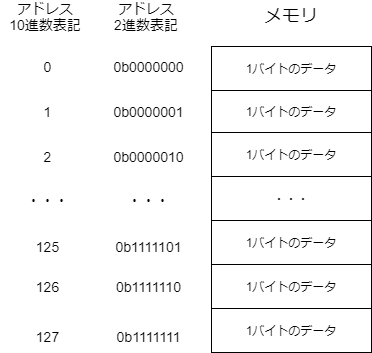
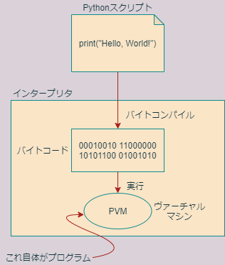
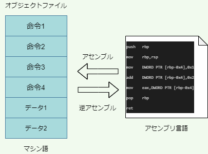

<!--
headingDivider: 2
-->

# 第1回 プログラミング概論

## 授業で使う言語-1

- この授業では、主にPythonを扱っていくことにします。
- それから、Rも少し扱っていきますが、Rについては、皆さんは統計学2や計量経済学（どちらも2年生科目)の授業で学んで来ているでしょうから、その基礎は押さえていると仮定し、いちいち復習はしません。
- たとえば、Rのベクトルやデータフレームがどういったものだったか忘れてしまっている人がいたら、復習しておいてください。
- それから、if条件分岐やforループについて、構文を忘れてしまっている人は、思い出しておくと良いでしょう。

## 授業で使う言語-2

- さて、Pythonについては多くの方が名前くらい聞いたことがあるでしょう。
- 以前はPythonの国内人気はいまいちでしたが、最近の機械学習ブームの波にのって人気が高まり、いまでは国内外問わず最もポピュラーなプログラミング言語となりました。
- 従って、YouTubeなどに、初心者向けのPythonのわかりやすい解説動画がたくさんあり、また独学に適した日本語の参考書も次々と発売されています。

## 大学でPythonを学ぶ理由

- 独学のための良質の素材があふれているのであれば、なぜ本講義でわざわざプログラミング、そしてPythonを学ばなければならないのでしょうか。
- 以下に、巷の教材に任せきってしまうことの問題を挙げてみましょう。

  - 独学では、モチベーションが沸かない。
  - 研究での活用がわかりにくい。
  - 表面的な説明が多く、Pythonの深いところがなかなか見えてこない。
  - 高度な内容をどうやって勉強したらいいのかわからない。

- つまり、とりあえずPythonを動かすことは独学で簡単にできるようになるのですが、そこから先（深ぼりしたり、応用したり）が見えにくいというのが筆者の見解です。

## 深掘りする理由-1

- では、なぜPythonを深ぼりする必要があるのでしょうか？

- 最も大きな理由は、それによって、応用力が身につくということです。
- 本講義を通して、受講者は**ビット**や**バイト**の言葉を直感的に使いこなせるようになると思います。
- そういった感覚は、長く使えるものです。
- 言語の表面的な知識だけを身につけても、すぐに忘れてしまうでしょうし、Pythonが廃れたら役に立たないでしょう。

## 深掘りする理由-2

- もう一つの小さな理由は、Pythonが、深ぼりしないと間違いを冒すタイプの言語だということです。
- 言い換えると、プログラムというものがどのように情報を扱っているのかをある程度理解しないと、Pythonを正しく使うことは難しいと言うことです。
- これは**良いニュース**だと思います。
- なぜなら、Pythonを勉強することが、計算機科学の勉強につながるからです。

## 深掘りする理由-3

- この点で、PythonはRとかなり違います。
- Rは、プログラミングにそれほど精通していなくても使いやすく設計されています。
- Rに慣れた学生の皆さんは、Pythonを学ぶことで、プログラミングというものが何なのか、より深い実感をもつことができるようになるでしょう。

## 学習教材-1

- 皆さんが本講義を通してPythonを学ぶに当たっては、以下の教材を有効活用することをおすすめします。

1. [Python公式ドキュメント](https://docs.python.org/ja/3/)
2. [『独習Python』(教科書)](https://www.amazon.co.jp/%E7%8B%AC%E7%BF%92Python-%E5%B1%B1%E7%94%B0-%E7%A5%A5%E5%AF%9B/dp/4798163643/ref=tmm_pap_swatch_0?_encoding=UTF8&qid=1621478622&sr=8-1)
3. 本サイト

- 内容の網羅性で言うと、`1>2>3`です。
- 本サイトではPythonの標準機能の一部しか紹介できませんので、足りない部分を2の教科書で補うことにします。

## 学習教材-2

- さらに、プログラミングをしていると、教科書を含む一般向け書籍にはなかなか書かれていないようなことも時々調べなくてはなりません。
- そのような場合には、最終的には1のPython公式ドキュメントを当たらねばなりません。
- さらに、公式ドキュメントにも載っていないことは高度な専門書や、ネット上の非公式なドキュメントを参考にしたり、[Stack Over Flow](https://stackoverflow.com/)のようなサイトで検索・投書するか、自分で試行錯誤しなくてはなりません。
- また、本講義はPythonの標準機能を説明するだけのものではありませんので上の教材だけでは不十分です。
- 標準機能以外に関する補助的教材や参考資料については、適宜紹介することにします。

## REPLによる対話的実行-1

- それでは前置きが長くなりすぎたので、そろそろPythonを動かしてみましょう。
- Pythonを動かすには、様々な方法がありますが、まずはREPL(Read-Eval-Print Loop)を用いた対話的実行を行ってみましょう。
- ウィンドウズを起動して、画面の左下の検索ウィンドウにAnacondaと打ち込んで、Anaconda Promptを起動しましょう（Anaconda Powershell Promptでも構いません）。
- Anacondaを起動したら、pythonと入力し、pythonの対話的インタープリタREPLを起動しましょう。
- プロンプトと呼ばれる`">>>"`記号が現れて、入力待ちの状態になるはずです。

## REPLによる対話的実行-2

- REPLは、Pythonのコードを1行ごとに評価し、即時にその結果を表示してくれるシステムです。
- 小さなコード断片の挙動を確かめる際などに便利です。
- Pythonには、整数や計算式などはそれ自体がPythonのコードと見なされるという特徴があります。
- そのおかげで、PythonのREPLを計算機として用いることができます。
- たとえば、何でも良いので、簡単な足し算や引き算をREPLに入力してみましょう。（入力の最後にはEnterキーを押します。）

## REPLによる対話的実行-3

```python
>>> 1 + 1
2
>>> 10 - 5
5
>>> 3 * 2
6
>>> 8 / 2
4.0
>>> 11 // 3
3
>>> 11 % 3
2
>>> 5 ** 3
125
```

- このように、REPLは簡単な計算機として用いることができます。なお、Pythonにおける2項算術演算子は以下の通りです。

## REPLによる対話的実行-4

| 演算子 | 機能                       |
| ------ | -------------------------- |
| +      | 可算                       |
| -      | 減算                       |
| *      | 乗算                       |
| **     | べき乗                     |
| /      | 除算                       |
| //     | 整数除算（余りを切り捨て） |
| %      | 剰余                       |

- 上記の表は教科書のセクション3.1にもありますので確認しておいてください。

## REPLによる対話的実行-5

- なお3つ以上の数の演算を行うには、演算子の優先順位に気を付けなければならないのはRと同じです。たとえば

  ```python
  >>> 2 + 3 * 5
  17
  ```

  のように掛け算は足し算よりも先に評価されます。演算子の評価順序を明確にしたいときは、丸カッコを使います。

  ```python
  >>> (2 + 3) * 5
  25
  ```

- 演算子の優先順位については教科書のセクション3.6(pp. 107)に解説がありますので、読んでおいてください。

## REPLによる対話的実行-6

- ただし、計算式においては、演算子の評価順序には過剰に頼り過ぎず、丸カッコを積極的に使うことをお勧めします。
- でないと、あとからコードを見返したときに、非常に理解しにくくなってしまうからです。

## 練習1

- 次の計算をPythonで実行したらどのような結果が得られるかを予測しなさい。

```python
# Q1
>>>(5 % 3) ** (7 // 2)
```

```python
# Q2
>>>(5.5 - 2.5 + 3.0) * 2.0
```

- 上記Q1, Q2の予測をREPLで確かめられたら、同じように様々な計算を自分で考えてREPLで実行し、予測と一致するか確かめなさい。

## REPLによる対話的実行-7

- それでは、次にもう少し高度なことをしてみます。以下のように入力して、変数xに整数1を代入し、xの値を表示してみましょう。

```python
>>> x = 1
>>> x
1
```

- このように、'='記号を使うと左辺の変数に右辺の値を代入できます。(Rでは、同様の操作に'<-'という矢印演算子を用いましたね。)

## REPLによる対話的実行-8

- それでは、さらに変数を用いて色々な演算をしてみましょう。

```python
>>> x = 1
>>> y = 2
>>> x + y + 3
6
>>> z = y + 1
>>> x - z
-2
>>> x = z ** y
>>> x
9
>>> x = x - 1
>>> x
8
```

## REPLによる対話的実行-9

- このように、変数は演算の中で用いることができます。
- これについてはRでもほとんど同じなので、細かい説明は不要でしょう。

- 最後に"Hello, World!"を出力しておきましょう。
- これについても、Rと全く同じですので、説明はほとんど要らないでしょう。(実際、Rのコードと見分けがつきません。)

```python
>>> print("Hello, World!")
Hello, World!
```

## REPLによる対話的実行-10

- Rと同じように、ダブルクォーテーションでくくられた部分は、Pythonにより文字列と解釈されます。printは、引数に与えられた文字列や数を画面に出力するだけの関数です。

- REPLを終了してAnaconda promptに戻るときは、次のように入力します。

```python
>>>exit()
```

## コマンドラインによる実行-1

- それでは次に、Pythonのコードをファイルに保存してコマンドラインから実行する方法を試してみましょう。
- Anaconda promptで次のように入力してhello.pyというテキストファイルを作成します。

```anaconda
(base) C:\Users\hogehoge>notepad hello.py
```

- "hello.pyは存在しません。新しく作成しますか？"と聞かれたら「はい」を選択するとメモ帳が起動します。
- メモ帳で、ファイルの先頭行に次のような1行を記述してください。

```python
print("Hello, World!")
```

## コマンドラインによる実行-2

- 次にファイルを保存して閉じ、Anaconda promptで次のように入力すると、ファイルに記述したPythonコードを実行することができます。

```anaconda
(base) C:\Users\hogehoge>python hello.py
Hello, World!

```

- なお、Pythonコードを記述するファイル（スクリプトと呼ぶ）の名前には拡張子.pyを付けるのが普通です。

## コマンドラインによる実行-3

- それではもう一度同じファイルを開いて、もう少し中身を豪華にしてみましょう。

```python
print("Hello, World!")
x = 1
y = 2
z = x + y
print(x)
print(y)
print(z)
```

## コマンドラインによる実行-4

- これを実行すると、以下のようになります。

```anaconda
(base) C:\Users\Kobayashi>python hello.py
Hello, World!
1
2
3

```

- このように、Pythonでは、**文**を改行で区切って並べることにより、上から順番に文が実行されていきます。
- 文については教科書のセクション1.5.2に詳しい説明があるので良く読んでおいてください。

## 練習2

5の5乗を計算して画面に出力するpower5_5.pyというファイルを作成し、実行しなさい。

## 本講義の目標-1

- 遅くなりましたが、ここで本講義の目標を述べておきます。本講義の目標を箇条書きにすると以下のとおりです。

1. Pythonの設計思想を理解する
2. メモリ(主記憶装置)のイメージができるようになる
3. Pythonで簡単なデータ解析ができるようになる
4. Pythonで簡単な社会科学実験のプログラムを作れるようになる

## 本講義の目標-2

- 上記では、「設計思想を理解する」という言葉に非常に多くの意味を込めました。
- 設計思想は、言葉で説明されて分かるものではなく、Pythonを学ぶうちに、段々と見えてくる設計上のパターンやクセのようなものです。
- そういったパターンやクセは、設計者の理念をそのまま反映していることもありますし、そういった理念を追求した結果、仕方なく生じてしまった歪み、機能的制約、初学者が面食らってしまうような数々の奇妙な挙動や明らかな欠陥も含みます。

## 本講義の目標-3

- 設計思想が分かると、たとえば、Pythonの

  ```python
  >>> x = y
  ```

  とC言語の

  ```C
  x = y;
  ```

  に対して、明確に違ったイメージを持つことができるようになります。
- 設計思想が分かるというのは、世界観が出来上がるということでもあります。
- これは多分、プログラミング言語も、自然言語と同じなのではないかと思います。

## 本講義の目標-4

- ある人を理解するということは、その人のスケジュールを全て覚えることではありません。
- それと同じで、言語の設計思想を理解することは、関数や構文をたくさん覚えることではありません(そういうことは、ネットで検索すればよいのです)。
- 設計思想を理解するというのは、新しい関数や構文に出会ったときに、『なるほどPythonらしいな』と思え、戸惑わないようになることです。
- そして、ある程度パターンが予測でき、変な行動をとっても怒らず、『まあ仕方ないね』と許せるようになることです。
- 時々失敗するけれど、なぜ失敗なのか、すぐに分かるということです。

## 本講義の目標-5

- さて、一見遠回りに見えますが、上記の1〜4は、どれも全て「応用」を念頭においていることを強調しておきたいと思います。
- 設計思想が分からなかったり、メモリのイメージを持っていないと、ずっと「手探り」でプログラミングをすることになり、すぐに伸び悩むことになると思います。
- これを機会にぜひ、ゆっくりパソコンに向かって様々な実験を繰り返し、あるいはStack overflowの数々の間違った情報に辟易し、ときにはデスクに向かって色々と計算してほしいと思います。
- そういったプロセスを踏んで、どんなプログラミング言語でも独力で学べるような基礎力を身に着けてほしいと思います。

## 本講義の目標-6

- それでは、まずプログラミングの準備として、プログラムといったものがどのように動いているのかといったことの簡単な説明から始めなくてはなりません。
- 以下、座学になりますが、難しい数学などは出てきませんので、何卒お付き合いください。

## 2進数と16進数-1

- 2進数や16進数については、多くの方が高校や大学で学んだことがあることでしょう。
- しかしながら、以降の説明で非常に重要ですので、ここでこれらの概念を簡単に復習しましょう。

- ご存じの通り、私たちが普段使っている10で桁上がりする数字は、10進数と呼ばれます。

## 2進数と16進数-2

- 一方、2で桁上がりする数を2進数、16で桁上がりする数を16進数と呼び、情報科学では10進数と並んで良く用いられる数の表し方です。

- 2進数では、2で桁上がりするため、10進数における2～9の数字は現れません。
- また、16進数では、10進数における0~9だけでは1桁を表すのに足りないため、a~fのアルファベットを用います。

## 2進数と16進数-3

| 10進数 | 2進数 | 16進数 |
| -----: | ----: | -----: |
|      0 |     0 |      0 |
|      1 |     1 |      1 |
|      2 |    10 |      2 |
|      3 |    11 |      3 |
|      4 |   100 |      4 |
|      5 |   101 |      5 |
|      6 |   110 |      6 |
|      7 |   111 |      7 |
|      8 |  1000 |      8 |
|      9 |  1001 |      9 |
|     10 |  1010 |      a |
|     11 |  1011 |      b |
|     12 |  1100 |      c |
|     13 |  1101 |      d |
|     14 |  1110 |      e |
|     15 |  1111 |      f |
|     16 | 10000 |     10 |

## 2進数と16進数-4

- ある数が2進数で表記されていることを明確にするため、2進数の先頭に0bという接頭辞を付けることがあります(bはbinaryより)。
- 同様に16進数には接頭辞0xをつけます(xはhexadecimalより)。
- たとえば、0x1eは0b11110すなわち10進数での30を表します。
- 10進数、2進数、16進数の間の変換に慣れておきましょう。とくに2進数と16進数の間の変換は重要です。

## 2進数と16進数-5

- 10進数、2進数、16進数の間の変換は、Pythonを用いても行うことができます。
- 次のPythonコードは、それぞれ、10進数の123を2進数、16進数に変換するものです。

```python
>>> bin(123)
'0b1111011'
>>> hex(123)
'0x7b'
```

- このように関数binとhexを使えば10進数をそれぞれ2進数、16進数に変換することができます。

## 2進数と16進数-6

- また、逆の変換をするときは、次のように数字を入力するだけです。

```python
>>> 0b1111011
123
>>> 0x7b
123
```

## コンピューターの仕組み-1

- パソコンは、様々な部品から構成されていますが、プログラミングの初心者がまず知っておかなければならないのが、CPUとメインメモリの働きです。
- メインメモリはランダムアクセスメモリ(Random Access Memory)とも呼ばれるので、RAMと表記されることもあります。

- CPUとメモリ(メインメモリ)は、記憶装置です。
- パソコンにはいくつもの記憶装置が内臓されていますが、どの記憶装置も、文字や整数や小数だけでなく、プログラムなど、すべての情報を0と1の配列に変換して記憶しています。

## コンピューターの仕組み-2

- CPUとメモリはどちらもトランジスタで構成された集積回路(IC, Integrated Circuit)ですが、次のような性質の違いがあります。

|          | CPU          | メモリ |
| -------- | ------------ | ------ |
| 記憶容量 | 非常に小さい | 大きい |
| 演算能力 | 有り         | 無し   |

## コンピューターの仕組み-3

- ここで言う演算とは、足し算や引き算を含む様々な計算のことです。
- CPUは演算機能をもっていますが、ほんの少しの情報しか記憶できないので、CPUだけではちょっとしたプログラムも動かせません。
- そこで、まず容量の大きいメモリにプログラム全体を読み込ませます。プログラムは、CPUに対する命令の集まりです（と思って大体間違いありません）。
- CPUは、メモリに読み込んだ命令を１つずつ読み取って実行していきます。

## メモリの仕組み-1

- メモリは、たとえば001011010110001101011...のように、全ての情報を0と1の並びに変換して記憶しています。
- この0と1の並びは、8桁ずつの区画に区切られています。
- それぞれの区画には、**アドレス**と呼ばれる数字が振られていて、数字によってメモリ上の位置が指定できるようになっています。

- それぞれの区画には、8桁の0と1が格納されているので、1つの区画は00000000から11111111までの256通りの状態を記憶することができます。
- この記憶容量のことを**バイト**(Byte)といいます。一方、1桁の0と1で記憶できる容量のことを**ビット**(bit)と呼びます。
- よって、1バイト = 8ビットの関係が成り立ちます。

## メモリの仕組み-2

- メモリへの情報の読み書きは、必ずバイトを単位として行われます。
- ビットを単位として読み書きすることはできません。
- このように、バイトはパソコンにおける最も重要な情報量の単位です。

## メモリの仕組み-3



## メモリの仕組み-4

- メモリについて考えるときは、上図のように、バイト単位のデータが積み重なったものと考えると良いです。
- なお、バイトよりも大きい情報量の単位には、キロバイトやメガバイト、ギガバイトなどがあります。

## メモリの仕組み-5

| 情報量の単位    | バイト換算                  |
| --------------- | --------------------------- |
| キロバイト(KB)  | 10の3乗=1,000バイト         |
| メガバイト(MB)  | 10の6乗=1,000,000バイト     |
| ギガバイト(GB)  | 10の9乗=1,000,000,000バイト |
| キビバイト(KiB) | 2の10乗=1,024バイト         |
| メビバイト(MiB) | 2の20乗=1,048,576バイト     |
| ギビバイト(GiB) | 2の30乗=1,073,741,824バイト |

## メモリの仕組み-6

- なお、キロバイト、メガバイト、ギガバイトという言葉が使われている場合でも、実際にはキビバイト(KiB)、メビバイト(MiB)、ギビバイト(GiB)を指す場合があるので、多少の注意が必要です。
- 本講義でも、キビバイトやメビバイトは余り親しみのない言葉ですので、KiBやMiBと書いてキロバイト、メガバイトと発音しても良いことにします。
- なおキビバイトとキロバイトの容量差は2%しかありませんので、通常この違いに神経質になる必要はありません。
- ギガバイトとギビバイトになると、7%の違いがありますので、ちょっと無視できないかもしれません。

## CPUの働き-1

- 一方、CPUは**レジスタ**と呼ばれる記憶装置を複数内臓しています。
- レジスタは、プログラム内の**命令**やデータ、メモリのアドレスなどを格納することができます。
- CPUはメモリに読み込まれたプログラムの中の命令をレジスタに読み込こんで実行したり、メモリのなかのデータをレジスタに読み込んで演算をほどこしたり、演算の結果をメモリに書き込んだりすることでコンピュータを動かしています。

## CPUの働き-2

- レジスタにはプログラマがプログラムから直接操作できるもの(十数個ある)と操作できないものがあります。
- プログラマが意識しなくてはならないのは前者の操作できるレジスタだけです。
- 具体的にどのようなレジスタがいくつあるのかについては、CPUによって違ってきます。

## CPUの働き-3

- レジスタは、メモリと全く同じように0と1の情報を格納できます。
- レジスタには、64ビットコンピュータでは64ビット=8バイトの情報を格納することができます。
- 32ビットコンピュータでは4バイトです。
- したがって、プログラムが一つのレジスタを使って一度に処理できるデータの量は64ビットコンピュータなら最大8バイト、32ビットコンピュータなら最大4バイトです。

## CPUの働き-4

- ただし64ビットレジスタは下位の32ビットを使って32ビットレジスタとしても動作できるようになっています。
- 従って、64ビットコンピュータでも、32ビット仕様のOSやアプリケーションが動作します。
- 32ビットレジスタのサイズが4バイトであることに合わせて、32ビットOSはメモリのアドレスを4バイトで表現します。

## CPUの働き-5

|            | 2進数表記     | 16進数表記 | 10進数表記              |
| ---------- | ------------- | ---------- | ----------------------- |
| 最小の数字 | 0b0           | 0x0        | 0                       |
| 最大の数字 | 0b1111...1111 | 0xffffffff | 4,294,967,295=2の32乗-1 |

- 0xffffffff=4,294,967,295=0b1111...1111であることはPythonで簡単に確かめることができます。

```python
>>> 0xffffffff
4294967295
>>> bin(0xffffffff)
'0b11111111111111111111111111111111'
```

## CPUの働き-6

- 4バイトの数値が表現できるメモリアドレスの範囲は、上記の表にあるように0～2の32乗-1=4×2の30乗-1です。
- メモリは1区画あたり1バイトの容量をもつので、32ビットOSでは、4×2の30乗バイト、すなわち4GiBまでしか扱うことができません。
- したがって、それ以上のメモリを物理的に搭載しても、4GiBを超える部分はOSによって認識してもらえません。
- 一方、64ビット対応したOSでは、メモリアドレスの表現に8バイト数値を使用します。
- したがって0～2の64乗-1までのアドレスを使うことができます。
- これは極めて巨大な数ですので、64ビットOSでは、実質任意に大きなメモリを使用できます。

## マシン語-1

- プログラムがメモリに読み込まれたあと、プログラムを構成する命令は、一つずつCPUに読みだされて実行されていきます。


## マシン語-2

- レジスタは0と1しか格納できないので、命令と命令からなるプログラムもまた、0と1の列でなくてはなりません。(当然、列の長さは8の倍数です。)
- こうした、CPUが理解できる、0と1で構成された命令を**マシン語**と呼びます。

- 試しに、プログラムが実際にどのようなマシン語になっているかをディスプレイに打ち出してみることができます。
- これを**ダンプ**(dump)と言います。
- たとえば、画面に"Hello, World!"と打ち出すプログラムの最初の36バイトをダンプしてみると、以下のようになります。

## マシン語-3

```C
01111111 01000101 01001100 01000110 00000001 00000001
00000001 00000000 00000000 00000000 00000000 00000000
00000000 00000000 00000000 00000000 00000010 00000000
00101000 00000000 00000001 00000000 00000000 00000000
00010100 00000011 00000001 00000000 00110100 00000000
00000000 00000000 10100100 00011010 00000000 00000000
```

## マシン語-4

- このように、マシン語は人間にとっては非常に分かりづらいので、マシン語を直接操作しなくてもプログラムが作れるように、C言語などのプログラミング言語が作られました。
- 余談ですが、64ビット版のWindows 10にはダンプをするためのツールが標準搭載されていないので、ダンプしたい人はそれ専用のツールを別途手に入れる必要があります。

## マシン語-5

- 一方Linuxにはダンプのためのコマンドが標準で搭載されています。
- ターミナルで次のように入力すれば実行可能ファイルをダンプできます。

```shell
xxd -b a.out
```

- ここでa.outが実行可能ファイルの名前です。-bは2進数でダンプするオプションです。このオプションを付けないと、結果は16進数で表示されます。

## プログラミング言語の種類

- プログラミング言語を分類する方法は色々ありますが、まず覚えた方が良いのが、コンパイル型言語とインタープリタ型言語の違いです。

|                  | コンパイル型                  | インタープリタ型                      |
| ---------------- | ----------------------------- | ------------------------------------- |
| 実行速度         | 高速                          | 低速                                  |
| コンパイル要不要 | 必要                          | 不必要                                |
| 例               | C言語、C++、FORTRAN、RUSTなど | Python、R、Ruby、Perl、JavaScriptなど |

### コンパイル型言語

たとえばC言語のようなコンパイル型言語で"Hello, World!"を出力するプログラムについて考えましょう。その場合、まず次のようなプログラミング言語で書かれたテキストファイル（**ソースファイル**あるいは**ソースコード**という）を準備します。

```C
#include <stdio.h>
int main(){
  printf("Hello, World!\n");
  return 0;
}
```

このファイル名をhello.cとしましょう。その後、**コンパイル**という操作により、このファイルを機械語に変換します。この操作を実行するソフトウェアのことを**コンパイラ**と呼びます。たとえばLinuxには通常GNU C/C++ Compilerというコンパイラがインストールされていて、次のコマンドでコンパイルを行うことができます。

```shell
gcc hello.c
```

コンパイルを行うと、a.outという名前のマシン語で書かれたファイルが作成されます。これを**実行可能ファイル**と呼びます。厳密には、hello.cをマシン語にコンパイルしただけでは実行ファイルにはならず、**オブジェクトファイル**と呼ばれるマシン語で書かれたファイルが出来上がります。コンパイラはさらに**リンク**という作業を行い、出来上がったオブジェクトファイルに必要な付属品を色々とくっつけて実行可能ファイルを作ります。コンパイル型の言語で書かれたソースファイルは直接実行することはできず、かならずコンパイルして実行可能ファイルを作る必要があります。


実行可能ファイルは、CPUが直接解釈可能なマシン語で書かれているため、非常に高速に動作します。一方で、大きなプログラムはコンパイルに大変時間がかかるという欠点があります。また実行可能ファイルを構成するマシン語は、CPUのレジスタを直接操作する命令の集まりですので、CPUの異なるコンピュータでは動作しません。従って、プログラムを他のコンピュータに移植するときは、移植先のコンピュータでソースコードを再コンパイルする必要があります。

### インタープリタ型言語

一方、Pythonのようなインタープリタ型言語では、実行にコンパイルを必要としません。インタープリタ型言語では、ソースファイルは実行可能ファイルの源（ソース）ではないので、ソースファイルのことを**スクリプト**と呼ぶことがあります。また、インタープリタ型言語のことを**スクリプト言語**ということもあります。スクリプト言語では、スクリプトに記述されたコードは**インタープリタ**と呼ばれるプログラム(アプリケーション)によって一つずつ読み取られ、実行されていきます。

実際にはスクリプトファイルのテキスト文をそのまま読み取っていくのはインタープリタにとって不便なので、まずスクリプトはバイトコードと呼ばれるマシン語に似たものに変換されます。そのあと、バイトコードの中の命令が1行ずつ読み取られながらインタープリタによって実行されていくわけです。インタープリタはスクリプトからバイトコードを生成する作業と、バイトコードの命令を読み取って実行する作業を両方担当しています。Pythonインタープリタのうち、バイトコード実行を行う部分だけを指して、**Pythonヴァーチャルマシン**(PVM)と呼びます。



Pythonがバイトコードを生成するプロセスのことを**コンパイル**もしくは**バイトコンパイル**と呼ぶことがあるので注意が必要です。コンパイル言語でのコンパイルと違い、Pythonのバイトコンパイルは**マシン語を生成しません**。

試しに"Hello world!"と印字するPythonのプログラムをバイトコンパイルしてみましょう。まず、このプログラムのPythonスクリプトは次のようになります。

```python
print("Hello world!")
```

このコードをバイトコンパイルして出来たバイトコードの最初の36バイトをダンプすると、以下のようになります。

```C
01000010 00001101 00001101 00001010 00000000 00000000 
00000000 00000000 10101110 10001001 10011110 01100000
00011000 00000000 00000000 00000000 11100011 00000000 
00000000 00000000 00000000 00000000 00000000 00000000
00000000 00000000 00000000 00000000 00000000 00000010
00000000 00000000 00000000 01000000 00000000 00000000
```

よく似ていますが、これはバイトコードであり、マシン語ではありません。Pythonヴァーチャルマシンは、このバイトコードを実行していきます。

バイトコードの特徴は、マシン語で記述されたコンパイル言語の実行可能ファイルと違って、CPUの仕様に依存していないことです。したがって、バイトコードはそのまま他のコンピュータで実行することができます。一方で、直接レジスタに命令を送り込むコンパイル言語に比べると、ヴァーチャルマシンを介さなくてはならないスクリプト言語はかなり低速になり、場合によっては100～1000倍くらいの実行時の速度差が出てしまいます。

しかしながら、コンパイルの必要がないので、インタープリタ言語による開発時間はコンパイル言語よりもはるかに早いのが普通です。(C言語で書かれた非常に大きなプログラムですと、コンパイルだけで数時間かかってしまうこともあります。たとえば以前node.jsというjavascriptのインタープリタをコンパイルしたときは半日くらいかかりました。)

このコンパイル型言語とインタープリタ型言語の違いを利用して、Python等のインタープリタ型言語でスピーディにプロトタイプを作成し、その後、少しずつコンパイル型言語に置き換えていくという開発上の作戦が取られることも良くあります。

もう一つ、皆さんに覚えておいて欲しいのは、インタープリタそれ自体がプログラムであり、これは通常コンパイル型言語で作成(実装)されているということです。たとえばPythonのインタープリタで最も一般的なのはC言語で実装されたCPythonというインタープリタで、ほとんどの方が使っているPythonはこれです。CPythonのソースコードは公開されているので誰でも読むことができ、C言語を知っていれば内容を理解できます。他にもJavaで実装されたJythonというインタープリタもあります。

### アセンブリ言語

なおプログラミング言語の中には、**アセンブリ言語**という特別なタイプの言語があります。アセンブリ言語は、01の並びであるマシン語を分かりやすい記号の列に「直訳」したものです。直訳したものですので、マシン語とアセンブリ言語はどちらの方向にでも変換可能です。アセンブリ言語からマシン語を生成する作業を**アセンブル**、その逆を**逆アセンブル**と言います。アセンブルを行うためのソフトウェアを**アセンブラ**と呼びます。アセンブリ言語の特徴の一つは、マシン語の直訳であるため、レジスタの操作をプログラマが明示的に行う必要があるということです。

たとえば、次のC言語のプログラムは、aという変数に1を代入し(正確には1という値で初期化し)、そのあとaに2を足すというだけのプログラムです。

```C
int MyAdd(){
  int a = 1;
  a = a + 2;
  return a;
}
```

これをコンパイルして出来たオブジェクトファイルを逆アセンブルすると、次のようなアセンブリ言語のコードが得られます。

```nasm
push   rbp
mov    rbp,rsp
mov    DWORD PTR [rbp-0x4],0x1
add    DWORD PTR [rbp-0x4],0x2
mov    eax,DWORD PTR [rbp-0x4]
pop    rbp
ret
```



アセンブリ言語にはいくつか方言がありますが、ここではNASM(Netwide Assembler)という表記を用いています。ここでは詳しく説明できませんが、上のコードにおいて、rbpやrsp、eaxは全てレジスタの名前を表します。このように、アセンブリ言語では、レジスタを直接操作することが必要になってきます。(ちなみに"DWORD PTR [RBP-0X4]"などはメモリの領域を表します。)

アセンブルと違って**コンパイルは不可逆変換**なので、実行可能ファイルからコンパイル前のソースコードを復元することはできません。従って実行可能ファイルを分析するときは、通常、逆アセンブルを行ってアセンブリ言語に翻訳し、これを読解していきます。例えば、コンピュータウィルスの性質を解析する際にこういったスキルが必要になります。

Linuxを使っている人は次のようにしてコンパイルと逆アセンブルを行うことができます。上のソースファイル名をmyadd.cとします。

```bash
gcc -c myadd.c
objdump -d -M x86-64,intel myadd.o
```

ここでmyadd.oはコンパイルによって生成されたオブジェクトファイルです。

## 抽象度

アセンブリ言語のように、レジスタやメモリといったハードウェアを直接操作する言語を**低水準言語**と呼びます。低水準言語は、**抽象度が低い言語**と表現されることもあります。一方、Pythonのように、レジスタやメモリと言ったものをプログラマが直接意識することなくプログラミングできるような言語は、**高水準言語**と呼ばれ、**抽象度が高い**と言われます。一般に、インタープリタ型言語のほうがコンパイル型言語よりも抽象度が高い傾向があります。また、時代が進むにしたがって、より高水準で抽象度の高い言語が登場してきたと言えます。

高水準言語や低水準言語というのは、相対的なものであるととらえた方が良いでしょう。たとえば、従来C言語はアセンブリ言語と比較して高水準言語であると言われてきましたが、言語の高水準化が進むにつれ、たとえばPython等に比べると低水準言語であると言われるようにもなってきました。というのも、C言語ではレジスタを意識することはほとんどありませんが、メモリはかなり意識しないとコードが書けないからです。一方、Pythonでは、C言語よりも抽象度が高く、比較的メモリを意識しなくてもプログラミングができるようになっています。それでも、以降の講義で論じるように、メモリをある程度意識することはPythonを正しく使う上で重要であると言えます。

## プログラミング上達のコツ

当たり前ですが、プログラミングの上達において最も大切なことは、「プログラミングを楽しむ」ことだと思います。そのために大切なことは、「ストレスなくコーディングする」ということに尽きると思います。そして、そのためには、以下の2点が重要であると筆者は考えます。

- 正しいタイピングをする
- エディターのキーバインドをマスターする

もう一つコツを挙げるとすれば、誰もが言うことですが、コードを試すときは、**写経**するということです。写経とは、コードをコピー＆ペーストしたり、すでに他人が入力したコードを実行するのではなく、自分でタイピングして書き写すことです。

### 正しいタイピング

正しいタイピングとは、タッチタイピング（いわゆるブラインドタッチ）のことです。タッチタイピングを解説したサイトはインターネットにたくさんありますので、ここでは改めて解説しません。以下の項目に注意して練習を重ねてください。

- 最初は決して速く打とうとしてはいけない
- 同じキーはいつも同じ指で叩く
- キーを叩くときは、基本そのキーに最も近い指で叩く
- キーボードを見ないでタイプするトレーニングをする
- 人差し指～小指すべて使う

数字や記号はつらいので、まずはアルファベットだけキーボードを見ないで打てるようになるように練習しましょう。そのうち見ないで打てるキーの数が増えてきます。タイピングソフトなどは必要ありません。ゆっくりで良いので、タッチタイピングの基本を守りつつプログラミングや文書作成をしていれば、自然に上達していきます。

上達につれてタイプの速度は上がってきますが、目安として大体1分間に200タイプくらいでスピード的には十分ではないでしょうか。重要なのはストレスを無くすことであって、速度を上げることではありません。ゆっくりでもキーボードを見ずに正確に打てるようになれば、視線の移動がほとんど必要なくなるので、コーディング中に感じるストレスは圧倒的に小さくなります。

### キーバインド

コーディングのストレスを軽減するには、正しいタイピングを心がけるだけでなく、キーバインドを覚えることが重要です。本講義で言うキーバインドとは、編集中に文書の中を移動したり、編集に関連する様々な機能を呼び出したりするためのキーボードショートカットのことです。

プログラミングの世界には大きく分けて、2種類のメジャーなキーバインドがあります。1つは**Emacsキーバインド**、もう一つは**viキーバインド**です。これらは、それぞれ、Emacs、viというエディターで用いられているキーバインドですが、多くのエディターでこれらの2つのキーバインドを使用することができるようになっています。

**Emacsキーバインド**は直観的で覚えやすいのが特徴で、**viキーバインド**は「速い」のが特徴です。筆者はプログラミングにEmacs、設定ファイルなどの編集にviを使うという風に使い分けていますので、本講義でもプログラミングのためにはEmacsキーバインドを用いることを推奨したいと思います。Emacsキーバインドについては次回VS Codeを操作するときに詳しく説明します。

### 写経

コードを写経することにより、自分で書いてみると、そっくりそのまま書き写したはずがうまく動作しないということが往々にして生じます。その度に、「どこが間違っていたのか」考えさせられることになり、細部に目が行くことになります。また、単純にタイピングの練習にもなります。

写経は、最初のうちは苦行かもしれません。前時代的なトレーニングと思われるかもしれません。なかなか先に進めないのでじれったい気持ちになるかもしれませんが、これは必要なプロセスです。どれだけプログラミングが上手になっても、皆さん写経をしておられます。逆に写経がストレスなくできるようになったら、一人前だと考えてください。

したがって、本講義では、**入力済みのコードを配布しない**ことにします。どうしてもコピー＆ペーストが必要なときは、このサイトから行えばよいでしょう。

## まとめ

今回は、以下の事項について学びました。

- Pythonを学ぶ意義
- Pythonを動かす2種類の基本的な方法
- 本講義の目標
- プログラムがどのように動いているか
- プログラミング言語にはどのようなものがあるか
- プログラミング上達のコツ

今回の講義でPythonのプログラムがどのように動いているか、大体分かったと思います。一方で、一つ一つのPythonの文がどのように動作しているのかまでは説明しませんでした。そういった詳細については今後の講義で解き明かして行くことにしましょう。

基本的なプログラミングの練習は、基本的に独学でも可能なものです。自宅や研究室のパソコンにもPythonをインストールし、教科書を参照しながらPythonの操作をしっかりと練習しておいてください。

## 参考書

- [『プログラムはなぜ動くのか(第2版)』](https://www.amazon.co.jp/%E3%83%97%E3%83%AD%E3%82%B0%E3%83%A9%E3%83%A0%E3%81%AF%E3%81%AA%E3%81%9C%E5%8B%95%E3%81%8F%E3%81%AE%E3%81%8B-%E7%AC%AC%EF%BC%92%E7%89%88-%E7%9F%A5%E3%81%A3%E3%81%A6%E3%81%8A%E3%81%8D%E3%81%9F%E3%81%84%E3%83%97%E3%83%AD%E3%82%B0%E3%83%A9%E3%83%A0%E3%81%AE%E5%9F%BA%E7%A4%8E%E7%9F%A5%E8%AD%98-%E7%9F%A2%E6%B2%A2%E4%B9%85%E9%9B%84/dp/4822283151/ref=tmm_pap_swatch_0?_encoding=UTF8&qid=1618632158&sr=8-1)(矢沢久雄 著/日経ソフトウェア監修) (2007) 日経BP社. ISBN 978-4-8222-8315-5.

## 宿題（ホームワーク）

本講義では提出しなくてよい宿題のことを「宿題」または「ホームワーク」と呼ぶことにします。今回はホームワークとして、以下を出題します。

1. 『独習Python』の第1章『イントロダクション』を読みなさい。
2. そこに書かれている手順に従って、AnacondaとVS Codeを自分のパソコンもしくは研究室のパソコンにインストールしなさい。
3. AnacondaをインストールしたパソコンでREPLを起動し、様々な計算式を打ち込んでみなさい。
4. REPLに様々なPythonコードを打ち込み、期待された結果が得られるか試してみなさい。
5. 『2の補数表現』や『浮動小数点数』、『エンディアン』といった言葉に聞き覚えがない人は、本ページ末尾の補遺を読んでおいてください。

なお、LinuxユーザーはAnacondaを**インストールしない**ことをお勧めします。X Windowシステムが壊れて再起不能になることがあります。

Anacondaはある程度スペックを要求します。CPUはIntel Core i5以上、メモリは最低でも8GBは必要かと思います(16GB推奨)。

## 課題（アサインメント）

本講義では、提出しなければならない宿題のことを「課題」もしくは「アサインメント」と呼ぶことにします。今回の課題はありません。課題は全てGitHubのアサインメント機能を使って提出していただきますので、課題が出題されるのはGitHubについて学ぶ第3回目以降です。

## 補遺(メモリ上での数の表現)

ここでは、メモリの上で整数や小数がどのように表現されているかを説明します。

### 符号なし整数

符号なし整数とは、正整数のみを表すことができるデータ型のことです。符号なし整数がメモリ上に記録される方法は特に難しいことはありません。単に正整数の2進数表現がそのまま格納されているだけです。例えば、2バイト=16ビットの領域に14という整数が格納されるときは、

```cmd
00000000 00001110
```

のように格納されます。

### 符号つき整数

符号つき整数では、負の数と正の数を表すことができます。符号付き整数では、最も桁の大きいビットを符号を表すために用います。この符号ビットが0ならば0か正の整数を、1ならば負の整数を表します。残りの桁は、正整数ならば、符号なし整数と同じで、元の正数の2進数表現になっています。

一方、負の数の場合は、元の数の絶対値の**2の補数**になっています。数`n`の2の補数とは、`n`のビット(0と1)を反転して、1をプラスしたものです。

たとえば、14は上記のように表されますので、そのビットを反転したものは、

```cmd
11111111 11110001
```

となりますので、これに1を足したものは、

```cmd
11111111 11110010
```

になります。これが-14の2の補数表現であり、メモリ上で-14という負数はこのように格納されています。

実際、14と-14を足すと0になることが次のようになります。

```cmd
  00000000 00001110
+ 11111111 11110010
-------------------
1 00000000 00000000
```

一番左のあふれた一桁は無視されるので、和は0になることが分かります。

符号つき整数の絶対値の上限は、符号なし整数の約半分になります。

|バイト数|符号つき整数|符号なし整数|
|--:|--:|--:|
|1|-128 ～　127|0 ～ 255|
|2|-32,768 ～ 32,767|0 ～ 65,535|
|4|-2,147,483,648 ～ 2,147,483,647|0 ～ 4,294,967,295|
|8|`-2**63` ～ `2**63-1`|0 ～ `2**64-1`|

即席ですが、任意の整数を2の補数表現に変換するPython関数を作りましたので参考にしてください(バグを見つけたら教えてください。)関数についてはまだ学んでいないので、現時点でこの関数を使える必要はありません。

```python
# %%
# 整数を2の補数表現に変換する関数
def int_to_bits(num,length,endian='big'):
    if type(num) is int:
        num_bytes = num.to_bytes(length,endian,signed=True)
        num_bin = bin(int(num_bytes.hex(),16))
        if len(num_bin)-2 < length * 8:
            bit_str = ("0"*(length*8-len(num_bin)+2)) + num_bin[2:]
        else:
            bit_str = num_bin[2:]
        byte_list = [bit_str[8*i:8*i+8] for i in range(length)]
        print(" ".join(byte_list))
    else:
        print("The first argument must be an integer.")
```

この関数は次のように使います。

```python
int_to_bits(整数,バイト数,エンディアン)
```

エンディアンは指定しなくても構いません。指定しない場合はビッグエンディアンになります(エンディアンについては下で説明しています)。

たとえば、4バイト符号つき整数の-255を2の補数表現にするには、次のようにします。

```python
int_to_bits(-255,4)
```

```cmd
# 出力
11111111 11111111 11111111 00000001
```

リトルエンディアンにするときは、第3引数を'little'に指定してください。

```python
int_to_bits(-255,4,'little')
```

```cmd
# 出力
00000001 11111111 11111111 11111111
```

### 小数

小数は、**浮動小数点数**というデータ型でメモリに格納されます。浮動小数点数には**単精度**浮動小数点数と**倍精度**浮動小数点数があります。単精度では一つの数値に32ビット(4バイト)、倍精度では64ビット(8バイト)を使います。

浮動小数点数がどのように小数をメモリ上で表現するのか、単精度の場合を例にとって説明します。

まず、全ての実数は次のように表現できることに注意しましょう。

```cmd
[符号] (m)×(10のn乗)
```

ただし、`m`は`0.xxx...`という形式の10進数小数です。たとえば、-123.45は、次のように表すことができます。

```cmd
- (0.12345)×(10の3乗)
```

`m`を**仮数**、`n`を**指数**と呼びます。

全く同様に、全ての実数は次のように表現できます。

```cmd
[符号] (m) * (2のn乗)
```

ただし、`m`は`1.xxx...`という形式の2進数小数です。たとえば、2進数小数`101.1011`は、次のように表すことができます。

```cmd
+ (1.011011)×(2の2乗)
```

そこで単精度浮動小数点では、下図のように32ビットを上の桁から順に1ビット、8ビット、23ビットに区切り、それぞれ**符号**、**指数**、**仮数**を表すのに使います。


ただし、指数は常に`1.xxx...`という形をしているので、`"1."`を省略し、`xxx...`の部分だけを23ビットに記憶します。たとえば、仮数が`1.011011`であれば、浮動小数点数の仮数部分23ビットは

```cmd
0110110 00000000 0000000
```

のようになります。また、指数部分は、正負どちらの値でもありえますが、ここでは負の数を表すのに補数は使いません。代わりに**イクセス表現**を使います。イクセス表現では、指数部分8ビットを0～255の符号なし整数と見なしたとき、そこから、ちょうど中間の値127を引いたものを実際の指数とする表現方法です。

たとえば、指数部分に記憶されているビット列が次のようになっていたとします。

```cmd
10000001
```

これは10進数符号なし整数に読み替えると129です。ここから127を引くと2ですので、実際の指数は2ということになります。

まとめると、符号部分のビット、指数部分のビット列、仮数部分のビット列がそれぞれ

```cmd
# 符号ビット
1
```

```cmd
# 指数部分8ビット
10000001
```

```cmd
# 仮数部分23ビット
01101100 00000000 0000000
```

のようになっているとき、この単精度浮動小数点数は、

```cmd
[-] (1.011011)×(2の2乗) = -101.1011
```

を表すことになります。これを10進数で表すと、-5.6875になります。言い換えると、-5.6875という小数は、浮動小数点数によって

```cmd
1-10000001-01101100 00000000 0000000
```

という32ビットでメモリ上に記憶されていることになります。

さて、上記の仮数部分を16進数で表し、指数部分をイクセス表現でなく実際の指数(10進数)に書き換えると、次のようになります。

```cmd
1-(+2)-6c 00 00
```

ただし右端の0だけは3ビットしかありませんので注意してください。

倍精度の浮動小数点数ですと、仮数部分は52ビット=6バイト+4ビットありますので、-5.6875はメモリ上で、

```cmd
1-(+2)-6c 00 00 00 00 00 0
```

と記憶されます。"6c"に続いて0が11個あることに注意してください。Pythonでは、この表現を次のようにして出力することができます。

```python
>>> (-5.6875).hex()
'-0x1.6c00000000000p+2'
```

ここで、`p`のあとの`+2`が指数、`0x1.`のあとの`6c00000000000`が指数部分に記録されているビット列を表します。

### エンディアン

**エンディアン**は、複数バイトを使う数値や文字が、どのバイトから先にメモリに格納されるかを表します。下の桁のバイトから順に格納されていく方式を**リトルエンディアン**、上の桁のバイトから順に格納されていく方式を**ビッグエンディアン**と呼びます。エンディアンはCPUに依存しますが、現在パソコンで使われているCPUの多くはリトルエンディアン方式です。

リトルエンディアンでは、下の桁のバイトのほうが上の桁よりもメモリ上で若いアドレスに格納されますので、例えば16ビット整数型としてメモリに保存された整数14をダンプすると、次のように、バイトが入れ替わって画面に表示されます。

```cmd
# 14はリトルエンディアンではこう見える
00001110 00000000
```

一方、ビッグエンディアンでは、上の桁のバイトのほうが下の桁よりも若いアドレスのメモリに格納されますので、14が格納されたメモリ領域をダンプすると、次のように画面に表示されます。

```cmd
# 14はビッグエンディアンではこう見える
00000000 00001110
```

このように、下の桁から若いアドレスに順番に格納していくリトルエンディアン方式は、発想において自然ですが、ダンプしたときにひっくり返って表示されるので、読みにくいという難点があります。一方ビッグエンディアンでは表示された順そのままで読むことができます。

エンディアンは普段はほとんど意識する必要がありませんが、文字や数値のバイト列表現を扱うときに、どうしても避けられない話題となってきますので、頭の片隅においておく必要があります。
