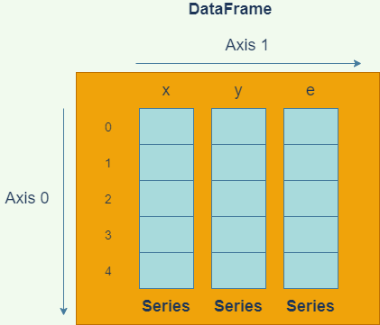
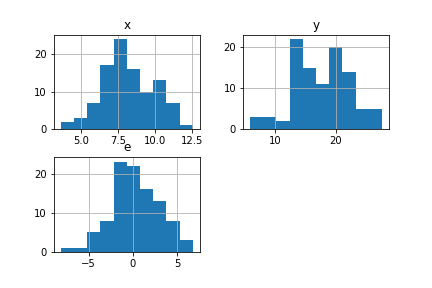
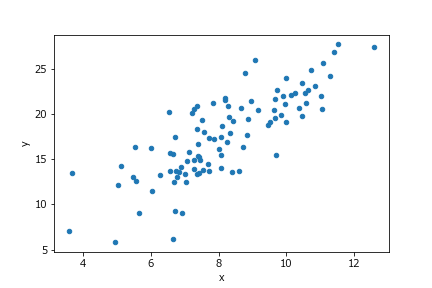
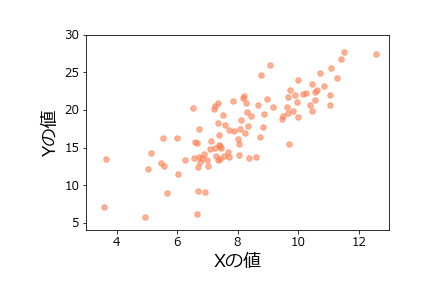

# 第10回　pandas入門

- [第10回　pandas入門](#第10回pandas入門)
  - [pandasとは](#pandasとは)
  - [データフレームの作成](#データフレームの作成)
  - [データフレームのデータ構造](#データフレームのデータ構造)
    - [論理的なデータ構造](#論理的なデータ構造)
    - [物理的なデータ構造](#物理的なデータ構造)
  - [データのチェック](#データのチェック)
    - [データの閲覧](#データの閲覧)
    - [各変数の型チェック](#各変数の型チェック)
    - [各変数の分布のチェック](#各変数の分布のチェック)
    - [要約統計量の計算](#要約統計量の計算)
  - [可視化の方法概観](#可視化の方法概観)
  - [matplotlibのフォント設定](#matplotlibのフォント設定)
  - [散布図のプロット](#散布図のプロット)
  - [色の微調整](#色の微調整)
  - [回帰直線のプロット](#回帰直線のプロット)
  - [回帰直線と散布図のオーバレイ](#回帰直線と散布図のオーバレイ)
  - [Seabornの活用](#seabornの活用)
  - [グラフの保存](#グラフの保存)
  - [インデクシングとスライス](#インデクシングとスライス)
    - [インデックス番号](#インデックス番号)
    - [ラベル](#ラベル)
    - [スライス(`iloc`)](#スライスiloc)
    - [スライス(`loc`)](#スライスloc)
    - [ブールインデックス](#ブールインデックス)
    - [ファンシーインデックス](#ファンシーインデックス)
  - [欠測値](#欠測値)
    - [NaN (Not a Number)](#nan-not-a-number)
    - [欠測の除去](#欠測の除去)
  - [CSVの読み書き](#csvの読み書き)
  - [まとめ](#まとめ)
  - [参考書](#参考書)
  - [宿題(ホームワーク)](#宿題ホームワーク)
  - [課題(アサインメント)](#課題アサインメント)
  - [補遺](#補遺)
    - [データフレーム表示行数の設定](#データフレーム表示行数の設定)

## pandasとは

前回の講義で学んだNumPyでは、配列構造を導入することにより、データ解析において必須とも言えるベクトル演算や要素への高速なアクセスを可能としていました。

しかしながら、NumPyの配列は基本的には複数のデータ型を混在させずに使用します。厳密にはオブジェクト型というデータ型を用いると混在させることができますが、高速化の利点は失われてしまいます。現実のデータは、測定する項目によってデータの型は異なるのが普通です。従って、NumPyの配列だけでは、データ解析には十分な柔軟性が得られないことが想像されます。

Rでは、こうした問題を**データフレーム**という構造を用いて解決しています。データフレームは行列、あるいは表のような構造をしており、各列内ではデータ型は固定ですが、列ごとに異なるデータ型を用いることが可能です。これによって、高速な計算と柔軟性を同時に実現することが出来ます。

**pandas**は、Pythonでデータフレームを使うためのモジュールであり、Pythonの世界におけるデータ解析ではスタンダードなツールとなっています。pandasは、**NumPy**をベースに構築されており、操作方法も似ています。

以前は機械学習モジュールのscikit-learnや可視化モジュールのmatplotlibなどの他のモジュールとの連携が十分でないイメージがありましたが、この問題は現在ではかなり解消し、他のデータ解析モジュールと高い互換性を実現しています。今や、Pythonでデータ解析をするならば、NumPyと同様、pandasを理解することは避けられないと言えます。

本講義では、前回の講義で作成した線形モデルの疑似サンプルデータを用いて、データを**pandas**のデータフレームに加工し、操作する方法を解説します。特にCSVファイルの操作と可視化に焦点を当てたいと思います。

## データフレームの作成

まずは`pandas`データフレームがどのようなものか説明するために、前回作った線形モデルの疑似データをデータフレームに格納してみましょう。まずは以下のコードを再実行し、疑似データを再作成してください。今回は、シード値を123に設定してからサンプリングしましょう。

```python
# %%
# 線形モデルからのサンプリング

import numpy as np
rng = np.random.default_rng(123)
x = rng.normal(8,2,100)
e = rng.normal(0,3,100)
y = 1 + 2 * x + e
```

念のため、`x`、`e`、`y`の内容を表示して、サイズ100のサンプルがちゃんと生成されているか確認しておいてください。

次に、`pandas`モジュールを読み込みます。`pandas`は、`pd`の別名で読み込むのが慣例となっているので、特段の理由が無い限りこれに従いましょう。

```python
# %%
import pandas as pd
```

それでは、`x`、`y`、`e`を変数とするデータフレームを作成しましょう。データフレームを作成する方法は幾つかありますが、最も簡単なのは以下のように辞書を用いる方法です。

この方法では、変数名をキー、対応するNumPyの配列を値として持つ辞書を作成し、pandasの関数DataFrameの引数に与えます。戻り値はデータフレームオブジェクトですので、これを適当な変数(ここでは`df`)に代入しておきましょう。

```python
# %%
data = {'x':x,'y':y,'e':e}
df = pd.DataFrame(data)
print(type(df))
```

```python
# 出力
<class 'pandas.core.frame.DataFrame'>
```

データフレーム`df`を表示してみましょう。

```python
# %%
print(df)
```

```python
# 出力

            x          y         e
0    6.021757  11.496212 -1.547303
1    7.264427  20.503193  4.974340
2   10.575851  21.259913 -0.891788
3    8.387949  13.625766 -4.150131
4    9.840462  19.837310 -0.843614
..        ...        ...       ...
95   5.555309  12.561268  0.450651
96   7.392817  15.309035 -0.476600
97   5.652623   9.026150 -3.279095
98   9.652547  21.696433  1.391339
99   9.700645  15.425901 -4.975388

[100 rows x 3 columns]
```

このように、途中の行は省略されていますが、100行×3列の表形式になっており、各列は`x`、`y`、`e`の値を格納していることが分かります。各行は、一つのオブザベーションであることに注意してください。

なお、上記のように、デフォルトでpandasのデータフレームはオブザベーションが一定行数を超える場合は中間のオブザベーションを省略して表示するようになっています。この表示設定を変更する方法は補遺に記載しておきます。

## データフレームのデータ構造

### 論理的なデータ構造

pandasデータフレームは、概念的には、各変数の配列を束にしたものになっています。各変数のデータを配列で取得するには、次のようにします。

```python
# %%
x_ser = df.x
x_arr = df.x.values
print(type(x_ser))
print(type(x_arr))
```

前者(`x_ser`)では`Series`というpandas特有の配列型オブジェクトが得られますが、後者(`x_arr`)では`ndarray`型のNumPy配列が得られます。

```python
# 出力

<class 'pandas.core.series.Series'>
<class 'numpy.ndarray'>
```

しばしば、「`DataFrame`は`Series`を束にしたものである」という表現がなされることがありますが、これはデータフレームから単一の変数データを取り出すと、往々にして`Series`型で返されるためです。多くの場合、以下の図のようなイメージを持っていれば十分でしょう。



NumPyの多次元配列とpandasのデータフレームの違いは、ちょうどRの行列とデータフレームの違いと似ています。NumPy多次元配列がすべての要素に同じ型のデータを持たなければならないのに対して、データフレームは、列ごとに異なる型を持つことができます。

一つの列の中では、通常は型が統一されますが、オブジェクト型の変数は任意のデータをもつことができます。

このようにpandasのデータの正体は`ndarray`オブジェクトですので、pandasのデータ型は基本的にNumPyのデータ型を踏襲していると考えて概ね正しいです。ただし幾つかの例外はあります。

たとえば、NumPy配列には文字列型が存在しますが、pandasデータフレームでは文字列はオブジェクト型として保存されるという違いがあります。

また、pandasには、欠測値を表すことができる`Int64`や`Int32`といった整数型が存在しますが、これはNumPyには存在しません。(`Int`という大文字からはじまる型名であることに注意してください。実際には、`Int64`や`Int32`は内部で`np.int64`、`np.int32`の配列を扱っています。)

### 物理的なデータ構造

論理的にはデータフレームは`Series`オブジェクトの束ですが、複数のデータフレームがメモリを共有しているのか否か、あるいはデータフレームを用いた種々の計算の効率性といったことを知る必要がある場合は、実際にどのようにデータが格納されているかを気に掛ける必要があります。

データフレームの実際のデータは、データフレーム内の**ブロックマネージャ**というオブジェクトによって管理されています。**ブロックマネージャ**の属性名は`_data`です。

```python
# %%
bm = df._data   # ブロックマネージャを取得
print(type(bm))
print(bm)
```

```python
# 出力

<class 'pandas.core.internals.managers.BlockManager'>
BlockManager
Items: Index(['x', 'y', 'e'], dtype='object')
Axis 1: RangeIndex(start=0, stop=100, step=1)
FloatBlock: slice(0, 3, 1), 3 x 100, dtype: float64
```

`BlockManager`を出力した結果で重要なのは`Items`と`FloatBlock`の項目です。`Items`は、変数のリストを表しています。一方、`FloatBlock`の欄は次のように解釈します。

|記述|意味|
|--|--|
|`slice(0,3,1)`|変数リストのスライス`[0:3:1]`、つまり0,1,2番目の変数は・・・|
|`3 x 100`|3行100列の2次元NumPy配列に格納されている|
|`dtype: float64`|そしてその数値型はNumPyの`float64`型である|

この情報より、実際には、データフレームの数値は単一の2次元NumPy配列に格納されていることが分かります。

各変数のデータが収められているNumPy配列の実体を取得するには、各変数の`values.base`属性にアクセスします。もう少し詳しくいうと、`values`属性はデータのビューですので、その参照元の配列を`base`で取得します。

次のコードの出力により、`x`、`y`、`e`のデータが単一の2次元NumPy配列に格納されていることを確認できます。

```python
# %%
base_array = df.x.values.base
print(df.y.values.base is base_array)
print(df.e.values.base is base_array)
print(base_array.shape)
```

```python
# 出力

True
True
(3, 100)
```

このように、`pandas`のデータフレームは、同じ型を持つ変数を一つのNumPy配列にまとめて格納することによって各種計算の高速化を図っています。

ここで試しに、`df`に、整数の変数を加えた新しいデータフレームを作ってみます。

```python
# %%
int_var = np.arange(100,dtype=np.int64)

data2 = {'x':x,'y':y,'e':e,'int_var':int_var}
df2 = pd.DataFrame(data2)
print(df2.head())
```

```python
           x          y         e  int_var
0   6.021757  11.496212 -1.547303        0
1   7.264427  20.503193  4.974340        1
2  10.575851  21.259913 -0.891788        2
3   8.387949  13.625766 -4.150131        3
4   9.840462  19.837310 -0.843614        4
```

同じようにブロックマネージャを取得してみましょう。

```python
# %%
bm2 = df2._data
print(bm2)
```

```python
BlockManager
Items: Index(['x', 'y', 'e', 'int_var'], dtype='object')
Axis 1: RangeIndex(start=0, stop=100, step=1)
FloatBlock: slice(0, 3, 1), 3 x 100, dtype: float64
IntBlock: slice(3, 4, 1), 1 x 100, dtype: int64
```

今度は、`IntBlock`という欄が新たにできました。この欄を読み解くと、第3変数の`int_var`は１行100列のNumPy配列に格納されており、その数値型は`int64`であることが分かります。


このように、数値型が異なる変数のデータは異なるNumPy配列に格納されています。実際、次のようにして`x`と`int_var`のデータがメモリを異にすることが分かります。

```python
# %%
df2.x.values.base is df2.int_var.values.base
```

```python
# 出力
False
```

同じ数値型のデータが同じブロック(2次元NumPy配列)に格納されていることから、データ型が同じ変数であれば、列方向の計算も、かなりのパフォーマンスで実行できることが分かります。

## データのチェック

データフレームを作成したら、本格的な分析にとりかかるまえに、まず始めにデータを精査すべきです。データを精査するプロセスには、様々な作業が含まれますが、例えば以下のような作業は有効でしょう。

1. 読み込んだデータの閲覧
2. 各変数の型のチェック
3. 欠測値の有無のチェック
4. 各変数の分布のチェック
5. 各変数の要約統計量の計算

このうち、欠測値の有無のチェックについては、多少難しい操作になるので、後に回し、ここでは1,2,4,5を説明します。

### データの閲覧

例えば文字列データを読み込んだ際に文字化けが無かったか、などをチェックするのに役立ちます。データの閲覧は、単純に`print`でデータを出力してみるのが最も簡単な方法です。

そのほか、以下のようなメソッドも有効でしょう。

|メソッド|機能|用例|
|--|--|--|
|`head`|先頭の指定した行数だけ表示|`df.head(20)`|
|`tail`|末尾の指定した行数だけ表示|`df.tail(20)`|

`head`および`tail`の行数指定はオプションであり、指定しない場合は5行表示します。

```python
# %%
print(df.tail())
```

`df.tail()`だけでも良いのですが、そうするとHTML加工されて出力されるので、ここでは書面の都合上`print`関数を使いました。

```python
# 出力
           x          y         e
95  5.555309  12.561268  0.450651
96  7.392817  15.309035 -0.476600
97  5.652623   9.026150 -3.279095
98  9.652547  21.696433  1.391339
99  9.700645  15.425901 -4.975388
```

また、特定の列だけ取得する方法には、様々な方法があります。

|記法|機能|型|
|--|--|--|
|`df['x']`|`x`の列だけ取得|`Series`|
|`df[['x']]`|`x`の列だけ取得|`DataFrame`|
|`df[['x','y']]`|`x`、`y`だけのデータを取得|`DataFrame`|
|`df.x`|`x`の列だけを取得|`Series`|
|`df.loc[:,'x']`|`x`の列だけを取得|`Series`|
|`df.loc[:,['x']]`|`x`の列だけを取得|`DataFrame`|
|`df.iloc[:,0]`|第0列だけを取得|`Series`|
|`df.iloc[:,[0,1]]`|第0、1列だけのデータを取得|`DataFrame`|

記法によって、得られるデータが`Series`型の場合と`DataFrame`型の場合があるので、多少注意が必要です。

`loc`や`iloc`の使い方については、後でインデクシングとスライスの説明を行う際に解説します。

### 各変数の型チェック

データフレームに読み込んだ変数のデータ型をチェックするには、データフレームの`dtypes`属性を表示します。

```python
# %%
print(df.dtypes)
```

```python
# 出力

x    float64
y    float64
e    float64
dtype: object
```

これを見ると分かるように、意図したように`x`、`y`、`e`が全て64ビット浮動小数点数として格納されていることが分かります。

このチェックによって、たとえば、`x`がオブジェクト型(`object`)などとして読み込まれていたりした場合は、`x`に数値以外のものがうっかりと混じってしまっていた可能性があります。あるいはデータをファイルから読み込んだ場合は、ファイルのオープンで何らかのトラブルがあった可能性があります。

### 各変数の分布のチェック

各変数の分布のチェックをするには、ヒストグラムをプロットするのが一番分かりやすい方法です。データフレームには、`hist`という全ての変数のヒストグラムをプロットするメソッドがあります。

```python
# %%
df.hist()
```

出力は以下のようになります。



これにより、分布の形状に際立った特徴がないか、例えば母集団がマルチモーダルになっている可能性はないか、といった考察ができます。

### 要約統計量の計算

pandasデータフレームには、要約統計量を計算する便利なメソッドが揃っています。一番最初に試してみるべきメソッドは、`describe`でしょう。これはRデータフレームの`summary`メソッドに対応するものです。

```python
# %%
print(df.describe())
```

```python
# 出力

                x           y           e
count  100.000000  100.000000  100.000000
mean     8.163830   17.621354    0.293695
std      1.799021    4.655073    2.761058
min      3.585058    5.838924   -8.185457
25%      6.978835   13.910635   -1.225525
50%      8.033164   17.570366    0.264505
75%      9.653371   20.953255    2.130415
max     12.579820   27.685974    6.796562
```

出力された各要約統計量の意味は次の通りです。

|統計量|意味|
|--|--|
|`count`|オブザベーション数|
|`mean`|平均値|
|`std`|標準偏差|
|`min`|最小値|
|`25%`|25%分位点|
|`50%`|50%分位点|
|`75%`|75%分位点|
|`max`|最大値|

なお、こちらの`std`はNumPyと異なり、自由度のデフォルトは`N-1`ですのでご注意ください。

自由度を変えたい場合は、独立に`std`メソッドや`var`メソッドを呼び出し、オプション引数`ddof`を設定する必要があります。

```python
#%%
# 自由度をNにした分散と標準偏差
print('Var:')
print(df.var(ddof=0))
print()
print('Std:')
print(df.std(ddof=0))
```

```python
# 出力
Var:
x     3.204111
y    21.453009
e     7.547206
dtype: float64

Std:
x    1.790003
y    4.631739
e    2.747218
dtype: float64
```

パーセンタイルをカスタマイズしたい場合は、`describe`メソッドの`percentiles`引数にパーセンタイルをリストで渡します。たとえば2.5%、50%、97.5%を出力したいときは、次のようにします。

```python
# %%
print(df.describe(percentiles=[0.025,0.5,0.975]))
```

```python
                x           y           e
count  100.000000  100.000000  100.000000
mean     8.163830   17.621354    0.293695
std      1.799021    4.655073    2.761058
min      3.585058    5.838924   -8.185457
2.5%     4.984007    8.015538   -5.119716
50%      8.033164   17.570366    0.264505
97.5%   11.348816   26.412084    5.619012
max     12.579820   27.685974    6.796562
```

相関行列を計算するには、`corr`メソッドが使えます。

```python
# %% ピアソンの積率相関係数
print(df.corr("pearson"))
```

引数には"pearson"(ピアソン積率相関係数)、"kendall"(ケンドール順位相関係数)、"spearman"(スピアマン順位相関係数)が選べます。

```python
# 出力
          x         y         e
x  1.000000  0.805777  0.055381
y  0.805777  1.000000  0.635935
e  0.055381  0.635935  1.000000
```

他にも様々なメソッドやオプション引数がありますので、pandasの[リファレンスマニュアル](https://pandas.pydata.org/pandas-docs/stable/reference/api/pandas.DataFrame.html)をチェックしてみてください。

## 可視化の方法概観

Pythonでデータや分析の結果を可視化するには、`matploblib`モジュールを使うのが最もポピュラーです。筆者が把握する限り、`matplotlib`を用いるには、主に3つの方法があります。

1. `matplotlib`を直接操作する
2. `pandas`データフレームから`matploblib`を呼び出す
3. `Seaborn`から`matplotlib`を呼び出す

`matplotlib`は非常に低水準なグラフ描画機能を提供するので、柔軟性は高いですが、綺麗なグラフを`matplotlib`で手作りするのは中々骨が折れます。

`Seaborn`は`matplotlib`のインターフェースを高水準にしたもので(こういうものを**ラッパー**と呼びます)、柔軟性は低いですが、非常に簡単にきれいなグラフを作成できるという特徴があります。しかしながら、詳細なカスタマイズをしようと思うと、最終的には`matplotlib`をいじらないといけません。細部にこだわらない普段使いには十分であるような気がします。

`pandas`データフレームから`matplotlib`を呼び出すのは、`matplotlib`を直接操作するのと対して変わりありませんが、幾分インターフェースが簡略化されて使いやすくなっています。データフレームのメソッドなので、データにアクセスしやすくなっています。こちらについても、詳細な設定は`matplotlib`に立ち返らないといけません。

(なお、PythonでもRの`ggplot`を使うことはできます。筆者はほとんど使ったことがありませんが、操作感がよいとは言えない印象があります。どなたかレビューお願いします。筆者の場合、そもそも`ggplot`を使いたいなら、最初からRを使います。)

このように、Rの可視化部門が実質`ggplot2`に一元化されているのに対し、Pythonの可視化部門は若干散らかっている印象があります。改めて見ると、``ggplot2``が優れているのは、非常に高水準なインターフェースと、極めて低水準な操作を両立している点ではないでしょうか。要するに、多少雑で良いなら簡単に様々なグラフが作れるが、頑張ればいくらでも美しく加工できるということです。

さて、Pythonに話を戻しましょう。筆者としては、グラフの大枠は`pandas`や`Seaborn`で作成し、細かい微調整については`matplotlib`を直接操作するというのが良いのではないかと思います。今回の講義は`pandas`の説明が中心ですので、データフレームのメソッドを介して可視化する方法を中心に説明します。

## matplotlibのフォント設定

`matplotlib`のデフォルトのフォントでは日本語が文字化けしてしまうため、まずフォントの設定を行う必要があります。

次のように、`matplotlib`をインポートしてフォントを日本語フォントに変えましょう。Windowsでは"MS gothic"や"MS mincho"、"Meiryo"がありますが、ここでは"Meiryo"にしておきましょう。

```python
# MS ゴシックに変更
import matplotlib
matplotlib.rcParams['font.family'] = 'Meiryo'
```

また、上記のやり方では、毎回の起動時にフォントを設定する必要があります。起動時のデフォルトのフォントを変更する方法もあります。

フォント周りの設定は本質的でなくごちゃごちゃした事項になるので、[チートシート](./cheatsheet.md)を別に作りました。参考にしてください。

## 散布図のプロット

散布図をプロットするには、データフレームの`plot.scatter`メソッドを使います。

```python
# %%
df.plot.scatter(x='x',y='y')
```

出力は以下のようになります。



オプション引数をつけることによって、様々な微調整が可能です。

|オプション引数|意味|
|--|--|
|`s`|マーカーサイズ|
|`c`|マーカー色|
|`marker`|マーカー形状|
|`xlim`|横軸範囲|
|`ylim`|縦軸範囲|
|`fontsize`|フォントサイズ|

これらのオプション引数は、例えば次のように使用します。

```python
# %%
df.plot.scatter(x='x',y='y',
s=30,                   # マーカーサイズ
c='skyblue',            # マーカーの色
marker='o',             # マーカーの形
xlim=(3,13),            # x軸の範囲
ylim=(4,30),            # y軸の範囲
fontsize=12             # 軸目盛のフォントサイズ
)
```

軸ラベルを変更するのは、少し手間がかかります。まず`matplotlib`のサブモジュール`pyplot`をインポートします(慣習として、`plt`という名前で読み込みます)。次に、`pyplot`モジュールの`xlabel`関数と`ylabel`関数で軸ラベルとそのサイズを次のように変更できます。

```python
# %%
import matplotlib.pyplot as plt
plt.xlabel('Xの値',size=18)
plt.ylabel('Yの値',size=18)
```

また、グラフ上下左右のマージンを設定するには、

```python
# %%
plt.subplots_adjust(left=0.2,bottom=0.2)
```

のように指定します。

ここで注意しなくてはならないのは、VS Codeの対話的モードで図を描く場合、図を描く関数の呼び出しと、図を調整する関数`plt.xlabel`等の呼び出しは、次のように**全て同じセルで行わなくてはならない**ということです(`import`は別のセルで構いません)。

```python
# %%
import matplotlib.pyplot as plt

df.plot.scatter(x='x',y='y',
s=30,                   # マーカーサイズ
c='skyblue',            # マーカーの色
marker='o',             # マーカーの形
xlim=(3,13),            # x軸の範囲
ylim=(4,30),            # y軸の範囲
fontsize=12             # 軸目盛のフォントサイズ
)
plt.xlabel('Xの値',size=18)
plt.ylabel('Yの値',size=18)
plt.subplots_adjust(left=0.2,bottom=0.2)
```

出力は次のようになります。


全てのマーカー形状と全ての色名は以下の`matplotlib`のサイトにリストアップされています。

- [全てのマーカー形状](https://matplotlib.org/stable/api/markers_api.html)
- [全ての色名](https://matplotlib.org/stable/gallery/color/named_colors.html)

また、`plot.scatter`メソッドの詳細な使い方は[pandasのリファレンス](https://pandas.pydata.org/pandas-docs/stable/reference/api/pandas.DataFrame.plot.scatter.html)を見てください。

## 色の微調整

マーカーの色はRGBもしくはRGBAでも指定可能です。RGBは、赤・緑・青の強さを0～1の数値で表したものです(0～255の1バイト整数で表すことも多いです)。三つの数値をタプルで表します。たとえば、

```cmd
(0,0,1)
```

は青原色となります。

また、RGBAは、RGBに加えて、第4の数値が不透明度を0～1で表します。1が最も不透明で、0が透明です。

`matplotlib`では、`colors.to_rgb`および`colors.to_rgba`関数によって色名からRGB値およびRGBA値を取得できます。

```python
# "coral"のRGBA値を取得
rgba_coral = matplotlib.colors.to_rgba("coral")
print(rgba_coral)
```

```python
# 出力

(1.0, 0.4980392156862745, 0.3137254901960784, 1.0)
```

たとえば、このRGBA値のアルファ値を少し減じてやることによって、透明度のある"coral"を作ることができます。

```python
# %%
rgba_coral_tr = rgba_coral[0:3] + (0.6,)
```

```python
df.plot.scatter(x='x',y='y',
s=30,                   # マーカーサイズ
color=rgba_coral_tr,            # マーカーの色
marker='o',             # マーカーの形
xlim=(3,13),            # x軸の範囲
ylim=(4,30),            # y軸の範囲
fontsize=12             # 軸目盛のフォントサイズ
)
plt.xlabel('Xの値',size=18)
plt.ylabel('Yの値',size=18)
plt.subplots_adjust(left=0.2,bottom=0.2)
```

結果は次のようになります。



ただし、RGB値やRGBA値を渡す場合は、引数名は`c`ではなく`color`にしてください。

## 回帰直線のプロット

それでは次に、単回帰の結果を散布図に重ねましょう。まずは回帰分析を再実行しておきます。

```python
# %%
# 回帰分析
from scipy import stats
res = stats.linregress(df.x,df.y)
print(res)
```

ここで、データフレーム`df`の変数`x`の配列と変数`y`の配列にアクセスするために、`df.x`、`df.y`という表記を用いていることに注意してください。このように、データフレームでは、`df.変数名`という表記によって、各列を取り出すことができます。

```python
# 出力
LinregressResult(slope=2.084996965456381, intercept=0.5997940915043358, rvalue=0.8057774353709972, pvalue=5.010945582964262e-24, stderr=0.15479582428347563, intercept_stderr=1.2937470389108192)
```

`intercept`が切片、`slope`が回帰係数であることに注意してください。

次に、この結果を用いて、回帰モデルの予測値を与えるデータフレームを用意しましょう。

まず、`x_model`を予測用のサンプルデータ点を表すNumPy配列にします。これは、グラフの定義域をカバーしていればどんな配列でもよいのですが、ここでは、3～13の範囲を100分割した数列にしておきましょう。このような操作には、NumPyの`linspace`関数を使います。

```python
# %%
x_model = np.linspace(3,13,100)
print(len(x_model))                 # 配列の長さ
print(np.round(x_model[:3],3))      # 最初の3要素
print(np.round(x_model[-3:],3))     # 最後の3要素
```

`linspace`の引数は、それぞれ、開始数値、終端数値、分割数です。

```python
# 出力
100
[3.    3.101 3.202]
[12.798 12.899 13.   ]
```

次に、`y_model`を、`y`の予測値を与える配列とします。これは、回帰分析の結果を用いて次のように計算できます。

```python
# %%
y_model = res.intercept + res.slope * x_model
```

これを用いて、100オブザベーションについての予測値を格納したデータフレーム`df_model`を次のように作成しておきます。

```python
# %%
df_model = pd.DataFrame({'x':x_model,'y':y_model})
print(df_model)
```

```python
# 出力

           x          y
0    3.00000   6.854785
1    3.10101   7.065391
2    3.20202   7.275996
3    3.30303   7.486602
4    3.40404   7.697208
..       ...        ...
95  12.59596  26.862332
96  12.69697  27.072937
97  12.79798  27.283543
98  12.89899  27.494149
99  13.00000  27.704755

[100 rows x 2 columns]
```

この予測値のデータフレームで、`x`横軸、`y`縦軸の折れ線グラフを描けば、回帰直線になっているはずです。回帰直線には、データフレームの`plot.line`メソッドを使います。`linestyle`引数で線の種類、`linewidth`で線の太さを設定できます。

```python
# %%
df_model.plot.line(x='x',y='y',
linestyle='dashed',
color='grey',
linewidth=3
)
```

`scatter`と同じく様々な微調整が可能ですが、ここでは後で散布図と重ねることを考慮して、微調整は行わないことにします。

出力は以下のようになります。


なお、全ての線の種類のリストは以下で調べることができます。

- [線の種類一覧](https://matplotlib.org/stable/gallery/lines_bars_and_markers/linestyles.html)

## 回帰直線と散布図のオーバレイ

それでは、最後に、上で作成した散布図と回帰直線をオーバレイ(重ね描き)してみましょう。まずは、オーバレイせずにそのまま二つのグラフを打ち出すだけのコードを書いてみます。

以下のようになりますが、これまで作成したコードを合わせただけなので、特に説明はいらないでしょう。

```python
# %%
df.plot.scatter(x='x',y='y',
s=30,                   # マーカーサイズ
c='skyblue',            # マーカーの色
marker='o',             # マーカーの形
xlim=(3,13),            # x軸の範囲
ylim=(4,30),            # y軸の範囲
fontsize=12             # 軸目盛のフォントサイズ
)

df_model.plot.line(x='x',y='y',
linestyle='dashed',     # 線種
color='grey',           # 線色
linewidth=3             # 線幅
)

plt.xlabel('Xの値',size=18) # X軸ラベル
plt.ylabel('Yの値',size=18) # Y軸ラベル
plt.subplots_adjust(left=0.2,bottom=0.2) # マージン
```

ふたつのグラフを重ねるには、以下のように一つ目のグラフの戻り値を、二つ目のグラフの`ax`引数に渡します。

```python
# %%
ax = df.plot.scatter(x='x',y='y', # 戻り値をaxに
s=30,                   # マーカーサイズ
c='skyblue',            # マーカーの色
marker='o',             # マーカーの形
xlim=(3,13),            # x軸の範囲
ylim=(4,30),            # y軸の範囲
fontsize=12             # 軸目盛のフォントサイズ
)

df_model.plot.line(x='x',y='y',
linestyle='dashed',     # 線種
color='grey',           # 線色
linewidth=3,            # 線幅
ax=ax,                  # 一つ目のグラフの戻り値
legend=False            # レジェンドを削除
)

plt.xlabel('Xの値',size=18) # X軸ラベル
plt.ylabel('Yの値',size=18) # Y軸ラベル
plt.subplots_adjust(left=0.2,bottom=0.2) # マージン
```

出力は次のようになります。ここでは、ついでに二つ目のグラフのレジェンドを削除しておきました。


## Seabornの活用

上記では、まず回帰分析を行ってから、その結果を散布図に重ねるという作業を行いましたが、`Seaborn`モジュールの`regplot`メソッドを用いると、回帰直線と信頼区間を自動で挿入してくれます。

Seabornのモジュール名は`seaborn`ですが、`sns`の別名で読み込むのが慣習となっていますので、それに従いましょう。

```python
# %%
import seaborn as sns
```

```python
# %%
sns.regplot(x=df.x,y=df.y,
    color='black',
    marker='x',
    scatter_kws={'s':10})   # マーカーサイズ

plt.tick_params(labelsize=14)   # 軸数値のサイズ
plt.xlim((3,13))
plt.ylim((4,30))
plt.xlabel('Xの値',size=18)
plt.ylabel('Yの値',size=18)

plt.subplots_adjust(left=0.2,
    bottom=0.2)
```


本講義では、Seabornの詳しい解説はしませんが、興味がある方は[リファレンスマニュアル](https://seaborn.pydata.org/api.html)を参照してください。

## グラフの保存

可視化の締めくくりとして、グラフのファイルへの保存について説明しておきます。グラフの保存は、`matplotlib.pyplot`の`savefig`関数によって行います。やはり、グラフを描画したセル内部で保存をする必要があります。

```python
# %%
ax = df.plot.scatter(x='x',y='y', # 戻り値をaxに
s=30,                   # マーカーサイズ
c='skyblue',            # マーカーの色
marker='o',             # マーカーの形
xlim=(3,13),            # x軸の範囲
ylim=(4,30),            # y軸の範囲
fontsize=12             # 軸目盛のフォントサイズ
)

df_model.plot.line(x='x',y='y',
linestyle='dashed',     # 線種
color='grey',           # 線色
linewidth=3,            # 線幅
ax=ax,                  # 一つ目のグラフの戻り値
legend=False            # レジェンドを削除
)

plt.xlabel('Xの値',size=18) # X軸ラベル
plt.ylabel('Yの値',size=18) # Y軸ラベル
plt.subplots_adjust(left=0.2,bottom=0.2) # マージン

plt.savefig('linregress.png',
dpi=300,
facecolor='white')
```

最後の一行でグラフを'linregress.png'というPNGファイルに保存しています。ここでは、背景を白色にするために`facecolor`引数に'white'を指定し、解像度を300dpiに設定しました。

エクスプローラで'linregress.png'を探して表示できるかどうか試してみてください。

## インデクシングとスライス

データフレームの一部を取り出すには、様々な方法があります。

- インデックス番号による参照
- ラベルによる参照
- スライスによる参照
- ブールインデックス参照
- ファンシーインデックス参照

いずれの方法でも、`loc`と`iloc`という二つの**インデクサ**を用いることになります。

### インデックス番号

インデックス番号でデータフレームの要素にアクセスするには、`iloc`を使います。`iloc[i,j]`で`i`行`j`列の要素を意味します。

```python
# %%
print(df.head())
print("\ndf.iloc[2,1]:")
print(df.iloc[2,1])
```

```python
# 出力

           x          y         e
0   6.021757  11.496212 -1.547303
1   7.264427  20.503193  4.974340
2  10.575851  21.259913 -0.891788
3   8.387949  13.625766 -4.150131
4   9.840462  19.837310 -0.843614

df.iloc[2,1]:
21.25991325823923
```

### ラベル

変数ラベルを用いて要素にアクセスしたい場合は、`iloc`の代わりに`loc`を使う必要があります。

```python
# %%
print(df.head())
print("\ndf.loc[3,'x']:")
print(df.loc[3,'x'])
```

```python
# 出力

           x          y         e
0   6.021757  11.496212 -1.547303
1   7.264427  20.503193  4.974340
2  10.575851  21.259913 -0.891788
3   8.387949  13.625766 -4.150131
4   9.840462  19.837310 -0.843614

df.loc[3,'x']:
8.387948838265226
```

### スライス(`iloc`)

`iloc`にスライス記法を使えば、データフレームの一部をスライスで取り出せます。

```python
# %%
print(df.head())
print("\ndf.iloc[0:3,1]:")
data_slice = df.iloc[0:3,1]
print(data_slice)
print(type(data_slice))
```

```python
# 出力

           x          y         e
0   6.021757  11.496212 -1.547303
1   7.264427  20.503193  4.974340
2  10.575851  21.259913 -0.891788
3   8.387949  13.625766 -4.150131
4   9.840462  19.837310 -0.843614

df.iloc[0:3,1]:
0    11.496212
1    20.503193
2    21.259913
Name: y, dtype: float64
<class 'pandas.core.series.Series'>
```

上記のように、スライスで気を付けないといけないのは、列番号を単一数値にすると、データフレームではなく`Series`オブジェクトになって返されるということです。

データフレームを返して欲しい場合は、以下のように単一要素でもスライスもしくはリストにしてインデクサに渡す必要があります。

```python
# %%
print(df.head())
print("\ndf.iloc[0:3,1:2]:")
data_slice = df.iloc[0:3,1:2]
print(data_slice)
print(type(data_slice))
```

```python
# 出力
           x          y         e
0   6.021757  11.496212 -1.547303
1   7.264427  20.503193  4.974340
2  10.575851  21.259913 -0.891788
3   8.387949  13.625766 -4.150131
4   9.840462  19.837310 -0.843614

df.iloc[0:3,1:2]:
           y
0  11.496212
1  20.503193
2  21.259913
<class 'pandas.core.frame.DataFrame'>
```

### スライス(`loc`)

`loc`インデクサを用いれば、列名にもスライスが使用可能です。

```python
# %%
df_xy = df.loc[:,'x':'y']
print(df_xy)
```

```python
# 出力
            x          y
0    6.021757  11.496212
1    7.264427  20.503193
2   10.575851  21.259913
3    8.387949  13.625766
4    9.840462  19.837310
..        ...        ...
95   5.555309  12.561268
96   7.392817  15.309035
97   5.652623   9.026150
98   9.652547  21.696433
99   9.700645  15.425901

[100 rows x 2 columns]
```

ここで、`loc`インデクサのスライスは若干記法が特殊であることに注意してください。番号によるスライスとは違って、`'x':'y'`と書くと、`y`の列も含まれたデータフレームが得られます。

これは行インデックスでも同じです。`loc`インデクサで行をスライスするときは、`1:4`とかくと、4行目も含まれたデータフレームが得られます。

### ブールインデックス

ブールインデックス参照とは、行数あるいは列数に等しい長さをもったブール値の配列を用いてデータフレームの一部を取り出すことです。データ分析で非常に頻繁に用いる手法ですので、必ず覚えておきましょう。

たとえば、`x`の値が8以上になっているオブザベーションだけを取り出したいとします。このような場合、以下のようなブールインデックス参照が有効です。

```python
# %%
df_xgt8 = df.loc[df.x>=8,:]
print(df_xgt8.head())
np.all(df_xgt8.x >= 8)       # 全て8以上か確認
```

```python
# 出力

           x          y         e
2  10.575851  21.259913 -0.891788
3   8.387949  13.625766 -4.150131
4   9.840462  19.837310 -0.843614
5   9.154208  20.388477  1.080062
7   9.083904  25.964371  6.796562
True
```

ブールインデックス参照に慣れていないと、これは何をやっているのか分からないでしょう。

上の記法を理解するため、まずインデクサに渡した`df.x>=8`が何を意味するのか考えてみます。

```python
df.x >= 8
```

この二項演算において、左辺は`Series`型配列、右辺は`8`というスカラですが、ブロードキャストが起きて右辺は左辺と同じ長さ`100`の`Series`型配列に変換されます。これはNumPy配列の場合と全く同じです。

そのあと、項ごとに二項演算`>=`が実行され、結果は`True`と`False`の長さ100の配列になります。

実際に結果を見てみましょう。

```python
# %%
print(df.x>=8)
print(type(df.x>=8))
```

```python
# 出力

0     False
1     False
2      True
3      True
4      True
      ...  
95    False
96    False
97    False
98     True
99     True
Name: x, Length: 100, dtype: bool
<class 'pandas.core.series.Series'>
```

この`Series`配列では、`x>=8`が成り立つところでは`True`、成り立たないところでは`False`になっていることに注意してください。

`pandas`のデータフレームは、こうしたブール値配列を`loc`インデクサに渡すと、`True`が成り立っている行だけを返してくれるという機能を持っています。こうしたブール値配列を用いた部分データの取得を**ブールインデックス参照**と呼びます。pandasに限らずデータフレームを扱う大抵のツールで提供されている機能です。

ブールインデックス参照を用いると、複雑な条件を満たすオブザベーションだけを容易に取り出すことができます。

たとえば、`x>=8`かつ`y<20`を満たす行だけを取り出してみましょう。この場合、次のようにします。

```python
# %%
df_x8y20 = df.loc[(df.x>=8) & (df.y<20),:]
print(df_x8y20.head())
print(df_x8y20.shape)
```

```python
# 出力

            x          y         e
3    8.387949  13.625766 -4.150131
4    9.840462  19.837310 -0.843614
14  10.000539  19.061887 -1.939190
21   9.655843  19.544249 -0.767437
24   9.509539  19.163218 -0.855860
(21, 3)
```

ここで重要なポイントが二つあります。

1. 二つの条件を繋ぐときは、各条件を丸カッコで囲む
2. 二つのブール値配列のANDは、`and`ではなく`&`をつかう

これらの2点を見落としがちですので気を付けましょう。`and`はスカラーの間の論理積には使えますが、配列の間の論理積には使えません。代わりに`&`を使います。

同様に、論理和ORは`|`、否定には`~`を使います。

### ファンシーインデックス

最後に**ファンシーインデックス**参照は、取り出したいインデックス番号のリストや配列をインデクサに渡す方法です。たとえば、0、2、4行目だけを取り出したいときは、次のようにします。

```python
# %%
df_fancy = df.iloc[[0,2,4],:]
print(df_fancy.head())
```

```python
# 出力
           x          y         e
0   6.021757  11.496212 -1.547303
2  10.575851  21.259913 -0.891788
4   9.840462  19.837310 -0.843614
```

なお、これまでの様々なインデクシングの記法は、組み合わせて使うことができることに注意しましょう。たとえば変数`x`と`e`の1～4行目を取り出したいときは次のようにします。

```python
# %%
df_comb = df.loc[1:4,['x','e']]
print(df_comb)
```

```python
# 出力
           x         e
1   7.264427  4.974340
2  10.575851 -0.891788
3   8.387949 -4.150131
4   9.840462 -0.843614
```

## 欠測値

### NaN (Not a Number)

pandasでは、従来欠測値は`np.nan`オブジェクト(`NaN`とも表記されます)で表されてきました。`np.nan`は"Not a Number"を意味しており、NumPy配列における値の欠測を表現するために使われます。`NaN`は浮動小数点型なので、一つの配列内で`int`型と混在させることはできません。

たとえば下記のように、`int64`型の配列に`NaN`を代入すると、エラーが出ます。

```python
# %%
# 整数配列にNaNを入れてみる
arr = np.arange(10,dtype=np.int64)
print(arr.dtype)
arr[0] = np.nan
```

```python
# 出力
int64
---------------------------------------------------------------------------
ValueError                                Traceback (most recent call last)

...(中略)...

      56 arr = np.arange(10,dtype=np.int64)
      57 print(arr.dtype)
----> 58 arr[0] = np.nan

ValueError: cannot convert float NaN to integer
```

たとえば、先ほど作成したデータフレーム`df2`をコピーして`df3`という新しいデータフレームを作成し、欠測値を挿入してみましょう。

```python
# %%
df3 = df2.copy()
```

ここでは、変数`x`の第3オブザベーション(0からカウントして)と変数`y`の第2オブザベーションに`NaN`を入れてみましょう。

```python
# %%
df3.loc[3,'x'] = np.nan
df3.loc[2,'y'] = np.nan
print(df3.head())
```

```python
# 出力

           x          y         e  int_var
0   6.021757  11.496212 -1.547303        0
1   7.264427  20.503193  4.974340        1
2  10.575851        NaN -0.891788        2
3        NaN  13.625766 -4.150131        3
4   9.840462  19.837310 -0.843614        4
```

上記のとおり`NaN`は"NaN"と表示されます。

こういった欠測値をどのように取り扱うかべきかは、場合によりますが、いずれにせよ欠測が存在していることを確認することは重要です。

### 欠測の除去

欠測が少ない場合は、欠測を含む行を全て除去する対処法が考えられます。これを**リストワイズ除去**と呼び、欠測に対処する方法の中では最も原始的なものです。

データフレームの`dropna`メソッドを使うと、リストワイズ除去したデータフレームが返されます。

```python
# %%
df3_dropnan = df3.dropna()
print(df3_dropnan.head())
```

```python
# 出力

          x          y         e  int_var
0  6.021757  11.496212 -1.547303        0
1  7.264427  20.503193  4.974340        1
4  9.840462  19.837310 -0.843614        4
5  9.154208  20.388477  1.080062        5
6  6.727073  13.750969 -0.703176        6
```

なお、逆に欠測に値を代入するときは、`fillna`メソッドが使えます。たとえば、欠測に平均値を代入する場合は、次のようにします。

```python
# %%
df3_fillnan = df3.fillna(df3.mean())
print(df3.mean())
print(df3_fillnan.head())
```

```python
# 出力

x           8.161566
y          17.584601
e           0.293695
int_var    49.500000
dtype: float64
           x          y         e  int_var
0   6.021757  11.496212 -1.547303        0
1   7.264427  20.503193  4.974340        1
2  10.575851  17.584601 -0.891788        2
3   8.161566  13.625766 -4.150131        3
4   9.840462  19.837310 -0.843614        4
```

なお、pandasには整数の欠測を表現できる`pandas.NA`という型も存在していますが、こちらについては本講義では割愛します。

## CSVの読み書き

pandasは、CSVとデータフレームの間で直接読み書きができるようになっています。まずは、今回の講義で作成したデータフレーム`df`をCSVに保存してみましょう。

CSVへの保存には、`to_csv`メソッドを使います。

```python
# %%
df.to_csv('pandas.csv',
    encoding='utf-8',
    index=False)  # 行インデックスなし
```

ここでは、'pandas.csv'という名前のファイルに、utf-8エンコーディングで保存しました。`index`オプション引数を`False`にして、行インデックスはCSVに含めないようにしました。

VS CodeにCSV関連の拡張機能(Edit CSV、Rainbow CSV等)をインストールしていればCSVが閲覧できるはずですので、ファイルエクスプローラで見つけて開いてみましょう。

次は逆に、先ほど保存したCSVを別の名前のデータフレームに読み込んでみましょう。

```python
# %%
df4 = pd.read_csv('pandas.csv',
    engine='python',
    encoding='utf-8')
```

`engine`引数はCSVの解析エンジンを設定するオプションですが、デフォルトで上手く読み込めない場合は、上のように`"python"`を指定すると上手くいくことが多いです。

## まとめ

今回の講義では以下の点について学びました。

- データフレームの作成
- データフレームの構造
- データのチェック
- 可視化
- 様々なインデクシング
- 欠測値の取り扱い
- CSVファイルの読み書き

今回の講義では、非常に高度で豊富なpandasの機能のごく一部しか紹介できませんでした。例えばpandasデータフレームには、データをグループ分けしたり、複数のデータフレームを様々な方法で結合する機能が備わっていますが、こういった高度な話題については一切触れませんでした。可視化についても、ほんの一部の機能しか紹介していません。

pandasのリファレンスマニュアルやインターネット上の情報を探して、自分が必要な機能が実装されていないか調べてみてください。大抵、自分が期待していいる以上のことができることに気付くと思います。

## 参考書

- [BlockManagerに関する記事](https://uwekorn.com/2020/05/24/the-one-pandas-internal.html)
- [『Pythonによるデータ分析入門ーNumPy、pandasを使ったデータ処理』](https://www.amazon.co.jp/Python%E3%81%AB%E3%82%88%E3%82%8B%E3%83%87%E3%83%BC%E3%82%BF%E5%88%86%E6%9E%90%E5%85%A5%E9%96%80-%E7%AC%AC2%E7%89%88-%E2%80%95NumPy%E3%80%81pandas%E3%82%92%E4%BD%BF%E3%81%A3%E3%81%9F%E3%83%87%E3%83%BC%E3%82%BF%E5%87%A6%E7%90%86-Wes-McKinney/dp/487311845X/ref=sr_1_1?adgrpid=103870342466&dchild=1&gclid=CjwKCAjwzMeFBhBwEiwAzwS8zJda-mLMnpel3pcvMcGv8Lgj2LMuXdWfU3zDldDWzHpWTu10bp8nDhoChwEQAvD_BwE&hvadid=448604013349&hvdev=c&hvlocphy=1009706&hvnetw=g&hvqmt=e&hvrand=1539812169160369851&hvtargid=kwd-334918825383&hydadcr=27270_11561194&jp-ad-ap=0&keywords=python+%E3%81%AB%E3%82%88%E3%82%8B%E3%83%87%E3%83%BC%E3%82%BF%E5%88%86%E6%9E%90%E5%85%A5%E9%96%80&qid=1622301042&sr=8-1)(Wes McKinney著、瀬戸山 雅人(翻訳)、小林 儀匡(翻訳)、滝口 開資(翻訳))(2018) オライリージャパン. ISBN-13 : 978-4873118451.

`pandas`データフレームのデータ構造についての考察は、上記のBlockManagerに関する記事を大いに参考にしました。

## 宿題(ホームワーク)

1. データフレーム`df`のブロックマネージャ`df._data`には`blocks`という属性があり、データのブロックがタプル形式で保存されていることを確認してください。各ブロックのデータは、ブロックの`values`属性に格納されています。これがNumPyの配列であることを以下のようにして確認しなさい。また、これが`df.x.values.base`によりアクセスできる配列と同じオブジェクトであることを確かめてください。

    ```python
    # %%
    for block in df._data.blocks:
        arr = block.values
        print(type(arr))
    ```

2. `Series`型オブジェクトについて研究してください。NumPy配列と同様、`Series`のスライスは元のオブジェクトのビューであることを確認してください。
3. データフレームのデータを、変数`x`でソートするには、`sort_values`メソッドを次のように使います。実際に試してみてください。

    ```python
    # %%
    x_sorted = df.sort_values(by='x')
    ```

4. 文字列データを含むデータフレームを作成してみてください。たとえば、次のようにすれば、`x`が8以上のオブザベーションを"High"、8未満を"Low"とする変数が作れます。'High'なオブザベーションだけを抽出して、各種要約統計量を計算してみてください。

    ```python
    df['height'] = 'Low'
    df.loc[df.x>=8,'height'] = 'High'
    ```

5. `groupby`メソッドを使うと、`groupby`オブジェクトを作成できます。このオブジェクトには、`describe`、`mean`、`var`などの基本統計量を**グループごとに**計算するメソッドが備わっています。以下のように、試してみてください。

   ```python
   gpb = df.groupby('height')
   gpb.describe()
   ```

## 補遺

### データフレーム表示行数の設定

pandasのデータフレームは、デフォルトで一部の行しか表示しないようになっています。表示行数を設定することはできますが、この設定がちょっと分かりにくいので、ここで詳しく説明しておきましょう。

pandasのオプションは、get_optionメソッドもしくは、options属性から確認できます。表示行数に関連するのは`min_rows`オプションと`max_rows`オプションです。

```python
# get_optionメソッドによる表示
print(pd.get_option('display.min_rows'))
print(pd.get_option('display.max_rows'))
```

```python
# options属性によるアクセス
print(pd.options.display.min_rows)
print(pd.options.display.max_rows)
```

```python
# 出力
20
60
```

この２つのオプションは分かりにくいですが、「データフレームの行数が`display.max_rows`を超えた場合は、`display.min_rows`行だけ表示する」という意味です。従って、上記の場合、60オブザベーション以下のデータフレームは全ての行を表示しますが、61オブザベーション以上のデータフレームについては途中を省略して最初と最後の20オブザベーションだけを表示することになります。

今の場合ですとデータフレームは100オブザベーションを含んでいますので、`display.max_rows`を100行以上に設定すると、全ての行が表示されるようになります。

また、省略された場合の表示行数を増やしたい場合は、`display.min_rows`を増やせばよいことになります。試しに`display.min_rows`を30に設定しましょう。オプションの設定は、set_option関数もしくは、options属性を変更することで行います。

```python
# %%
# set_option関数を用いる場合
pd.set_option("display.min_rows",30)
```

```python
# %%
# options属性によるアクセス
pd.options.display.max_rows = 60
```

```python
# %%
# データフレームの再表示
print(df)
```

```python
# 出力
            x          y         e
0    8.013504  18.317503  1.290495
1    9.896525  22.444125  1.651074
2   11.326705  26.724520  3.071111
3    8.938435  18.402628 -0.474241
4    6.862927  16.547593  1.821740
5   10.850879  22.979716  0.277957
6    9.264085  20.722213  1.194043
7    6.849750  13.762926 -0.936575
8   11.286648  22.471414 -1.101883
9   10.799512  22.553242 -0.045781
10   4.228583   7.170566 -2.286601
11  11.212478  23.096968 -0.327989
12   8.700634  17.235308 -1.165959
13   6.341005  20.754819  7.072809
14   8.717844  20.486063  2.050374
..        ...        ...       ...
85   7.623332  17.575759  1.329095
86   8.119302  16.581371 -0.657233
87   3.639397   3.949449 -4.329345
88   6.937774  19.882245  5.006697
89   3.661514  11.380440  3.057411
90   5.775179  11.460086 -1.090272
91   9.078126  19.656764  0.500513
92   7.534294  13.864200 -2.204387
93   8.182152  17.203746 -0.160558
94  10.004772  20.587155 -0.422388
95   8.927801  14.040083 -4.815520
96   5.269992  15.510429  3.970445
97  10.328037  20.252442 -1.403633
98   8.183177  18.688349  1.321994
99   5.729897  13.355884  0.896091

[100 rows x 3 columns]
```
