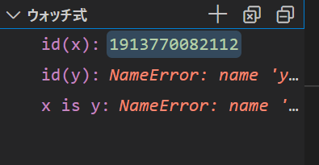

# 第4回 変数とメモリ

- [第4回 変数とメモリ](#第4回-変数とメモリ)
  - [代入(付値)とは何か](#代入付値とは何か)
  - [ハコ型代入](#ハコ型代入)
  - [ラベル型代入](#ラベル型代入)
  - [参照カウンタ](#参照カウンタ)
  - [Copy on modifyメカニズム](#copy-on-modifyメカニズム)
    - [練習1](#練習1)
  - [Pythonの挙動](#pythonの挙動)
  - [デバッグモードの活用](#デバッグモードの活用)
  - [ステップイン](#ステップイン)
  - [変更と代入の違い](#変更と代入の違い)
    - [練習2](#練習2)
    - [練習3](#練習3)
  - [ミュータブルとイミュータブル](#ミュータブルとイミュータブル)
  - [イミュータブルオブジェクトの再利用](#イミュータブルオブジェクトの再利用)
  - [動的型付け](#動的型付け)
  - [変数にまつわる用語](#変数にまつわる用語)
  - [まとめ](#まとめ)
  - [参考書](#参考書)

## 代入(付値)とは何か

本講義の受講者にとって、Rの次のような操作は至極ありふれたものだと思います。

```R
# コード1
x <- c(1,2,3)
y <- x
x[2] <- 5
print(x)
print(y)
```

上記のコマンドを実行したときに、どのような結果が出力されるかを答えられない人はいないでしょう。実際にRの対話的インタープリタを起動するか、VS Code上で実行してみれば良いでしょう。

```R
> print(x)
[1] 1 5 3
> print(y)
[1] 1 2 3
> 
```

しかし、コード1で実際に何が起きているのかを正しく説明できる人はあまり多くないと思います。多くの人が次のように考えているのではないでしょうか？

1. 変数xにベクトル(1,2,3)が代入される
2. 変数yに変数xの値、つまり(1,2,3)がコピーされる
3. 変数xの第2要素が5に書き換えられる
4. 変数xの値が出力される
5. 変数yの値が出力される

しかし、実際に起きていることは、上記と少し違います。今回の目標はこれを理解することとします。今回の講義で、変数に値を代入するときRやPythonでは何が起きているのかが、ある程度分かるようになります。第1回で学んだメモリやアドレスの概念が必須になります。

## ハコ型代入

上記の説明がどのように間違っているかを説明する前に、初学者向けの書籍に良く見られる「箱の比喩」を用いた代入の説明について解説しておきます。

箱を用いた説明とは、次のようなものです。

>下図のように、変数`x`に`1`を代入するということは、`x`という箱に`1`という値を入れることであり、`y`に`x`を代入するということは、`x`に入っている値`1`をコピーして`y`という箱に入れることである。


このような説明は、C言語のようなプログラミング言語では正しい比喩ですが、RやPythonでは正しくありません。特にPythonでは正しい理解を妨げる説明です。

C言語では、次のようにして、予めxやyが整数であることを変数の作成時に宣言します

```C
int x,y; // x,yが整数であることを宣言
```

ソースファイルにこの宣言を見つけたCのコンパイラは、マシン語に変換する際に、xやyといった変数名をメモリのアドレス(実際にはメモリ領域)あるいはレジスタ名といったもので置き換えてしまいます。

したがって、

```C
y = x;  // xの値をyに代入
```

という代入操作は、あるアドレスのメモリ領域に格納されている値を別のメモリ領域にコピーすることを意味します。したがって、メモリ領域を箱と考えれば、箱の比喩は正しく実際に起こっていることを表しています。

## ラベル型代入

プログラミングの世界では、124や"c"のような具体的な数値や文字だけではなく、それを操作するための付属的な情報を合わせもつものを**オブジェクト**と呼びます。

オブジェクトは、表面的には数値や文字ですが、実際には数値や文字を格納する領域以外にもメモリ領域を占有しています。C言語の整数や文字列は、値を格納する分だけのメモリ領域しか占有しないので、オブジェクトではありません。一方、PythonやRの数値や文字列はすべてオブジェクトです。

RやPythonでの代入の説明でより現実に近いのは以下のような比喩です。

>下図のように、変数`x`に1を代入するということは、1という[**オブジェクト**](https://ja.wikipedia.org/wiki/%E3%82%AA%E3%83%96%E3%82%B8%E3%82%A7%E3%82%AF%E3%83%88_(%E3%83%97%E3%83%AD%E3%82%B0%E3%83%A9%E3%83%9F%E3%83%B3%E3%82%B0))に`x`というラベルを貼り付けることであり、変数`y`に`x`を代入するという操作は、ラベル`x`がついているオブジェクトにもう一つ`y`という別のラベルを貼り付けることである。


この正しい見方では、1という一つのオブジェクトに`x`、`y`という二つのラベルが貼り付けられています。このようなラベルのことを**参照**(reference)と呼ぶことがあります。また、変数`x`や`y`はオブジェクト`1`を**参照している**ということもあります。

それでは、Rでの代入操作(y <- x)がこのような「ラベル張り」であるということを確かめてみましょう。そのために、[Hadley Wickham](http://hadley.nz/)が作った[pryr](https://cran.r-project.org/web/packages/pryr/index.html)パッケージをインストールしましょう。

```R
install.packages('pryr')
```

pryrを読み込むと関数addressを使うことができるようになります。addressは、引数として与えた変数(参照)が指し示しているオブジェクトのアドレスを返す関数です。実際に使ってみましょう。

```R
library(pryr)
x <- c(1,2,3)
address(x)
y <- x
address(y)
```

上のように対話的インタープリタで入力すると、次のような出力が得られます。

```R
> address(x)
[1] "0x183f3110"
> y <- x
> address(y)
[1] "0x183f3110"
> 
```

出力が二つ得られていますが、一つ目の値**0x183f3110**は、`x`というラベルが貼り付けられているベクトル`(1,2,3)`というオブジェクトが格納されているメモリのアドレスを16進数で表したものです（具体的なアドレスの値は、実行時ごとに異なります）。また、二つ目の出力は、`y`というラベルが貼り付けられているオブジェクトのメモリ上のアドレスですが、これも**0x183f3110**となっており、`x`と同じオブジェクトにyが貼り付けられているということが分かります。

このように、C言語とは違って`x`、`y`という別個のメモリアドレスが存在するわけではないことが分かります。

## 参照カウンタ

ところが、Rは**Copy on modify**という機構を備えていて、ラベル張りであることを余り意識させない作りになっています。Copy on modify機構について説明するために、まずは**参照カウンタ**(リファレンスカウンタ）について説明しましょう。以下、Rのヴァージョン3系列(3.5,3.6等)を仮定して話を進めますが、出力はヴァージョン4でも同じになるはずです。(ヴァージョン3と4の違いは課題で取り扱います。)

ベクトルのようなRのオブジェクトは、自分に何枚のラベルがついているかに関する情報を内部に格納しています。換言すると、Rオブジェクトは、自分がいくつの変数(xやy)に**参照されているか**を知っています。オブジェクトを参照している変数の数の事を**参照カウント**と呼びます。Rオブジェクトは、内部に自分自身の参照カウントを記憶する**参照カウンタ**を持っています。

参照カウンタの値は、関数`pryr::refs`によって調べることができます。

```R
> rm(list=ls()) #一応全変数を削除
> x <- c(1,2,3)
> refs(x)
[1] 1
> y <- x
> refs(x)
[1] 2
> refs(y)
[1] 2
> 
```

## Copy on modifyメカニズム

さて、次のようにxに代入したベクトル(1,2,3)の内容を書き換えようとするとき、参照カウントが1の場合と2以上の場合では、Rは異なる挙動を示します。

まずxの参照カウントが1の場合です。

```R
rm(list=ls()) #全変数を削除
x <- c(1,2,3)
address(x)
x[2] <- 5
address(x)
```

上記を実行すると、次のような出力が得られます。

```R
> x <- c(1,2,3)
> address(x)
[1] "0x17f14dd8"
> x[2] <- 5
> address(x)
[1] "0x17f14dd8" #xのアドレスは変わらない
> 
```

上記のように、`x`の内容を書き換える前後で、`x`は同じオブジェクトを参照しています。

ところが、`x`の参照カウントが2以上のとき、つまり`x`と同じオブジェクトを参照する変数`y`が存在するとき、異なる挙動が起きます。次を実行してみましょう。

```R
rm(list=ls()) #全変数を削除
x <- c(1,2,3)
y <- x
address(x)
address(y)
x[2] <- 5
address(x)
address(y)
```

上記を実行すると、次のような出力が得られます。

```R
> rm(list=ls()) #全変数を削除
> x <- c(1,2,3)
> y <- x
> address(x)
[1] "0x17ecbc78"
> address(y)
[1] "0x17ecbc78"
> x[2] <- 5
> address(x)
[1] "0x17ecb598"  #xのアドレスが変わった
> address(y)
[1] "0x17ecbc78"
> 
```

上記のように、参照カウントが2以上になると、オブジェクトの内容を変更する際に、あらたなメモリ領域が確保され、オブジェクトがコピーされてから変更が行われることが分かります。このメカニズムを**Copy on modify**と呼びます。

Copy on modify機構のおかげで、Rのプログラマは、オブジェクトがいくつの変数に参照されているかをあまり意識する必要がありません。xの内容を修正したときに、うっかりyの内容まで修正してしまう危険がないわけです。


### 練習1

1. 次のRコードは、二つの参照を持つリストオブジェクトの内容を変更するものである。`pryr::address`関数を用いて、上記のコードでCopy on modify機構が働いているかどうか確かめなさい。

    ```R
    rm(list=ls()) # 全変数を削除
    x <- list(a='A',b='B')
    y <- x
    x[['a']] <- 'AA'
    ```

2. 次はさらに複雑な例である。`x`はリストを要素にもつリストである。この入れ子になった内側のリストに変更を加えたとき、Copy on modifyは働くか？確かめなさい。

    ```R
    rm(list=ls())
    x <- list(a=list(b='B',d='D'))
    y <- x
    x[['a']][['b']] <- 'BB'
    ```

## Pythonの挙動

ところが、PythonにはCopy on modify機構がありません。どういうことかというと、オブジェクトがいくつの変数に参照されているかにかからわず、オブジェクトの内容変更に伴うコピーは自動的には起きません。

これを実際に確かめてみましょう。
Pythonにはベクトル型は存在しないので、代わりにリストを使いましょう。たとえば1,2,3という三つの整数を要素にもつリストは次のように作成します。(リストについては、次回詳しく取り上げます。)

```python
>>> x = [1,2,3]
>>> x
[1, 2, 3]
```

Rのベクトルでは最初の要素にアクセスするには`x[1]`と書きますが、pythonのリストでは`x[0]`と書きます。つまり、インデックスは0からはじまります。それを除けばインデクシングのルールはRのベクトルと非常によく似ています。

```python
>>> x
[1, 2, 3]
>>> x[0]
1
>>> x[1]
2
>>> x[2]
3
```

さてそれでは準備が出来たので実験を開始しましょう。
PythonにおけるRの`pryr::address`に対応する関数はビルトイン関数の`id`です。`id`は、変数が参照するオブジェクトのアドレスを10進数で返します。まずはpythonの変数が参照であることを確認しましょう。

```python
>>> x = [1,2,3]
>>> y = x
>>> id(x)
2080340453760
>>> id(y)
2080340453760
>>> id(x) == id(y)
True
```

最後の`id(x) == id(y)`という式は、Rと同じで、左辺と右辺が正しければ`True`、違っていれば`False`を返す二項演算です。上記より、確かにpythonの代入がラベル型であることが分かります。なお、`id(x) == id(y)`は、次のように書くこともできます。

```python
>>> x = [1,2,3]
>>> y = x
>>> x is y
True
```

"`x is y`"は、xとyが同じオブジェクトを指しているときに`True`、そうでないときに`False`となります。

それでは次に、Copy on modifyが働かないことを確かめましょう。

```python
>>> x = [1,2,3]
>>> y = x
>>> x is y
True
>>> x[1] = 5
>>> x
[1, 5, 3]
>>> y   # yまで変化した
[1, 5, 3]
>>> x is y # Copy on modifyは起きていない
True
```

上記のように、複数の参照をもつオブジェクトの内容を変更すると、それを参照する全ての変数の内容が変わってしまいます。下図のように、Rとは違ってPythonはCopy on modifyを行わないからです。


## デバッグモードの活用

オブジェクトのメモリアドレスやオブジェクトの同一性がプログラムの中でどのように変化していくかを観察するには、VS Codeのデバッグモードを用いると分かりやすいです(**condaコマンドのパスを通している必要があります**)。

GitHubディレクトリの下に、`vars`というディレクトリを作成し、VS Codeで開きましょう。`debug.py`というファイルを作成し、次のように記述してください。

```python
x = [1,2,3]
y = x
x[1] = 5
pass
```

`pass`は、『何もしない』を意味します。

次に、VS Codeの画面左側の虫のマークをクリックしてください。


『実行とデバッグ』というボタンが現れますが、そのすぐ下の、『launch.jsonファイルを作成します』をクリックしてください。


`Debug Configuration`というパレットが立ち上がりますので、一番上の、`Python File Debug the currently active Python file`を選択してください。これで、今選択しているPythonコードをデバッグすることができるようになります。`launch.json`という設定ファイルが作成されますが、閉じてください。

開いている`debug.py`ファイルの1行目の左がわをクリックして、赤い印をつけましょう。これを**ブレークポイント**と呼びます。デバッグをするときは、このブレークポイントを一つ以上設定します。


次に、『ウォッチ式』を定義します。画面左側中程にある『ウォッチ式』ペインの『＋』マークをクリックして、ウォッチ式を入力しましょう。ここでは次の3つのウォッチ式を入力してください。

- id(x)
- id(y)
- x is y


ウォッチ式とは、デバッグ中にリアルタイムで『ウォッチ』したい式のことです。

以上でデバッグの準備が整いました。

## ステップイン

デバッグを起動するには、左上の緑色の三角マークをクリックします。


デバッグが起動すると、プログラムが実行され、ブレークポイントの行を実行する直前でストップします。また、画面上に6個のボタンが現れることに注意してください。


これらのボタンは、左から順番に

- 次のブレークポイントまで実行
- ステップオーバー
- ステップイン
- ステップアウト
- 再起動
- 停止

を表します。ステップオーバーとステップアウトは関数に関係があるので、今は説明を保留します。

ここから、**ステップイン**という操作によって、1行ずつコードを評価しながら、ウォッチ式の値がどのように変化していくか観察していきます。

ステップインを表す下向きのやじるしをクリックしてください。すると、ブレークポイントの行が実行され、次の行へとフォーカスが移ります。

左上の『変数』ペインの`Locals`欄と`Globals`欄の両方に`x: [1,2,3]`というのが現れるはずです。


これは、変数`x`に`[1,2,3]`という値(オブジェクト)が付値されたということを表します。

同時に、ウォッチ式のペインでは、`id(x)`の値に数字が現れるはずです。この値は、`id(x)`の値、すなわちオブジェクト`[1,2,3]`が位置するメモリのアドレスを表しています。



`y`のほうはまだ代入が起きていないため、ウォッチ式`id(y)`の値は`NameError`となっています。

次に、もう一度ステップインしてください。次は、ウォッチ式`id(y)`の値が表示され、ウォッチ式`x is y`が`True`になるはずです。`id(x)`と`id(y)`の値が同じであることに注意してください。これは、`x`と`y`が同じオブジェクトを参照していることを表します。このことは、`x is y`が`True`になっていることからも分かります。

もう一度ステップインすると、変数ペインの`x`と`y`の第2要素が同時に変化することに注意してください。これは、`x is y`が`True`だったので、予測できたことですね。

最後にもう一度ステップインして`pass`の行を実行し、デバッグを終了しておきましょう。

## 変更と代入の違い

Pythonの初学者にとってちょっと分かりにくいのが、**変数xが参照するオブジェクト自体の内容を修正する**ということと、**変数xに別のオブジェクトを代入する・参照させる**(参照を付け直す)という二つの操作の違いです。**変更**では、変数が参照するオブジェクトのアドレスは変化しませんが、**代入では変化します**。

|操作|参照先のアドレス|
|--|--|
|xが参照するオブジェクト自体の内容を変更|変化しない|
|xに別のオブジェクトを代入|変化する|

たとえば、次の例では、xとyが同じオブジェクトを参照している状態でxに別のオブジェクトを代入しましたが、yは変化していません。代入操作では、単にxが別のオブジェクトを参照するようになるだけで、もとのオブジェクトには何の影響も与えないからです。

```python
>>> x = [1,2,3]
>>> y = x # xとyは同じオブジェクトを参照
>>> x = [4,5,6] # xに異なるオブジェクトを代入
>>> x
[4, 5, 6]
>>> y   # yは変化していない
[1, 2, 3]
>>> x is y  # xとyは違うオブジェクトを指している
False
```


しかしながら、ほんの少しだけコードを変えて次のようにすると、xへの操作は**代入**ではなく**変更**になります。yの内容まで変わってしまいますので注意してください。

```python
>>> x = [1,2,3]
>>> y = x
>>> x[:] = [4,5,6]  # スライス記法でxの内容を変更
>>> x
[4, 5, 6]
>>> y   # yも変わってしまった
[4, 5, 6]
>>> x is y  # xとyは同じオブジェクトを参照
True
```


変更したのは1行だけです。ここで用いた`x[:]`は**スライス記法**というもので、コロン`:`は「**最初から最後まで、リストの全ての要素**」を意味します。スライス記法については、教科書のセクション6.1.2に詳しく説明されているので読んでおきましょう。

スライス記法がどのように機能しているのかを解説するついでに、Pythonに特有の**アンパック代入**も導入しておきましょう。Pythonでは、次のようにして、複数の変数に一挙に値を代入できます。

```python
>>> x,y,z = [1,2,3]
>>> x
1
>>> y
2
>>> z
3
```

これを**アンパック代入**と呼びます。アンパック代入については、教科書のセクション3.2.4に詳しいので読んでおいてください。

上述のスライス記法の構文は、次のようにアンパック代入するのと実質的に同じことをやっていることになります。(実際には少し違います。)

```python
>>> x = [1,2,3]
>>> y = x
>>> x[0],x[1],x[2] = [4,5,6]
>>> x
[4, 5, 6]
>>> y
[4, 5, 6]
>>> x is y
True
```

これを見れば、スライス記法による代入が、実際にはxが指すリストオブジェクトの内容を変更してしまっているのが分かるでしょう。

実際にはスライス記法による代入は、アンパック代入とは少し違って、左辺の要素数と右辺の要素数が違っても構いません。従って、いままで`[1,2,3]`があった**ところ**に`[1,2,3,4]`を代入することができます。

```python
>>> x = [1,2,3]
>>> y = x
>>> x[:] = [4,5,6,7]
>>> x
[4, 5, 6, 7]
>>> y
[4, 5, 6, 7]
>>> x is y
True
```

この操作では、一見、数字3個分のメモリ領域に4個めの数字を詰め込んでいるように見えます。ここでは種明かししませんが、このような一見無理のある代入をしたときにメモリ上で何が起きているのか、想像してみてください。そのような想像が、プログラミングのための思考能力を鍛えることになります。

### 練習2

ここでは、スライス記法の働きを、VS Codeのデバッグモードで確かめてみましょう。ウォッチ式を`id(x)`、`id(y)`、`x is y`の3つに設定し、次の２つのコードをステップイン実行し、ウォッチ式の変化がどのように異なるか観察してください。

```python
x = [1,2,3]
y = x
x[:] = [4,5,6]  # スライス記法でxの内容を変更
pass
```

```python
x = [1,2,3]
y = x
x = [4,5,6]  # スライス記法でxの内容を変更
pass
```

### 練習3

次のコードにおいて、`x[1]`の変更が`y`の値に影響を与えるかどうか予想してから、実行して確かめてください。

```python
>>> x = [0,1,2]
>>> y = x[1]
>>> x[1] = 5
>>> print(y)   # いくつになるか?
```

```python
>>> x = [0,1,2]
>>> y = x[:]
>>> x[1] = 5
>>> print(y)   # 変わっているか?
```

## ミュータブルとイミュータブル

Pythonでは、代入と変更の違いに関連して、初学者を混乱させる**ミュータブル**なオブジェクトと**イミュータブル**なオブジェクトという概念があります。ミュータブルなオブジェクトは内容の書き換えが可能なオブジェクトであり、イミュータブルなオブジェクトとは、書き換え不可能なオブジェクトです。

| 分類            | データ型           |
| -------------- | ------------------ |
| ミュータブル   | リスト(`list`)、辞書(`dict`)、集合(`set`) |
| イミュータブル | 整数(`int`)、浮動小数点数(`float`)、文字列(`str`)、ブール値(`bool`)、タプル(`tuple`)|

ミュータブルとイミュータブルが紛らわしい概念であるのは、それが**変数**と**定数**の概念に、一見似ているからです。

**定数**という概念はC言語などに現れる概念で、**値の変更を禁止された変数**のことです。しかしながら、PythonにはC言語のような定数は存在しません(`True`や`False`、`None`といった特殊な**ビルトイン(組込み)定数**が存在するのみです)。

Pythonの変数は、いつでも好きなオブジェクトに貼り付けられる**ラベル**です(箱ではありません)。箱ではなくラベルですから、イミュータブルなオブジェクトからイミュータブルなオブジェクトに付け替えられますし、イミュータブルなオブジェクトからミュータブルなオブジェクトに付け替えることも可能です。

実際、文字列はイミュータブルですが、次のコードは全く正常であり、何のエラーも起きません。

```python
# %%
x = "First"
x = "Second"
x = "Third"
```

一方、イミュータブルやミュータブルは、ラベルが参照しているオブジェクトの性質であり、定数や変数とは異なる概念です。文字列はイミュータブルなので、その内容を変更することはできません。

```python
# %%
x = "Immutable"
x[0] = "i" #エラーが起きる
```

上記2行目は、"Immutable"という文字列オブジェクトの最初の要素"I"を"i"に入れ替えよ、という許されない命令です。したがってエラーが出ます。

```python
Traceback (most recent call last):
  File "test.py", line 2, in <module>
    x[0] = "i"
TypeError: 'str' object does not support item assignment
```

よくある初学者のミスは、次のように、文字列の一部をスライスで変更しようというものです。

```python
>>> x = "This is Python."
>>> x[0:4] = "It"
Traceback (most recent call last):
  File "<stdin>", line 1, in <module>
TypeError: 'str' object does not support item assignment
```

しかし同じことをリストで行うのは、全く正しい操作です。

```python
>>> x = [1,2,3,4,5,6]
>>> x[0:4] = [1,2]
>>> x
[1, 2, 5, 6]
>>>
```

このように、イミュータブルやミュータブルは、オブジェクトの性質であって、変数そのものの性質ではないことに注意しておきましょう。

## イミュータブルオブジェクトの再利用

最後に、イミュータブルオブジェクトとメモリ利用に関連して、一つ注意事項を述べます。これは、Pythonプログラミング上はほとんど問題になりませんが、Pythonのメモリ利用を研究をする上で留意しておくべきことです。

同じオブジェクトを二つ以上の変数が参照しているときに問題が生じるのは、オブジェクトに変更が加えられたときだけであることに注意してください。従って、オブジェクトがイミュータブルである場合は、いくつの変数がそのオブジェクトを参照しているかということは、Pythonのプログラマにとって全く問題になりません。

この事実を利用して、Pythonは、シンプルなイミュータブルオブジェクトに関しては、自動的に再利用するようになっています。

```python
>>> x = 1
>>> y = 1
>>> x is y
True
>>> x = 'a'
>>> y = 'a'
>>> x is y
True
```

上記では、`x`と`y`に独立に`1`を代入したはずが、`x`と`y`は同じオブジェクトを参照していることが分かります。整数オブジェクトはイミュータブルなので、これは全く問題になりません。xが指し示す整数オブジェクト1の内容をうっかり変更してしまって、予期せずyの変更を招く危険がないからです。文字列オブジェクト`'a'`についても同様です。また、`True`や`False`の**ブール型オブジェクト**、「からっぽ」を意味する**Noneオブジェクト**等も必ず再利用されます。

一方で、どれだけシンプルであろうとも、ミュータブルなオブジェクトは再利用されず、代入のたびに新たなメモリ領域が確保されます。

```python
>>> x = [0]
>>> y = [0]
>>> x is y
False
```

また、イミュータブルであっても、そもそも利用される確率の小さいオブジェクトは、再利用されません。

```python
>>> x = 100000
>>> y = 100000
>>> x is y
False
```

これは、利用頻度の小さいオブジェクトをメモリ上に確保したままにすると、メモリの利用効率が悪くなるからです。

こういった事柄は一見些細な事柄ですが、Pythonのメモリ利用を研究する上でつまづくポイントになるので、知っておいて損はないでしょう。

## 動的型付け

今回の講義を通して、『変数』という言葉を特に断りもなく使って来ました。そして、変数へ何らかの値を代入するということは、ラベルをオブジェクトに貼り付けることなのだと説明しました。ラベルが変数名であり、オブジェクトが値です。

Pythonのような言語では、変数名はラベルでしかなく、一つの変数名を、基本的にいつでもどのようなオブジェクトにでもラベルとして貼り付け、貼り付けかえることが可能です。`x`は整数にしか貼り付けてはいけないとか、`y`は関数にしか貼り付けてはいけないとか、そういう制約はありません。

したがって、次のようなコードが完全に機能します。

```python
# %%
import sys as x     # xにモジュールを代入
print(x)
x = 1   # xに整数を代入
print(x)
x = "string"    # xに文字列を代入
print(x)
x = [1,2,3]     # xにリストを代入
print(x)
def x():        # xに関数を代入
    print('I am x.')
print(x)
x()     # xを関数として呼び出した
```

コードの詳細はまだわからないと思いますが、このコードでは、同じ"x"という変数に、モジュール、整数、文字列、リスト、関数を次々と代入しています。このコードの出力は、次のようになります。

```python
# 出力
<module 'sys' (built-in)>
1
string
[1, 2, 3]
<function x at 0x7fb1ac7938b0>
I am x.
```

上記の出力は、最後の行を除きすべて`print(x)`の出力です。これを見ると分かるように、`x`は、モジュール、整数、文字列、リスト、そして関数へと変化しています。

このようにPythonでは、最初に『`x`は整数だよ』とか、『`x`はモジュールだよ』と言った宣言をしません。`x`(が指すオブジェクト)のデータ型は、**動的に変化**し得るのです。このような言語の性質を**動的型付け**と呼びます。それに対して、C言語やJavaがそうであるように、『`x`は整数だよ』『`x`は配列だよ』といった宣言をし、そのあとはずっと同じ型のデータしか格納できない、といった性質を**静的型付け**と言います。

**動的型付け**の利点は非常に**柔軟**なプログラミングができるということです。なぜならば、プログラムにおいて、`x`のデータ型に依存した処理を、ギリギリまで遅らせることができるからです。それどころか、場合によっては、最後まで型を気にする必要すらないからです。たとえば、`print(x)`と書くとき、`x`がどんな型をもっているのかなど、(ほとんど)気にする必要はありません。

一方、静的型付け言語だと、`x`が整数なのか、文字列なのか、最初に決めてしまわならないし、最後まで気にしなくてなりません。従って、往々にして、型ごとに別々のコードを書かなくてはならないことになります。

一方、**動的型付け**言語の欠点は、コードが実行されるまで`x`のデータ型がわからないため、`x`が現れるたびにインタープリタが逐一`x`の型を判断して、型に応じた適切な処理を実行しなくてはならないことです。そのコストは、実行速度の低下となって現れます。それに対して**静的型付け**言語は、最初から最後まで`x`のデータ型が固定されているので、逐一データ型をチェックする必要はありません。静的型付け言語では、`x+y`という表現が出たとき、`x`は整数か、浮動小数点数か、文字列か、と問う必要はないのです。

## 変数にまつわる用語

すでにお気づきのように、Pythonのような動的型付け言語においては、**変数**という言葉を**関数**や**モジュール**と言った言葉からわざわざ切り離して定義する意味はほとんどありません。そこで、本講義では、**変数**という言葉は、ラベルを意味するにすぎず、ときには数値であったり、関数であったり、モジュールであったりしても良いとします。要するに何らかのオブジェクトを参照している記号であれば、それは変数です。

また、**名前**、**識別子**、**記号**と言った言葉も使うことがありますが、これらは断りが無い限り全て**変数**と同じ意味で用いることにします。特に、**変数**が数値や文字列だけでなく、関数やモジュールを指すことを明確にしたいときに、これらの言葉を使うことがあります。

## まとめ

今回の授業では、以下の点について学びました。

- ハコ型の代入とラベル型の代入の違い
- Copy on modifyにまつわるRとPythonの違い
- スライス記法の挙動
- イミュータブル・ミュータブルの意味

次回はリストについてさらに掘り下げて学んで行きます。リストについて掘り下げて学ぶことで、メモリやアドレスという概念がPythonの理解において重要であることが分かるでしょう。

## 参考書

- [『R言語徹底解説』](https://www.amazon.co.jp/R%E8%A8%80%E8%AA%9E%E5%BE%B9%E5%BA%95%E8%A7%A3%E8%AA%AC-Hadley-Wickham/dp/432012393X)(Hadley Wickham著、石田基広、市川太祐、高柳慎一その他訳)(2016) 共立出版. ISBN-13 : 978-4320123939.
