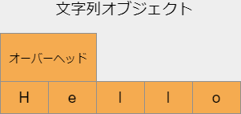

# 第6回 標準ライブラリ(1)ータプル、文字列、ファイル入出力

- [第6回 標準ライブラリ(1)ータプル、文字列、ファイル入出力](#第6回-標準ライブラリ1ータプル文字列ファイル入出力)
  - [標準ライブラリとは](#標準ライブラリとは)
  - [イテラブル](#イテラブル)
  - [タプル(tuple)](#タプルtuple)
  - [文字列(str)](#文字列str)
    - [練習1](#練習1)
  - [エンコーディング](#エンコーディング)
  - [デコーディング](#デコーディング)
    - [練習2](#練習2)
  - [文字列オブジェクトのメモリ占有](#文字列オブジェクトのメモリ占有)
  - [ファイル入出力](#ファイル入出力)
    - [readメソッドによる読み込み](#readメソッドによる読み込み)
    - [writeメソッドによる書き込み](#writeメソッドによる書き込み)
    - [行ごとの読み書き](#行ごとの読み書き)
    - [バイナリ編集](#バイナリ編集)
  - [文字列のメソッド](#文字列のメソッド)
    - [replace(部分文字列の置換)](#replace部分文字列の置換)
    - [translate(文字の置換)](#translate文字の置換)
    - [split(文字列の分割)](#split文字列の分割)
    - [join(文字列の結合)](#join文字列の結合)
    - [練習3](#練習3)
  - [まとめ](#まとめ)
  - [参考書](#参考書)

## 標準ライブラリとは

標準ライブラリとは、Pythonをインストールしたときに最初から使うことのできる一連のデータ型、関数、オブジェクトなどを差し、インタープリタに組み込まれているものとモジュールで提供されるものがあります。(ただし、モジュールの中にはビルトインモジュールというインタープリタと切り離せないモジュールもあります。`math`や`sys`がそういった例です。**ビルトイン**は**組込み**を意味します。)

今回の講義では、ビルトインデータ型の中でも特に重要な**イテラブル**なデータ型について学んで行きます。その過程で、**文字エンコーディング**、**ハッシュテーブル**、**ファイル入出力**といったプログラミングにおける重要な事項について学んで行きましょう。

## イテラブル

イテラブルなデータ型とは、Python特有の概念で、大雑把にいうと、forループの繰り返し処理においてループインデックスの範囲指定に用いることができるデータ型のことです。つまり

```python
# %%
for i in index_range:
    print(i)

```

のようなコードでindex_rangeのところに配置できるものです。(イテラブルのより正確な定義は[リファレンスマニュアル](https://docs.python.org/ja/3/glossary.html#term-iterable)を参照。)

組込みデータ型でイテラブルなものには主に次のようなものがあります。

1. コンテナ
   1. シーケンス
      1. リスト(**list**)
      2. タプル(**tuple**)
      3. レンジ(**range**)
   2. 集合(**set**)
   3. 辞書(**dict**)
2. 文字列(**str**)
3. バイト(**bytes**)

これらのデータ型には、ミュータブルなもの・イミュータブルなもの、インデックスやキーによって要素を取得できるもの・できないものといった違いがあります。

|型|mutable|index|key|slice|hashable|和・積|制約|
|--|--|--|--|--|--|--|--|
|list|yes|yes|no|yes|no|yes|no|
|tuple|no|yes|no|yes|yes/no|yes|no|
|range|no|yes|no|yes|yes|no|N/A|
|str|no|yes|no|yes|yes|yes|N/A|
|set|yes|no|no|no|no|no|yes|
|dict|yes|no|yes|no|no|no|yes|

なお、上記の表の各列は次のような意味です。

|列名|意味|
|--|--|
|mutable|ミュータブルかどうか|
|index|インデックス参照可能かどうか|
|key|キーで値を取得可能かどうか|
|slice|スライス記法を許すかどうか|
|hashable|ハッシュ可能かどうか|
|和・積|`+`、`*`演算子を受け付けるか|
|制約|要素の型に制約があるか|

keyとhashableについては辞書を説明するときに解説します。

リストやレンジについては前回解説しましたので、今回はそれ以外の型(タプル、文字列、辞書、集合)について説明します。バイト型も重要ですが、時間の都合で詳細な解説を割愛します。

## タプル(tuple)

タプルは以下のような性質をもちます。

- イテラブル
- イミュータブル
- インデックス参照可能
- スライス参照可能
- 任意のオブジェクトを要素に持てる
- 算術演算(和・積)可能

タプルは、リストと同じくシーケンス型に分類されますが、イミュータブルなデータ型です。タプルは、リストをイミュータブルにしたものと考えてほとんど間違いありません。リストと同じく、要素オブジェクトへの参照を格納しています。

リストと同じくインデックス番号やスライスで要素にアクセスでき、どのようなPythonオブジェクトでも要素に持てます。

forループにおける使用方法はリストと同じです。

```python
# 1,2,3と印字
for i in (1,2,3):
    print(i)
```

イミュータブルなので、要素への代入操作は禁止されています。

```python
>>> x = ('foo','bar','baz')
>>> x[0] = 'Python'
Traceback (most recent call last):
  File "<stdin>", line 1, in <module>
TypeError: 'tuple' object does not support item assignment
```

タプルの使用において注意しなくてはならないのは、タプルのようなイミュータブルなコンテナ型というのは、要素への参照の変更が禁止されているだけで、参照先の要素オブジェクトの変更は禁止されていないということです。したがって、タプルはイミュータブルですが、次のように要素オブジェクトに変更を加えることは可能です。

```python
>>> x = ('foo','bar',['baz'])
>>> x[2].append('BAZ')
>>> x
('foo', 'bar', ['baz', 'BAZ'])
```

リストと同じくタプルはインデクシングやスライス記法を受け付けます。

```python
>>> x = (1,2,3,4,5)
>>> x[1:4]
(2, 3, 4)
>>> x[3]
4
>>> x[:]
(1, 2, 3, 4, 5)
```

なお、一つしか要素のないタプルを作るためには、次のように、余分なカンマが一つ必要です。

```python
>>> x = (1,)    # 一つしか要素のないタプル
>>> x
(1,)
>>> type(x)
<class 'tuple'>
>>> x = (1)     # これだとただの整数
>>> x
1
>>> type(x)
<class 'int'>
```

なおここで用いたtype関数は引数にあたえたオブジェクトの型を調べるビルトイン関数です。

タプルはリストと同じように`+`演算子、`*`演算子を受け付けます。

```python
>>> x = (1,2) + (3,4)
>>> x
(1, 2, 3, 4)
```

```python
>>> x = (1,2) * 3
>>> x
(1, 2, 1, 2, 1, 2)
```

ただし、リストと同じで掛け算はシャローコピーですので、やはり次のような挙動には注意しましょう。

```python
>>> x = ((1,[]),) * 3
>>> x
((1, []), (1, []), (1, []))
>>> x[0][1].append(2)
>>> x
((1, [2]), (1, [2]), (1, [2]))
```

リストと比べたときのタプルの利点としては、それが辞書のキーとして用いることができるということです。これについては辞書の欄で詳しく述べます。

## 文字列(str)

Pythonの文字列型はRと同じくダブルもしくはシングルクォーテーションによって作成でき、以下のような性質を持ちます。

- イテラブル
- イミュータブル
- インデックス参照可能
- スライス参照可能
- 算術演算可能

forループで用いると、一文字ずつループインデックスに渡されます。

```python
# "HELLO WORLD!"を一文字ずつ印字
for c in "HELLO WORLD!":
    print(c,end='--')
print()
```

```python
# 結果
H--E--L--L--O-- --W--O--R--L--D--!--
```

文字列は、インデックスで各文字に、スライスで部分文字列にアクセスできます。イミュータブルなので、変更は一切不可能です。

文字列は+演算子や*演算子を受け付けます。

```python
>>> x = "Hello, " + "World!"
>>> x
'Hello, World!'
>>> print(x)
Hello, World!
>>>
```

```python
>>> x = "knock, " * 10
>>> print(x)
knock, knock, knock, knock, knock, knock, knock, knock, knock, knock,
```

### 練習1

文字列を1文字ずつ処理する練習です。文字列"Hello, World!"を一文字ずつ画面に印字し、'l'の後でのみ改行して出力するPythonコードを作成しなさい。出力は以下のようになります。

```bash
# 出力
Hel
l
o, Worl
d!
```

## エンコーディング

文字列は、イテラブルですが、コンテナ型ではありません。レンジ以外のビルトインのコンテナ型は、要素オブジェクトへの参照を格納していますが、文字列オブジェクトは、文字への参照ではなく文字そのものを格納した配列を内部にもっています。



文字をメモリ上に格納する為には、文字をバイト列に変換しなくてはなりません。これを**エンコーディング**と言います。文字をエンコードするには様々な方式があり、そのうち有名なものはutf-8やshift-jisなどがあります。

|文字|shift_jis|euc_jp|utf_8|
|--|--|--|--|
|あ|0x82a0|0xa4a2|0xe38182|
|山|0x8e52|0xbbb3|0xe5b1b1|

文字列が特定のエンコーディングによってどのようなバイト列になるのかは、文字列メソッドのencodeによって確かめることができます。encodeメソッドはバイト型のオブジェクトを返します。

```python
>>> x = 'あ'.encode('shift-jis')
>>> x
b'\x82\xa0'
>>> x.hex()
'82a0'
```

バイト型については解説しませんが、上記のようにhexというメソッドによって、16進数の文字列に変換することができます。

次のコードは、ひらがなの50音をutf-8のコードで書きだすためのPythonコードです。

```python
# %%
a = 'あいうえお'
k = 'かきくけこ'
s = 'さしすせそ'
t = 'たちつてと'
n = 'なにぬねの'
h = 'はひふへほ'
m = 'まみむめも'
y = 'や　ゆ　よ'
r = 'らりるれろ'
w = 'わ　　　を'
nn = 'ん　　　　'
x = [a,k,s,t,n,h,m,y,r,w,nn]
for line in x:
    print(line,end=' --> ')
    for char in line:
        print(char.encode('utf-8').hex(),end=' ')
    print()
```

結果は次のようになります。

```python
# 出力
あいうえお --> e38182 e38184 e38186 e38188 e3818a 
かきくけこ --> e3818b e3818d e3818f e38191 e38193 
さしすせそ --> e38195 e38197 e38199 e3819b e3819d 
たちつてと --> e3819f e381a1 e381a4 e381a6 e381a8 
なにぬねの --> e381aa e381ab e381ac e381ad e381ae 
はひふへほ --> e381af e381b2 e381b5 e381b8 e381bb 
まみむめも --> e381be e381bf e38280 e38281 e38282 
や　ゆ　よ --> e38284 e38080 e38286 e38080 e38288 
らりるれろ --> e38289 e3828a e3828b e3828c e3828d 
わ　　　を --> e3828f e38080 e38080 e38080 e38292 
ん　　　　 --> e38293 e38080 e38080 e38080 e38080 
```

このようにutf-8は全てのひらがなに3バイトを使っています。なお、ここでは、

```python
char.encode('utf-8').hex()
```

のように、encodeメソッドとhexメソッドをつなげています。これは、一つ目のメソッドの戻り値のオブジェクトであるバイトオブジェクトがもつhexメソッドを呼び出していることに相当します。この記法を**メソッドチェーン**と呼び、1つめのメソッドの戻り値には関心がない場合に便利な記法です。

なお、同じエンコーディング方式、同じシンボルでも半角文字と全角文字では異なるバイト列にエンコードされます。プログラミングの初心者にありがちなミスは半角カッコの代わりに全角カッコをつかってしまうことですが、これらがutf-8でどのように異なるのか調べてみましょう。

```python
# %%
'('.encode('utf-8').hex()   # 半角カッコ
'（'.encode('utf-8').hex()  # 全角カッコ
```

```python
# 実行結果
28
efbc88
```

このように、半角カッコは0x28という1バイトであるのに対し、全角カッコは0xefbc88という3バイトの列です。インタープリタはこれらを違う文字として解釈するので、エラーを出します。

たとえば、わざと半角カッコの代わりに全角カッコを使ってタプルを作ってみましょう。

```python
# %%
# 1つめのカッコが全角になっている
x = （5,4,3)
```

```python
# 出力

x = （5,4,3)
  File "<ipython-input-32-7b09692778be>", line 1
    x = （5,4,3)
         ^
SyntaxError: invalid character in identifier
```

## デコーディング

エンコーディングの逆の変換、すなわちバイト列を文字列に変換する操作を**デコーディング**と言います。Pythonでは、バイトオブジェクトのdecodeメソッドを用いて行うことができます。

```python
>>> thanks_str = 'ありがとう'
>>> thanks_bytes = thanks_str.encode('utf-8')
>>> thanks_bytes
b'\xe3\x81\x82\xe3\x82\x8a\xe3\x81\x8c\xe3\x81\xa8\xe3\x81\x86'
>>> thanks_bytes.hex()
'e38182e3828ae3818ce381a8e38186'
>>> thanks_bytes.decode('utf-8')   # デコーディング
'ありがとう'
```

エンコーディングに用いた方式と異なる方式でテキストをデコードしたときに生じる現象を俗に**文字化け**と呼びます。文字化けはPython上で引き起こすことが可能です。

たとえば6文字の文字列'ありがとう！'(全て全角)はutf-8で18バイトになります。

```python
# %%
x = 'ありがとう！'.encode('utf-8')
print('バイト列 = ',x.hex())
print('バイト数 = ',len(x))
```

```python
# 出力
バイト列 =  e38182e3828ae3818ce381a8e38186efbc81
バイト数 =  18
```

これを1文字2バイトのutf-16の9文字としてデコードしてみましょう(utf-16は[BMP](https://ja.wikipedia.org/wiki/%E5%9F%BA%E6%9C%AC%E5%A4%9A%E8%A8%80%E8%AA%9E%E9%9D%A2)と呼ばれる基本的な文字群を2バイトで表します)。

```python
y = x.decode('utf-16','replace')
print('文字列 = ',y)
print('文字数 = ',len(y))
```

ここで第2引数`replace`は、デコードできない文字を何らかの適当な文字で置き換えるというオプションです。

```python
# 出力
文字列 =  臣誂臣ꢁ臣膼
文字数 =  9
```

このように`utf-16`では予想されたとおり9文字となりましたが、文字化けが生じました。

なお、デコードできない文字を置き換えるのではなく除去してデコードさせる場合は、`decode`メソッドの第2引数に`ignore`を設定してください。

### 練習2

アルファベットの全ての小文字と大文字をutf-8にエンコードして16進数で印字するPythonコードを作成しなさい。出力は以下のようになります。(スペース上の制約のため5文字ごとに改行していますが、これはなくても構いません。)また、結果はasciiコードでも等しいことを確かめなさい。(asciiにエンコードする。)

```bash
# 出力
a:61 b:62 c:63 d:64 e:65
f:66 g:67 h:68 i:69 j:6a
k:6b l:6c m:6d n:6e o:6f
p:70 q:71 r:72 s:73 t:74
u:75 v:76 w:77 x:78 y:79
z:7a A:41 B:42 C:43 D:44
E:45 F:46 G:47 H:48 I:49
J:4a K:4b L:4c M:4d N:4e
O:4f P:50 Q:51 R:52 S:53
T:54 U:55 V:56 W:57 X:58
Y:59 Z:5a 
```

## 文字列オブジェクトのメモリ占有

文字列オブジェクトのメモリ消費量はどのくらいになるでしょうか？1バイトでは256通りの状態を表すことができることを思い出しましょう。従って、1文字に1バイトを確保すれば、最大256文字を区別することができます。アルファベットと幾つかの記号くらいなら、これで十分です。

しかしながら、ひらがなや漢字が混じると、256文字では足りませんので、最低でも2バイトのメモリが必要です。さらに滅多に使わないような記号まで含めると、2バイトでも足りません。

それぞれのバイト数で表現できる最大文字数は次の通りです。

|バイト数|最大文字数|
|--|--|
|1|`2**8 == 256`|
|2|`2**16 == 65,536`|
|4|`2**32 == 4,294,967,296`|

文字エンコーディングには可変長エンコーディングと固定長エンコーディングがあります。可変長エンコーディングでは文字によってバイト数が異なりますが、固定長エンコーディングでは全ての文字で同じバイト数を使います。実装上の問題で、Pythonの文字列オブジェクトは内部で固定長エンコーディングを用いています。

さて、1文字のバイト数を小さくするとメモリ消費量は節約できますが、表現できる文字数は小さくなります。一方、1文字のバイト数を大きくすると、表現できる文字数は多くなりますが、メモリ消費量は大きくなってしまいます。

Pythonはこうしたジレンマを解決するため、文字列の種類によって内部で異なるエンコーディングを使い分けています。アルファベットなどのシンプルな文字列は1バイト文字列で、ひらがなや漢字等が入ったより広い範囲の文字列には2バイトあるいは4バイト文字列を使います。

次のコードは、Python文字列が一文字あたり何バイト使っているかを調べるためのものです。

```python
# アルファベットaの場合
import sys
char = "a"
x = ""
for i in range(10):
    x += char
    print(x,end=" --> ")
    print(sys.getsizeof(x))
```

上のコードで、"x += char"は、"x = x + char"と全く同じ意味で、単なる別表現であることに注意してください。それ以外は、これまで習った知識しか使っていません。

出力は次のようになります。

```python
# 出力。オーバーヘッドは49Byte(環境依存)
a --> 50
aa --> 51
aaa --> 52
aaaa --> 53
aaaaa --> 54
aaaaaa --> 55
aaaaaaa --> 56
aaaaaaaa --> 57
aaaaaaaaa --> 58
aaaaaaaaaa --> 59
```

ひらがなにすると以下のようになります。

```python
# ひらがな「あ」の場合
import sys
char = "あ"
x = ""
for i in range(10):
    x += char
    print(x,end=" --> ")
    print(sys.getsizeof(x))
```

```python
# 出力。オーバーヘッドは74Byte(環境依存)
# ひらがな「あ」の場合
あ --> 76
ああ --> 78
あああ --> 80
ああああ --> 82
あああああ --> 84
ああああああ --> 86
あああああああ --> 88
ああああああああ --> 90
あああああああああ --> 92
ああああああああああ --> 94
```

さらに絵文字の場合です。

```python
# 絵文字の場合
import sys
char = "🐼"
x = ""
for i in range(10):
    x += char
    print(x,end=" --> ")
    print(sys.getsizeof(x))
```

```python
# 出力。オーバーヘッドは76Byte(環境依存)
# 絵文字の場合
🐼 --> 80
🐼🐼 --> 84
🐼🐼🐼 --> 88
🐼🐼🐼🐼 --> 92
🐼🐼🐼🐼🐼 --> 96
🐼🐼🐼🐼🐼🐼 --> 100
🐼🐼🐼🐼🐼🐼🐼 --> 104
🐼🐼🐼🐼🐼🐼🐼🐼 --> 108
🐼🐼🐼🐼🐼🐼🐼🐼🐼 --> 112
🐼🐼🐼🐼🐼🐼🐼🐼🐼🐼 --> 116
```

このように、文字の種類に応じて1、2、4バイト文字を使い分けていることが分かります。

しかしながら、通常プログラマはメモリ容量を気にしているのでない限り、こうしたインタープリタ内部でのエンコーディングを気にする必要はありません。プログラマがエンコーディングを気にしなければならないのは、ファイルの読み書きのときです。プログラマは文字をファイルに保存する際に、エンコーディングを自由に選べます。プログラマがエンコーディングを指定しない場合、Pythonはデフォルトでutf-8を用います。

## ファイル入出力

### readメソッドによる読み込み

ここでは、特定のエンコーディングで保存されたテキストファイルを開いて、テキストをPythonの文字列オブジェクトに読み込み、エンコーディングを変えて別のファイルに保存する作業を行ってみましょう。これはPythonの非常に実用的な用途です。

GitHubディレクトリの下に"change_encoding"というフォルダを作って、その中でVS Codeを開いてください。VS Codeを開いたら、change_encodingフォルダの中に"euc_jp.txt"というファイルを新規作成して開いてください。

この状態でVS Codeの画面の右下を見ると、青いバーの上にUTF-8という表示が見られるはずです。


これは、このファイルが現在UTF-8エンコーディングで開かれていることを意味します。この表示をクリックすると、パレットが開き、

1. エンコード付きで再度開く
2. エンコード付きで保存する

のどちらかを選べるようになりますので、1のエンコード付きで再度開くを選びます。すると、エンコードを選択するパレットに変化しますので、euc-jpと入力してリターンします。すると、右下の表記がEUC-JPに変化します。


これで、現在テキストファイルeuc_jp.txtはeuc_jpエンコードで開かれた状態になりました。この状態で文章を記入して保存すると、euc_jpエンコーディングで保存されることになります。

どのような文章を入力しても良いのですが、ここでは、

```txt
この文章のエンコーディングをeuc_jpからshift_jisに変更します。
```

と入力して保存しましょう。ファイルを保存したら閉じてください。

それでは準備ができたので、いよいよPythonからファイルを開きましょう。VS Code上で、euc_jp.txtと同じフォルダの中に、change_encoding.pyというファイルを作り開いてください。ここに目的のコードを記述して実行しましょう。

テキストファイルを開くには、ビルトイン関数の**open**を使います。openは、**with**命令と共に使うのが普通ですので、セットで覚えましょう。

```python
# %%
with open('./euc_jp.txt','r',encoding='euc_jp') as file:
    text = file.read()
```

この構文では、開かれたファイルは、ファイルオブジェクトとして`file`という変数に代入されます。`open`の第1引数はファイル名、`'r'`は「読み込み専用」を意味し、`encoding`引数はファイルのエンコーディングを表します。ここでは`'euc_jp'`を指定しています。

ファイルオブジェクトにはファイルを操作するためのメソッド群があり、`read`メソッドはその内容を読み込んで一つの文字列として返します。上記コードではその戻り値をtextという変数に代入しています。

ファイルオブジェクトは、`open`関数によって開いたら、使い終わったあとに`close`メソッドによって必ず閉じなければなりません。「どうせ必ず閉じるなら、いつ閉じるかを予め指定して開けばいいのでは？」と思うかもしれません。そのために導入されたのが`with`命令です。`with`命令とともにファイルを開くと、`with`ブロックが終了したときに自動的にファイルがクローズします。`with`を使うとファイルの閉じ忘れがないので、ファイルを使うときは特に理由がない限り`with`で開くようにしましょう。

これで、変数`text`に読み込まれたファイル内の文章が文字列オブジェクトとして代入されました。ためしに表示してみましょう。

```python
# %%
print(text)
```

```python
# 出力
このファイルのエンコーディングをeuc_jpからshift_jisに変更します。
```

### writeメソッドによる書き込み

あとはこれをエンコーディングを指定して**別のファイル**に保存するだけです。ファイルへの書き込みは次のようにします。

```python
# %%
with open('./shift_jis.txt','w',encoding='shift_jis') as file:
    file.write(text)
```

読み込みのときとよく似ていますが、`open`の第1引数は新しいファイルの名前です。ここでは`'shift_jis.txt'`とします。第2引数の`'w'`は「書き込み」を意味します。最後に`encoding`引数は`'shift_jis'`にしておきましょう。

開いたファイルへ変数`text`を書き込むには上記のように`write`メソッドを使います。引数には文字列オブジェクトを与えます。

それでは、VS Codeのファイルエクスプローラを見てみましょう。`shift_jis.txt`というファイルが新しく出来ているはずなので、開いてみてください。中身は

```txt
このファイルのエンコーディングをeuc_jpからshift_jisに変更します。
```

となっているはずですが、VS Codeの右下のバーを見てみると、表記がShift JISになっているはずです。これはこのファイルがshift_jisでエンコードされていることを表していますので、めでたくエンコーディングの変換ができたことになります。


### 行ごとの読み書き

上では、ファイルの中身を一気に読みだして一つの文字列に格納しましたが、行ごとに読み込む方法もあります。以下のような内容を記述したテキストファイル`lines.txt`を作成して保存してください。

```python
昔々、
ある所に
おじいさんと
おばあさんが
住んでいました。
```

このファイルから行ごとにテキストを読み出すには、次のようにします。

```python
# %%
with open('./lines.txt','r') as file:
  text_lines = file.readlines()
print(text_lines)
```

結果はリストで得られます。

```python
# 出力
['昔々、\n', 'ある所に\n', 'おじいさんと\n', 'おばあさんが\n', '住んでいました。']
```

このように、`readlines`メソッドでは行末の改行記号は除去されません。改行を除去したい場合は、次のように書くことができます。

```python
# %%
with open('./lines.txt','r') as file:
  text_lines = file.read().splitlines()
print(text_lines)
```

```python
# 出力
['昔々、', 'ある所に', 'おじいさんと', 'おばあさんが', '住んでいました。']
```

`splitlines`は文字列のメソッドであり、文字列を改行で分割し、得られた行のリストを返します(教科書セクション5.2.8参照)。

`readlines`の逆の操作、すなわち行のリストをファイルに書き込むときは、次のように`writelines`メソッドを用います。

```python
# %%
with open('./output_lines.txt','w') as file:
  file.writelines(text_lines)
```

ただし、この方法では各行の末尾に改行は追加されません。改行を挿入するにはたとえば次のような方法があります。

```python
# %%
with open('./output_lines.txt','w') as file:
  file.write("\n".join(text_lines))
```

`join`は文字列を結合するメソッドであり、[後ほど](#join文字列の結合)説明します。

### バイナリ編集

それでは、ファイル入出力もマスターしたことですので、ファイルのバイナリ情報(バイト列)を直接編集してみたいと思います。

これまでは、文字とバイト列の翻訳をPythonに任せていましたが、今度は、直接コンピュータの言葉であるバイナリ情報をファイルに書き込むということです。ここでは、「こんにちは」という文字列が書かれたテキストをバイナリ編集で作ってみましょう。エンコーディングは何でもいいですが、utf-8にしておきましょう。

すでに上でひらがなのutf-8コード表をつくりましたので、これを使って「こんにちは」のバイト列を構成しましょう。バイト列を構成するには、バイトの列をリストにして`bytes`関数に渡します。ここで、たとえば「こ」は`0xe38193`ですので、3つのバイトのリスト`[0xe3,0x81,0x93]`になることに注意してください。

```python
# %%
thanks = bytes([0xe3,0x81,0x93,
0xe3,0x82,0x93,
0xe3,0x81,0xab,
0xe3,0x81,0xa1,
0xe3,0x81,0xaf])
print(thanks)
```

```python
# 出力

b'\xe3\x81\x93\xe3\x82\x93\xe3\x81\xab\xe3\x81\xa1\xe3\x81\xaf'
```

次はこれをファイルに書き込んでいきます。ファイル名は"howareyou.txt"にしましょう。バイナリ情報の書き込みは、モードを"bw"にしてオープンします。'b'がバイナリ、'w'が書き込みを意味します。

```python
# %%
with open('howareyou.txt','bw') as file:
    file.write(thanks)
```

'howareyou.txt'というテキストファイルが出来ているはずですので、開いてみてください。ちゃんと「こんにちは」と書かれていたら成功です。エンコーディングもutf-8になっていることをVS Codeで確認しましょう。

上記で、バイト列を構成する際も、ファイルをオープンするときも、一切utf-8であるということをPythonに教えなかったことに注意してください。utf-8であるということは、ファイルを開くときに初めてVS Codeに認識されたのです。

つまるところは、テキストファイルの読み書きとは、こういうものであることを分かって頂ければ幸いです。

## 文字列のメソッド

文字列オブジェクトは様々なメソッドを備えており、それらを用いて文字列を操作することが可能です。

### replace(部分文字列の置換)

`replace`メソッドを用いると、文字列の中の特定の部分文字列を全て別の部分文字列に置換することができます。たとえば、次のようにすれば、`sentence`文字列オブジェクトの中の`"パイソン"`を全て`"Python"`で置き換えることができます。

```python
# %%
sentence = "パイソンは言語です。パイソンは動物ではありません。"
setence2 = sentence.replace('パイソン','Python')
print(sentence2)
```

```python
# 出力
Pythonは言語です。Pythonは動物ではありません。
```

さらに、メソッドチェーン(メソッドを繋げる)を用いれば、部分文字列の置換を連続して複数回お行うことができます。たとえば、以下のコードでは、`sentence`文字列オブジェクトの中の`"パイソン"`を全て`"Python"`で置き換えたあと、句点`"。"`を全角エクスクラメーションマーク`"！"`で置き換えています。

```python
# %%
sentence = "パイソンは言語です。パイソンは動物ではありません。"
setence3 = sentence.replace('パイソン','Python').replace('。','！')
print(sentence3)
```

```python
# 出力
Pythonは言語です！Pythonは動物ではありません！
```

### translate(文字の置換)

それではここで、せっかくですので、ここまで学んだことの応用として、多少役に立つコードを作りましょう。Pythonスクリプトを読み込んで、全角括弧を半角括弧に変換するコードを作りたいと思います。

そのためには、まずどの文字をどの文字に置き換えるのかを示した次のような辞書を作成する必要があります。

|置き換え前|置き換え後|
|--|--|
|（|`(`|
|）|`)`|

分かりにくいですが、置き換え前が全角で、置き換え後が半角です。Pythonで実装してみましょう。Pythonの辞書型については、次回の講義で詳しく解説しますが、たとえば文字'A'を文字'a'に、文字'B'を文字'b'に変換したい場合は、次のように、書きます。

```python
# 辞書の形式
trans_rule = {'A':'a','B':'b'}
```

辞書型の用語で、コロンの左側の文字を**キー**、右側の文字を**値**と呼びます。上の例では、'A'と'B'がキーで、'a'と'b'が値です。

同じように、全角括弧'（'を半角括弧'('に、全角括弧'）'を半角括弧')'に置き換えたい場合は、次のように書きます。

```python
# %%
# 変換ルールを定義する辞書
trans_rule = {'（':'(','）':')'}
```

さてこれから、文字列オブジェクトの`translate`というメソッドと、上で定義した変換ルール辞書`trans_rule`を使って、文字列中の全角括弧を半角括弧に置き換えます。

まず、全角括弧を使った「悪いコードの例」を作って実行してみましょう。

```python
# %%
bad_code = "print（'Hello, World!'）"
exec(bad_code)
```

exec関数は、文字列をPythonコードとして実行するための関数です。以下、出力です。

```python
# 出力
Traceback (most recent call last):

  --- (中略) ---

  File "<ipython-input-1-1a4bddd34732>", line 2, in <module>
    exec(bad_code)

  File "<string>", line 1
    print（'Hello, World!'）
         ^
SyntaxError: invalid character in identifier
```

案の定、エラーが出ました。

それでは、次に、`bad_code`内の全角括弧を半角括弧に置換して、正しく動くコードを作りましょう。次のように、文字列型の`maketrans`メソッドと、`translate`メソッドという二つのメソッド、および上記で作成した変換用辞書を用います。

```python
# %%
trans = str.maketrans(trans_rule)
good_code = bad_code.translate(trans)
print(good_code)
exec(good_code)
```

ここで、`maketrans`は、変換ルール辞書trans_ruleを、`translate`メソッドにおいて使用可能な形式に変換するだけのメソッドです。以下は出力です。

```python
# 出力
print('Hello, World!')
Hello, World!
```

次は正しく動作しました。

尚、上記のコードで2点注意事項があります。一つは、`maketrans`メソッドが、文字列オブジェクトではなく、文字列型を意味する`str`から呼び出されていることです。このように、オブジェクトからではなく、データ型名から呼び出すことの出来るメソッドを、**クラスメソッド**と呼びます。それに対して、オブジェクトから呼び出さなくてはならない`translate`のようなメソッドを**インスタンスメソッド**と呼びます。(クラスやインスタンスといった用語については、後の講義で解説します。)

2点目は、`maketrans`メソッドの戻り値`trans`です。これを表示してみましょう。

```python
# %%
print(type(trans))
print(trans)
```

```python
# 出力
<class 'dict'>
{65288: '(', 65289: ')'}
```

このように、`maketrans`の戻り値は辞書です。ただ、キーが文字列から数字に置き換えられています。この数字は、もとの文字を**Unicodeコードポイント**に置き換えたものです。Unicodeコードポイントとは、全てのユニコード文字に付けられた一意な数字で、文字のID番号のようなものです。

コードポイントと文字を変換するには、関数`chr`と`ord`を使います。

|関数|変換方向|
|--|--|
|chr|コードポイントから文字|
|ord|文字からコードポイント|

以下のように使います。

```python
>>> ord('a')
97
>>> chr(97)
'a'
```

それでは、せっかくですから、全ての小文字アルファベットのコードポイントを出力するコードを書いておきましょう。

```python
# %%
for i in range(ord('a'),ord('z')+1):
    if (i-ord('a'))%5 == 4:
        end_str = '\n'
    else:
        end_str = '\t'
    print(chr(i) + "/" + str(i),end=end_str)
```

ここで、`\t`はタブキーを表す**エスケープシーケンス**です。エスケープシーケンスが分からない人は教科書を読んでおいてください。`str(i)`は、数字`i`を文字列に変換しています。

```python
# 出力
a/97	b/98	c/99	d/100	e/101
f/102	g/103	h/104	i/105	j/106
k/107	l/108	m/109	n/110	o/111
p/112	q/113	r/114	s/115	t/116
u/117	v/118	w/119	x/120	y/121
z/122
```

ここで扱ったものの他にも、文字列型には便利なメソッドがたくさんあるので、教科書のセクション5.2を良く読んで調べておいてください。

### split(文字列の分割)

テキスト分析を行っていると、文字列を特定の部分文字列が現れる箇所で分割したいことがあります。そのような操作は、`split`メソッドで行うことができます。例えば、次のコードは、文字列オブジェクト`sentence`を、`"は"`が現れる箇所で分割し、結果を`sentence2`に代入します。

```python
# %%
sentence = "パイソンは言語です。パイソンは動物ではありません。"
split_result = sentence.split('は')
print(split_result)
```

結果はリストで返されます。

```python
# 出力
['パイソン', '言語です。パイソン', '動物で', 'ありません。']
```

よくある操作は、長いテキストを改行文字(`'\n'`)で分割することによって、段落を取り出したり、句点やピリオドで分割することで文を取り出したりするものです。その際、取り出した文の前後の空白を除去したい場合がありますが、そのような場合には、`strip`メソッドを用いることができます(教科書のセクション5.2.6を参照)。なお、改行で分割する場合は、`splitlines`メソッドを用いることも可能です(教科書セクション5.2.8参照)

### join(文字列の結合)

`split`メソッドとセットで覚えて置きたいメソッドは、文字列を結合する`join`メソッドです。`join`は`split`の逆変換にあたり、文字列のリストを結合することができます。たとえば、次のコードは、上で作成した文字列のリスト`split_result`を、`"は"`で結合して一つの文字列に戻します。

```python
# %%
join_result = "は".join(split_result)
print(join_result)
```

```python
# 出力
パイソンは言語です。パイソンは動物ではありません。
```

リスト内の文字列を単純に結合したい場合は、空文字列を使って

```python
# %%
# 単純にリスト内の文字列を結合
"".join(split_result)
```

のようにします。

### 練習3

以下の文章を'momotaro.txt'というテキストファイルに保存しなさい。

>昔々、ある所に、おじいさんと、おばあさんが住んでいました。ある朝、おじいさんは山へ芝刈りに、おばあさんは川へ洗濯に行きました。おばあさんが川で洗濯をしていると、川上から大きな桃が、どんぶらこ、どんぶらこと流れてきました。

上記の文章を読み込んで、読点「、」をコンマ','に、句点「。」をピリオド'.'に置き換えた文章を'momotaro2.txt'に出力するPythonコードを作成しなさい。ただしエンコーディングは'euc_jp'とする。

## まとめ

今回は、以下のことを学びました。

- タプルの性質
- 文字列の性質
- エンコーディング
- デコーディング
- ファイル入出力
- 文字列のメソッド

タプルや文字列は非常に重要なデータ型です。教科書を良く読み、どのような操作が可能であるのかを確認しておきましょう。タプルはセクション6.1.17に解説が、文字列はセクション5.2に解説があります。

## 参考書

- [『プログラマのための文字コード技術入門』](https://www.amazon.co.jp/E6-94-B9-E8-A8-82-E6-96-B0-E7-89-88-E3-83-97-E3-83-AD-E3-82-B0-E3-83-A9-E3-83-9E-E3-81-AE-E3-81-9/dp/4297102919/ref=dp_ob_title_bk)第2版（矢野啓介 著）(2019) 技術評論社. ISBN-13: 978-4297102913.
