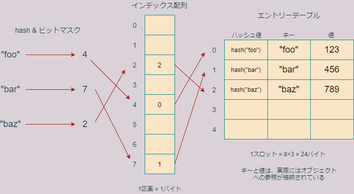

# 第7回 標準ライブラリ(2)―辞書、集合

- [第7回 標準ライブラリ(2)―辞書、集合](#第7回-標準ライブラリ2辞書集合)
  - [辞書(dict)](#辞書dict)
  - [辞書の更新](#辞書の更新)
  - [ループでの挙動](#ループでの挙動)
    - [練習1](#練習1)
  - [ハッシュ可能オブジェクト](#ハッシュ可能オブジェクト)
  - [ハッシュ表](#ハッシュ表)
  - [ビットマスク](#ビットマスク)
    - [練習2](#練習2)
  - [辞書のリサイズ](#辞書のリサイズ)
  - [集合](#集合)
  - [集合演算](#集合演算)
    - [練習3](#練習3)
  - [まとめ](#まとめ)
  - [参考書](#参考書)
  - [宿題(ホームワーク)](#宿題ホームワーク)
  - [課題(アサインメント)](#課題アサインメント)

## 辞書(dict)

辞書(ディクショナリとも呼びます)型はRのリストに似たデータ構造で、次の特徴を持ちます。

- イテラブル
- ミュータブル
- 「キーオブジェクト」と「値オブジェクト」のペアを保存する
- ハッシュ可能オブジェクトだけをキーに持てる
- 任意のオブジェクトを値に持てる
- キーを指定して値にアクセスする
- インデックス参照やスライス記法は受け付けない

辞書はPythonにおいて重要であるだけでなく、**ハッシュテーブル**という計算機科学において非常に重要なデータ構造なので、詳しく説明します。

リストは、要素を列挙したものでした。リストは本質的に**順序集合**です。

```python
>>> x = ['foo','bar','baz']
>>> print(x[1])
bar
```

一方、辞書は要素の順序集合ではなく、オブジェクトのペアの集合です。ペアを構成するオブジェクトは、**キー**および**値**と呼ばれます。

辞書を説明するには、実際の辞書の例が分かりやすいです。

|英単語|意味|
|--|--|
|yep|はい|
|yes|はい|
|yet|しかし|

といった(あまり役に立たない)英和辞書があったとします。この辞書では、英単語から意味を検索できるが、その逆(意味から英単語を検索)はできないとします。

英単語がキー、意味が値に相当します。キーは一意でなくてはなりませんが、値は重複があっても構いません。

実際にこの辞書を作るには幾つかのやり方がありますが、そのうち二つを紹介しておきます。他の作成方法については教科書のセクション6.3.1を見てください。

```python
>>> x = {'yep':'はい','yes':'はい','yet':'しかし'}
>>> x
{'yep': 'はい', 'yes': 'はい', 'yet': 'しかし'}
>>> x = dict(yep='はい',yes='はい',yet='しかし')
>>> x
{'yep': 'はい', 'yes': 'はい', 'yet': 'しかし'}
```

1番目の方法では、中括弧を使って辞書を作っています。中括弧の中にはキーと値のペアをコンマで区切って列挙します。キーと値はコロンで区切ります。

2番目の方法では、**dict**という関数を明示的に呼び出して辞書を作成しています。関数には、`key=value`という形式でキーと値のペアを渡します。こちらの形式では、キーにクォーテーションは必要ないので注意してください。

ちょうどリストにおいてインデックスから要素を取得したように、キーを指定すれば値を取得できます。

```python
>>> x['yep']
'はい'
>>> x['yet']
'しかし'
```

キーの一覧、値の一覧、キーと値のペアの一覧を取得するには、`keys`メソッド、`values`メソッド、`items`メソッドを使います。

```python
>>> x.keys()
dict_keys(['yep', 'yes', 'yet'])
>>> x.values()
dict_values(['はい', 'はい', 'しかし'])
>>> x.items()
dict_items([('yep', 'はい'), ('yes', 'はい'), ('yet', 'しかし')])
```

上記のようにキーの一覧、値の一覧、ペアの一覧は`dict_keys`、`dict_values`、`dict_items`という特殊な**イテラブル**データ型で返されます。これは、適宜リストや集合、タプルに変換して用いることができます。

たとえばリストに変換するには、関数`list`を使います。

```python
>>> y = list(x.keys())
>>> y
['yep', 'yes', 'yet']
>>> z = list(x.values())
>>> z
['はい', 'はい', 'しかし']
>>> a = list(x.items())
>>> a
[('yep', 'はい'), ('yes', 'はい'), ('yet', 'しかし')]
```

## 辞書の更新

辞書の内容を更新するもっとも基本的な方法は、代入です。たとえば、`x`の`'yep'`の意味を`'うっす'`に変更したいときは、次のようにします。

```python
>>> x['yep'] = 'うっす'
>>> x
{'yep': 'うっす', 'yes': 'はい', 'yet': 'しかし'}
```

このような代入操作において、指定されたキーが存在する場合は、上記のように既存の値が更新されます。指定されたキーがまだ存在しない場合は、新たにキー：値ペアが挿入されます。

```python
>>> x['yeah'] = 'うん'
>>> x
{'yep': 'うっす', 'yes': 'はい', 'yet': 'しかし', 'yeah': 'うん'}
```

特定のキー：値ペアを削除したいときは、**del**文を用います。

```python
>>> del x['yeah']
>>> x
{'yep': 'うっす', 'yes': 'はい', 'yet': 'しかし'}
```

複数の値を一挙に更新したい場合は、`update`メソッドを使います。例えば、辞書`x`を辞書`y`で上書き更新するには、次のように`update`メソッドを用います。

```python
>>> x
{'yep': 'うっす', 'yes': 'はい', 'yet': 'しかし'}
>>> y = {'yep':'はーい','yet':'まだ','no':'いいえ'}
>>> y
{'yep': 'はーい', 'yet': 'まだ', 'no': 'いいえ'}
>>> x.update(y)
>>> x
{'yep': 'はーい', 'yes': 'はい', 'yet': 'まだ', 'no': 'いいえ'}
```

このように`x.update(y)`と書くことにより、`y`の要素(キー：値ペア)ですでに`x`に存在するものは置き換えられ、存在しないものは新たに追加されます。

## ループでの挙動

辞書をリストの代わりにループインデックスの範囲として指定すると、ループインデックスにはキーだけが代入されます。つまり、次の2つのコードは全く同じ意味です。

```python
# %%
# xは辞書
for i in x.keys():
    print(i)
# %%
for i in x:
    print(i)
```

キーと値の両方を使いたいときは、次のようにしなくてはなりません。

```python
# %%
x = {'yep':'はい','yes':'はい','yet':'しかし'}
for i in x.items():
    print(i)
```

このように書くと、ループインデックスにはループごとにキーと値のタプルが代入されます。

```python
# 出力
('yep', 'はい')
('yes', 'はい')
('yet', 'しかし')
```

このようループインデックスにタプルを返すイテラブルの場合、次のようなループインデックスへの**アンパック代入**がサポートされています。

```python
# %%
x = {'yep':'はい','yes':'はい','yet':'しかし'}
for i,j in x.items():
    print(i + ' --> ' + j)
```

```python
# 出力

yep --> はい
yes --> はい
yet --> しかし
```

### 練習1

全ての小文字アルファベットをキー、対応する大文字アルファベットを値とする辞書`letcap`を作成しなさい。また、辞書`letcap`から、キーと値を入れ替えた辞書、すなわち大文字をキー、小文字を値とする辞書`caplet`を作成しなさい。

## ハッシュ可能オブジェクト

任意のオブジェクトが値になれますが、キーに指定できるのは、**ハッシュ可能な**Pythonオブジェクトのみです。

あるアルゴリズムによってオブジェクトを整数に変換することを**ハッシュ化**と呼びます。ハッシュ化によって得られる数値を**ハッシュ値**と呼び、当のアルゴリズムを**ハッシュ関数**と呼びます。全てのPythonオブジェクトがハッシュ化できるわけではなく、ハッシュ化できるオブジェクトを**ハッシュ可能**(hashable)であると言います。ビルトインイミュータブル型のオブジェクトはほとんどすべてハッシュ可能ですが、ミュータブル型はハッシュ不可能です。

ハッシュ化は、ビルトイン関数の**hash**によって行うことができます。

```python
>>> hash(1)
1
>>> hash("foo")
2930000467231731134
>>> hash((1,2,3))
529344067295497451
>>> hash(range(10))
-7546101314042312252
>>> hash([1,2,3])
Traceback (most recent call last):
  File "<stdin>", line 1, in <module>
TypeError: unhashable type: 'list'
```

上記の例では、リスト`[1,2,3]`がハッシュ不可能なため、エラーが出ています。

タプルはイミュータブルですが、全ての要素がハッシュ可能な場合にのみハッシュ可能です。よって、たとえば次のようなタプルはハッシュ不可能です。

```python
>>> x = (1,2,[3])
>>> hash(x)
Traceback (most recent call last):
  File "<stdin>", line 1, in <module>
TypeError: unhashable type: 'list'
```

したがって、このようなタプルは辞書のキーに指定することができず、エラーが出ます。

```python
>>> x = {}
>>> x[(1,2,[3])]=123
Traceback (most recent call last):
  File "<stdin>", line 1, in <module>
TypeError: unhashable type: 'list'
```

ハッシュ関数の特徴は、

- `==`演算子でTrueになる二つのオブジェクトは同じハッシュ値をもつ
- 異なるオブジェクトが同じハッシュ値を持ってもよい(ただしその確率は通常小さい)

ということです。たとえば、Pythonのハッシュ関数は、-1と-2に同じハッシュ値を返します。

```python
>>> hash(-1) == hash(-2)
True
```

このようにハッシュ化は**不可逆変換**です。ハッシュ値からもとのオブジェクトを復元することは通常できません。

なお、実際には、hash関数が使うアルゴリズムは、ハッシュ化するオブジェクトの型に依存しています。ハッシュ可能なデータ型は、すべて`__hash__`というハッシュ値を返すメソッドを持っていて、関数hashはこのメソッドを呼び出しているだけです。それは次のようにして確認できます。

```python
>>> x = "foo"
>>> hash(x)
2419985339487190468
>>> x.__hash__()
2419985339487190468
>>> hash(x) == x.__hash__()
True
```

また、Pythonのハッシュ関数は、セキュリティー上の理由から、インタープリタを起動するごとに異なるハッシュ値を返すようになっています。値の同じオブジェクトにはいつも同じハッシュ値を返すようにするには、環境変数`PYTHONHASHSEED`に`0～2**32-1`の範囲の整数(4バイト符合なし整数)を設定してAnacondaプロンプト(もしくはVS Code)を再起動してください。

## ハッシュ表

辞書の構造は少し不思議です。というのも、なぜPythonは、`x['yep']`と書くだけで、すぐにキー`'yep'`に対応する値を発見することができるのでしょうか？もし辞書がキー：値ペアを順番に格納しているだけだと、Pythonはキー`'yep'`を見つけるのに、いちいち全てのキー集合のなかから`'yep'`を検索しなくてはなりません。これだと、辞書が大きくなるに従って、検索に大きな時間を要するようになってしまいます。Pythonはこの問題を、**ハッシュ表**という構造を用いて解決しています。

それでは、次のコードを例に、辞書を作成する際に何が起きているのかを見ていきましょう。

```python
>>> x = {'foo':123,'bar':456,'baz':789}
```

上のコードを実行すると、筆者の処理系では辞書`x`のために232バイトのメモリ領域が確保されます（具体的なバイト数は処理系やPythonのバージョンに依存します）。

```python
>>> import sys
>>> sys.getsizeof(x)
232
```

この232バイトのうち、104バイトはオーバーヘッドで、本質的なのは残り128バイトです。この128バイトは、ハッシュ表を格納しています。ハッシュ表の役割は、キーオブジェクトを、値オブジェクトに対応付けることです。

最近のバージョンのPythonでは、ハッシュ表は**インデックス配列**と**エントリー表**という二つの部分から構成されています。インデックス配列は、1区画1バイトからなる8区画の一続きのメモリ領域で、合計8バイトを占有しています。

一方エントリー表は、1スロット(区画)24バイトからなる5スロットの一続きのメモリ領域で、合計120バイトを占有しています。さらに一つのスロットは三つの小区画に分かれていて、一つの小区画は8バイト占めています。この三つの小さい区画を**ハッシュ値区画**、**キー区画**、**値区画**と呼ぶことにします。

エントリー表の各スロットには、`x`を構成するキーや値の情報が格納されています。以下、Pythonがどのようにそれらの情報をエントリー表に格納していくか説明します。



まず、Pythonは第一のキーオブジェクト`'foo'`をハッシュ化し、そのハッシュ値を0～7の整数に変換します。この変換は、ハッシュ値の下位3ビットを取り出すことで行っています。3ビットの整数は0～7の範囲をとることに注意してください。

```python
>>> x = hash("foo")
>>> bin(x)
'0b111111111111110001101001010101111001010101111011001011001010100'
>>> x & 0b111   # xの下位3ビットを取得
4
```

なおここで、`& 0b111`というのが任意の数の下位3ビットを取り出す操作になっていますが、これについては後で解説します。ここでは、確かに`bin(x)`の下位3文字が100、つまり2進数で4になっていることを確認してください。

その後Pythonは、キー`'foo'`の参照、値123の参照、ハッシュ値(`hash("foo")`の値)をエントリー表第0スロットのキー区画、値区画、ハッシュ値区画に記録します。キーの参照、値の参照、ハッシュ値はどれも8バイトなので、スロットは24バイト消費します。

次に、"foo"のハッシュ値の下位3ビットは`0b100=4`でしたので、Pythonは、インデックス配列の**第4区画**に、エントリー表での`'foo'`の**スロット番号0**を記録します。

Pythonは、同じことを、`'bar'`と`'baz'`に対しても行います。これらのハッシュ値と下位3ビットを調べてみましょう。

```python
>>> hash("bar") & 0b111
7
>>> hash("baz") & 0b111
2
```

`"bar"`と`"baz"`の情報はエントリー表の第1、第2スロットに順番に収められます。また、`hash("bar")`の下位3ビットが7であったので、インデックス配列の第7区画に`"bar"`のスロット番号である1をセットします。同様に`hash("baz")`の下位3ビットが2であったので、インデックス配列の第2区画に"baz"のスロット番号2をセットします。

このようにして、Pythonは図のようなハッシュテーブルを完成させます。

Pythonが、完成した辞書からキー`'foo'`に対応する値123を取り出す際は、それを登録したときとほぼ同じ方法を使います。

まず、`'foo'`をハッシュして下位3桁をみます。するとその値は4ですので、インデックス表の4番目を見ます。そこが空っぽであればPythonはエラーを出しますが、番号が書いてあった場合は、その番号に対応するエントリー表のスロットをみます。そのスロットに記録されているキーが、今探しているキーと一致すれば、対応する値を返して作業を終了します。

上記の作業の作業量は、ハッシュテーブルにエントリーされているキー：値ペアの数に依存せずほぼ一定であるため、辞書の操作は登録されている要素(キー：値ペア)の数が大きくなっても、比較的高速に行うことができるのです。

なお、ハッシュ化して下3桁をとると、複数のキーが同じインデックスになってしまうことがあります。これを**ハッシュ衝突**と呼びます。二つのキーでハッシュ衝突が起きると、後から登録しようとしているキーに対しては、あるアルゴリズムで別のインデックスを振られます。

ここから先は専門的な話になりますので詳細は説明しませんが、ここで使われている空きインデックスを探すアルゴリズムはリニアプロービングという単純なアルゴリズムです。関心のある方は参考書の[『High Performance Python: Practical Performant Programming for Humans』(Gorelick & Ozsvald, 2020)](https://www.amazon.co.jp/High-Performance-Python-Performant-Programming/dp/1492055026)をご覧ください。ここではハッシュ衝突の概念だけ押さえておきましょう。

## ビットマスク

さてここで話が少しそれますが、ハッシュ値から下3桁をとりだした操作は教養の観点から言って重要ですので、少し詳しく説明をしておきます。ハッシュ値のところで行ったように、たとえば整数123から下位3ビットを取り出すには、次のようにします。

```python
>>> 123 & 0b111
3
```

まず、`0b111`は、接頭辞`0b`がついているので、7を2進数表現したものであることにしてください。`&`演算子は、**bitwise AND**という**ビット演算子**の一種で、二つのビット配列がともに1になっているビットだけを1にし、残りの全てのビットを0にした数字を返します。

```python
>>> x = 0b1010 & 0b1001
>>> x
8
>>> bin(x)
'0b1000'
>>>
```

したがって、どのような整数でも、`0b111`とのbitwise ANDをとれば、下位3ビット以外はすべて0になり、下位3ビットだけがとりだせることになります。このように、ビット列との`&`をとって特定のビットだけを抽出することを、**ビットマスク**をかけるといいます。このとき、ビット抽出に使われる`0b111`のような数字をビットマスクと呼びます。情報科学で頻繁に使われる概念なので覚えておきましょう。

なおハッシュ値が負の値の場合、`bin`関数が表示する2進数表記は、実際にハッシュ値がメモリに記録されるときのビット配列とは異なります。`bin(x)`が返すのは、`x`の絶対値の2進数表現にマイナス符合を付けたものであり、`x`のメモリ上でのビット配列ではありません。ビットマスクは`bin`関数の戻り値では無く、メモリ上でのビット配列、つまり2の補数表現に対して取られます。たとえば、"bar"を関数hashでハッシュ化すると、筆者の環境では次のように負の値になり、その下3ビットは`001`、つまり**1**となります。

```python
>>> bin(hash('bar'))
'-0b101111000110111000001100101111000011111100001110110110111001'
```

ところが、'bar'のハッシュ値と`0b111`のANDを取ったものは、上で示したように、**7**でした。この食い違いは、ハッシュ値が負である為に置きます。ハッシュ値が負のときのビット演算の結果は、2の補数表現で考えなくてはいけません。

初回の講義の補遺において紹介した`int_to_bits`を使ってハッシュ値の2の補数表現を求めておきましょう。

```python
# %%
int_to_bits(hash('bar'),8)
```

```cmd
# 出力
11110100 00111001 00011111 00110100 00111100 00001111 00010010 01000111
```

このように、確かに下3桁は`0b111`、つまり7になっていることが分かります。

bitwise演算子には、AND以外にも様々なものがあり、ビット単位での操作を可能にします。ここでは取り上げませんが、非常に重要ですので、教科書のセクション3.5を良く読んでおきましょう。

### 練習2

試作品段階ですが、辞書の内部構造を表示するモジュール[insdict](https://github.com/kobayashiyutaka/insdict)を開発中です。興味のある方は仮想環境にインストールして使ってみてください。ただし、インタープリタをコンパイルしたのと同じCコンパイラが必要です。Windowsの場合は、Microsoft Visual Studioが必要です。Linuxの場合はGCCが必要です。

## 辞書のリサイズ

さて、辞書に話を戻します。辞書のエントリーが増えてきて、インデックス表が埋まってくると、だんだんとハッシュ衝突の確率が上がってきます。衝突が多いほど、登録にも検索にも時間がかかるようになります。ですので、衝突を最小限に抑えるために、インデックス配列の区画数はエントリー表よりもすこし大きめに確保してあります。具体的には、エントリー表のスロット数は、インデックス配列の長さの約2/3になっています。

エントリー表が満杯になった状態で次のキーが登録されると、インデックス配列とエントリー表が同時に拡張されます。このとき、新しくインデックス配列とエントリー表が作成され、既存のインデックス配列とエントリー表の内容がコピーされます。

新しく作成されたエントリー表のサイズは10区画、インデックス表のサイズは16区画になります。再びエントリー表が一杯になると、再度拡張がおき、今度はエントリー表は21区画、インデックス表は32区画になります。このようにして、エントリー表が一杯になるたびに、おおよそ倍々にインデックス表とエントリー表は拡張されていきます。

理論的には、辞書の要素が増えるにつれ、オーバヘッドを除く占有バイト数は次のように変化していきます。

|要素数|スロット数|配列長|エントリー表サイズ|配列サイズ|合計|
|-|-|-|-|-|-|
|1~5|5|8|24x5=120|1x8=8|128|
|6~10|10|16|24x10=240|1x16=16|256|
|11~21|21|32|24x21=504|1x32=32|536|
|22~42|42|64|24x42=1008|1x64=64|1072|
|43~85|85|128|24x85=2040|1x128=128|2168|
|86~170|170|256|24x170=4080|2x256=512|4592|
|171~341|341|512|24x341=8184|2x512=1024|9208|

上記の表で、各列の意味は以下の通りです。

|列|意味|
|--|--|
|スロット数|エントリー表のスロット数|
|配列長|インデックス配列の区画数|
|エントリー表サイズ|エントリー表の総バイト数|
|配列サイズ|インデックス配列の総バイト数|
|合計|エントリー表の総バイト数＋インデックス配列の総バイト数|

ちょっと細かいことですが、上の表でインデックス配列は、辞書が小さい間は、1区画1バイトを占めていますが、エントリー表のスロット数が85から170に増加したときに1区画あたり2バイトに増加します。これは、インデックス配列のそれぞれの区画は、
符号付き1バイト整数(-128～+127)を表すのに使っており、128以上のスロットナンバーを記録できないからです。

本当に上記のようなことが起きているかを確かめるためのコードを書いてみましょう。からっぽの辞書に一つずつキー：値ペアを追加していき、`2**8`個までペアを追加することにします。占有バイト数が変化したときだけ出力することにします。

```python
import sys

x = dict()
prev_size = 0     # 前回のハッシュ表サイズ
curr_size = 0     # 今回のハッシュ表サイズ
min_size = 128    # 最小のハッシュ表サイズ
overhead = sys.getsizeof(x) - min_size # オーバーヘッド

for i in range(1,2**8+1):
    x.update({i:i})
    curr_size = sys.getsizeof(x) - overhead
    if curr_size != prev_size:
        print(str(i) + ' --> ' + str(curr_size))
    prev_size = curr_size
```

```python
# 出力
1 --> 128
6 --> 256
11 --> 536
22 --> 1072
43 --> 2168
86 --> 4592
171 --> 9208
```

1列目は辞書のエントリー数、2列目はオーバーヘッドを除いたハッシュ表の占有バイト数です。

下の図は、エントリ数とともに辞書の占有メモリがどのように増えていくかを表した図です。オーバーヘッドは含んでいません。


具体的なバイト数は処理系(64bitか32bitか)に依存し得ます。64ビットOSなのに結果が上の表と一致しないとすれば、Pythonのバージョンがかなり古いか、あるいはものすごく新しい可能性があります。その場合は、試しに自分の使っている処理系ではどのようにハッシュ表がメモリを使っているのか色々と実験して調べてみてください。

## 集合

集合型は、辞書やリストに比べると使う機会が少ないと思いますので、説明は簡単にしておきます。集合は、内部構造をもたないオブジェクトの集まりです。集合は、**値のないキーだけの辞書**と思ってほぼ間違いはありません。以下のような特徴を持ちます。

- イテラブル
- ミュータブル
- インデックス・スライス参照不可
- キー参照不可
- ハッシュ可能オブジェクトだけを要素に持てる
- 算術演算不可
- 集合演算可

集合を作るやり方は主に二通りあります。一つは、中かっこ内に要素を列挙する方法、もう一つは、関数setにイテラブルオブジェクトを渡す方法です。

```python
>>> x = {'foo','bar','baz'}
>>> x
{'baz', 'foo', 'bar'}
>>> y = set([1,2,3])
>>> y
{1, 2, 3}
```

集合は辞書キーと同じで、重複が許されないことに注意してください。これを利用して、文字列などから、文字列に含まれている文字の集合を作成できます。

```python
# 文字の一覧を取得
>>> z = set("foo bar baz")
>>> z
{'a', 'f', 'b', ' ', 'r', 'o', 'z'}
```

集合の要素は辞書のキーと同じでハッシュ可能でないといけません。

```python
>>> x = {[3],5}
Traceback (most recent call last):
  File "<stdin>", line 1, in <module>
TypeError: unhashable type: 'list'
```

ループでの挙動は、辞書と変わりありません。

```python
>>> x = {'a','b','c'}
>>> x
{'b', 'a', 'c'}
>>> for i in x:
...     print(i)
...
b
a
c
```

## 集合演算

リストや辞書でなく、集合を用いるのは、**集合演算**を用いたいときでしょう。集合型には様々な集合演算が定義されています。

|メソッド|記号|機能|
|--|--|--|
|`x.difference(y)`|`-`|xとyの差集合|
|`x.intersection(y)`|`&`|xとyの積集合|
|`x.union(y)`|\||xとyの和集合|
|`x.issubset(y)`|`<=`|xがyの部分集合ならTrue|
|`x.issuperset(y)`|`>=`|yがxの部分集合ならTrue|

たとえば、和集合はunionメソッドもしくは`|`演算子で作成できます。

```python
>>> x = {'a','b','c'}
>>> y = {'c','d','e'}
>>> x.union(y)
{'b', 'a', 'd', 'e', 'c'}
>>> x | y   # 同じ意味
{'b', 'a', 'd', 'e', 'c'}
```

上記の集合演算を自分で色々と試してみましょう。

### 練習3

文字列"pythonlanguage"に含まれる文字のうち、"helloworld"と"foobarbaz"の**どちらか一方にのみ**含まれている文字の集合を求めなさい。

## まとめ

今回の講義では、以下のことを学びました。

- 辞書の仕組み
- ハッシュ表
- ビットマスク
- 集合型
- 集合演算

辞書はPythonのデータ型の中でも非常に重要な役割を持つものですので、教科書の対応する範囲を良く読み、挙動を理解するようにしましょう。

## 参考書

- [『High Performance Python: Practical Performant Programming for Humans』](https://www.amazon.co.jp/High-Performance-Python-Performant-Programming/dp/1492055026)(M. Gorelick, I. Ozsvald著) (2020) O'Reilly. ISBN-13 : 978-1492055020.
- [『CPython Internals: Your Guide to The Python 3 Interpreter』](https://www.amazon.co.jp/CPython-Internals-Guide-Python-Interpreter/dp/1775093344/ref=sr_1_1?__mk_ja_JP=%E3%82%AB%E3%82%BF%E3%82%AB%E3%83%8A&dchild=1&keywords=CPython+internals&qid=1622045115&sr=8-1)(A. Shaw, The real python.com tutorial team)(2021) Real Python. ISBN-13: 978-1775093343.
