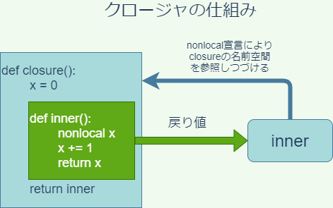

# 第8回　関数とモジュール

- [第8回　関数とモジュール](#第8回関数とモジュール)
  - [関数](#関数)
    - [練習1](#練習1)
  - [ジェネレータ](#ジェネレータ)
    - [練習2](#練習2)
    - [練習3](#練習3)
  - [内包表記](#内包表記)
    - [練習4](#練習4)
  - [if/if-elseつき内包表記](#ifif-elseつき内包表記)
    - [練習5](#練習5)
  - [モジュールの種類](#モジュールの種類)
    - [外部ファイル](#外部ファイル)
    - [ビルトインモジュール](#ビルトインモジュール)
    - [builtinsモジュール](#builtinsモジュール)
    - [mainモジュール](#mainモジュール)
  - [モジュールを作る](#モジュールを作る)
  - [モジュールのリロード](#モジュールのリロード)
  - [モジュールのバイトコード](#モジュールのバイトコード)
    - [練習6](#練習6)
  - [名前空間](#名前空間)
    - [グローバル名前空間](#グローバル名前空間)
    - [練習7](#練習7)
    - [ローカル名前空間](#ローカル名前空間)
    - [ビルトイン名前空間](#ビルトイン名前空間)
    - [練習8](#練習8)
  - [スコープ](#スコープ)
    - [グローバルスコープ](#グローバルスコープ)
    - [ローカルスコープ](#ローカルスコープ)
    - [ビルトインスコープ](#ビルトインスコープ)
  - [LEGBルール](#legbルール)
    - [再帰関数](#再帰関数)
  - [global/nonlocal命令](#globalnonlocal命令)
    - [練習9](#練習9)
  - [クロージャ](#クロージャ)
    - [練習10](#練習10)
  - [記号表(高度な話題)](#記号表高度な話題)
    - [トップレベル記号表の取得](#トップレベル記号表の取得)
    - [トップレベル記号表の精査](#トップレベル記号表の精査)
    - [記号表を精査する関数inspect_tbl](#記号表を精査する関数inspect_tbl)
    - [ローカル記号表の取得](#ローカル記号表の取得)
    - [ローカル記号表の精査](#ローカル記号表の精査)
  - [まとめ](#まとめ)
  - [参考書](#参考書)
  - [宿題(ホームワーク)](#宿題ホームワーク)
  - [課題(アサインメント)](#課題アサインメント)

## 関数

まずRにおける関数の作成を思い出しましょう。一例として、2つの引数の和を返すだけのmyadd関数を定義するには、次のように書くのでしたね。

```R
myadd <- function(a,b) {
    z <- a + b
    return(z)
}
```

上記において、関数の中身(ボディ)は、中括弧の中で与えられます。`a`、`b`が引数であり、任意の数値を想定しています。関数`return`を呼び出すことで関数の実行は終了し、returnの引数が戻り値として返されます。作成された関数は、無名のまま使うこともできますが、通常は何度も再利用するものです。そのため、`myadd`という名前(**識別子**)に、作成した関数オブジェクトを`<-`演算子によって付値しています。これにより、識別子`myadd`に関数オブジェクトが結び付けられ、次のようにこの関数を何度でも呼び出せるようになります。

```R
> res <- myadd(2,8)
> print(res)
[1] 10
```

なお上記では、`return(a+b)`としても構いませんが、関数のボディの存在をわかりやすくするために、あえて複数行で記述しました。

一方、Pythonの関数は、以下の`def`命令を用いて作成し、必ず識別子への代入が行われます。(Pythonにも**lambda式**という無名関数はありますが、全く違う方法で作ります。残念ながら`lambda`式では複数行ブロックをもつ関数を作ることはできません。`lambda`式については教科書のセクション8.4.4に詳しく説明がありますのでよく読んでおいてください。)上記のRコードはPythonで書き直すと次のようになります。

```python
def myadd(a,b):
    z = a + b       # 関数ブロック
    return z        #

print(myadd(5,4))
print(myadd(10,-2))
```

```python
# 出力
9
8
```

`if`ブロックや`for`ブロックと同じように、関数の内容もまた、インデントを用いたブロックによって表現します。戻り値は`return`命令で返します。Pythonの`def`や`del`とおなじような命令であって、関数ではないことに注意しましょう。したがって、`return`にはカッコは必要ありません。

`return`命令を省略すると、関数は`None`オブジェクトを返します。`None`は「空っぽ」を意味するオブジェクトであり、メモリ上に常駐していて常に再利用されます。たとえば次の関数`hello`は、`return`命令を呼び出しませんので、その戻り値は`None`となります。

```python
def hello():
    print('Hello, World!')

x = hello()
print(x is None)
```

```python
# 出力
Hello, World!
True
```

また、関数を終了させたいが、戻り値はいらないという場合は、単に`return`と書くと、`None`を返して終了します。何らかの理由で関数の実行を途中で終了したい場合に有用です。

```python
# %%
def hello(name):
    if name == '':
        print('hello,world!')
        return
    print('hello,' + name)

hello('')
hello('taro')
```

```python
# 出力
hello,world!
hello,taro
```

本講義では省略しますが、Pythonの関数は引数のデフォルト値やキーワード引数など、様々な形式の引数を設定することが可能です。教科書のセクション8.3に詳しく説明されているので、良く読んでおきましょう。

### 練習1

数値のリストを引数にとり、リストの全ての要素の3乗の和を求める関数sumcubeを作成しなさい。たとえば、次の関数呼び出しの戻り値は36になります。

```python
sumcube([1,2,3])
```

## ジェネレータ

`return`命令の代わりに`yield`命令を使うと、関数は**ジェネレータ関数**という特別な関数になります。ジェネレータ関数は、戻り値として、**ジェネレータオブジェクト**を返します。(ジェネレータ関数とジェネレータオブジェクトのどちらも**ジェネレータ**と呼ぶことがあるので注意してください。)


ジェネレータオブジェクトは、イテラブルなオブジェクトであり、主にループ処理で用いることができます。ループ処理でループインデックスに代入されるのは、`yield`の戻り値です。ただし、注意しなくてはならないのは、`yield`は作業を中断するだけで、関数ブロックの処理を終了しないということです。

たとえば、次のようなジェネレータは、19以下の偶数を順番にループインデックスに返します。

```python
# %%
# ジェネレータ関数の定義
def yield_even():
    for i in range(20):
        if i%2 == 0:
            yield i

# ジェネレータの活用
for i in yield_even():
    print(i)
```

```python
# 出力
0
2
4
6
8
10
12
14
16
18
```

なお、ジェネレータオブジェクトは**イテレータ**でもあります。従って、`next`関数によって値を取得することができます。

ジェネレーターオブジェクトはイテラブルであるため、`list`コンストラクタや`set`コンストラクタ、`tuple`コンストラクタに渡すことで、リストや集合、タプルを作ることができます。

```python
print(list(yield_even()))
print(set(yield_even()))
print(tuple(yield_even()))
```

```python
# 出力
[0, 2, 4, 6, 8, 10, 12, 14, 16, 18]
{0, 2, 4, 6, 8, 10, 12, 14, 16, 18}
(0, 2, 4, 6, 8, 10, 12, 14, 16, 18)
```

ただし、あくまでも、有限回の呼び出しで`StopIteration`例外を発生するジェネレータである必要があります。練習2で作ったような、無限回`next`で呼び出せるジェネレータをこのように使わないよう注意しましょう。

上記の方法で辞書を作成するには、ジェネレータはキーと値のタプルを返すものでなくてはなりません。たとえば、次の例は、20未満の偶数をキー、その自乗を値としてもつ辞書を作成するコードです。

```python
def yield_even():
    for i in range(20):
        if i % 2 == 0:
            yield i,i**2

print(dict(yield_even()))
```

```python
# 出力
{0: 0, 2: 4, 4: 16, 6: 36, 8: 64, 10: 100, 12: 144, 14: 196, 16: 256, 18: 324}
```

ジェネレータから得られた値をそのまま使うのではなく、若干の編集を加えてリストや集合にしたい場合は、次に説明する**内包表記**を用いることができます。

```python
def yield_even():
    for i in range(20):
        if i%2 == 0:
            yield i

# 内包表記(奇数の列)
x = [i + 1 for i in yield_even()]
print(x)
```

```python
# 出力
[1, 3, 5, 7, 9, 11, 13, 15, 17, 19]
```

### 練習2

呼び出すたびに1のn乗、2のn乗、3のn乗…という風に、正整数のn乗を返すジェネレータオブジェクトを生成するジェネレータ関数`genpow`を定義しなさい。この関数の引数は、指数`n`です。

たとえば、次のように書くと、`x`は`next(x)`を実行するたびに正整数の3乗を返すジェネレータオブジェクトになります。

```python
x = genpow(3)
```

ヒント: `while`を用いた無限ループを活用します。

### 練習3

練習2の応用です。`genpow`を修正して、指数`n`に加えて、整数の上限`max`を引数に加えなさい。たとえば、次のように書くと、`x`は`next(x)`の呼び出しによって最大`10**3`まで返せるジェネレータオブジェクトになります。ただし、`max`に負の数を与えると、練習2の`genpow`と同じで上限値はなくなり、`next(x)`は任意の回数呼び出せるようになるとします。

```python
x = genpow(max,n)
```

## 内包表記

脱線しますが、折角ですので、ここで**内包表記**についてお話ししておきます。内包表記は、ループ処理の結果をリスト、辞書、集合などのコンテナ型オブジェクトにまとめるためのPython特有の構文であり、慣れるとコードをコンパクトに書くのに非常に有用です。以下が、内包表記の基本形です。

```python
# リスト内包表記
[iを含む表現 for i in ループ範囲]
# セット(集合)内包表記
{iを含む表現 for i in ループ範囲}
# 辞書内包表記
{iを含む表現:iを含む表現 for i in ループ範囲}
```

例えば、100までの偶数の自乗をすべて収めたリストを作るときは、次のように書きます。

```python
>>> [i**2 for i in range(0,100,2)]
[0, 4, 16, 36, 64, 100, 144, 196, 256, 324, 400, 484, 576, 676, 784, 900, 1024, 1156, 1296, 1444, 1600, 1764, 1936, 2116, 2304, 2500, 2704, 2916, 3136, 3364, 3600, 3844, 4096, 4356, 4624, 4900, 5184, 5476, 5776, 6084, 6400, 6724, 7056, 7396, 7744, 8100, 8464, 8836, 9216, 9604]
```

同じことをforループでやるとすると、たとえば次のようになります。

```python
# %%
x = []
for i in range(0,100,2):
    x.append(i**2)

print(x)
```

```python
# 出力
[0, 4, 16, 36, 64, 100, 144, 196, 256, 324, 400, 484, 576, 676, 784, 900, 1024, 1156, 1296, 1444, 1600, 1764, 1936, 2116, 2304, 2500, 2704, 2916, 3136, 3364, 3600, 3844, 4096, 4356, 4624, 4900, 5184, 5476, 5776, 6084, 6400, 6724, 7056, 7396, 7744, 8100, 8464, 8836, 9216, 9604]
```

セット内包表記は`[]`を`{}`にするだけですが、リストと違い重複を除去できます。次のコードは、100までの偶数の自乗を5で割った余りを集めたリストと集合を計算するためのものです。

```python
>>> [i**2 % 5 for i in range(0,100,2)]
[0, 4, 1, 1, 4, 0, 4, 1, 1, 4, 0, 4, 1, 1, 4, 0, 4, 1, 1, 4, 0, 4, 1, 1, 4, 0, 4, 1, 1, 4, 0, 4, 1, 1, 4, 0, 4, 1, 1, 4, 0, 4, 1, 1, 4, 0, 4, 1, 1, 4]
>>> {i**2 % 5 for i in range(0,100,2)}
{0, 1, 4}
```

辞書内包表記は少し特徴的です。たとえば次は、"hello,world!"という文字列のそれぞれの文字をキーとし、キーの大文字を値とする辞書を作成するコードです。やはりこの場合も、キーの重複は取り除かれます。

```python
>>> x = {c:c.upper() for c in "hello,world!"}
>>> x
{'h': 'H', 'e': 'E', 'l': 'L', 'o': 'O', ',': ',', 'w': 'W', 'r': 'R', 'd': 'D', '!': '!'}
```

辞書で内包表記でキーの重複が取り除かれる際には、最新の値が採用されるので注意が必要です。たとえば、次のコードは、キーと値を入れ替えた辞書を作るものです。値は一意とは限らないので、重複部分は除去され、最新のペアだけが残ります。

```python
# %%
x = {'foo':1,'bar':2,'baz':1}
{j:i for i,j in x.items()}
```

```python
# 出力
{1: 'baz', 2: 'bar'}
```

### 練習4

文字列'Python'から1文字目を1回、2文字目を2回、...n文字目をn回繰り返した文字列'Pyyttthhhhooooonnnnnn'をリスト内包表記を使って作成しなさい。

## if/if-elseつき内包表記

先に挙げた、100までの偶数の自乗を含むリストは、次のように`if`と組み合わせた内包表記によっても作成できます。

```python
# %%
x = [i**2 for i in range(100) if i%2 ==0]
print(x)
```

```python
# 出力

[0, 4, 16, 36, 64, 100, 144, 196, 256, 324, 400, 484, 576, 676, 784, 900, 1024, 1156, 1296, 1444, 1600, 1764, 1936, 2116, 2304, 2500, 2704, 2916, 3136, 3364, 3600, 3844, 4096, 4356, 4624, 4900, 5184, 5476, 5776, 6084, 6400, 6724, 7056, 7396, 7744, 8100, 8464, 8836, 9216, 9604]
```

上記では、`i`が2で割り切れるときのみ`i**2`をリストに加える、という意味になります。

ところが、`i`が2で割り切れるときは`i**2`をリストに加え、そうでないときは0を加えよ、という命令にしたいときは、下のようにかなり異なる表現になります。

```python
# %%
x = [i**2 if i%2==0 else 0 for i in range(100)]
print(x)
```

実はこの表現においては、単文の**if-else**構文が使われています。単文のif-elseは次のように用います。

```python
式A if 条件 else 式B
```

このように書くと、「条件が成り立っていれば式A、さもなくば式B」という意味になります。本来内包表記とは直接関係がなく、どこでも用いることができます。たとえばxにiの絶対値を代入したい場合は次のように書くことができます。(実際には`abs`という絶対値を返すビルトイン関数があります。)

```python
x = i if i>=0 else -i
```

このように、ifつき内包表記とif-elseつき内包表記は全く別のものですので、両者を組み合わせることもできます(おすすめはしませんが)。たとえば、「7の倍数のうち、3の倍数は自乗し、3で割り切れない数はそのまま格納したリスト」は次のように表現できます。

```python
# %%
x = [i**2 if i%3==0 else i for i in range(100) if i%7==0]
print(x)
```

```python
# 出力

[0, 7, 14, 441, 28, 35, 1764, 49, 56, 3969, 70, 77, 7056, 91, 98]
```

このように、内包表記は非常に高い表現力をもっています。`for`ループの結果をリストに格納したい、ということはプログラミングをやっていると頻発しますので、この機会にぜひ覚えておきましょう。

### 練習5

文字列"this practice is too difficult for most students"に含まれているアルファベット(空白は含まない)のうち、3回以上用いられているものだけを集めた集合を内包表記で作りなさい。

## モジュールの種類

さて、自作した関数を複数のプログラムで再利用したい場合には、モジュールの仕組みを活用するのが便利です。これまでにも、`sys`モジュールや`copy`モジュールを随所で活用してきましたが、ここでモジュールとはどのようなものかを明確にしておきましょう。

モジュールは、Pythonスクリプトから読み込んで使用できる関数や変数、データ型、Pythonコードの集合のことを広く指します。

Pythonには以下の4種類のモジュールがあります。

|種類|説明|例|
|--|--|--|
|外部ファイル|PythonやCで作成され、importで呼び出して使う|`copy`|
|ビルトインモジュール|インタープリタに組み込まれ、importで呼び出して使う(`builtins`モジュールは例外)|`sys`、`math`|
|`builtins`モジュール|ビルトイン関数・定数を定義している特別なビルトインモジュールで、起動時に自動で読み込まれる|`builtins`|
|`main`モジュール|主スクリプトの属するモジュール|任意のスクリプト|


### 外部ファイル

全てのPythonスクリプトは他のPythonスクリプトに`import`命令で読み込めるので、モジュールとして機能します。その他にも、たとえばCPythonインタープリタであれば、C言語やCythonと言った言語でモジュールを作成できます。こういった外部ファイルで提供されたモジュールは、import命令によって主プログラムに読み込んで使用することができます。たとえば`copy`モジュールはcopy.pyというPythonスクリプトとして存在しており、import命令で読み込めます。

### ビルトインモジュール

それに対して、ファイルの形では存在していないビルトインモジュールという特別なタイプのモジュールがあります。たとえば`sys`はビルトインモジュールであり、インタープリタに埋め込まれています。その他、数学関数を収めた`math`もビルトインモジュールです。こういったものも`import`文で読み込んで使うことができます。

`import`したモジュールがビルトインかどうかは単にそのオブジェクトを`print`してみればわかります。

```python
>>> import sys
>>> print(sys)
<module 'sys' (built-in)>
>>> import copy
>>> print(copy)
<module 'copy' from '/usr/lib/python3.8/copy.py'>
```

ビルトインモジュールの場合は、`sys`のように`(built-in)`と表示されます。一方、ファイルの場合は、`copy`のようにモジュールファイルのある場所が表示されます。

### builtinsモジュール

ビルトインモジュールの中には、ただ一つだけ`builtins`という特別なモジュールがあります。これは、たとえば`print`など、ビルトイン関数や`True`などのビルトイン定数を定義しているモジュールです。builtinsだけは、`import`を必要とせず、`__builtins__`という別名でPythonの起動と同時に自動的に読み込まれます。試しに、`__builtins__`を`print`してみてください。

```python
>>> print(__builtins__)
<module 'builtins' (built-in)>
```

このように、`__builtins__`という名前がすでに定義されていて、その正体は`builtins`というビルトインモジュールであることがわかります(とてもややこしいので混乱しないように注意してください)。これは、`builtins`モジュールが`__builtins__`という別名で読み込まれているということを意味します。モジュールの別名読み込みは一般に次のようなimport-as文で行います。

```python
import モジュール名 as 別名
```

つまり、`builtins`モジュールだけは、起動時に次のように読み込まれたのと同じ状態になるということです。

```python
import builtins as __builtins__
```

なぜこのようになっているかというのは、名前空間の節で説明します。

### mainモジュール

最後に、**main**というモジュールがあります(正確には`__main__`)。これは、実行時の主スクリプトの別名です。たとえばコマンドプロンプトで次のようにfile.pyスクリプトを実行したとします。

```cmd
python file.py
```

このとき、file.pyに記述された変数、関数、コード、データ型は全て`main`モジュールに属することになります。

このように、Pythonスクリプトは全てモジュールとして機能しますが、その逆は必ずしも成り立ちません。モジュールはスクリプトよりも広い概念です。

## モジュールを作る

それでは折角ですので、モジュールを自作してみましょう。といっても、二つのPythonスクリプトを作成し、一方をもう一方から`import`するだけです。`import`する側が`main`モジュールとなります。

GitHubディレクトリの中に`my_first_module`というフォルダを作ってVS Codeで開きましょう。そして、mymod1.pyというファイルを作って開きましょう。この中に、次のように記述します。

```python
x = 5
def hello():
    print("Hello,World!")
```

記述を終えたら保存します。ここでの目的は、mymod1.pyの中で定義された変数`x`と関数`hello`を再利用することです。

次に、mymain.pyというファイルを作成して開き、次のように記述して**インタラクティブモード**で実行してみましょう。

```python
# %%
import mymod1

print(mymod1.x)
mymod1.hello()
```

ここで、`mymod1.x`によって、mymod1.pyで定義された変数xにアクセスしていることに注意してください。上手く`import`できれば、次のように表示されるはずです。

```python
# 出力
5
Hello,World!
```

ここで2点注意事項があります。

1. `import`での読み込みは初回のみ有効であり、モジュールの再読み込み(リロード)には使えない。
2. 一度読み込まれたモジュールはバイトコンパイルされ、変更がない限り再利用され続ける。

## モジュールのリロード

上記1は、モジュールを変更したら、一旦Pythonを再起動しないと、変更したモジュールを`import`で読み込み直せないということを意味します。これを覚えておくことは大変重要です。

たとえば、まずmymain.pyをインタラクティブモードで実行したあと、**インタラクティブモードを起動したまま**で、mymod1.pyを次のように変更して保存してみましょう。

```python
x = 100
def hello():
    print("Good bye,World!")
```

そして、mymain.pyをインタラクティブモードでもう一度実行してみてください。次のように、mymod1.pyの変更が反映されていないはずです。

```python
# 出力

5
Hello,World!
```

それでは、一度インタラクティブモードを終了してください(Pythonを停止する)。それからもう一度同じmymain.pyのコードを実行してください。次のように、変更が反映されるはずです。

```python
100
Good bye,World!
```

Pythonを終了せずにモジュールの再読み込みをするには、次のように`importlib`モジュールの`reload`関数を使う方法もあります。モジュールの開発中は、一々Pythonを再起動するよりもこちらのほうが便利でしょう。一度読み込まれたmymod1モジュールを再び読み込むには、次のように記述します。

```python
import importlib
importlib.reload(mymod1)
```

## モジュールのバイトコード

`import`文によって読み込まれたPythonスクリプトのモジュールは、通常インタプリタによってバイトコンパイルされ`__pycache__`というディレクトリに保存されます。`__pycache__`は`main`モジュールファイル(主スクリプト)が置かれていた場所に作られます。VS Code上で閲覧できるはずなので、開いてみてください。

中には、mymod1.cpython-38.pycというバイナリファイルが作られているはずです。これがmymod1.pyをバイトコンパイルして出来たバイトコードです。

通常、`main`モジュールとして実行されるファイルは、実行のたびにバイトコンパイルされ、バイトコードがファイルに保存されることはありません(強制的にバイトコードを作ることは可能です)。一方、`import`されたファイルは(可能な限り)バイトコードを保存し、ファイル内容に変更がない限り再コンパイルしません。

このようにして、モジュールのバイトコンパイルにかける時間を節約することで、Pythonは実行までの時間を短縮する工夫をしています。通常モジュールのバイトコンパイルを意識する必要はありませんが、教養として知っておきましょう。

### 練習6

主スクリプトを強制的にバイトコンパイルするには、コンソール(Anaconda prompt)上で次のように入力します。

```bash
python -m compileall script.py
```

ここで`script.py`はスクリプト名です。このようにして作成された主スクリプトのバイトコードは通常のモジュールと同じく`__pycache__`内に作成され、テキストで書かれたスクリプトと全く同じように実行できます。

"Hello, World!"と出力するスクリプトを作成してコンパイルし、作成されたバイトコードを見つけてください。また、そのバイトコードを実行してください。

## 名前空間

名前空間とは、`main`を始めとするモジュールの中で定義された記号(識別子)の一覧および、それらの記号が参照するオブジェクトの対応表のことです。一つのモジュールには、次の3種類の名前空間が存在します。

|名前空間|含まれる記号|
|--|--|
|ローカル名前空間|関数のなかで定義された記号|
|グローバル名前空間|モジュールファイルのトップレベル(関数の外)で定義された記号
|ビルトイン名前空間|`__builtins__`で定義されている記号|

記号がどの名前空間に属するかは、それがどこで最初に定義されたかによって決まります。最初から定義されている記号を除き、記号が定義されるのは**代入**が起きるときです。従って、モジュールのトップレベル、つまり関数の外で値を代入された変数はグローバル変数となり、関数の中で値を代入された変数はローカル変数となります。

### グローバル名前空間

それぞれの名前空間は、具体的に辞書の形で取り出すことができます。グローバル名前空間の辞書はビルトイン関数`globals`を使って取得できます。

まず、Pythonを起動してすぐ`globals`を呼び出すと次のようになります。

```python
>>> globals()
{'__builtins__': <module '__builtin__' (built-in)>, '__name__': '__main__', '__doc__': None, '__package__': None}
>>> len(globals())
4
```

このように、グローバル名前空間には起動直後にすでに幾つかの変数が定義されていることが分かります。グローバル名前空間で定義されている変数を**グローバル変数**と呼びます。

|グローバル変数|意味|
|--|--|
|`__builtins__`|ビルトイン名前空間|
|`__name__`|モジュールの名前|

このうち重要なのは、`__builtins__`と`__name__`です。モジュールがmainモジュールとして直接Pythonによって実行された場合、`__name__`には`"__main__"`が設定されますが、他のファイルによって`import`された場合には`__name__`にはモジュールのファイル名が設定されます。これにより、モジュールは自分が主スクリプトとして実行されているのか、他のモジュールに`import`されているのかを見分けることができます。

一方、`__builtins__`はビルトイン名前空間を表します。これについては、ビルトイン名前空間のところで解説します。

モジュールのトップレベルで変数を作成してみましょう。

```python
>>> x = "I am global."
>>> 'x' in globals()
True
>>> globals()['x']
'I am global.'
>>>
```

このように、`x`をトップレベルで定義すると、`globals()`辞書に変数`x`が定義され、グローバル変数となったことが分かります。

### 練習7

次のような振る舞いをする関数`printmod`を定義したPythonスクリプト`mymod2.py`を作成し、挙動をテストしなさい。

`printmod`は次のような関数とします。`mymod2.py`がスクリプトから`import`されているときは、"Script mymod2.py is imported by another script."と印字し、`mymod2.py`が主スクリプトとして実行されているときは、"Script mymod2.py is executed as the main module."と印字します。

### ローカル名前空間

ローカル名前空間は、各関数につき一つずつ存在しており、関数内で定義された記号とそれが参照するオブジェクトの対応を与えます。ローカル名前空間で定義された変数を**ローカル変数**と呼びます。ローカル名前空間を辞書として取り出すには、関数内でビルトイン関数のlocalsを呼び出します。

```python
# %%

x = 1
def f(y):
    z = 3
    print(locals())

f(2)
```

```python
# 出力

{'y': 2, 'z': 3}
```

上記では、関数`f`の中で`locals`を呼び出したので、`f`の名前空間が辞書として出力されました。この名前空間には、`f`の中で定義されている変数である`y`と`z`が登録されています。

なお、[Pythonのリファレンスマニュアル](https://docs.python.org/3/library/functions.html)にあるように、`locals()`の戻り値である辞書を**編集してはいけません**。`locals()`の戻り値は名前空間を辞書にコピーしたものであって名前空間そのものではないため、`locals()`に加えた変更はローカル名前空間に反映されません。

### ビルトイン名前空間

ビルトイン名前空間は、`True`や`None`といった全ての**ビルトイン定数**と**ビルトイン関数**を定義している名前空間です。ビルトイン名前空間は、`builtins`モジュールの`__dict__`属性(変数)に辞書として格納されています。`builtins`は起動時にすでに`__builtins__`という別名で読み込まれているため、これを使うことができます。

```python
>>> __builtins__.__dict__
{'__name__': 'builtins', '__doc__': "Built-in functions, exceptions, and other objects.\n\nNoteworthy: None is the `nil' object; Ellipsis represents `...' in slices.", '__package__': '', '__loader__': <class '_frozen_importlib.BuiltinImporter'>, ...(以下省略)
>>> len(__builtins__.__dict__)
154
```

上記のように、150個以上のビルトイン関数・定数・データ型等が定義されていることがわかります(具体的な数はPythonバージョンや処理系に依存しえます。)

ここで、`__builtins__`という名前の働きについて説明します。
(`__builtins__`の働きは、現在のモジュールが`main`かどうかによって少し違います。以下では、話を単純にするため、現在のモジュールが`main`であると仮定します。)

上述のように、モジュールが`main`として実行されると、`builtins`モジュールが`__builtins__`という別名で読み込まれます。Pythonがビルトイン関数の名前を参照するとき、実際には、この`__builtins__`という名前で読み込まれたモジュールのグローバル名前空間が検索されます。(したがって、研究目的以外では絶対に行うべきではありませんが、別のモジュールを`__builtins__`という名前で上書きインポートすることにより、Pythonはそのモジュールのグローバル名前空間をビルトイン名前空間と『誤認』することになります。)

[Pythonのリファレンスマニュアル](https://docs.python.org/3/reference/executionmodel.html)によると、Pythonが`__builtins__`という名前をどのように使うかはPythonの実装に依存しているようです。リファレンスマニュアルには、以下のようにこの`__builtins__`をプログラムの中で使うべきでないと明記されています。

>Users should not touch `__builtins__`; it is strictly an implementation detail. Users wanting to override values in the builtins namespace should import the **builtins** module and modify its attributes appropriately.

上記にあるように、ビルトイン名前空間を操作したいときは、`builtins`モジュールを別途`import`してそれを操作するのが正しい方法です。

たとえば次のようにすると、ビルトイン名前空間に`x`という変数を追加することができ、`print`などのビルトイン関数と同じようにプログラムのどこからでも呼び出すことができるようになります。

```python
>>> import builtins
>>> builtins.x = 5
>>> __builtins__.__dict__['x']
5
>>> x
5
```

### 練習8

ビルトイン名前空間に追加された変数は、プログラム全体から参照可能になることを次のようにして確かめてください。

次のような3つのスクリプトを作成し、`main.py`を実行してください。

```python
# main.py
import mymod3
import mymod4

print("In main: ",x)
```

```python
# mymod3.py
import builtins
builtins.x = 1
```

```python
# mymod4.py
print("In mymod4: ",x)
```

## スコープ

Pythonで変数名や関数名がどのように使われるかを理解するには、名前空間だけでなく**スコープ**の概念を理解する必要があります。

**スコープ**とは、モジュールファイルのなかで、ある名前空間の記号が、**記号単体で参照できるコードの範囲**を指します。ここで**記号単体**とは、たとえば`x`のように書くことです。`sys.x`のように書くことは記号単体とは言いません。スコープは、それぞれの名前空間に一つずつ存在します。変数`x`のスコープというと、通常`x`が属する名前空間のスコープを指します。

グローバル名前空間のスコープを**グローバルスコープ**、ローカル名前空間のスコープを**ローカルスコープ**、ビルトイン名前空間のスコープを**ビルトインスコープ**と呼びます。

|スコープ名|対応する名前空間|範囲|
|--|--|--|
|グローバルスコープ|グローバル名前空間|モジュール全体|
|ローカルスコープ|各関数のローカル名前空間|関数ブロック|
|ビルトインスコープ|ビルトイン名前空間|プログラム全体|

### グローバルスコープ

グローバルスコープは、モジュールのトップレベルで代入された記号を**記号単体**で使うことができるコードの範囲です。トップレベルで代入された変数や関数は、モジュールファイルのどこからでも記号単体で参照できますので、**グローバルスコープはモジュールファイル全体**ということになります。**グローバル**という言葉が紛らわしいですが、グローバル名前空間の記号はモジュールの外からは参照できません。

### ローカルスコープ

一方関数内で定義された記号はその関数の中でしか記号単体で参照できないので、**ローカルスコープ**は対応する関数の関数ブロックに等しくなります。

### ビルトインスコープ

ビルトイン名前空間の記号は文字通り、どこからでも記号単体で参照できます。従って**ビルトインスコープ**はプログラム全体を指す最も広いスコープです。

## LEGBルール

一般にスコープは入れ子の関係にあります。たとえば関数のローカルスコープは、モジュールのグローバルスコープに含まれています。内側のスコープでは、両方の名前空間が参照できるので、ある記号が参照されたとき、Pythonはどちらの名前空間を先に検索するのかを決定する必要があります。

Pythonは、内側から外側へ向かって名前空間を検索します。具体的には、以下のような順番で、名前空間を検索します。

1. ローカル名前空間(**L**ocal)
2. 外側の関数のローカル名前空間(**E**nclosing)
3. グローバル名前空間(**G**lobal)
4. ビルトイン名前空間(**B**uilt-in)


1〜4のどの名前空間を参照しても記号が見つからなかったとき、Pythonはエラー(NameError)を出します。この検索パターンを**LEGBルール**と呼びます。

注意しなくてはならないのは、**関数の内側では、一つの記号は関数ブロックを通して必ず同じ名前空間を参照**するということです。

たとえば、次のコードのコードは、間違ったコードとして非常に有名なものです。

```python
# %%
x = 5

def f():
    print(x)
    x = 3
    print(x)

f()
```

これを書いたプログラマは、関数`f`の中で、まず5を出力し、次に3を出力することを意図していますが、これを実行すると、次のようなエラーが出ます。

```python
# 出力

---------------------------------------------------------------------------
UnboundLocalError                         Traceback (most recent call last)

...(中略)...

      239 
      240 def f():
----> 241     print(x)
      242     x = 3
      243     print(x)

UnboundLocalError: local variable 'x' referenced before assignment
```

最後の`UnboundLocalError`の行に注目しましょう。このエラーは、「値が割り当てられる前に`x`が参照された」というものです。

なぜこのようなエラーが出たかというと、`x=3`という`x`への代入操作が関数内に存在していることにより、`x`が`f`のローカル名前空間にエントリーし、関数ブロックの全域でローカル変数とみなされるからです。従って、1回目の`print(x)`で、`x`が定義されていない、というエラーが出るわけです。

同様ですが、もっと分かりにくいコードは次のようなものです。

```python
# %%
x = 5

def f():
    x += 1
    print(x)

f()
```

出力は以下の通りです。

```python
# 出力

---------------------------------------------------------------------------

...(中略)...
      249 
      250 def f():
----> 251     x += 1
      252     print(x)
      253 

UnboundLocalError: local variable 'x' referenced before assignment
```

`x += 1`は、`x = x + 1`と同じ意味です。これは`x`への代入を伴いますが、その時点で、`x`は`f`のローカル名前空間に属するローカル変数とみなされます。`x = x + 1`の右辺は、`x`の値を参照していますので、「まだ定義されていないローカル変数が参照された」というエラーが出るわけです。

しかしながら、次のような操作では、エラーが出ません。なぜなら、関数内部で`x`が指すオブジェクトへの変更は行われましたが、`x`の代入は行われていないため、`x`はグローバル変数のままだからです。

```python
# %%
# %%
x = [1,2,3]

def f():
    print(x)
    x.append(4)

f()
print(x)
```

### 再帰関数

ローカル名前空間に記号が見当たらないときは、一つ外側の名前空間にアクセスするため、関数の内部で自分自身を参照することが可能になります。

たとえば、次の関数は、自分自身のデータ型を返すおかしな関数です。

```python
# %%
def typer():
    return type(typer)

print(typer())
```

```python
# 出力
<class 'function'>
```

もう少し馬鹿々々しくない次の関数は、`x`が正整数のときに`x`の階乗`x!`を返す関数です。

```python
# %%
def f(x):
    if type(x) is int and x > 0:
        if x > 1:
            return x*f(x-1)
        else:
            return x
    else:
        print('x must be a positive integer')
        return
f(5)
```

```python
# 出力
120
```

## global/nonlocal命令

関数の内側で、グローバル変数を編集したり、外側の関数のローカル変数を編集することも可能です。そのためには、`global`命令と`nonlocal`命令を使います。

```python
# %%
# %%
x = 5

def f():
    global x
    x += 1

f()
print(x)
```

```python
# 出力
6
```

また、入れ子になった関数で外側の名前空間の変数を編集するには、`nonlocal`命令を使います。

```python
# %%
x = 0

def outer():
    x = 0

    def inner():
        nonlocal x
        x += 1
        print("At inner:",x)

    inner()
    print("At outer:",x)

outer()
print("At global:",x)
```

```python
# 出力

At inner: 1
At outer: 1
At global: 0
```

残念ながら、関数の入れ子において2つ以上上の階層の名前空間を指定する命令は存在しません。したがって、次の例において、`f`の名前空間を直接指定する命令はありません。

```python
# %%
x = 0

def f():
    x = 0
    
    def g():
        x = 0
        
        def h():
            nonlocal x
            x += 1
            print("At h:",x)

        h()
        print("At g:",x)

    g()
    print("At f:",x)

f()
print("At global:",x)
```

```python
At h: 1
At g: 1
At f: 0
At global: 0
```

### 練習9

上記の3重入れ子関数において、`nonlocal`を`global`に変えたときにどうなるか予測し、実際に実行して結果を確かめなさい。

## クロージャ

`nonlocal`宣言の最も重要な応用が、**クロージャ**と呼ばれる独特のプログラミングテクニックです。ある程度複雑なプログラムになると、関数呼び出しにおいて、呼び出すごとに関数の挙動を変化させたい場合が生じます。そのような場合にクロージャが役に立ちます。

たとえば、任意のオブジェクトを引数にとり、過去の呼び出しにおいて引数として渡した全てのオブジェクトを格納したリストを戻り値として返す関数を考えてみましょう。これは次のように実現できます。

```python
def closure():
    args = []
    def inner(arg):
        nonlocal args
        args.append(arg)
        return args
    return inner

func = closure()
```

これで`func`は、呼び出す度にこれまでの引数のリストを返す関数になります。試してみてください。

通常は、関数のローカル名前空間は、関数の呼び出しが終了した時点で消失します。しかし上の関数`closure`の場合、内部の関数`inner`が`closure`の名前空間を`nonlocal`宣言によって参照しています。したがって、`inner`が存在し続ける限り、`closure`の名前空間も存在し続けなければなりません。`closure`は自身の名前空間を参照する関数`inner`を戻り値として変数(`func`)に代入させて存続させることによって、名前空間の消失を防ぐというトリックを使っています。



ジェネレータとクロージャはどちらも履歴をもつ点で一見似ていますが、ジェネレータは始めに与えたルールに従って次々とオブジェクトを生成するに過ぎません。一方、クロージャは呼び出しごとに引数をとって挙動を操作することができるので、より複雑な操作が可能になります。

### 練習10

引数を一つとり、これまで引数に与えた数字の中で最大であれば`True`を、さもなくば`False`を返すクロージャ`clmax`を作成しなさい。ただし、一度目の呼び出しは必ず`True`を返すとする。

## 記号表(高度な話題)

このように、Pythonでは、入れ子になったスコープのせいで関数内のある記号がどの名前空間を指しているのかがプログラマからみて分かりにくくなるという問題が生じ得ます。

この問題を研究するにあたって役に立つのが**記号表**(シンボルテーブル)です。記号表は、関数ブロックで使われている各記号と名前空間の関係を表した表であり、各関数ブロックとモジュールのトップレベルに対して一つずつ存在します。ローカル名前空間が、「関数内で**定義**されている記号の一覧」を与えるのに対して、関数の記号表は、「関数内で**使われている**記号の一覧」を与えることに注意してください。したがって、ある関数の記号表には、その関数の名前空間には属さない記号も現れます。

記号表はPythonコードの構文解析後、バイトコンパイルの直前にインタープリタによって作成され、これを用いてバイトコンパイルが行われます([リファレンスマニュアル](https://docs.python.org/3/library/symtable.html)参照)。

### トップレベル記号表の取得

PythonにはsymtableというPythonコードの記号表を取得するモジュールがあります(Pythonのバージョンは3.8.8以上を使ってください。それより前だと変な挙動をする可能性があります。)。たとえば次のようなPythonコードにはグローバル名前空間が一つとローカル名前空間が2つあります。

```python
# %%
x = 1
def f():
    x = 2
    y = 3

def g():
    y = x + 1
    print(y)
```

このコードにおいて、まずトップレベルの記号表を取得するには次のようにします。

```python
# %%
import symtable

code = """
x = 1
def f():
    x = 2
    y = 3

def g():
    y = x + 1
    print(y)
"""

tbl = symtable.symtable(code,"main.py","exec")
print(tbl)      # トップレベルの記号表を出力
print()

top_syms = tbl.get_symbols()
print(top_syms) # 記号表の中の記号の一覧
```

ここで、`symtable`モジュールの`symtable`関数を使っていますが、この関数は第1引数にPythonコード、第2引数に仮想的な主スクリプトの名前を与えます。第3引数は通常"exec"を指定すれば良いです。戻り値は`SymbolTable`型のオブジェクトですが、これがモジュールmainのトップレベルの記号表です。上記のコードでは変数`tbl`に代入しています。

記号表(`SymbolTable`)オブジェクトは、`get_symbols`メソッドにより、記号の一覧をリストで取得できます。上記では、このリストを変数`top_syms`に代入しています。各記号は、`Symbol`型のオブジェクトです。

```python
# 出力

<SymbolTable for top in main.py>

[<symbol 'x'>, <symbol 'f'>, <symbol 'g'>]
```

上記のように、トップレベルの記号表は、グローバルで定義された記号`x`、`f`、`g`のエントリーを持っていることが分かります。

### トップレベル記号表の精査

記号オブジェクトがもつ`is_global`メソッドは、記号がグローバルであればTrueを返します。実際、`x`、`f`、`g`が全てグローバル変数であることが次のようにして確認できます。

```python
# %%
print("Symbols in " + tbl.get_name() + ':\n')

for sym in top_syms:
    print(sym,"global:",sym.is_global())
```

ここで、`get_name`メソッドは、記号表の名前を取得するためのものです。

```python
# 出力
Symbols in top:

<symbol 'x'> global: True
<symbol 'f'> global: True
<symbol 'g'> global: True
```

次に、各グローバル変数が、それ自身の記号表をもっているかどうか調べることにします。変数が関数の識別子であるならば、記号表をもっているはずですので、`f`と`g`は記号表をもっているはずです。記号表をもっているかどうか確認するには、`is_namespace`メソッドを使います。

```python
# %%
print("Symbols in " + tbl.get_name() + ':\n')

for sym in top_syms:
    print(sym,"has table:",sym.is_namespace())
```

```python
# 出力

Symbols in top:

<symbol 'x'> has table: False
<symbol 'f'> has table: True
<symbol 'g'> has table: True
```

予想されたように、`f`と`g`は記号表を持ちます。

同様に、`is_local`メソッドは、記号が、**その記号表のある場所で定義されていればTrueを返します**。従って、少々紛らわしいですが、`x`、`f`、`g`は全てグローバル変数ですが、`is_local`メソッドはTrueを返します。

```python
# %%
print("Symbols in " + tbl.get_name() + ':\n')

for sym in top_syms:
    print(sym,"is defined here:",sym.is_local())
```

```python
# 出力

Symbols in top:

<symbol 'x'> is defined here: True
<symbol 'f'> is defined here: True
<symbol 'g'> is defined here: True
```

### 記号表を精査する関数inspect_tbl

上記のコードは今後再利用することになりますので、この時点で関数にしてしまいましょう。

```python
# %%
# 記号表内の記号を調べる関数

def inspect_tbl(tbl):
    print("Symbols in " + tbl.get_name() + ":\n")
    methods = ["is_global()","is_local()","is_namespace()"]
    phrases = ["is global:","is local:","has table:"]
    for method,phrase in zip(methods,phrases):
        for sym in tbl.get_symbols():
            print(sym,phrase,eval("sym." + method))
        print()
```

ここで、二つばかり新しいテクニックが使われています。一つは、`eval`という関数で、これは引数に与えた文字列をコードとして評価し、その戻り値を返す関数です。

もう一つは、`zip`関数で、これは複数のイテラブルを結合して一つのイテラブルを作る関数です。出来上がったイテラブルは、もとのイテラブルをタプルにしてループインデックスに渡します。したがって、

```python
for method,phrase in zip(methods,phrases):
```

と書くことによって、第`i`回目のループでは、`methods`の第`i`要素が`method`に、`phrases`の第`i`要素が`phrase`に代入されます。

さて、`inspect_tbl`関数を、トップレベルの記号表`tbl`に適用してみましょう。

```python
# %%
inspect_tbl(tbl)
```

```python
# 出力

Symbols in top:

<symbol 'x'> is global: True
<symbol 'f'> is global: True
<symbol 'g'> is global: True

<symbol 'x'> is local: True
<symbol 'f'> is local: True
<symbol 'g'> is local: True

<symbol 'x'> has table: False
<symbol 'f'> has table: True
<symbol 'g'> has table: True
```

### ローカル記号表の取得

記号が記号表を持つ場合(つまり関数である場合)、`get_namespaces`メソッドもしくは`get_namespace`メソッドのどちらかで記号表を取得できます。この二つのメソッドの違いは以下の通りです。

|メソッド|記号表をもつ場合|記号表を持たない場合|
|--|--|--|
|get_namespace|記号表を返す|エラーを出す|
|get_namespaces|記号表のリストを返す|空のタプルを返す|

従って、エラーへの対処が面倒な場合は`get_namespaces`のほうが便利です。(なお実際にはほとんど無いと思いますが、一つの名前空間で同じ名前の関数が複数回定義されれば、一つの記号が複数の記号表を持ちます。このような場合、やはり`get_namespace`はエラーを出します。)

いま扱っている`tbl`トップレベル記号表には、`f`と`g`という二つの関数を表す記号がありますので、これらの記号表を取得してみましょう。`f`、`g`はそれぞれ`top_syms`リストの第2、3要素であったことに注意してください。

```python
# %%
f_tbl = top_syms[1].get_namespace()
g_tbl = top_syms[2].get_namespace()
print(f_tbl)
print(g_tbl)
```

```python
# 出力

<Function SymbolTable for f in main.py>
<Function SymbolTable for g in main.py>
```

### ローカル記号表の精査

それでは`f`と`g`のローカル記号表が取得できましたので、これらを`inspect_tbl`で精査します。まずは`f`の記号表からです。

```python
# %%
inspect_tbl(f_tbl)
```

```python
# 出力

Symbols in f:

<symbol 'x'> is global: False
<symbol 'y'> is global: False

<symbol 'x'> is local: True
<symbol 'y'> is local: True

<symbol 'x'> has table: False
<symbol 'y'> has table: False
```

これを見ると分かるように、`f`の記号表には、記号`x`と`y`が存在しますが、どちらもローカル変数で、記号表を持たないことが分かります。

次に`g_tbl`記号表を精査しましょう。

```python
# %%
inspect_tbl(g_tbl)
```

```python
# 出力

Symbols in g:

<symbol 'y'> is global: False
<symbol 'x'> is global: True

<symbol 'y'> is local: True
<symbol 'x'> is local: False

<symbol 'y'> has table: False
<symbol 'x'> has table: False
```

これを見ると分かるように、`g`のなかで参照はされているが代入はされていない記号`x`はグローバル変数であることが分かります。一方、`y`には値が代入されているので、ローカル変数になっています。このように、記号表を用いれば、関数ブロックにおいて、ある記号がどの名前空間を参照しているのかを特定することができます。

上記のコードのような単純な例だと、記号表の恩恵はあまり感じられないかもしれません。そこで、記号表の役割を実感できる例を、ホームワークで出題することにします。

最後に、`is_local`や`is_global`以外にも`Symbol`型はたくさんのメソッドを持っていて、名前解決の研究に非常に有用であることを述べておきます。以下、上に用いたメソッドとその他幾つかをまとめておきます。

|メソッド|機能|
|--|--|
|`is_local`|記号がそのブロックで定義されていればTrue|
|`is_global`|記号がグローバルならばTrue(ただしトップに定義が無くてもTrueになる)|
|`is_referenced`|記号がそのブロックで使われていればTrue|
|`is_nonlocal`|記号がnonlocalならTrue|
|`is_namespace`|記号が記号テーブルを持つならばTrue|
|`get_namespaces`|記号がもつ記号テーブルのリストを返す|

他にもたくさんの興味深いメソッドがありますので[リファレンスマニュアル](https://docs.python.org/ja/3/library/symtable.html)を参照してください。

## まとめ

今回の講義では、以下の点について学びました。

- 関数
- ジェネレータ
- 内包表記
- モジュール
- 名前空間
- スコープ
- LEGBルール
- 記号表

名前空間やスコープはPythonの中核をなす概念なのでしっかり把握しておきましょう。

## 参考書

1. [『はじめてのPython』](https://www.amazon.co.jp/%E5%88%9D%E3%82%81%E3%81%A6%E3%81%AEPython-%E7%AC%AC3%E7%89%88-Mark-Lutz/dp/4873113938/ref=sr_1_1?__mk_ja_JP=%E3%82%AB%E3%82%BF%E3%82%AB%E3%83%8A&dchild=1&keywords=%E3%81%AF%E3%81%98%E3%82%81%E3%81%A6%E3%81%AEPython&qid=1622042001&sr=8-1)(Mark Lutz著、夏目 大 訳)(2009) オライリージャパン(第3版) ISBN-13: 978-4873113937.
2. [『CPython Internals: Your Guide to The Python 3 Interpreter』](https://www.amazon.co.jp/CPython-Internals-Guide-Python-Interpreter/dp/1775093344/ref=sr_1_1?__mk_ja_JP=%E3%82%AB%E3%82%BF%E3%82%AB%E3%83%8A&dchild=1&keywords=cpython+internals&qid=1622041957&sr=8-1)(A. Shaw, The real python.com tutorial team)(2021) Real Python. ISBN-13: 978-1775093343.
3. [Pythonリファレンスマニュアル(symtable)](https://docs.python.org/ja/3/library/symtable.html)
