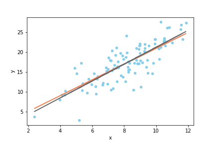

# 第9回 NumPy/SciPy入門

- [第9回 NumPy/SciPy入門](#第9回-numpyscipy入門)
  - [NumPy/SciPyとは](#numpyscipyとは)
  - [NumPyの利点](#numpyの利点)
  - [目標](#目標)
  - [インストールとインポート](#インストールとインポート)
  - [1次元配列の作成](#1次元配列の作成)
  - [ベクトル演算](#ベクトル演算)
  - [インデクシング・スライス](#インデクシングスライス)
  - [ビュー](#ビュー)
  - [乱数の生成](#乱数の生成)
  - [記述統計量](#記述統計量)
  - [線形モデルからのサンプリング](#線形モデルからのサンプリング)
  - [単回帰分析](#単回帰分析)
  - [行列の作成](#行列の作成)
  - [行列のインデクシング](#行列のインデクシング)
  - [行列演算](#行列演算)
  - [行列の記述統計量](#行列の記述統計量)
  - [行列のブロードキャスト](#行列のブロードキャスト)
  - [行列のデータ構造](#行列のデータ構造)
  - [配列を作る様々な方法](#配列を作る様々な方法)
  - [まとめ](#まとめ)
  - [参考書](#参考書)
  - [宿題(ホームワーク)](#宿題ホームワーク)
  - [課題(アサインメント)](#課題アサインメント)

## NumPy/SciPyとは

これまで見てきたように、Pythonには、Rのベクトルのような数値計算に適したデータ型が標準で備わっていません。それはPythonが**汎用プログラミング言語**だからです。Pythonは、一つの仕事に特化した機能を標準で提供するのではなく、標準機能は柔軟性が高く、汎用性の高いものだけを提供し、専門的な機能については、全てモジュールあるいはパッケージの形で、拡張機能として提供する仕組みを採用しています。そのおかげで、世界中の有志のプログラマによって、Pythonの様々な拡張機能が提供され、機械学習、ウェブアプリケーション、GIS、経済実験など、多様な分野で成功を収めて来ました。

今回取り上げる**NumPy**はPythonに高度な数値計算ライブラリを提供するモジュールで、他の様々なライブラリがNumPyに依存しています。Pythonでデータ解析をするならば、NumPyは絶対に避けて通れませんので、今回の講義でしっかりと基礎を押さえましょう。

また、NumPyをベースにした科学計算ライブラリである**SciPy**についても簡単に取り上げます。NumPyの機能は非常に高度で強力ですが、科学の個別の分野には適応していません。統計や物理計算などの個別の分野に特化した計算は、NumPyをベースにした**SciPy**モジュールが提供します。

なお、NumPyやSciPyのような複数のモジュールを集めて作ったモジュールは**パッケージ**と呼ばれます。[リファレンスマニュアル](https://docs.python.org/3/reference/import.html#packages)にあるように、全てのパッケージはモジュールですが、モジュールは必ずしもパッケージではありません。

使う側からすると、あるモジュールがパッケージかどうかということは通常問題になりません。従って、本講義では、区別する必要が生じないかぎり、パッケージのことをモジュールと呼ぶことにします。

## NumPyの利点

NumPyを使う利点は、主に以下のようなものでしょう。

- ベクトルや高次元の配列を扱うことができる
- 種々のベクトル・行列演算が可能
- 標準機能に比べ、演算が高速

中でも**速度**の問題は科学技術計算において重大です。特にPythonのforループによる処理が遅いことはPythonユーザーの間でも有名です。常識的な時間内に、本格的な科学計算を終わらせたいのなら、Pythonのリストやforループ、内包表記と言ったものをコードの主要な部分で使おうとは考えないことです。

NumPyでのベクトル演算が高速な主な理由は、C言語でのプログラミングと同じように、メモリ上で連続した配列(各要素のバイト数は固定)に直接数値を格納し、しかも一つの配列には「整数」や「浮動小数点数」など決まったデータ型の数値しか格納しないからです。

一方、これまで学んできたように、リストを始め、Pythonのコンテナは全て数値そのものではなく、オブジェクトへの参照を格納しています。しかも、オブジェクトのデータ型は、実際にオブジェクトが参照されるまでわかりません。

より具体的にPythonが遅い理由を考えるため、「リストAの要素とリストBの要素を要素ごとに足して、一つのリストを作る」という操作をPythonが処理するときの手順について考えてみるとよいでしょう。第1要素を足し合わせるだけで、以下のプロセスが必要になります。

1. リストA、Bの第1要素に格納されている参照(アドレス)を取得
2. それらの参照をたどって、2つのオブジェクトを取得
3. 2つのオブジェクトの型を調べる
4. `+`演算子が2つの型の間で定義されているか調べる
5. 定義されていなければエラーを返す
6. 定義されていれば2つのオブジェクトから数値を取り出して足す
7. 演算結果の数値をPythonの数値オブジェクトに加工する

少なくともこれだけの操作が、**それぞれの要素**について必要になるはずです。

一方NumPyのベクトルの場合は、一つのベクトルが複数のデータ型を混在させることは通常ありません(注；[Structured array](https://numpy.org/doc/stable/user/basics.rec.html)という高度な方法でデータ型を混在させることができますが、リストのような、型が動的に決まるタイプの柔軟性のある混在ではありません)。従って要素ごとに演算がどのように定義されているか調べる必要はありません。しかもベクトルは参照ではなく数値そのものを格納しているため、参照をたどる時間も必要ありませんし、計算結果を要素ごとにオブジェクト化する時間も必要ありません。これが主な高速化の理由ですが、他にも内部で諸々の効率性のよいアルゴリズムを使っているということがあるでしょう。

## 目標

NumPyやSciPyの様々な機能を1回の講義で幅広く説明することは困難です。そこで、今回は的を絞り、以下の2点の達成を目標とします。

- NumPyで線形モデルに従って疑似データを作成する
- そのデータに対してSciPyで線形回帰を行う

上記の作業を自分でできるようになれば、NumPy/SciPyのマニュアルはインターネット上や書籍で豊富に提供されていますので、他の作業は容易に独学で学ぶことができると思います。

独学の際に有用な資料を以下にリストアップしておきます。

- [NumPyリファレンス](https://numpy.org/doc/stable/reference/)
- [SciPyリファレンス](https://docs.scipy.org/doc/scipy/reference/)
- [NumPyによるデータ分析入門](https://www.amazon.co.jp/NumPy%E3%81%AB%E3%82%88%E3%82%8B%E3%83%87%E3%83%BC%E3%82%BF%E5%88%86%E6%9E%90%E5%85%A5%E9%96%80-%E2%80%95%E9%85%8D%E5%88%97%E6%93%8D%E4%BD%9C%E3%80%81%E7%B7%9A%E5%BD%A2%E4%BB%A3%E6%95%B0%E3%80%81%E6%A9%9F%E6%A2%B0%E5%AD%A6%E7%BF%92%E3%81%AE%E3%81%9F%E3%82%81%E3%81%AEPython%E3%83%97%E3%83%AD%E3%82%B0%E3%83%A9%E3%83%9F%E3%83%B3%E3%82%B0-Umit-Mert-Cakmak/dp/4873118875)

## インストールとインポート

それでは、早速NumPyを使ってみましょう。まず準備として、Anacondaの`base`以外の環境を使っている方は、`numpy`モジュールをインストールする必要があります。

```cmd
conda install numpy
```

NumPyのモジュール名は`numpy`です。ルールではありませんが、`numpy`は`np`という別名で`import`するのが慣習ですので、特に理由がないかぎりそうしましょう。

したがって、次のように`import`してください。以降、`numpy`は`np`の名前で使うことができるようになります。

```python
import numpy as np
```

NumPyの主要なデータ型は`ndarray`という配列型です。NumPyは、配列オブジェクトを作成し、配列オブジェクトを操作するためのモジュールであると考えて概ね間違いはありません。よって、配列を極めることがNumPyを極めることでもあります。

## 1次元配列の作成

本講義では、まず1次元の配列を作る方法に限定して説明し、多次元については必要に応じて随時説明することにします。1次元の配列とは、数値が一列にならんだだけのものであり、**ベクトル**とも呼ばれます。

1次元配列を作る方法は色々とありますが、最も基本的なのは、`array`関数を用いてリスト、タプル、あるいはレンジから作る方法です。

```python
>>> x = np.array([1,2,3,4,5])   # リストから作成
>>> x
array([1, 2, 3, 4, 5])
>>> x = np.array((1,2,3,4,5))   # タプルから作成
>>> x
array([1, 2, 3, 4, 5])
>>> x = np.array(range(10))     # レンジから作成
>>> x
array([0, 1, 2, 3, 4, 5, 6, 7, 8, 9])
>>> type(x)
<class 'numpy.ndarray'>
```

このように、配列を出力すると、`array([...])`という表記で出力されますが、内側の`[]`はPythonのリストとは何の関係もありません。

なお、レンジから配列を作る場合は、以下のような`arange`という関数が別に用意されているので、こちらから作っても良いでしょう。

```python
>>> x = np.arange(10)
>>> x
array([0, 1, 2, 3, 4, 5, 6, 7, 8, 9])
>>> type(x)
<class 'numpy.ndarray'>
```

`x`のデータ型は`ndarray`ですが、`x`が内部にもっている数値データの配列もまた『型』を持ちます。データの型は、`ndarray`オブジェクトの`dtype`属性に収められています。

```python
>>> x.dtype
dtype('int64')
```

この出力は、`x`内部の要素配列が`int64`というNumPyモジュール内で定義されたデータ型を有することを示しています。

`int64`型の数値は、64ビット、つまり8バイトのメモリ領域に格納される整数です。8バイト整数は仮に非負の整数だけに用いれば`0〜2**64-1`の範囲の整数を表すことができますが、`int64`は符号つき整数ですので、`-2**63〜2**63-1`、つまり下が`-9223372036854775808`から上が`9223372036854775807`までの整数を表現することができます。

一つの数値で8バイト占有しますので、`x`の配列全体では80バイト消費しているはずですが、これを確認することができます。`ndarray`型オブジェクトは、属性`nbytes`にオーバーヘッドを除いた占有メモリ量を格納しています。

```python
>>> x = np.arange(10)
>>> x
array([0, 1, 2, 3, 4, 5, 6, 7, 8, 9])
>>> type(x)
<class 'numpy.ndarray'>
>>> x = np.arange(10)
>>> x.nbytes
80
>>> import sys
>>> sys.getsizeof(x)
184
```

上記のように、筆者の環境では`x`全体が184バイト占有していますのでオーバーヘッドは104バイトということになります(オーバーヘッドはNumPyのバージョンや環境に依存しえます)。

`ndarray`オブジェクト内部の数値型は、配列オブジェクトを作成するときに適当なものが自動的に選択されます。上記で数値型が自動的に`int64`になったのは、筆者の環境が64ビット処理系であることに関連しています。

数値型を明示的に指定したい場合は、`array`関数の`dtype`引数に数値型を指定します。たとえば、小さな正整数しか扱わないことが分かっている場合は、メモリを節約するために、数値型を符号なし16ビット整数に設定したいということがあるかもしれません。その場合は、`array`関数の`dtype`引数に数値型を指定します。

```python
# arrayを使う場合
>>> x = np.array(range(10),dtype=np.uint16)
>>> x
array([0, 1, 2, 3, 4, 5, 6, 7, 8, 9], dtype=uint16)
>>> x.nbytes
20
```

```python
# arangeを使っても同じ
>>> x = np.arange(10,dtype=np.uint16)
>>> x
array([0, 1, 2, 3, 4, 5, 6, 7, 8, 9], dtype=uint16)
>>> x.nbytes
20
```

これで使用メモリを`1/4`まで削減できました(ただしオーバーヘッド除く)。ここで`uint16`は"unsigned integer 16 bits"(符号なし16ビット整数)を表すデータ型であり、NumPyモジュール内で`uint16`という名前で定義されています。

NumPyには、主に以下のようなデータ型があります。

|数値型|意味|
|--|--|
|`int8`|8ビット符号付き整数|
|`int16`|16ビット符号付き整数|
|`int32`|32ビット符号付き整数|
|`int64`|64ビット符号付き整数|
|`uint8`|8ビット符号なし整数|
|`uint16`|16ビット符号なし整数|
|`uint32`|32ビット符号なし整数|
|`uint64`|64ビット符号なし整数|
|`float16`|16ビット浮動小数点数|
|`float32`|32ビット浮動小数点数|
|`float64`|浮動小数点数(通常64ビット、処理系依存)|
|`complex64`|64ビット複素数|
|`complex128`|複素数(通常128ビット、処理系依存)|
|`bool`|ブール値(1バイト)|
|`unicode`|固定長文字列|
|`object`|オブジェクトの参照(通常8バイト、処理系依存)|

## ベクトル演算

NumPy配列は、Rのベクトルによく似たベクトル演算をサポートしています。つまり、同じサイズの２つの配列に二項演算子を施すと、要素ごとの演算を実行します。

```python
>>> x = np.array([0,2,4,6,8])
>>> y = np.array([1,2,2,3,4])
>>> x + y
array([ 1,  4,  6,  9, 12])
>>> x - y 
array([-1,  0,  2,  3,  4])
>>> x * y
array([ 0,  4,  8, 18, 32])
>>> x / y
array([0., 1., 2., 2., 2.])
```

四則演算だけでなく、比較演算子もベクトル化されます。

```python
>>> x = np.array([0,5,10])
>>> y = np.array([3,2,10])
>>> x > y
array([False,  True, False])
>>> x >= y
array([False,  True,  True])
>>> x == y
array([False, False,  True])
>>> x != y
array([ True,  True, False])
```

ベクトルとスカラーの二項演算もサポートされています。

```python
>>> x = np.arange(10)
>>> x
array([0, 1, 2, 3, 4, 5, 6, 7, 8, 9])
>>> x + 3
array([ 3,  4,  5,  6,  7,  8,  9, 10, 11, 12])
```

上記の場合、NumPyは、`x`と同じで全ての要素が3であるNumPy配列を作成し、それと`x`のベクトル演算を行います。つまり、本質的に次の演算が行われます。

```python
>>> x + np.array([3] * 10)
array([ 3,  4,  5,  6,  7,  8,  9, 10, 11, 12])
```

より一般に、NumPyは、形状の異なる配列同士のベクトル演算を行うとき、小さい方の配列を変形して大きい方に形状を合わせてから演算を行います。これを**ブロードキャスト**と言います。

1次元配列においてブロードキャストが可能なのは、一方がスカラーもしくは要素が一つしかないリストや配列の場合だけです。それ以外の場合はエラー(ValueError)が出ます。

```python
>>> x
array([0, 1, 2, 3, 4, 5, 6, 7, 8, 9])
>>> x + np.array([1,2,3])
Traceback (most recent call last):
  File "<stdin>", line 1, in <module>
ValueError: operands could not be broadcast together with shapes (10,) (3,) 
```

多次元配列のブロードキャストルールはもう少し複雑です。これについては、あとで行列を扱うときに説明します。

## インデクシング・スライス

NumPyの配列は、Pythonのリストと同じように、インデックス参照およびスライス記法によって要素を取得したり、部分配列を取得できます。

```python
>>> x
array([0, 1, 2, 3, 4, 5, 6, 7, 8, 9])
>>> x[5]
5
>>> x[-1]
9
>>> x[3:7]
array([3, 4, 5, 6])
>>> x[:6]
array([0, 1, 2, 3, 4, 5])
>>> x[4:]
array([4, 5, 6, 7, 8, 9])
>>> x[::2]
array([0, 2, 4, 6, 8])
>>> 
```

代入文の左辺にインデックス参照やスライス記法を用いることもできますが、左辺と右辺の形状が違う場合はブロードキャストのルールが適用されます。

```python
>>> x
array([0, 1, 2, 3, 4, 5, 6, 7, 8, 9])
>>> x[4] = 100
>>> x
array([  0,   1,   2,   3, 100,   5,   6,   7,   8,   9])
>>> x[3:6] = [300,400,500]
>>> x
array([  0,   1,   2, 300, 400, 500,   6,   7,   8,   9])
>>> x[3:6] = np.array([10,10])
Traceback (most recent call last):
  File "<stdin>", line 1, in <module>
ValueError: could not broadcast input array from shape (2,) into shape (3,)
```

上記の最後の例では、3つの要素をもつスライスに2つしか要素を持たないベクトルを代入しようとしたため、エラーが出ました。

## ビュー

実は、配列のスライスによって得られるものは、**ビュー**(view)というNumPy特有のオブジェクトです。ビューは始めて現れる概念だけでなく、理解していないと意図しないデータ操作をしてしまうことになりますので、少し丁寧に解説しておきます。

たとえば次のようにして`x`のスライスを作って`y`に代入したとしましょう。

```python
>>> x = np.arange(10)
>>> y = x[2:8:2]
>>> x
array([0, 1, 2, 3, 4, 5, 6, 7, 8, 9])
>>> y
array([2, 4, 6])
```

NumPy配列は内部に、生の数値データが収められた配列を持っていることを思い出しましょう。上記のようにスライス記法で`y`を作成すると、`y`は`x`と異なるオブジェクトでありながら、数値データの配列は`x`と共有した状態になります。


これは次のようにして確かめることが出来ます。まず、`x`と`y`が異なるオブジェクトであることを確かめておきましょう。

```python
# %%
import numpy as np
x = np.arange(10)
y = x[2:8:2]
print("x:",x)
print("y:",y)
print("x is y:",x is y)         # x is y?
print("x is at",hex(id(x)))     # xのアドレス
print("y is at",hex(id(y)))     # yのアドレス
```

```python
# 出力

x: [0 1 2 3 4 5 6 7 8 9]
y: [2 4 6]
x is y: False
x is at 0x7f04b60c5e70
y is at 0x7f04fc0a8cf0
```

NumPy配列は、内部の数値データ配列の情報を直接取得することができるようになっています。この情報は、`__array_interface__`という属性に辞書の形で収められています。これを出力してみましょう。

```python
# %%
print("x:")
for key,value in x.__array_interface__.items():
    print(' ',key,value)

print("y:")
for key,value in y.__array_interface__.items():
    print(' ',key,value)
```

```python
# 出力

print("x:")...
x:
  data (38235568, False)
  strides None
  descr [('', '<i8')]
  typestr <i8
  shape (10,)
  version 3
y:
  data (38235584, False)
  strides (16,)
  descr [('', '<i8')]
  typestr <i8
  shape (3,)
  version 3
```

上記のように`__array_interface__`属性は6個のエントリーをもつ辞書ですが、特に重要なのは以下のエントリーです。

|キー|内容|
|--|--|
|`data`|`(データのアドレス,読み出し属性)`|
|`strides`|ストライド|
|`typestr`|数値データの型|
|`shape`|配列の形状|

`data`はタプルですが、その１つめの要素はデータ配列のアドレスであり、`x`と`y`のアドレスがきっかり16バイト違うことに注目してください。読み出し属性は、`True`なら読み出し専用、`False`なら書き込みもできます。

`np.int64`型のデータは一つの数値で8バイト占有しますので、上記の結果は、`y`のデータは、`x`のデータの2区画先から始まっていることを表しています。

次に`strides`ですが、これは、**ストライド**(歩幅)と言って、ビューにおいて隣り合う数値データの間のアドレスの間隔をバイトで表したものです。`x`のほうはビューではないので`None`になっています(数値データは隙間なくメモリ上にならんでいます)。一方`y`のほうは、ストライドが16バイトですので、数値データの間隔は2区画分、つまり一つとばしで並んでいることが分かります。

`typestr`は数値の型を表す文字列ですが、最初の文字`<`は、リトルエンディアンを表します。もしここが`>`になっていればビッグエンディアンです。`i8`は、8バイト(64ビット)整数(integer)を表します。もし浮動小数点数ならば`i`の代わりに`f`(floating point number)と表示されます。

最後に`shape`ですが、これは要素の数ですので、特に説明はいらないでしょう。

このように、`x`と`y`は違うNumPy配列オブジェクトでありながら、データを共有していることが分かります。２つの配列オブジェクトがメモリを共有しているかどうかは、`numpy`モジュールの`shares_memory`関数で調べることができます。

```python
>>> np.shares_memory(x,y)
True
```

このように、`x`とそのビューである`y`はデータを共有しているので、`y`の変更は`x`に影響を及ぼします。

```python
>>> y[0] = 100
>>> x
array([  0,   1, 100,   3,   4,   5,   6,   7,   8,   9])
```

なお、ビューの親となっている元のオブジェクトはビューの`base`という属性に格納されています。

```python
>>> y.base
array([  0,   1, 100,   3,   4,   5,   6,   7,   8,   9])
>>> y.base is x
True
```

またビューのストライドは、`strides`という属性にも格納されています。

```python
>>> x = np.arange(10)
>>> y = x[2:8:2]
>>> y.strides
(16,)
```

## 乱数の生成

NumPyには`random`という乱数発生用のモジュールが含まれています。`random`には、正規乱数や一様乱数など、様々な種類の乱数を生成する関数が定義されており、シミュレーションに重宝しますので、是非活用できるようになってください。以下、それらのごく一部を紹介します。

|関数|分布|
|--|--|
|`normal`|正規分布|
|`random`|区間`[0,1)`の一様分布|
|`uniform`|任意区間の一様分布|
|`poisson`|ポワソン分布|
|`randint`|離散一様分布|
|`gumbel`|ガンベル分布|

その他の乱数生成関数や個々の関数の詳しい使い方については、NumPy[リファレンス](https://numpy.org/doc/stable/reference/random/index.html?highlight=random#module-numpy.random)を参照してください。

例えば、標準正規分布からサイズ20のサンプルを取得するには、次のようにします。

```python
>>> x = np.random.normal(0,1,20)
>>> x
array([ 0.09725553,  2.00971439, -0.58210648,  1.54395503,  0.45286862,  1.11726181, -0.4284753,  0.54515861, -0.87370196,  0.01872232, -0.71166122, -0.91043368, 1.03194197,  1.17382845, -0.11945387, -0.6825217 , 0.62068263,  0.22084924, -0.74841417, -0.65386876])
>>> len(x)
20
```

`normal`の第1引数は期待値、第2引数は標準偏差、第3引数はサンプルサイズです。

なお、**乱数のシード値**を具体的に与えない場合は、Pythonを起動するごとに異なった乱数列が得られます。

```python
>>> np.random.normal(0,1,5)
array([-1.16956415, -1.10909057,  1.11722481,  0.65070696,  0.66218606])
>>> np.random.normal(0,1,5)
array([ 0.81478851, -1.3194389 ,  0.91750309, -0.41069239, -0.52968867])
>>> np.random.normal(0,1,5)
array([-0.29362213, -0.82283927,  1.99318359, -0.62032484,  0.12263955])
```

毎回必ず決まった乱数列がほしい場合は、以下のようにして[`default_rng`関数](https://numpy.org/doc/stable/reference/random/generator.html)を用いて新しい**乱数ジェネレータオブジェクト**を作成します。

```python
>>> rng = np.random.default_rng(123)
>>> type(rng)
<class 'numpy.random._generator.Generator'>
```

`default_rng`に与える引数は整数ならば何でも構いません。戻り値は乱数ジェネレータオブジェクトであり、これは`random`モジュールと同じように使うことができます。

```python
>>> rng.normal(0,1,10)
array([-0.98912135, -0.36778665,  1.28792526,  0.19397442,  0.9202309, 0.57710379, -0.63646365,  0.54195222, -0.31659545, -0.32238912])
```

なお、配列には`round`という**丸め**のためのメソッドが備わっています。引数には小数点以下に残す桁数を指定します。

```python
>>> x = rng.normal(0,1,10)
>>> x
array([ 0.09716732, -1.52593041,  1.1921661 , -0.67108968,  1.00026942, 0.13632112,  1.53203308, -0.65996941, -0.31179486,  0.33776913])
>>> x.round(3)    # 小数点以下3桁に丸める
array([ 0.097, -1.526,  1.192, -0.671,  1.   ,  0.136,  1.532, -0.66, -0.312,  0.338])
```

## 記述統計量

NumPy配列には、要素の平均や分散などの記述統計量を計算する関数やメソッドが標準で備わっています。

|メソッド|統計量|
|--|--|
|`mean`|平均|
|`var`|分散|
|`std`|標準偏差|
|`sum`|総和|

```python
>>> x = np.random.normal(0,1,10)
>>> x.mean().round(3)
0.049
>>> x.sum().round(3)
0.495
>>> x.var().round(3)
1.292
>>> x.std().round(3)
1.137
```

ただし、`arr`を配列とすると、`arr.var()`はデフォルトでは平均との差の二乗和をサンプルサイズ`len(arr)`で割ったものになるので注意してください([varのマニュアル](https://numpy.org/doc/stable/reference/generated/numpy.var.html#numpy.var))。不偏分散がほしいときは、オプション引数`ddof`に1を設定する必要があります。`ddof`はDelta Degrees of Freedom(自由度の差分)であり、自由度は`len(arr)-ddof`に設定されます(分散=平均との差の二乗和/自由度です)。標準偏差を計算する`std`についても同様です。

```python
>>> x.var(ddof=1).round(3)  # 不偏分散
1.435
>>> x.std(ddof=1).round(3)  # 不偏分散の平方根
1.198
>>> np.sqrt(x.var(ddof=1)).round(3)
1.198
```

なお、`sqrt`関数は平方根を計算するNumPyの関数です。

## 線形モデルからのサンプリング

それではいよいよ、線形モデルからサンプリングを行います。この線形モデルでは、`x`という独立変数と、`y`という従属変数があるとします。次のようなモデルを考えましょう。

```python
# %%
y = b0 + b1 * x + e
```

ここで`b0`が定数項(切片)、`b1`は傾き、`e`は正規分布に従う期待値0の乱数とします。以下では、このモデルからサンプリングによって得られた擬似的データに単回帰分析を行い、`b0`および`b1`の推定値を求めます。なお、`b1`の推定値がいわゆる回帰係数となります。

回帰分析において独立変数は定数として扱われますので、分布は何でも構いませんが、ここでは期待値8、標準偏差2の正規分布を仮定しましょう。また、乱数項の標準偏差は3であると仮定します。

```python
# %%
import numpy as np
x = np.random.normal(8,2,100)
e = np.random.normal(0,3,100)
y = 1 + 2 * x + e
```

これで独立変数値の列`x`、乱数項の列`e`、従属変数値の列`y`が全て配列として得られました。`y`を求めるときにブロードキャストを利用して定数項とベクトルの演算を行ったことに注意してください。

## 単回帰分析

単回帰分析には、SciPyモジュールを使います。SciPyには`stats`という統計モジュールが含まれていますので、それをインポートしましょう。

```python
# %%
from scipy import stats
```

上記の`from-import`命令では、`scipy`モジュールの`stats`というサブモジュールだけを読み込んでいます。なお、一般に次のように書くことで、モジュールから、特定のサブモジュールや関数、属性(モジュール内のグローバル名前空間で定義されている変数)だけを読み込むことができます。

```python
from module import sub
```

ここで`sub`はサブモジュールあるいは関数名や属性名です。

単回帰分析には、`stats`モジュール内の`linregress`関数を使います。第1引数が独立変数で、第2引数が従属変数です。

```python
# %%
res = stats.linregress(x,y)
type(res)
```

```python
# 出力

scipy.stats._stats_mstats_common.LinregressResult
```

上記のように、結果は`LinregressionResult`型のオブジェクトとして返されます。このオブジェクトは、以下の属性を持っています。

|属性|意味|
|--|--|
|`slope`|回帰係数のOLS推定値|
|`stderr`|`slope`の標準誤差|
|`pvalue`|`slope`のP値(両側t検定)|
|`rvalue`|相関係数R|
|`intercept`|切片のOLS推定値|
|`intercept_stderr`|`intercept`の標準誤差|

これらを順番に表示してみましょう。

```python
# %%
coeffs = ['slope','stderr','pvalue','rvalue','intercept','intercept_stderr']
for cf in coeffs:
    value = round(eval("res." + cf),3)
    print(cf + ": ",value)
```

```python
# 出力

slope:  2.083
stderr:  0.177
pvalue:  0.0
rvalue:  0.765
intercept:  1.058
intercept_stderr:  1.425
```

上記のように、傾きや切片が概ね正しく推定されています。また傾きのP値はほぼ0ですので、傾きが統計的に有意に0から離れていることが分かります。

なお、linregressが計算するP値は両側検定のP値ですので、片側検定の場合はその半分の値となります。

なお、上記のモデル、疑似データ、回帰直線をプロットすると、以下の図のようになります。オレンジの線が真のモデル、灰色の線が推定された回帰直線です。

こうした図を作成する方法については、次回の講義で取り扱います。



## 行列の作成

初歩的なデータ解析においても重要になる2次元配列について、少し取り扱っておきたいと思います。

1次元配列をベクトルであるとすれば、2次元配列は行列です。(`matrix`という行列を表す特別な型もありますが、本稿では扱いません。)行列を作るには、まず行列のもとになる入れ子になったリストを作成します。

下図のような行列を作成するとします。


この場合、次のような入れ子のリストを作成します。

```python
# %%
arr_like = [[0,1,2],[3,4,5],[6,7,8]]
```

このリストにおいて、第1要素が行列の1行目、第2要素が2行目、第3要素が3行目に相当します。この`arr_like`リストをNumPyの`array`関数に渡すことにより、行列が作成されます。

```python
# %%
arr2d = np.array(arr_like)
arr2d
```

```python
# 出力
array([[0, 1, 2],
       [3, 4, 5],
       [6, 7, 8]])
```

もう一つの作り方は、1次元配列を作ってから`reshape`メソッドによって行列化することです。

```python
# %%
arr_nums = np.arange(9).reshape((3,3))
arr_nums
```

ここで`reshape`の引数には、`(行数、列数)`のタプルを与えます。

```python
# 出力
array([[0, 1, 2],
       [3, 4, 5],
       [6, 7, 8]])
```

## 行列のインデクシング

配列の要素にアクセスするときは、行・列のインデックスをコンマでつないで指定します。

```python
# %%
# 1行2列の要素

print(arr2d[1,2])
```

```python
# 出力
5
```

1次元のときと同じように、スライス記法も使用可能です。たとえば、0～1行目、1～2列目の部分行列を取り出したいときは、次のようにします。

```python
# %%
arr2d[0:2,1:3]
```

```python
# 出力

array([[1, 2],
       [4, 5]])
```

ただし、スライスで得られるのは、1次元配列の場合と同様コピーではなくビューであることに注意してください。

```python
# %%
arr2d_view = arr2d[0:2,1:3]
np.shares_memory(arr2d_view,arr2d)
```

```python
# 出力
True
```

インデックスを1つだけ指定すると、特定の行を取得できます。

```python
# %%
arr2d[1]
```

```python
# 出力

array([3, 4, 5])
```

列を取得するときは行をスライスする必要があります。

```python
# %%
arr2d[:,1]
```

```python
# 出力
array([1, 4, 7])
```

ただしこのようにすると、戻されるビューは次元が落ちてしまいます。もとの配列の次元を維持するには、列もスライスにします。

```python
# %%
arr2d[:,1:2]
```

```python
array([[1],
       [4],
       [7]])
```

## 行列演算

NumPyの行列には、通常の線形代数で用いるような行列演算がサポートされています。

二つの行列の積をとるときは、演算子`@`を使います。

```python
# %%
arr1 = np.array([[1,2],[3,4]])
arr2 = np.array([[1,3],[2,4]])
arr3 = arr1 @ arr2
print("arr1:")
print(arr1)
print("\narr2:")
print(arr2)
print("\narr1 @ arr2:")
print(arr3)
```

```python
# 出力

arr1:
[[1 2]
 [3 4]]

arr2:
[[1 3]
 [2 4]]

arr1 @ arr2:
[[ 5 11]
 [11 25]]
```

行列とベクトルの間の積についても、`@`が使えます。

```python
# %%
vec1 = np.array([-1,5])
vec2 = arr1 @ vec1
print("arr1:")
print(arr1)
print("\nvec1:")
print(vec1)
print("\narr1 @ vec2:")
print(vec2)
```

```python
# 出力
arr1:
[[1 2]
 [3 4]]

vec1:
[-1  5]

arr1 @ vec2:
[ 9 17]
```

行列の転置は、`transpose`メソッドもしくは`T`属性を用いることができます。

```python
# %%
print("arr1:")
print(arr1)
print("\narr1.T")
print(arr1.T)
print("\narr1.transpose()")
print(arr1.transpose())
```

```python
# 出力

arr1:
[[1 2]
 [3 4]]

arr1.T
[[1 3]
 [2 4]]

arr1.transpose()
[[1 3]
 [2 4]]
```

## 行列の記述統計量

行列についても、記述統計量を計算するメソッドをそのまま使うことができます。たとえば、全ての要素の平均は`mean`メソッドによって得られます。

```python
# %%
arr = np.arange(9).reshape((3,3))
print("arr:")
print(arr)
print("\narr.mean():")
print(arr.mean())
```

行ごとの平均、列ごとの平均をとるときは、`axis`引数を設定します。このとき、`axis=0`で行方向の平均(つまり列ごとの平均)、`axis=1`で列方向の平均(つまり行ごとの平均)を計算できます。

```python
# %%
arr = np.arange(9).reshape((3,3))
print("arr:")
print(arr)
print("\narr.mean(axis=0):")
print(arr.mean(axis=0))
print("\narr.mean(axis=1):")
print(arr.mean(axis=1))
```

```python
# 出力

arr:
[[0 1 2]
 [3 4 5]
 [6 7 8]]

arr.mean(axis=0):
[3. 4. 5.]

arr.mean(axis=1):
[1. 4. 7.]
```

`axis`の指定の仕方がRの`margin`とは逆なので気を付けてください。Rの`margin=1`がNumPy行列の`axis=1`、`margin=2`が`axis=0`に相当します。

`axis`引数は、他の統計量関連のメソッド(`sum`、`var`、`std`など)でも利用可能ですので、調べてみてください。

## 行列のブロードキャスト

行列においては、ブロードキャストにより、行列とベクトル、行列とスカラーの演算が可能になります。

行列とスカラーの演算については、ベクトルの場合と同じで、スカラーの方が行列と同じ形状に変換されます。

一方、行列とベクトルの演算については、ベクトルは、行列の行と同じ形状もしくは列と同じ形状をもつ必要があります。

たとえば、次のように、ベクトルが行列の行と同じ形状をもつ場合、NumPyは当のベクトルを行方向に複製して行列にキャスト(型変換)します。

```python
# %%
arr = np.array([[1,2,3],[4,5,6]])
vec = np.array([2,2,2])
print("arr:")
print(arr)
print("\nvec:")
print(vec)
print("\narr + vec:")
print(arr + vec)
```

同様に、ベクトルが行列の列と同じ形状を持つ場合は、列方向に複製することで行列にキャストされます。

```python
# %%
arr = np.array([[1,2,3],[4,5,6]])
vec = np.array([[2],[2]])
print("arr:")
print(arr)
print("\nvec:")
print(vec)
print("\narr + vec:")
print(arr + vec)
```

```python
# 出力
arr:
[[1 2 3]
 [4 5 6]]

vec:
[[2], [2]]

arr + vec:
[[3 4 5]
 [6 7 8]]
```

## 行列のデータ構造

行列は、概念的には表の形をしていますが、メモリに物理的に格納される際には、1次元の配列として格納されています。

この事実は、行列のスライスをとってビューを作成してみると良く分かります。

```python
# %%
arr_like = [[1,2,3],[4,5,6],[7,8,9]]
arr = np.array(arr_like)
arr2 = arr[0:2,0:2]

print("Original:")
print(arr)
print()

for key,value in arr.__array_interface__.items():
    print(key,value)

print("\nView:")
print(arr2)
print()

for key,value in arr2.__array_interface__.items():
    print(key,value)
```

```python
# 出力

Original:
[[0 1 2]
 [3 4 5]
 [6 7 8]]

data (1882324077584, False)
strides None
descr [('', '<i4')]
typestr <i4
shape (3, 3)
version 3

View:
[[0 1]
 [3 4]]

data (1882324077584, False)
strides (12, 4)
descr [('', '<i4')]
typestr <i4
shape (2, 2)
version 3
```

重要なのは、ビューのストライドが`(12,4)`になっていることです。これは、

- 次の行へ進むときは、12バイト先へ飛んでください
- 次の列へ進むときは、4バイト先へ飛んでください

という意味です。また、データの型は`<i4`ですので、4バイト整数であることが分かります。すなわち、一つの数値で4バイトメモリを占有します。

これらを総合すると、データは実際には数のように直線的に格納されていて、それを行列の形に見せているだけだということが分かります。


このように、多次元配列構造を1次元的にメモリに保存することは計算機科学ではありふれたことですので、覚えておきましょう。

(余談ですが、Rでは、FORTRAN型の行列を継承しており、データは列ごとにメモリに格納されますが、NumPyでは、C型の行列を継承しており、データは行ごとにメモリに格納されます。データ解析においては、列を変数、行をオブザベーションとすることがほとんどですので、FORTRAN型行列のほうが自然です。次回紹介するpandasのデータフレームでは、内部でNumPy行列を用いてデータを格納していますが、その際、**NumPy行列の行をデータフレームの列として使う**ことで、FORTRAN型のデータフレームを実現しています。RとPythonがそれぞれ、FOTRANとCからどれだけ多くの物を受け継いでいるか調べてみてください。)

## 配列を作る様々な方法

配列は様々な方法で作ることができます。配列を作成するNumPy関数の一部を以下に列挙しておきます。全ての配列作成関数については[NumPyのリファレンスマニュアル](https://numpy.org/doc/stable/reference/routines.array-creation.html)を参照してください。

まずは、形状を`(行数、列数)`のようにタプルで与える関数です。スカラーを与えると1次元配列になります。

|関数|意味|用例|
|--|--|--|
|`ones`|全てが1の配列を作る|`np.ones((2,3))`|
|`zeros`|全てが0の配列を作る|`np.zeros((2,3))`|
|`full`|全てが同じ値の配列を作る|`np.full((2,3),5)`|

次に、`_like`系の関数です。これらについては、ある既存の配列を引数に与えて、それと同じ形状の配列を作ります。

|関数|意味|用例|
|--|--|--|
|`ones_like`|全てが1の配列を作る|`np.ones_like(arr)`|
|`zeros_like`|全てが0の配列を作る|`np.zeros(arr)`|
|`full_like`|全てが同じ値の配列を作る|`np.full(arr,5)`|

## まとめ

今回の講義では、以下のことを学びました。

- NumPy1次元配列の作成
- ベクトル演算
- 配列のスライスとビュー
- 乱数の生成
- 線形モデルのシミュレーション
- SciPyの単回帰分析
- 行列の作成・操作
- 行列のデータ構造
- 記述統計量の計算

分量の都合上、NumPy配列の機能のごく一部しか紹介できませんでした。NumPyのマスターはデータ分析において非常に重要ですので、参考書やNumPyのリファレンスマニュアルを読んで勉強しておいてください。

また、SciPyには、[`linalg`](https://docs.scipy.org/doc/scipy/reference/linalg.html)というモジュールがあり、NumPy配列のための線形代数ライブラリを提供しています。例えば特異値分解(関数`svd`)など、多変量解析で不可欠になる機能が多数実装されているので、是非試していただきたいと思います。

今回、3次元以上のNumPy配列については扱いませんでしたが、深層学習などの分野においては中心的な役割を演じる重要なデータ構造ですので、機会があれば資料に足していきたいと思います。

## 参考書

以下の参考書が、薄くて読みやすくかつ内容も大変充実しています。

- [『NumPyによるデータ分析入門』](https://www.amazon.co.jp/NumPy%E3%81%AB%E3%82%88%E3%82%8B%E3%83%87%E3%83%BC%E3%82%BF%E5%88%86%E6%9E%90%E5%85%A5%E9%96%80-%E2%80%95%E9%85%8D%E5%88%97%E6%93%8D%E4%BD%9C%E3%80%81%E7%B7%9A%E5%BD%A2%E4%BB%A3%E6%95%B0%E3%80%81%E6%A9%9F%E6%A2%B0%E5%AD%A6%E7%BF%92%E3%81%AE%E3%81%9F%E3%82%81%E3%81%AEPython%E3%83%97%E3%83%AD%E3%82%B0%E3%83%A9%E3%83%9F%E3%83%B3%E3%82%B0-Umit-Mert-Cakmak/dp/4873118875)(Umit Mert Cakmak, Mert Cuhadaroglu著、山崎 邦子 (翻訳), 山崎 康宏 (翻訳))(2019) オライリージャパン. ISBN-13: 978-4873118871.

## 補遺

1. スライスの代わりに、取り出したい行あるいは列を明示的にリストによって指定するインデクシングの方法を**ファンシーインデックス**参照と言います。たとえば、`arr2d`から0行目と2行目だけを取り出したい場合は次のようにします。ファンシーインデックス参照を試してみなさい。そのうえで、それが元の配列のビューではなくコピーを作ることを確認し、なぜそのようになっているのか、ストライドの概念を用いて考察してみなさい。

    ```python
    # %% 
    # ファンシーインデックス参照
    # コピーを作る
    x = arr2d[[0,2],:]
    print(x)

    # 見かけ上同じだがスライス記法
    # ビューを作る 
    y = arr2d[0::2,:]
    print(y)
    ```

2. SciPyの`linalg`モジュールを用いて、行列の固有値・固有ベクトルを計算してみなさい。
3. 以下のように3次元NumPy配列を作成し、それがどのように表示されるか確認しなさい。`sum`メソッドでAxis0、Axis1、Axis2方向に和をとり、何が起きているのか考察しなさい。

    ```python
    # %%
    arr3d = np.arange(27).reshape((3,3,3))
    sum0 = arr3d.sum(axis=0)
    sum1 = arr3d.sum(axis=1)
    sum2 = arr3d.sum(axis=2)
    ```

4. `ndarray`の`view`メソッドを用いると、データ型を変えたビューを作成することができます。以下では、`array`関数の引数`dtype='<i2'`でリトルエンディアン2バイト整数型の配列`x`を作った後、`view`メソッドの`dtype='i1'`引数で1バイト整数型のビュー`y`を作っています。なぜ`y`の出力がこのようになるのか、考察してみてください。さらに、`y`に何らかの演算を施して、`x`がどのように変化するか観察してみてください。

    ```python
    # %%
    x = np.array([256,256],dtype='<i2')
    y = x.view(dtype='i1')
    print(y)
    ```

    ```python
    # 出力
    [0 1 0 1]
    ```
