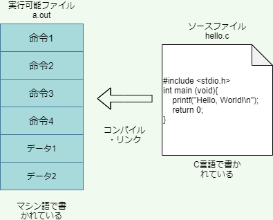

# 第1回 プログラミング概論

- [第1回 プログラミング概論](#第1回-プログラミング概論)
  - [Pythonの実行方法](#pythonの実行方法)
  - [REPLによる対話的実行](#replによる対話的実行)
    - [練習1](#練習1)
  - [コマンドラインによる実行](#コマンドラインによる実行)
    - [練習2](#練習2)
  - [2進数と16進数](#2進数と16進数)
  - [コンピューターの仕組み](#コンピューターの仕組み)
  - [メモリの仕組み](#メモリの仕組み)
  - [CPUの働き](#cpuの働き)
  - [マシン語](#マシン語)
  - [プログラミング言語の種類](#プログラミング言語の種類)
    - [コンパイル型言語](#コンパイル型言語)
    - [インタープリタ型言語](#インタープリタ型言語)
    - [アセンブリ言語](#アセンブリ言語)
  - [抽象度](#抽象度)
  - [プログラミング上達のコツ](#プログラミング上達のコツ)
    - [正しいタイピング](#正しいタイピング)
    - [キーバインド](#キーバインド)
    - [写経](#写経)
  - [まとめ](#まとめ)
  - [参考書](#参考書)
  - [補遺(メモリ上での数の表現)](#補遺メモリ上での数の表現)
    - [符号なし整数](#符号なし整数)
    - [符号つき整数](#符号つき整数)
    - [小数](#小数)
    - [エンディアン](#エンディアン)

## Pythonの実行方法

まずはPythonを動かしてみましょう。Pythonを動かすには、様々な方法がありますが、そのうち、代表的なものは次の3つです。

1. REPLで一行ずつ対話的(インターラクティブ)に実行
2. Pythonスクリプトを作成してコマンドラインから実行
3. VSCode内でセル(コードブロック)ごとに対話的に実行([第2回講義参照](./programming-2.md))

## REPLによる対話的実行

まずはREPL(Read-Eval-Print Loop)を用いた対話的実行を行ってみましょう。

ウィンドウズを起動して、画面の左下の検索ウィンドウにAnacondaと打ち込んで、Anaconda Promptを起動しましょう（Anaconda Powershell Promptでも構いません）。Anacondaを起動したら、pythonと入力し、pythonの対話的インタープリタREPLを起動しましょう。プロンプトと呼ばれる`">>>"`記号が現れて、入力待ちの状態になります。

REPLは、Pythonのコードを1行ごとに評価し、即時にその結果を表示してくれるシステムです。小さなコード断片の挙動を確かめる際などに便利です。

Pythonには、整数や計算式などはそれ自体がPythonのコードと見なされるという特徴があります。そのおかげで、PythonのREPLを計算機として用いることができます。たとえば、何でも良いので、簡単な足し算や引き算をREPLに入力してみましょう。（入力の最後にはEnterキーを押します。）

```python
>>> 1 + 1
2
>>> 10 - 5
5
>>> 3 * 2
6
>>> 8 / 2
4.0
>>> 11 // 3
3
>>> 11 % 3
2
>>> 5 ** 3
125
```

このように、REPLは簡単な計算機として用いることができます。なお、Pythonにおける2項算術演算子は以下の通りです。

| 演算子 | 機能                       |
| ------ | -------------------------- |
| +      | 可算                       |
| -      | 減算                       |
| *      | 乗算                       |
| **     | べき乗                     |
| /      | 除算                       |
| //     | 整数除算（余りを切り捨て） |
| %      | 剰余                       |

上記の表は教科書のセクション3.1にもありますので確認しておいてください。

なお3つ以上の数の演算を行うには、演算子の優先順位に気を付けなければならないのはRと同じです。たとえば

```python
>>> 2 + 3 * 5
17
```

のように掛け算は足し算よりも先に評価されます。演算子の評価順序を明確にしたいときは、丸カッコを使います。

```python
>>> (2 + 3) * 5
25
```

演算子の優先順位については教科書のセクション3.6(pp. 107)に解説がありますので、読んでおいてください。ただし、計算式においては、演算子の評価順序には頼り過ぎると読みにくいコードになってしまうので、むしろ丸カッコを積極的に使うことが望ましいです。

### 練習1

次の計算をPythonで実行したらどのような結果が得られるかを予測しなさい。

```python
# Q1
>>>(5 % 3) ** (7 // 2)
```

```python
# Q2
>>>(5.5 - 2.5 + 3.0) * 2.0
```

上記Q1, Q2の予測をREPLで確かめられたら、同じように様々な計算を自分で考えてREPLで実行し、予測と一致するか確かめなさい。

----

それでは、次にもう少し高度なことをしてみます。以下のように入力して、変数xに整数1を代入し、xの値を表示してみましょう。

```python
>>> x = 1
>>> x
1
```

このように、'='記号を使うと左辺の変数に右辺の値を代入できます。(Rでは、同様の操作に'<-'という矢印演算子を用います。)

それでは、さらに変数を用いて色々な演算をしてみましょう。

```python
>>> x = 1
>>> y = 2
>>> x + y + 3
6
>>> z = y + 1
>>> x - z
-2
>>> x = z ** y
>>> x
9
>>> x = x - 1
>>> x
8
```

このように、変数は演算の中で用いることができます。

最後に"Hello, World!"を出力しておきましょう。これについても、Rと全く同じですので、説明はほとんど要らないでしょう。(実際、Rのコードと見分けがつきません。)

```python
>>> print("Hello, World!")
Hello, World!
```

Rと同じように、ダブルクォーテーションでくくられた部分は、Pythonにより文字列と解釈されます。printは、引数に与えられた文字列や数を画面に出力するだけの関数です。

REPLを終了してAnaconda promptに戻るときは、次のように入力します。

```python
>>>exit()
```

## コマンドラインによる実行

それでは次に、Pythonのコードをファイルに保存してコマンドラインから実行する方法を試してみましょう。Anaconda promptで次のように入力し、メモ帳を起動してください。

```anaconda
(base) C:\Users\hogehoge>notepad
```

メモ帳が起動したら、次のように記述して、保存しましょう。保存する際、ファイル名は`hello`にしてください。

```python
print("Hello, World!")
```

次にファイルを保存して閉じ、Anaconda promptで次のように入力すると、ファイルに記述したPythonコードを実行することができます。

```anaconda
(base) C:\Users\hogehoge>python hello.txt
Hello, World!

```

なお、Pythonコードを記述するファイル（スクリプトと呼ぶ）の名前には`.txt`ではなく拡張子`.py`を付けるのが普通ですので、覚えておきましょう。

それではもう一度同じファイルを開いて、もう少し中身を豪華にしてみましょう。

```python
print("Hello, World!")
x = 1
y = 2
z = x + y
print(x)
print(y)
print(z)
```

これを実行すると、以下のようになります。

```anaconda
(base) C:\Users\Kobayashi>python hello.txt
Hello, World!
1
2
3

```

このように、Pythonでは、**文**を改行で区切って並べることにより、上から順番に文が実行されていきます。文については教科書のセクション1.5.2に詳しい説明があるので良く読んでおいてください。

### 練習2

5の5乗を計算して画面に出力するpower5_5.pyというファイルを作成し、実行しなさい。

## 2進数と16進数

2進数や16進数については、多くの方が高校や大学で学んだことがあることでしょう。しかしながら、以降の説明で非常に重要ですので、ここでこれらの概念を簡単に復習しましょう。

ご存じの通り、私たちが普段使っている10で桁上がりする数字は、10進数と呼ばれます。一方、2で桁上がりする数を2進数、16で桁上がりする数を16進数と呼び、情報科学では10進数と並んで良く用いられる数の表し方です。

2進数では、2で桁上がりするため、10進数における2～9の数字は現れません。また、16進数では、10進数における0～9だけでは1桁を表すのに足りないため、a～fのアルファベットを用います。具体的には、3つの数表記には、以下のような関係があります。

| 10進数 | 2進数 | 16進数 |
| -----: | ----: | -----: |
|      0 |     0 |      0 |
|      1 |     1 |      1 |
|      2 |    10 |      2 |
|      3 |    11 |      3 |
|      4 |   100 |      4 |
|      5 |   101 |      5 |
|      6 |   110 |      6 |
|      7 |   111 |      7 |
|      8 |  1000 |      8 |
|      9 |  1001 |      9 |
|     10 |  1010 |      a |
|     11 |  1011 |      b |
|     12 |  1100 |      c |
|     13 |  1101 |      d |
|     14 |  1110 |      e |
|     15 |  1111 |      f |
|     16 | 10000 |     10 |

ある数が2進数で表記されていることを明確にするため、2進数の先頭に0bという接頭辞を付けることがあります(bはbinaryより)。同様に16進数には接頭辞0xをつけます(xはhexadecimalより)。たとえば、0x1eは0b11110すなわち10進数での30を表します（分かりましたか？）。

10進数、2進数、16進数の間の変換に慣れておきましょう。とくに2進数と16進数の間の変換は重要です。これは全く難しくありません。インターネットなどにいくらでも情報がありますので、練習しておきましょう。

10進数、2進数、16進数の間の変換は、Pythonを用いても行うことができます。次のPythonコードは、それぞれ、10進数の123を2進数、16進数に変換するものです。

```python
>>> bin(123)
'0b1111011'
>>> hex(123)
'0x7b'
```

このように関数binとhexを使えば10進数をそれぞれ2進数、16進数に変換することができます。

また、逆の変換をするときは、次のように数字を入力するだけです。

```python
>>> 0b1111011
123
>>> 0x7b
123
```

## コンピューターの仕組み

パソコンは、様々な部品から構成されていますが、プログラミングの初心者がまず知っておかなければならないのが、CPUとメインメモリの働きです。メインメモリはランダムアクセスメモリ(Random Access Memory)とも呼ばれるので、RAMと表記されることもあります。

CPUとメモリ(メインメモリ)は、記憶装置です。パソコンにはいくつもの記憶装置が内臓されていますが、どの記憶装置も、文字や整数や小数だけでなく、プログラムなど、すべての情報を0と1の配列に変換して記憶しています。

CPUとメモリはどちらもトランジスタで構成された集積回路(IC, Integrated Circuit)ですが、次のような性質の違いがあります。

|          | CPU          | メモリ |
| -------- | ------------ | ------ |
| 記憶容量 | 非常に小さい | 大きい |
| 演算能力 | 有り         | 無し   |

ここで言う演算とは、足し算や引き算を含む様々な計算のことです。CPUは演算機能をもっていますが、ほんの少しの情報しか記憶できないので、CPUだけではちょっとしたプログラムも動かせません。そこで、まず容量の大きいメモリにプログラム全体を読み込ませます。プログラムは、CPUに対する命令の集まりです（と思って大体間違いありません）。CPUは、メモリに読み込んだ命令を１つずつ読み取って実行していきます。それでは、次に、プログラムなどの情報がどのようにメモリに保存されているのかを見ていきましょう。

## メモリの仕組み

メモリは、たとえば001011010110001101011...のように、全ての情報を0と1の並びに変換して記憶しています。この0と1の並びは、8桁ずつの区画に区切られています。それぞれの区画には、**アドレス**と呼ばれる数字が振られていて、数字によってメモリ上の位置が指定できるようになっています。

それぞれの区画には、8桁の0と1が格納されているので、1つの区画は00000000から11111111までの256通りの状態を記憶することができます。この記憶容量のことを**バイト**(Byte)といいます。一方、1桁の0と1で記憶できる容量のことを**ビット**(bit)と呼びます。よって、

1バイト = 8ビット

の関係が成り立ちます。

メモリへの情報の読み書きは、必ずバイトを単位として行われます。ビットを単位として読み書きすることはできません。このように、バイトはパソコンにおける最も重要な情報量の単位です。


メモリについて考えるときは、上図のように、バイト単位のデータが積み重なったものと考えると良いです。上図では、合計128バイトの容量をもつメモリのイメージを図示しています。なお、バイトよりも大きい情報量の単位には、キロバイトやメガバイト、ギガバイトなどがあります。

| 情報量の単位    | バイト換算                  |
| --------------- | --------------------------- |
| キロバイト(KB)  | 10の3乗=1,000バイト         |
| メガバイト(MB)  | 10の6乗=1,000,000バイト     |
| ギガバイト(GB)  | 10の9乗=1,000,000,000バイト |
| テラバイト(TB) | 10の12乗バイト|
| ペタバイト(PB) | 10の15乗バイト|
| エクサバイト(EB)| 10の18乗バイト|
| キビバイト(KiB) | 2の10乗=1,024バイト         |
| メビバイト(MiB) | 2の20乗=1,048,576バイト     |
| ギビバイト(GiB) | 2の30乗=1,073,741,824バイト |
| テビバイト(TiB) | 2の40乗バイト|
| ペビバイト(PiB) | 2の50乗バイト|
| エクスビバイト(EiB)| 2の60乗バイト|

なお、キロバイト、メガバイト、ギガバイトという言葉が使われている場合でも、実際にはキビバイト(KiB)、メビバイト(MiB)、ギビバイト(GiB)を指す場合があるので、多少の注意が必要です。本講義でも、キビバイトやメビバイトは余り親しみのない言葉ですので、KiBやMiBと書いてキロバイト、メガバイトと発音しても良いことにします。ご注意ください。なおキビバイトとキロバイトの容量差は2%しかありませんので、通常この違いに神経質になる必要はありません。ギガバイトとギビバイトになると、7%の違いがありますので、ちょっと無視できないかもしれません。

## CPUの働き

一方、CPUは**レジスタ**と呼ばれる記憶装置を複数内臓しています。レジスタは、プログラム内の**命令**やデータ、メモリのアドレスなどを格納することができます。CPUはメモリに読み込まれたプログラムの中の命令をレジスタに読み込こんで実行したり、メモリのなかのデータをレジスタに読み込んで演算をほどこしたり、演算の結果をメモリに書き込んだりすることでコンピュータを動かしています。

レジスタにはプログラマがプログラムから直接操作できるもの(数十個ある)と操作できないものがあります。プログラマが意識しなくてはならないのは前者の操作できるレジスタだけです。具体的にどのようなレジスタがいくつあるのかについては、CPUによって違ってきます。

レジスタは、メモリと全く同じように0と1の情報を格納できます。レジスタには、64ビットコンピュータでは64ビット=8バイトの情報を格納することができます。32ビットコンピュータでは4バイトです。したがって、プログラムが一つのレジスタを使って一度に処理できるデータの量は64ビットコンピュータなら最大8バイト、32ビットコンピュータなら最大4バイトです。

ただし64ビットレジスタは下位の32ビットを使って32ビットレジスタとしても動作できるようになっています。従って、64ビットコンピュータでも、32ビット仕様のOSやアプリケーションが動作します。

32ビットレジスタのサイズが4バイトであることに合わせて、32ビットOSはメモリのアドレスを4バイトで表現します。

|            | 2進数表記     | 16進数表記 | 10進数表記              |
| ---------- | ------------: | ---------: | ----------------------: |
| 最小の数字 | `0b0`           | `0x0`        | `0`                       |
| 最大の数字 | `0b1111...1111` | `0xffffffff` | `4,294,967,295=2の32乗-1` |

0xffffffff=4,294,967,295=0b1111...1111であることはPythonで簡単に確かめることができます。

```python
>>> 0xffffffff
4294967295
>>> bin(0xffffffff)
'0b11111111111111111111111111111111'
```

4バイトの数値が表現できるメモリアドレスの範囲は、上記の表にあるように0～2の32乗-1=4×2の30乗-1です。メモリは1区画あたり1バイトの容量をもつので、32ビットOSでは、4×2の30乗バイト、すなわち4GiBまでしか扱うことができません。したがって、それ以上のメモリを物理的に搭載しても、4GiBを超える部分はOSによって認識してもらえません。

一方、64ビット対応したOSでは、メモリアドレスの表現に8バイト数値を使用します。したがって(少なくとも理論上は)0～2の64乗-1までのアドレス(16EiB=約18エクサバイト)を表現できます。これは極めて巨大な数ですので、64ビットOSではメモリの上限が問題になることは通常ありません。

## マシン語

プログラムがメモリに読み込まれたあと、プログラムを構成する命令は、一つずつCPUに読みだされて実行されていきます。


レジスタは0と1しか格納できないので、命令と命令からなるプログラムもまた、0と1の列でなくてはなりません。(当然、列の長さは8の倍数です。)こうした、CPUが理解できる、0と1で構成された命令を**マシン語**(機械語)と呼びます。大昔、コンピュータができたばかりでプログラミング言語がまだ存在していなかったころは、プログラマはマシン語を直接編集することでプログラムを作っていました。

試しに、プログラムが実際にどのようなマシン語になっているかをディスプレイに打ち出してみることができます。これを**ダンプ**(dump)と言います。たとえば、画面に"Hello, World!"と打ち出すプログラムをダンプしてみると、該当箇所は以下のようになります。

```dump
...(前略)...
00000060: 00100000 00000000 01010000 01100000 01001000 01100101   .P`He
00000066: 01101100 01101100 01101111 00101100 00100000 01010111  llo, W
0000006c: 01101111 01110010 01101100 01100100 00100001 00000000  orld!.
00000072: 01001000 10111001 00000000 00000000 00000000 00000000  H.....
00000078: 00000000 00000000 00000000 00000000 01001000 10000011  ....H.
0000007e: 11101100 00100000 11101000 00000000 00000000 00000000  . ....
00000084: 00000000 01001000 10000011 11000100 00100000 11001001  .H.. .
0000008a: 11000011 00000010 00000000 00000000 00000000 00000010
...(後略)...
```

ここで、1列目はファイルの先頭からのバイト数を16進数で表したものです。`0x64`バイトから`0x70`バイトまでが`Hello, World!`という文字列を表し、`0x72`バイトから`0x8a`バイトまでが命令です。

このように、マシン語は人間にとっては非常に分かりづらいので、マシン語を直接操作しなくてもプログラムが作れるように、C言語などのプログラミング言語が作られました。

なお、64ビット版のWindows 10にはダンプをするためのツールが標準搭載されていませんが、Gitをインストールするとbashターミナルで`xxd`コマンドが使えるようになります。一方Linuxには`xxd`コマンドが標準で搭載されています。いずれのOSでも、ターミナルで次のように入力すれば実行可能ファイルを2進数にダンプできます。

```bash
xxd -b a.out
```

ここでa.outが実行可能ファイルの名前です(Windowsの場合`a.exe`などになります)。-bは2進数でダンプするオプションです。このオプションを付けないと、結果は16進数で表示されます。

## プログラミング言語の種類

プログラミング言語を分類する方法は色々ありますが、まず覚えた方が良いのが、コンパイル型言語とインタープリタ型言語の違いです。

|                  | コンパイル型                  | インタープリタ型                      |
| ---------------- | ----------------------------- | ------------------------------------- |
| 実行速度         | 高速                          | 低速                                  |
| コンパイル | 必要                          | 不要                                |
| 例               | C言語、C++、FORTRAN、RUSTなど | Python、R、Ruby、Perl、JavaScriptなど |

### コンパイル型言語

たとえばC言語のようなコンパイル型言語で"Hello, World!"を出力するプログラムについて考えましょう。その場合、まず次のようなプログラミング言語で書かれたテキストファイル（**ソースファイル**あるいは**ソースコード**という）を準備します。

```C
#include <stdio.h>
int main(void){
  printf("Hello, World!\n");
  return 0;
}
```

このファイル名をhello.cとしましょう。その後、**コンパイル**という操作により、このファイルを機械語に変換します。この操作を実行するソフトウェアのことを**コンパイラ**と呼びます。たとえばLinuxには通常GCC(GNU Compiler Collection)というコンパイラがインストールされています。

コンパイルを行うと、マシン語で書かれた別のファイルが作成されます。これを**実行可能ファイル**と呼びます。厳密には、hello.cをマシン語にコンパイルしただけでは実行ファイルにはならず、**オブジェクトファイル**と呼ばれるマシン語で書かれたファイルが出来上がります。コンパイラはさらに**リンク**という作業を行い、出来上がったオブジェクトファイルに必要な付属品を色々とくっつけて実行可能ファイルを作ります。



Anaconda仮想環境([第2回の講義資料](./programming-2.md)参照)にGCCがインストール出来ている人は、実際にコンパイルしてみることができます。(GCCがインストール出来ていない人は、手順だけ追っておきましょう。)Anaconda PromptでGCCがインストールされた仮想環境を起動し、次のように入力してメモ帳を起動しましょう。

```cmd
notepad hello.c
```

メモ帳が起動したら、上記の`Hello, World!`のCのソースコードをコピー＆ペーストして、保存し、閉じましょう。

上記のようにしてソースファイルが作成できたら、以下のようにしてコンパイルします。

```cmd
gcc -Wall hello.c -o hello.exe
```

`-Wall`は、コードに不適切な点があれば警告を発してくれるオプションです。また、`-o hello.exe`は、`hello.exe`という名前のファイルにコンパイルせよという意味です。

`hello.exe`が正しく作成されていれば、Anaconda Promptで次のように入力することで実行できるはずです。

```cmd
hello.exe
```

出力は以下の通りです。

```cmd
Hello, World!
```

コンパイル型の言語で書かれたソースファイルは直接実行することはできず、かならずコンパイルして実行可能ファイルを作る必要があります。

実行可能ファイルは、CPUが直接解釈可能なマシン語で書かれているため、非常に高速に動作します。一方で、大きなプログラムはコンパイルに大変時間がかかるという欠点があります。また実行可能ファイルを構成するマシン語は、CPUのレジスタを直接操作する命令の集まりですので、CPUの異なるコンピュータでは動作しません。従って、プログラムを他のコンピュータに移植するときは、移植先のコンピュータでソースコードを再コンパイルする必要があります。

なお、コンパイルとリンクを分けて行うには次のようにします。

```cmd
gcc -c hello.c
```

```cmd
gcc hello.o -o hello.exe
```

一つめのコマンドがコンパイルを実行してオブジェクトファイル`hello.o`を作ります。二つ目のコマンドは、さらにリンクを行って実行可能ファイル`hello.exe`を作っています。

オブジェクトファイルや実行可能ファイルを16進ダンプしてみることもできます。`hello.c`が置かれているフォルダで`Git bash`([第3回講義資料](./programming-3.md)を参照)を開き、次のように入力してみましょう。

```cmd
xxd hello.o
```

筆者の環境では、出力は以下のようになります。

```dump
...(前略)...
00000100: 4000 3040 2f34 0000 0000 0000 0000 0000  @.0@/4..........
00000110: 0000 0000 3000 0000 8401 0000 0000 0000  ....0...........
00000120: 0000 0000 0000 0000 4000 5040 5548 89e5  ........@.P@UH..
00000130: 4883 ec20 e800 0000 0048 8d0d 0000 0000  H.. .....H......
00000140: e800 0000 00b8 0000 0000 4883 c420 5dc3  ..........H.. ].
00000150: 9090 9090 9090 9090 9090 9090 4865 6c6c  ............Hell
00000160: 6f2c 2057 6f72 6c64 2100 0000 0108 0305  o, World!.......
00000170: 0832 0403 0150 0000 0000 0000 2400 0000  .2...P......$...
...(後略)...
```

ここで、一番左の列がファイル先頭からの位置をバイト数(16進数)で表したものですが、プログラムの命令が書かれているのは、`0x12c`バイト地点の`5548 89e5 ...`のところから、`0x14f`バイト地点の`... c420 5dc3`までです。そのあとマシン語で「命令なし」を意味する`90`が12個続いたあと、`4865 6c6c 6f2c 2057 6f72 6c64 21`と13バイトの数字が続いていますが、これは、ASCIIコードで`Hello, World!`の13文字を意味します。このように、命令コードの直後に、必要なデータが添付されていることが分かります。

### インタープリタ型言語

一方、Pythonのようなインタープリタ型言語では、実行にコンパイルを必要としません。インタープリタ型言語では、ソースファイルは実行可能ファイルの源（ソース）ではないので、ソースファイルのことを**スクリプト**と呼ぶことがあります。また、インタープリタ型言語のことを**スクリプト言語**ということもあります。スクリプト言語では、スクリプトに記述されたコードは**インタープリタ**と呼ばれるプログラム(アプリケーション)によって一つずつ読み取られ、実行されていきます。

実際にはスクリプトファイルのテキスト文をそのまま読み取っていくのはインタープリタにとって不便なので、まずスクリプトはバイトコードと呼ばれるマシン語に似たものに変換されます。そのあと、バイトコードの中の命令が1行ずつ読み取られながらインタープリタによって実行されていくわけです。インタープリタはスクリプトからバイトコードを生成する作業と、バイトコードの命令を読み取って実行する作業を両方担当しています。Pythonインタープリタのうち、バイトコード実行を行う部分だけを指して、**Pythonヴァーチャルマシン**(PVM)と呼びます。


Pythonがバイトコードを生成するプロセスのことを**コンパイル**もしくは**バイトコンパイル**と呼ぶことがあるので注意が必要です。コンパイル言語でのコンパイルと違い、Pythonのバイトコンパイルは**マシン語を生成しません**。

試しに"Hello world!"と印字するPythonのプログラムをバイトコンパイルしてみましょう。まず、このプログラムのPythonスクリプトは次のようになります。

```python
print("Hello world!")
```

このコードをバイトコンパイルして出来たバイトコードをダンプすると、以下のようになります。

```dump
00000000: 550d 0d0a 0000 0000 7a7f bb60 1600 0000  U.......z..`....
00000010: e300 0000 0000 0000 0000 0000 0000 0000  ................
00000020: 0002 0000 0040 0000 0073 0c00 0000 6500  .....@...s....e.
00000030: 6400 8301 0100 6401 5300 2902 7a0d 4865  d.....d.S.).z.He
00000040: 6c6c 6f2c 2057 6f72 6c64 214e 2901 da05  llo, World!N)...
00000050: 7072 696e 74a9 0072 0200 0000 7202 0000  print..r....r...
00000060: 00fa 0868 656c 6c6f 2e70 79da 083c 6d6f  ...hello.py..<mo
00000070: 6475 6c65 3e01 0000 00f3 0000 0000       dule>.........
```

`Hello, World!`の文字列は`0x3e`バイトの位置(`4865 6400...`)から`0x4a`(`...6c64 21`)までにあります。よく似ていますが、これはバイトコードであり、マシン語ではありません。Pythonヴァーチャルマシンは、このバイトコードを実行していきます。

バイトコードの特徴は、マシン語で記述されたコンパイル言語の実行可能ファイルと違って、CPUの仕様に依存していないことです。したがって、バイトコードはそのまま他のコンピュータで実行することができます。一方で、直接レジスタに命令を送り込むコンパイル言語に比べると、ヴァーチャルマシンを介さなくてはならないスクリプト言語はかなり低速になり、往々にして100倍くらいの実行時の速度差が出てしまいます。

しかしながら、コンパイルの必要がないので、インタープリタ言語による開発時間はコンパイル言語よりもはるかに早いのが普通です。(C言語で書かれた非常に大きなプログラムですと、コンパイルだけで数時間かかってしまうこともあります。たとえばnode.jsというjavascriptのインタープリタをコンパイルすると半日くらいかかります。)

このコンパイル型言語とインタープリタ型言語の違いを利用して、Python等のインタープリタ型言語でスピーディにプロトタイプを作成し、その後、少しずつコンパイル型言語に置き換えていくという開発上の作戦が取られることも良くあります。

もう一つ、皆さんに覚えておいて欲しいのは、インタープリタそれ自体がプログラムであり、これは通常コンパイル型言語で作成(実装)されているということです(ただし[PyPy](https://ja.wikipedia.org/wiki/PyPy)のような例外はあります)。たとえばPythonのインタープリタで最も一般的なのはC言語で実装されたCPythonというインタープリタで、ほとんどの方が使っているPythonはこれです。CPythonのソースコードは公開されているので誰でも読むことができ、C言語を知っていれば内容を理解できます。他にもJavaで実装されたJythonというインタープリタもあります。

注)最近では、[JITコンパイル](https://ja.wikipedia.org/wiki/%E5%AE%9F%E8%A1%8C%E6%99%82%E3%82%B3%E3%83%B3%E3%83%91%E3%82%A4%E3%83%A9#:~:text=%E5%AE%9F%E8%A1%8C%E6%99%82%E3%82%B3%E3%83%B3%E3%83%91%E3%82%A4%E3%83%A9%EF%BC%88%E3%81%98%E3%81%A3%E3%81%93%E3%81%86%E3%81%98,%E3%82%92%E5%9B%B3%E3%82%8B%E3%82%B3%E3%83%B3%E3%83%91%E3%82%A4%E3%83%A9%E3%81%AE%E3%81%93%E3%81%A8%E3%80%82)という技術が発展し、Juliaのような双方の利点を取り入れた次世代型の言語が複数現れてきました。これにより、インタープリタ型言語とコンパイル型言語の境界線は不明瞭になりつつあります。

### アセンブリ言語

なおプログラミング言語の中には、**アセンブリ言語**という特別なタイプの言語があります。アセンブリ言語は、01の並びであるマシン語を分かりやすい記号の列に「直訳」したものです。直訳したものですので、マシン語とアセンブリ言語はどちらの方向にでも変換可能です。アセンブリ言語からマシン語を生成する作業を**アセンブル**、その逆を**逆アセンブル**と言います。アセンブルを行うためのソフトウェアを**アセンブラ**と呼びます。アセンブリ言語の特徴の一つは、マシン語の直訳であるため、レジスタの操作をプログラマが明示的に行う必要があるということです。

たとえば、次のC言語のプログラムは、aという変数に1を代入し(正確には1という値で初期化し)、そのあとaに2を足すというだけのプログラムです。

```C
int MyAdd(void){
  int a = 1;
  a = a + 2;
  return a;
}
```

これをコンパイルして出来たオブジェクトファイルを逆アセンブルすると、次のようなアセンブリ言語のコードが得られます。

```nasm
myadd.o:     file format pe-x86-64


Disassembly of section .text:

0000000000000000 <MyAdd>:
   0:   55                      push   rbp
   1:   48 89 e5                mov    rbp,rsp
   4:   48 83 ec 10             sub    rsp,0x10
   8:   c7 45 fc 01 00 00 00    mov    DWORD PTR [rbp-0x4],0x1
   f:   83 45 fc 02             add    DWORD PTR [rbp-0x4],0x2
  13:   8b 45 fc                mov    eax,DWORD PTR [rbp-0x4]
  16:   48 83 c4 10             add    rsp,0x10
  1a:   5d                      pop    rbp
  1b:   c3                      ret
  1c:   90                      nop
  1d:   90                      nop
  1e:   90                      nop
  1f:   90                      nop
```


ここでは詳しく説明できませんが、上のコードにおいて、rbpやrsp、eaxは全てレジスタの名前を表します。このように、アセンブリ言語では、レジスタを直接操作することが必要になってきます。(ちなみに"DWORD PTR [RBP-0X4]"などはメモリの領域を表します。)

アセンブルと違って**コンパイルは不可逆変換**なので、実行可能ファイルからコンパイル前のソースコードを復元することはできません。従って実行可能ファイルを分析するときは、通常、逆アセンブルを行ってアセンブリ言語に翻訳し、これを読解していきます。例えば、コンピュータウィルスの性質を解析する際にこういったスキルが必要になります。

Linuxを使っている人は次のようにしてコンパイルと逆アセンブルを行うことができます。上のソースファイル名をmyadd.cとします。

```bash
gcc -c myadd.c
objdump -d -M x86-64,intel myadd.o
```

ここでmyadd.oはコンパイルによって生成されたオブジェクトファイルです。

Anaconda仮想環境にNASM(Netwide Assembler)をインストール済みの人は、アセンブリ言語のソースを書いてアセンブルしてみることもできます(NASMをインストールしていない人は、手順だけ追っておきましょう。)

次のコードは、x86-64系PCのWindowsでしか動作しないNASMのコードで、`Hello, World!`を出力するものです。

```nasm
;hello.asm
extern printf
section .data
    msg db  "Hello,World!",0
section .text
    global main
main:
    mov rcx,msg
    sub rsp,32
    call printf
    add rsp,32
leave
ret
```

これを`hello.asm`という名前のファイルにノートパッド等を使ってコピー＆ペーストして保存します。

アセンブルはAnaconda Promptで以下のように行います。

```cmd
nasm -f win64 hello.asm -l hello.lst
```

アセンブルされたオブジェクトファイルは`hello.obj`という名前で保存されます(`hello.o`ではないので注意)。また、`hello.lst`ファイルには、ソースコードの各命令とマシン語の対応表が出力されます。

```lst
     1                                  ;hello.asm
     2                                  extern printf
     3                                  section .data
     4 00000000 48656C6C6F2C20576F-         msg db  "Hello, World!",0
     4 00000009 726C642100
     5                                  section .text
     6                                      global main
     7                                  main:
     8 00000000 48B9-                       mov rcx,msg
     8 00000002 [0000000000000000]
     9 0000000A 4883EC20                    sub rsp,32
    10 0000000E E8(00000000)                call printf
    11 00000013 4883C420                    add rsp,32
    12 00000017 C9                      leave
    13 00000018 C3                      ret
```

1列目はメモリに配置されるときの相対的な位置をバイト数で表したもの、2列目は機械語の命令もしくはデータ、3列目は対応するアセンブリコードです。

これをみると分かるように、アセンブルされたマシン語の命令は、ソースコードの命令と全く同じ順序で並んでいることが分かります。

`hello.obj`をダンプしてみることにより、これらが実際に近接して配置されていることを確かめることができます。`Git bash`ターミナルで`hello.obj`を16進ダンプしてみましょう。

```bash
xxd hello.obj
```

```dump
...(前略)...
00000040: 7400 0000 0000 0000 0000 0000 1900 0000  t...............
00000050: 7200 0000 8b00 0000 0000 0000 0200 0000  r...............
00000060: 2000 5060 4865 6c6c 6f2c 2057 6f72 6c64   .P`Hello, World
00000070: 2100 48b9 0000 0000 0000 0000 4883 ec20  !.H.........H..
00000080: e800 0000 0048 83c4 20c9 c302 0000 0002  .....H.. .......
00000090: 0000 0001 000f 0000 0007 0000 0004 002e  ................
...(後略)...
```

第`0x64`バイト位置の`4865 6c6c ...`から`0x70`バイト位置の`6c64 21`までの13バイトが`Hello, World!`です。また、その直後`0x72`位置の`48b9 0000...`から`0x8a`バイト位置`...20c9 c3`までが命令コードです。

## 抽象度

アセンブリ言語のように、レジスタやメモリといったハードウェアを直接操作する言語を**低水準言語**と呼びます。低水準言語は、**抽象度が低い言語**と表現されることもあります。一方、Pythonのように、レジスタやメモリと言ったものをプログラマが直接意識することなくプログラミングできるような言語は、**高水準言語**と呼ばれ、**抽象度が高い**と言われます。一般に、インタープリタ型言語のほうがコンパイル型言語よりも抽象度が高い傾向があります。また、時代が進むにしたがって、より高水準で抽象度の高い言語が登場してきたと言えます。

高水準言語や低水準言語というのは、相対的なものであるととらえた方が良いでしょう。たとえば、従来C言語はアセンブリ言語と比較して高水準言語であると言われてきましたが、言語の高水準化が進むにつれ、たとえばPython等に比べると低水準言語であると言われるようにもなってきました。というのも、C言語ではレジスタを意識することはほとんどありませんが、メモリはかなり意識しないとコードが書けないからです。一方、Pythonでは、C言語よりも抽象度が高く、比較的メモリを意識しなくてもプログラミングができるようになっています。それでも、以降の講義で論じるように、メモリをある程度意識することはPythonを正しく使う上で重要であると言えます。

## プログラミング上達のコツ

当たり前ですが、プログラミングの上達において最も大切なことは、「プログラミングを楽しむ」ことだと思います。そのために大切なことは、「ストレスなくコーディングする」ということに尽きると思います。そして、そのためには、以下の2点が重要であると筆者は考えます。

- 正しいタイピングをする
- エディターのキーバインドをマスターする

もう一つコツを挙げるとすれば、誰もが言うことですが、コードを試すときは、**写経**するということです。写経とは、コードをコピー＆ペーストしたり、すでに他人が入力したコードを実行するのではなく、自分でタイピングして書き写すことです。

### 正しいタイピング

正しいタイピングとは、タッチタイピング（いわゆるブラインドタッチ）のことです。タッチタイピングを解説したサイトはインターネットにたくさんありますので、ここでは改めて解説しません。以下の項目に注意して練習を重ねてください。

- 最初は決して速く打とうとしてはいけない
- 同じキーはいつも同じ指で叩く
- キーを叩くときは、基本そのキーに最も近い指で叩く
- キーボードを見ないでタイプするトレーニングをする
- 人差し指～小指すべて使う

数字や記号はつらいので、まずはアルファベットだけキーボードを見ないで打てるようになるように練習しましょう。そのうち見ないで打てるキーの数が増えてきます。タイピングソフトなどは必要ありません。ゆっくりで良いので、タッチタイピングの基本を守りつつプログラミングや文書作成をしていれば、自然に上達していきます。

上達につれてタイプの速度は上がってきますが、目安として大体1分間に200タイプくらいでスピード的には十分ではないでしょうか。重要なのはストレスを無くすことであって、速度を上げることではありません。ゆっくりでもキーボードを見ずに正確に打てるようになれば、視線の移動がほとんど必要なくなるので、コーディング中に感じるストレスは圧倒的に小さくなります。

### キーバインド

コーディングのストレスを軽減するには、正しいタイピングを心がけるだけでなく、キーバインドを覚えることが重要です。本講義で言うキーバインドとは、編集中に文書の中を移動したり、編集に関連する様々な機能を呼び出したりするためのキーボードショートカットのことです。

プログラミングの世界には大きく分けて、2種類のメジャーなキーバインドがあります。1つは**Emacsキーバインド**、もう一つは**viキーバインド**です。これらは、それぞれ、Emacs、viというエディターで用いられているキーバインドですが、多くのエディターでこれらの2つのキーバインドを使用することができるようになっています。

**Emacsキーバインド**は直観的で覚えやすいのが特徴で、**viキーバインド**は「速い」のが特徴です。筆者はプログラミングにEmacs、設定ファイルなどの編集にviを使うという風に使い分けていますので、本講義でもプログラミングのためにはEmacsキーバインドを用いることを推奨したいと思います。Emacsキーバインドについては次回VS Codeを操作するときに詳しく説明します。

### 写経

コードを写経することにより、自分で書いてみると、そっくりそのまま書き写したはずがうまく動作しないということが往々にして生じます。その度に、「どこが間違っていたのか」考えさせられることになり、細部に目が行くことになります。また、単純にタイピングの練習にもなります。

写経は、最初のうちは苦行かもしれません。前時代的なトレーニングと思われるかもしれません。なかなか先に進めないのでじれったい気持ちになるかもしれませんが、これは必要なプロセスです。どれだけプログラミングが上手になっても、皆さん写経をしておられます。逆に写経がストレスなくできるようになったら、一人前だと考えてください。

したがって、本講義では、**入力済みのコードを配布しない**ことにします。どうしてもコピー＆ペーストが必要なときは、このサイトから行えばよいでしょう。

## まとめ

今回は、以下の事項について学びました。

- Pythonを学ぶ意義
- Pythonを動かす2種類の基本的な方法
- 本講義の目標
- プログラムがどのように動いているか
- プログラミング言語にはどのようなものがあるか
- プログラミング上達のコツ

今回の講義でPythonのプログラムがどのように動いているか、大体分かったと思います。一方で、一つ一つのPythonの文がどのように動作しているのかまでは説明しませんでした。そういった詳細については今後の講義で解き明かして行くことにしましょう。

基本的なプログラミングの練習は、基本的に独学でも可能なものです。自宅や研究室のパソコンにもPythonをインストールし、教科書を参照しながらPythonの操作をしっかりと練習しておいてください。

## 参考書

1. [『プログラムはなぜ動くのか(第2版)』](https://www.amazon.co.jp/%E3%83%97%E3%83%AD%E3%82%B0%E3%83%A9%E3%83%A0%E3%81%AF%E3%81%AA%E3%81%9C%E5%8B%95%E3%81%8F%E3%81%AE%E3%81%8B-%E7%AC%AC%EF%BC%92%E7%89%88-%E7%9F%A5%E3%81%A3%E3%81%A6%E3%81%8A%E3%81%8D%E3%81%9F%E3%81%84%E3%83%97%E3%83%AD%E3%82%B0%E3%83%A9%E3%83%A0%E3%81%AE%E5%9F%BA%E7%A4%8E%E7%9F%A5%E8%AD%98-%E7%9F%A2%E6%B2%A2%E4%B9%85%E9%9B%84/dp/4822283151/ref=tmm_pap_swatch_0?_encoding=UTF8&qid=1618632158&sr=8-1)(矢沢久雄 著/日経ソフトウェア監修) (2007) 日経BP社. ISBN 978-4-8222-8315-5.
2. [『Beginning x64 Assembly Programming』](https://www.amazon.co.jp/Beginning-x64-Assembly-Programming-Professional/dp/1484250753/ref=sr_1_1?__mk_ja_JP=%E3%82%AB%E3%82%BF%E3%82%AB%E3%83%8A&dchild=1&keywords=beginning+x64+assembly&qid=1622904457&s=english-books&sr=1-1)(Jo Van Hoey 著)(2019) Apress. ISBN-13: 978-1484250754.

どちらも読み易い名著です。特に2は非常に英語が平易です。1はBorland C++/Windowsを仮定していますが、2はNASM/Ubuntu 18.04を仮定しています。

<!--
## 宿題（ホームワーク）

本講義では提出しなくてよい宿題のことを「宿題」または「ホームワーク」と呼ぶことにします。今回はホームワークとして、以下を出題します。

1. 『独習Python』の第1章『イントロダクション』を読みなさい。
2. そこに書かれている手順に従って、AnacondaとVS Codeを自分のパソコンもしくは研究室のパソコンにインストールしなさい。
3. AnacondaをインストールしたパソコンでREPLを起動し、様々な計算式を打ち込んでみなさい。
4. REPLに様々なPythonコードを打ち込み、期待された結果が得られるか試してみなさい。
5. 『2の補数表現』や『浮動小数点数』、『エンディアン』といった言葉に聞き覚えがない人は、本ページ末尾の補遺を読んでおいてください。

なお、LinuxユーザーはAnacondaを**インストールしない**ことをお勧めします。X Windowシステムが壊れて再起不能になることがあります。

Anacondaはある程度スペックを要求します。CPUはIntel Core i5以上、メモリは最低でも8GBは必要かと思います(16GB推奨)。
-->

## 補遺(メモリ上での数の表現)

ここでは、メモリの上で整数や小数がどのように表現されているかを説明します。

### 符号なし整数

符号なし整数とは、正整数のみを表すことができるデータ型のことです。符号なし整数がメモリ上に記録される方法は特に難しいことはありません。単に正整数の2進数表現がそのまま格納されているだけです。例えば、2バイト=16ビットの領域に14という整数が格納されるときは、

```cmd
00000000 00001110
```

のように格納されます。

### 符号つき整数

符号つき整数では、負の数と正の数を表すことができます。符号付き整数では、最も桁の大きいビットを符号を表すために用います。この符号ビットが0ならば0か正の整数を、1ならば負の整数を表します。残りの桁は、正整数ならば、符号なし整数と同じで、元の正数の2進数表現になっています。

一方、負の数の場合は、元の数の絶対値の**2の補数**になっています。数`n`の2の補数とは、`n`のビット(0と1)を反転して、1をプラスしたものです。

たとえば、14は上記のように表されますので、そのビットを反転したものは、

```cmd
11111111 11110001
```

となりますので、これに1を足したものは、

```cmd
11111111 11110010
```

になります。これが-14の2の補数表現であり、メモリ上で-14という負数はこのように格納されています。

実際、14と-14を足すと0になることが次のようになります。

```cmd
  00000000 00001110
+ 11111111 11110010
-------------------
1 00000000 00000000
```

一番左のあふれた一桁は無視されるので、和は0になることが分かります。

符号つき整数の絶対値の上限は、符号なし整数の約半分になります。

|バイト数|符号つき整数|符号なし整数|
|--:|--:|--:|
|1|-128 ～　127|0 ～ 255|
|2|-32,768 ～ 32,767|0 ～ 65,535|
|4|-2,147,483,648 ～ 2,147,483,647|0 ～ 4,294,967,295|
|8|`-2**63` ～ `2**63-1`|0 ～ `2**64-1`|

即席ですが、任意の整数を2の補数表現に変換するPython関数を作りましたので参考にしてください(バグを見つけたら教えてください。)関数についてはまだ学んでいないので、現時点でこの関数を使える必要はありません。

```python
# %%
# 整数を2の補数表現に変換する関数
def int_to_bits(num,length,endian='big'):
    if type(num) is int:
        num_bytes = num.to_bytes(length,endian,signed=True)
        num_bin = bin(int(num_bytes.hex(),16))
        if len(num_bin)-2 < length * 8:
            bit_str = ("0"*(length*8-len(num_bin)+2)) + num_bin[2:]
        else:
            bit_str = num_bin[2:]
        byte_list = [bit_str[8*i:8*i+8] for i in range(length)]
        print(" ".join(byte_list))
    else:
        print("The first argument must be an integer.")
```

この関数は次のように使います。

```python
int_to_bits(整数,バイト数,エンディアン)
```

エンディアンは指定しなくても構いません。指定しない場合はビッグエンディアンになります(エンディアンについては下で説明しています)。

たとえば、4バイト符号つき整数の-255を2の補数表現にするには、次のようにします。

```python
int_to_bits(-255,4)
```

```cmd
# 出力
11111111 11111111 11111111 00000001
```

リトルエンディアンにするときは、第3引数を'little'に指定してください。

```python
int_to_bits(-255,4,'little')
```

```cmd
# 出力
00000001 11111111 11111111 11111111
```

### 小数

小数は、**浮動小数点数**というデータ型でメモリに格納されます。浮動小数点数には**単精度**浮動小数点数と**倍精度**浮動小数点数があります。単精度では一つの数値に32ビット(4バイト)、倍精度では64ビット(8バイト)を使います。

浮動小数点数がどのように小数をメモリ上で表現するのか、単精度の場合を例にとって説明します。

まず、全ての実数は次のように表現できることに注意しましょう。

```cmd
[符号] (m)×(10のn乗)
```

ただし、`m`は`0.xxx...`という形式の10進数小数です。たとえば、-123.45は、次のように表すことができます。

```cmd
- (0.12345)×(10の3乗)
```

`m`を**仮数**、`n`を**指数**と呼びます。

全く同様に、全ての実数は次のように表現できます。

```cmd
[符号] (m) * (2のn乗)
```

ただし、`m`は`1.xxx...`という形式の2進数小数です。たとえば、2進数小数`101.1011`は、次のように表すことができます。

```cmd
+ (1.011011)×(2の2乗)
```

そこで単精度浮動小数点では、下図のように32ビットを上の桁から順に1ビット、8ビット、23ビットに区切り、それぞれ**符号**、**指数**、**仮数**を表すのに使います。


ただし、仮数は常に`1.xxx...`という形をしているので、`"1."`を省略し、`xxx...`の部分だけを23ビットに記憶します。たとえば、仮数が`1.011011`であれば、浮動小数点数の仮数部分23ビットは

```cmd
01101100 00000000 0000000
```

のようになります。また、指数部分は、正負どちらの値でもありえますが、ここでは負の数を表すのに補数は使いません。代わりに**イクセス表現**を使います。イクセス表現では、指数部分8ビットを0～255の符号なし整数と見なしたとき、そこから、ちょうど中間の値127を引いたものを実際の指数とする表現方法です。

たとえば、指数部分に記憶されているビット列が次のようになっていたとします。

```cmd
10000001
```

これは10進数符号なし整数に読み替えると129です。ここから127を引くと2ですので、実際の指数は2ということになります。

まとめると、符号部分のビット、指数部分のビット列、仮数部分のビット列がそれぞれ

```cmd
# 符号ビット
1
```

```cmd
# 指数部分8ビット
10000001
```

```cmd
# 仮数部分23ビット
01101100 00000000 0000000
```

のようになっているとき、この単精度浮動小数点数は、

```cmd
[-] (1.011011)×(2の2乗) = -101.1011
```

を表すことになります。これを10進数で表すと、-5.6875になります。言い換えると、-5.6875という小数は、浮動小数点数によって

```cmd
1-10000001-01101100 00000000 0000000
```

という32ビットでメモリ上に記憶されていることになります。

さて、上記の仮数部分を16進数で表し、指数部分をイクセス表現でなく実際の指数(10進数)に書き換えると、次のようになります。

```cmd
1-(+2)-6c 00 00
```

ただし右端の0だけは3ビットしかありませんので注意してください。

倍精度の浮動小数点数ですと、仮数部分は52ビット=6バイト+4ビットありますので、-5.6875はメモリ上で、

```cmd
1-(+2)-6c 00 00 00 00 00 0
```

と記憶されます。"6c"に続いて0が11個あることに注意してください。Pythonでは、この表現を次のようにして出力することができます。

```python
>>> (-5.6875).hex()
'-0x1.6c00000000000p+2'
```

ここで、`p`のあとの`+2`が指数、`0x1.`のあとの`6c00000000000`が指数部分に記録されているビット列を表します。

### エンディアン

**エンディアン**は、複数バイトを使う数値や文字が、どのバイトから先にメモリに格納されるかを表します。下の桁のバイトから順に格納されていく方式を**リトルエンディアン**、上の桁のバイトから順に格納されていく方式を**ビッグエンディアン**と呼びます。エンディアンはCPUに依存しますが、現在パソコンで使われているCPUの多くはリトルエンディアン方式です。

リトルエンディアンでは、下の桁のバイトのほうが上の桁よりもメモリ上で若いアドレスに格納されますので、例えば16ビット整数型としてメモリに保存された整数14をダンプすると、次のように、バイトが入れ替わって画面に表示されます。

```cmd
# 14はリトルエンディアンではこう見える
00001110 00000000
```

一方、ビッグエンディアンでは、上の桁のバイトのほうが下の桁よりも若いアドレスのメモリに格納されますので、14が格納されたメモリ領域をダンプすると、次のように画面に表示されます。

```cmd
# 14はビッグエンディアンではこう見える
00000000 00001110
```

このように、下の桁から若いアドレスに順番に格納していくリトルエンディアン方式は、発想において自然ですが、ダンプしたときにひっくり返って表示されるので、読みにくいという難点があります。一方ビッグエンディアンでは表示された順そのままで読むことができます。

エンディアンは普段はほとんど意識する必要がありませんが、文字や数値のバイト列表現を扱うときに、どうしても避けられない話題となってきますので、頭の片隅においておく必要があります。
