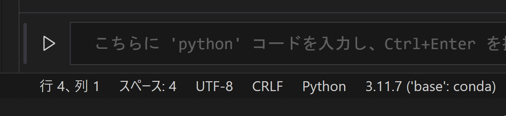
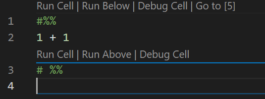
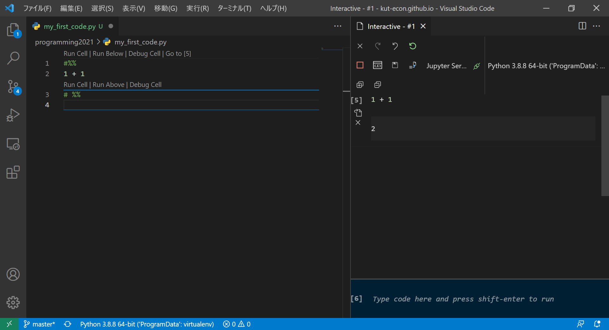
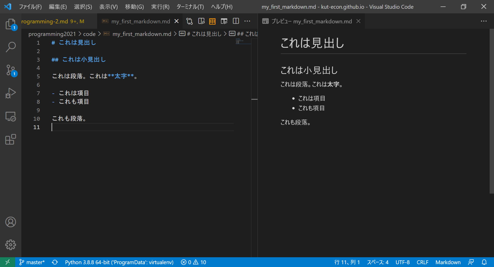
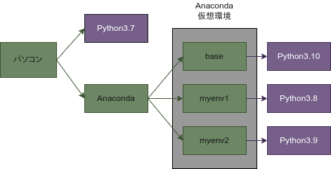

# 第2回 VS Code/仮想環境入門

- [第2回 VS Code/仮想環境入門](#第2回-vs-code仮想環境入門)
  - [VS Codeを起動する](#vs-codeを起動する)
  - [VS Code ショートカット](#vs-code-ショートカット)
  - [プロキシの設定(VS Code)](#プロキシの設定vs-code)
  - [各種エクステンションのインストール](#各種エクステンションのインストール)
  - [VS Codeインターラクティブモード](#vs-codeインターラクティブモード)
    - [練習1](#練習1)
  - [Emacsキーバインディング](#emacsキーバインディング)
    - [練習2](#練習2)
  - [マークダウン入門](#マークダウン入門)
    - [構文](#構文)
      - [練習3](#練習3)
    - [目次をつける](#目次をつける)
    - [PDFへの出力](#pdfへの出力)
    - [図の作成](#図の作成)
    - [スライドの作成](#スライドの作成)
  - [Anacondaとは](#anacondaとは)
  - [プロキシの設定(Anaconda)](#プロキシの設定anaconda)
  - [Anaconda仮想環境](#anaconda仮想環境)
  - [仮想環境の状態チェック](#仮想環境の状態チェック)
  - [仮想環境の構築](#仮想環境の構築)
  - [VS Codeで特定の仮想環境を使う](#vs-codeで特定の仮想環境を使う)
  - [まとめ](#まとめ)
  - [参考書](#参考書)
  - [補足事項](#補足事項)
    - [コマンドプロンプトからVS Codeが起動しないときは?](#コマンドプロンプトからvs-codeが起動しないときは)
    - [『実行』ボタンで『condaが見つからない』エラーが出るときは?](#実行ボタンでcondaが見つからないエラーが出るときは)
    - [REPLで変なエラーが出るようになったときは?](#replで変なエラーが出るようになったときは)
    - [Pythonのバージョン3.8をmyenv環境にインストールするには?](#pythonのバージョン38をmyenv環境にインストールするには)
    - [Rのバージョン3.6をmyenv環境にインストールするには?(Windowsの場合)](#rのバージョン36をmyenv環境にインストールするにはwindowsの場合)
    - [Rのバージョン4.1をmyenv環境にインストールするには?(Macの場合)](#rのバージョン41をmyenv環境にインストールするにはmacの場合)
    - [RをVS Code上で起動できるようにするには?](#rをvs-code上で起動できるようにするには)
    - [CコンパイラとアセンブラをenvC環境にインストールするには?](#cコンパイラとアセンブラをenvc環境にインストールするには)

## VS Codeを起動する

プログラマにとって、ソースコードやスクリプトを編集するための**エディタ**は、とても重要なものです。プログラミングの学習においては、エディタの研究にもしっかりと時間を割きましょう。本講義では、Visual Studio Code(VS Code)という、Microsoftが開発したフリーのエディタを用いることにします。

それでは早速VS Codeを起動してみましょう。ホームパス下にGitHubという名前のフォルダを作ってください。（注；本講義では、「フォルダー」と「ディレクトリ」をほとんど同じ意味で用います。）Windowsユーザーの人は、ドキュメントフォルダーの下に作るのが良いでしょう。Anaconda promptやコマンドプロンプトで次のように入力して得られるパスです。

```cmd
echo %HOMEPATH%
```

GitHubフォルダの場所はあまり重要ではないので、ホームパスがよくわからない人は、自分が分かりやすい場所に作っても構いません。GitHubフォルダを作ったら、その中にさらにmy_first_codeという名前のフォルダーを作りましょう。

my_first_codeの中身（からっぽ）をWindowsエクスプローラで表示し、右クリックすると「Codeで開く」という選択肢がありますので、それを選ぶと、VS Codeが起動します(下図)。**「Codeで開く」が見つからない**場合は、フォルダをVS Codeのショートカットアイコンにドラッグ&ドロップしてください。


とりあえず覚えなくてはならないのは、左上のエクスプローラーと、それを開閉するボタンです。エクスプローラーでは、現在いるフォルダmy_first_codeの中にどのようなファイルがあるかを示しています。VS Codeのエクスプローラーの詳しい使い方については、『独習Python』のp30-31を読んでください。

## VS Code ショートカット

VS Codeを使うに当たって、覚えたほうが良いショートカットが3つあります。

- **Ctrl-Shift-P**: コマンドパレットを開きます。VS Codeの諸々の操作は、このコマンドパレットに望みの操作に関連するキーワードを入力し、出てきた操作リストの中から望みの操作を選択するという形で行います。
- **Ctrl-Shift-X**: 拡張機能検索ウィンドウとインストール済み拡張機能の一覧を表示します。邪魔な拡張機能を無効にしたり、新しい拡張機能を探してインストールするのに使います。
- **Ctrl-,**: 設定項目検索ウィンドウを開きます。注)設定ファイルを直接編集するときは、コマンドパレットにsettings.jsonと入力してください。

## プロキシの設定(VS Code)

**この設定が必要なのは、大学の有線LANに接続する場合だけです。それ以外の方は、この項目は読み飛ばしてください!**

VS Codeを快適に使うためには、インターネット経由で様々な**エクステンション**(拡張機能)をインストールする必要があります。大学内の有線LANに接続してエクステンション（拡張機能）をインストールするためには、プロキシの設定が必要です。

 **Ctrl-,**と叩くと、設定のための検索窓が立ち上がりますので、**proxy**と入力しましょう。すると、

```vscode
Http: Proxy
使用するプロキシ設定。設定されていない場合は、'http_proxy' および >'https_proxy' の環境変数から継承されます。
[                                        ]
```

というproxy設定パネルが現れますので、次のように大学のプロキシサーバーとポート番号を入力しましょう。ただし、ここで、`http://proxy-server-addr:????`の箇所は、大学のプロキシサーバーの正しいURLとポート番号に置き換えてください。正しいURLとポート番号はMoodle(KUTLMS)に記載してあります。

```vscode
Http: Proxy
使用するプロキシ設定。設定されていない場合は、'http_proxy' および 'https_proxy' の環境変数から継承されます。
[http://proxy-server-addr:????            ]
```

<!--
入力できたら、設定ファイルに正しく書き込まれているか次のようにして確認しましょう。**Ctrl-Shift-P**と叩いて、コマンドパレットを開きます。**settings.json**と入力すると、幾つか候補が出てきますが、そのうち、

```vscode
基本設定：設定(JSON)を開く
Preferences: Open Settings (JSON)
```

を選択します。すると、json形式でかかれた設定ファイル**settings.json**が開かれますので、次のように、プロキシが記載されていることを確認します。

```json
{
    ...
    ...
    "http.proxy": "http://proxy-server-addr:????", 
    ...
    ...
}
```

...のところは何か色々書いてあると思いますが、プロキシの設定が見当たれば大丈夫です。

もしくは、上記のsettings.jsonを開いて、直接プロキシの行を書き込んでしまっても構いませんが、そのように直接書き込むメリットはあまり無いと思います。むしろ各種設定は、上記のsettings.jsonというjson形式のファイルに書き込まれていて、VS Codeで自由に追記・修正できるということを理解するのが重要でしょう。
-->

## 各種エクステンションのインストール

プロキシの設定ができましたので、各種エクステンションがインストールできます。エクステンション（拡張機能）をインストールするには、**Ctrl-Shift-X**を叩きます。現れた検索ウィンドウにエクステンション名を入力すれば、候補をリストアップしてくれますので、望みのものを選んでインストールボタンを押しましょう。

以下のエクステンションが必要ですので、インストールしましょう。

- Japanese Language Pack for VS Code (VS Codeを日本語化)
- Python(Microsoftのもの)
- Jupyter(インターラクティブモード)
- Awesome Emacs Keymap (Emacsキーバインディング)
- Markdown All in One (マークダウン便利ツール集)
- markdownlint (Markdownの構文チェッカー)
- Markdown PDF (MarkdownファイルをPDFやHTMLに変換)

<!--
- Pylance (Intellisenseがうまく機能しない場合、試す価値あり)
- Path Intellisense (ファイル名パス補完)
- R (Rが実行できるようになります)
- R Tools (R用のIntellisense)
- Rainbow CSV (CSVファイルが見やすくなります)
- Edit CSV (CSVが編集できる)
-->

<!--
マークダウン系のエクステンションは(文字通り)無数に存在しますので、必ずしも上記のもので無くて良いですし、より良いものがあるかもしれません。ぜひ自分に合うエクステンションを探してみてください。上のエクステンションを全て一度にインストールするのは大変だと思うので、まずは**Japanese Language Pack**と**Python**エクステンションをインストールしましょう（残りは各自インストールしておいてください）。

なお以下は授業では使いませんが、AWSなどの外部サーバーで開発を行う際に大変重宝します。リモートのファイルを直接VS Codeで編集できます。

- Remote - SSH (外部サーバー等にSSH接続できる)
-->

<!--
以下は、VS Code内で図を書くことができる便利なエクステンションです。ソフトウェアの設計図などをMarkdownで書きたい人には大変便利です。本稿の図はほとんどこのエクステンションを使って作成しました。必須ではありませんが、興味が有る人は入れて見てください。

- Draw.io Integration (図を作成)
-->

## VS Codeインターラクティブモード

それでは大体の準備ができたので、いよいよVS Codeでプログラミングしてみましょう。Pythonのプログラミングを行うときは、インターラクティブモードという、VS Codeの内部で**Jupyter**を起動する方法が便利です。

VS Codeのエクスプローラからmy_first_code.pyというファイルを作成し、開いてください(教科書pp.30-31参照)。1行目に次のように入力してください。

```python
#%%
```

もし編集画面が次のように変化すればインターラクティブモードの起動に成功したことを表します。


**尚、初回は「インタープリタが未選択」という通知が出る場合があります。** これは、[後述](#anacondaとは)するように、一つのパソコンに複数のPythonがインストールされている可能性があるので、どのPythonを使うのか定められていないということです。その時は、通知内容にしたがって、インタープリタを選択します。"Python 3.x.x xx-bit ('base': conda)"を選択してください。(xは各自の環境に依存します。)正しいインタープリタが選択されていれば、画面の右下に、"Python 3.x.x xx-bit ('base': conda)"の表記が表示されます。正しいインタープリタが選択されていない場合は、「[VS Codeで特定の仮想環境を使う](#vs-codeで特定の仮想環境を使う)」の欄の記述に従って、選択を行ってください。



ためしに、簡単な計算を行ってみましょう。"#%%"記号のすぐ下に計算式を書いて**Shift-Enter**と叩いてみましょう。すると次のように編集画面が変化します。



この編集画面で"#%%"記号と青線に挟まれた部分は**セル**と呼ばれ、この部分に記述されたPythonコードは、**Shift-Enter**によってまとめて実行されます。

一方、セルを実行して得られた結果は、画面右の**インターラクティブウィンドウ**に表示されます。



上図で右側がインターラクティブウィンドウです。1+1の結果である2が表示されています。

### 練習1

VS Codeインターラクティブモードを用いて、以下のような様々な計算を行ってみなさい。なお、以降の講義では、VS Code上のコードを`# %%`、REPL上のコードを`>>>`で表すことにします。注)`>>>`記号はプロンプトなので、**入力する必要はありません**。

```python
# %%
x = 1
y = 2
print(x + y)
# %%
z = x + y
print(y ** z)
# %%
print("Hello, World!")
```

いくつかセルが出来たら、"# %%"記号の横にある"Run Cell"、"Run Above"、"Run Below"などをクリックしてみましょう。何が起きたか分かりますか？("Run Debug"は難しいのでクリックしないように。)

## Emacsキーバインディング

これで自由にPythonコードを実行できるようになりました。ここで、ついでにEmacsキーバインディングの練習をしましょう。まず、上で説明した手順にしたがって、**Awesome Emacs Keymap**エクステンションをインストールしてください。

Awesome Emacs Keymapエクステンションをインストールすると、Emacsキーバインディングが使えるようになります。
my_first_code.pyを開き、コードの任意の箇所にカーソルを置いて、Ctrl-nと叩いてみましょう。カーソルが次の行に移動したらキーバインディングが正常に機能しています。Ctrl-pと叩けばカーソルが前の行に移動するはずです。このように、キーバインドを使うと、マウスを使わずにカーソルを移動できます。

主なEmacsキーバインディングは以下の通りです。

|キー操作|動作|
|--|--|
|Ctrl-n|次の行に移動|
|Ctrl-p|前の行に移動|
|Ctrl-b|前の文字に移動|
|Ctrl-f|次の文字に移動|
|Ctrl-a|行頭へ移動|
|Ctrl-e|行末へ移動|
|Ctrl-v|次のページへ移動|
|Alt-v|前のページへ移動|
|Ctrl-k|現在の行のカーソル以降を削除|
|Ctrl-d|前方一文字削除|
|Ctrl-h|後方一文字削除|
|Ctrl-s|順方向検索|
|Ctrl-r|逆方向検索|
|Ctrl-x Ctrl-s|保存|
|Ctrl-x Ctrl-u|アンドゥ|
|Ctrl-space|マーク設定|
|Ctrl-w|マーク設定地点からカーソル位置までをカット|
|Ctrl-y|貼り付け|
|Ctrl-x Ctrl-c|エディター終了|

これらのキーバインドを駆使して、可能な限りマウスに触らないでコーディングするように練習してください。

タッチタイピングで視線の移動を減らし、Emacsキーバインディングで手の移動を減らして、ストレスのないプログラミング生活を楽しみましょう。上記の他にも多数の便利なキー操作がありますので、インターネット等で調べてみてください。また、ここでは説明しませんが、VS Codeはキーバインドを細かくカスタマイズすることもできます。気になる人は、インターネットでカスタマイズの方法を調べてみましょう。

### 練習2

my_first_code.pyの上で、上の表に上げたキーバインドを一つずつ試してみましょう。

## マークダウン入門

### 構文

次に、簡単なマークダウンファイルを作成してみましょう。マークダウンとは、HTMLのようなマークアップ言語の一種で、プレーンテキスト文書に書式を付けて文書を整形するための言語です。ホームページを記述するためのHTML(HyperText Markup Language)については皆さんご存知かとおもいますが、Markdownは、HTMLよりももっと機能を限定して簡略化したようなものです。(ちなみに本講義資料も全てマークダウンで記述しました。)

HTMLでは、たとえば見出しや段落を作るとき、次のようなテキスト文書をつくります。

```html
<html>
<body>
    <h1>見出し</h1>
    <h2>これは小見出し</h2>
    <p>
        これは段落。これは<b>太字</b>。
        <ul>
            <li>これは項目</li>
            <li>これも項目</li>
        </ul>
    </p>
    <p>
        これも段落。
    </p>
</body>
</html>
```

しかし、HTMLには次のような欠点があります。

- 書くのが面倒
- 読みにくい
- ソースと表示が大きくことなる

そこで、スタイルなどの細かい微調整は諦めてもっと簡潔に書式を記述できるようにしたのがマークダウンです。マークダウンでは上記と同じ文書が次のようになります。

```markdown
# これは見出し

## これは小見出し

これは段落。これは**太字**。

- これは項目
- これも項目

これも段落。
```

HTMLに比べると非常に簡潔であることが分かると思います。

マークダウン文書を作成するまえに、以下のエクステンションをインストールする必要があります。

- Markdown All in One (マークダウン便利ツール集)
- markdownlint (Markdownの構文チェッカー)
- Markdown PDF (MarkdownファイルをPDFやHTMLに変換)

そのほか、図やスライドを作るには、以下のエクステンションが必要です。

- Draw.io Integration (図の作成)
- Marp for VS Code (スライドの作成)

エクステンションがインストールできたら、早速マークダウンを書いてみましょう。VS Codeのエクスプローラで、my_first_markdown.mdというファイルを作成し、開いてください。(マークダウン文書の拡張子は必ず.mdにします。)文書を開いたら、Emacsキーバインドなどを活用しつつ、上述のマークダウン文書を打ち込んでいきましょう。



上図で、画面の左がソースファイルの編集画面、右側にはプレビューが表示されます。ソースとプレビューを比較すると分かるように、両者に大きな違いがないことが分かります。これがマークダウンの最大の特徴です。

|記法|解説|出力|
|--|--|--|
|`# 見出し`|`# + 半角スペース +　見出し文字列`|大見出し(タイトル)|
|`## 見出し`|`## + 半角スペース +　見出し文字列`|中見出し(セクション)|
|`### 見出し`|`### + 半角スペース +　見出し文字列`|小見出し|
|`**文字**`|`** + 太字にしたい文字列 + **`|太字|
|`- 項目`|マイナス記号 + 半角スペース + 箇条書き項目|箇条書き|
|`1. 項目`|数字 + ピリオド + 半角スペース + 箇条書き項目|数字付き箇条書き|
|`----`|ハイフン三つ以上|水平線|
|`[ハイパーリンク](https://homepage.com)`|`[文字列](URL)`|ハイパーリンク|

見出しは`#`記号の数が多いほど小さくなります。見出しの前後は必ず1行の空行を入れます。

```markdown
# 見出し1

## 見出し2

### 見出し3

#### 見出し4
```

なお、入れ子の箇条書きをVS Codeで作る時はタブキーで字下げをすると入れ子になります。(ちなみに、**Shift+Tab**で字下げを元に戻せます。)

```markdown
1. 項目1
  1. 項目1-1
  2. 項目1-2
2. 項目2
```

表は次のように作ります。

```markdown
|商品|個数|値段|
|--|--|--|
|りんご|2個|200円|
|みかん|8個|350円|
|バナナ|1房|100円|
```

#### 練習3

my_first_markdown.mdに上記の見出し、入れ子の箇条書き、表の例を記述し、プレビューを確認しなさい。以下のようになりましたか？


なお、URLリンクの挿入は以下のようにします。

```markdown
プログラミングのHPは[こちら](https://kut-econ.github.io/programming2021/)。
```

コード断片の挿入は以下のようにします。

````markdown
```python
# %%
x = 1
y = 1
z = x + y
print(z)
```
````

上記の`python`の部分には、`markdown`、`R`、`C`、`bash`など、言語の名前を指定します。

### 目次をつける

`Markdown All in One`がインストールしてあれば、簡単に目次をつけることができます。この目次は、文書を変更すると、その内容を自動的に反映してくれる便利な目次です。一度挿入すれば、二度とマニュアルで編集する必要はありません。

文書の先頭、大見出しのすぐ下にカーソルをもっていき、`Ctrl-Shift-P`を叩いてコマンドパレットを出してください。`Create table`と入力すると、`Markdown All in One: Create Table of Contents`という選択肢が出てきますので、これを選択すると、目次が挿入されます。

### PDFへの出力

拡張機能Markdown PDFをインストールすれば、マークダウンファイルをPDFに出力できます。

`Ctrl-Shift-P`でコマンドパレットを起動し、`export`と入力してください。幾つか選択肢が出てきますが、その中から`Markdown PDF: Export (pdf)`を選択します。これだけで、現在開いているマークダウンファイルが同じディレクトリにPDF形式で出力されます。

### 図の作成

VS Codeで図を作成するには、Draw.io Integrationという拡張機能をインストールする必要があります。`Ctrl-Shift-X`で`Draw.io Integration`を検索し、インストールしてください。

VS Codeで、`.drawio.png`という拡張子のファイルを作ってください。たとえば`filename.drawio.png`のような名前にします。これをクリックすると、ドローイングツールのDrawioが起動して、図を作成できるようになります。

図を作成したら、次のようにして、マークダウン中に挿入できます。

```markdown

```

ここで、URLリンクとは違って、最初に`!`マークが入っていることに注意してください。

### スライドの作成

マークダウンでスライドを作るには、拡張機能の`Marp for VS Code`をインストールします。

`Marp`がインストールできたら、VS Codeでマークダウンファイルを新たに作成してください。ファイル名は何でも構いませんが、`slide.md`にしておきましょう。

`slide.md`を開いて、ファイルの先頭に、次のように記述してください。

```markdown
---
marp: true
---
<!--
headingDivider: 2
-->
```

`marp:`と`true`の間に一つスペースを入れるのを忘れないようにしてください。これで、レベル2の見出しがスライド頁の区切りになります。

たとえば、以下のように入力してみてください。プレビューがスライドになるはずです。

```markdown
---
marp: true
---
<!--
headingDivider: 2
-->

# Marpで楽しくスライド作り

1234567 工科太郎

## これは頁タイトルになる

ここは2ページ目である。

1. 番号付き箇条書き項目である
2. 番号付き箇条書き項目である
3. 番号付き箇条書き項目である
```

PDFに出力することも簡単にできますので試してみてください(編集画面の上のほうにある三角マークからできます)。

VS Codeの話は上記でおしまいです。VS Codeには他にも様々な拡張機能があるので、色々探してみてください。

## Anacondaとは

Anacondaとは、Pythonを中心として、データサイエンスを実践する上で便利なソフトウェアを多数まとめたものです。最初からPythonを使って様々な作業を行うための環境が整っているので、初心者でもPythonを始めやすい特徴があります。また、仮想環境を自由に作成することができ、仮想環境ごとに異なるバージョンのPythonをインストールしたり、追加パッケージをインストールすることができるという便利さがあります。近年の入門書の多くがAnacondaを推奨していることを鑑み、本講義でもAnacondaを用いることにします。

Anacondaを使用するうえで最初に理解しなければならないことは、**一つのパソコンには複数のPythonがインストールされている場合があるので、今自分がどのPythonを使っているのかいつも意識すべきである**ということです。

下の図のように、パソコンにPythonが直接インストールされている場合がありますし、Anaconda仮想環境のそれぞれにPythonがインストールされている場合もありますが、これらは全て別のものです。自分が思っているのと違うPythonを気づかずに使っていると、「思っていたのと挙動が違う!」というトラブルにハマってしまうことになるので、注意しましょう。慣れないうちは、Anacondaの**base仮想環境**にインストールされているPythonを使用するようにしましょう。



## プロキシの設定(Anaconda)

**この設定が必要なのは、大学の有線LANに接続する場合だけです。それ以外の方は、この項目は読み飛ばしてください!**

ここからはAnacondaの解説をします。大学の有線LANに繋がっている研究室のパソコン等でAnacondaを使用する場合、プロキシの設定が必要です。

Windowsスタートメニューから、Anaconda Promptを起動し、次のように入力すると、プロキシの設定が表示されます。

```cmd
(base) C:\Users\hoge>conda config --show proxy_servers
proxy_servers: {}
```

上記のようにproxy_serversの項目が空欄になっていたら、プロキシが設定されていません。その場合は、以下のように順次入力してhttpとhttpsの両方にnocのプロキシサーバーを設定しましょう。

```cmd
(base) C:\Users\hoge>conda config --set proxy_servers.http http://proxy-server-addr:????
(base) C:\Users\hoge>conda config --set proxy_servers.https http://proxy-server-addr:????
```

ここで、proxy-server.addrは正しいプロキシサーバーのアドレス(Moodleに記載)に、????は正しいポート番号に置き換えてください。

もう一度設定を表示して、プロキシが正しく設定されているか確認しましょう。

```cmd
(base) C:\Users\hoge>conda config --show proxy_servers
proxy_servers:
  http: http://proxy-server-addr:????
  https: http://proxy-server-addr:????
```

上記の用に表示されれば正しく設定されています。

## Anaconda仮想環境

大学のPCでは、Anacondaに追加機能をインストールすることはできません。Anacondaに追加機能をインストールするには、Windowsの管理者権限が必要だからです。また、管理者権限があったとしても、Anacondaを直接いじるのは不安です。良く分からない追加機能をインストールして、Anaconda全体に不具合が生じるかもしれないからです。

このような問題を解決するために、Anacondaには仮想環境という仕組みが備わっています。仮想環境とは、新しくPythonがインストールされていて、自由にパッケージのインストール・アンインストールを行うことができる自分専用の環境のことです。(解説はしませんが、Anacondaがない場合はvenvモジュールによって仮想環境を作ることができます。)

Pythonを使っていると、必ず近いうちに複数のバージョンのPythonを使い分けなくてはならない時がやってきます。その時のために、今から仮想環境に慣れましょう。

## 仮想環境の状態チェック

Anacondaをインストールすると、baseという名前のデフォルトの仮想環境が作成されます。Anaconda promptを起動すると、base環境が起動している状態になります。試しに次のようにして、base環境を停止してみましょう。

```anaconda
(base) C:\Users\hoge>conda deactivate

C:\Users\hoge>
```

プロンプトから(base)という文字列が無くなりました。この状態では、全ての仮想環境がストップしています。再びbaseを起動するために、次のように入力しましょう。

```anaconda
C:\Users\hoge>conda activate

(base) C:\Users\hoge>
```

次に、現在存在している仮想環境をcondaコマンドでチェックしておきましょう。以下のように打ち込みます。

```anaconda
(base) C:\Users\hoge>conda env list
# conda environments:
#
base                  *  E:\ProgramData\Anaconda3
```

最初は仮想環境がbaseしか存在しないので、#のある行を除けば1行しか出力されません。アスタリスク(*)は、現在自分のいる仮想環境がbaseであることを示しており、そのあとのパスはbaseがインストールされているディレクトリを表しています。全く同じ出力は、次のようにしても得られます。

```anaconda
(base) C:\Users\hoge>conda info --envs
# conda environments:
#
base                  *  E:\ProgramData\Anaconda3
```

Pythonでデータ解析を行うためには、様々なパッケージをインストールする必要があります。パッケージは仮想環境ごとに異なるものをインストールすることが出来ますが、baseには最初から多くのパッケージがインストールされています。baseにインストールされているパッケージのリストを取得してみましょう。

```anaconda
(base) C:\Users\hoge>conda list
# packages in environment at E:\ProgramData\Anaconda3:
#
# Name                    Version                   Build  Channel
_anaconda_depends         2020.07                  py38_0
_ipyw_jlab_nb_ext_conf    0.1.0                    py38_0
alabaster                 0.7.12             pyhd3eb1b0_0
anaconda                  custom                   py38_1
anaconda-client           1.7.2                    py38_0

...（中略）...

xz                        5.2.5                h62dcd97_0
yaml                      0.2.5                he774522_0
yapf                      0.31.0             pyhd3eb1b0_0
zeromq                    4.3.3                ha925a31_3
zfp                       0.5.5                hd77b12b_6
zict                      2.0.0              pyhd3eb1b0_0
zipp                      3.4.1              pyhd3eb1b0_0
zlib                      1.2.11               h62dcd97_4
zope                      1.0                      py38_1
zope.event                4.5.0                    py38_0
zope.interface            5.3.0            py38h2bbff1b_0
zstd                      1.4.5                h04227a9_0
```

ものすごく長い出力が得られたと思いますが、これらが全て予めインストールされているパッケージです。非常に多くのパッケージが既にインストール済みですので、データ解析では、多くの場合base環境だけで事足ります。しかしながら、例えば実験プログラミング用パッケージであるotreeはインストールされていませんので、こういったパッケージをインストールする場合には、新たな仮想環境の構築が必須になります。

## 仮想環境の構築

それではいよいよ、仮想環境を作ってみましょう。たとえばmyenvという名前の仮想環境を作るには次のようにします。

```anaconda
(base) C:\Users\hoge>conda create -n myenv
Collecting package metadata (current_repodata.json): done
Solving environment: done

## Package Plan ##

  environment location: E:\ProgramData\Anaconda3\envs\myenv

Proceed ([y]/n)?
```

environmental location:の所に出てくるパスに仮想環境が構築されることになりますが、具体的なパスは人によって異なります。(パスを変更することもできますが、ここでは説明を省略します。)

以下のように'y'と入力すると、仮想環境が構築されます。

```anaconda
Proceed ([y]/n)? y

Preparing transaction: done
Verifying transaction: done
Executing transaction: done
#
# To activate this environment, use
#
#     $ conda activate myenv
#
# To deactivate an active environment, use
#
#     $ conda deactivate


(base) C:\Users\hoge>
```

ちゃんと環境ができているかチェックしましょう。

```anaconda
(base) C:\Users\hoge>conda info -e
# conda environments:
#
base                  *  E:\ProgramData\Anaconda3
myenv                    E:\ProgramData\Anaconda3\envs\myenv
```

たしかにmyenvという環境が出来ているようですが、アスタリスク記号`*`はbaseについており、myenvは起動していないことが分かります。myenvを起動するには、次のようにします。

```anaconda
(base) C:\Users\hoge>conda activate myenv

(myenv) C:\Users\hoge>
```

プロンプトが`(base)`から`(myenv)`に変わり、myenv環境が起動しました。myenv環境にインストールされているパッケージのリストを表示してみましょう。

```anaconda
(myenv) C:\Users\hoge>conda list
# packages in environment at E:\ProgramData\Anaconda3\envs\myenv:
#
# Name                    Version                   Build  Channel

(myenv) C:\Users\hoge>
```

全くパッケージが入っていないことが分かります。Pythonすら入っていません。たとえばPythonのバージョン3.8をこの環境にインストールするには、次のようにします。

```anaconda
(myenv) C:\Users\hoge>conda install python=3.8
Collecting package metadata (current_repodata.json): done
Solving environment: done

## Package Plan ##

  environment location: E:\ProgramData\Anaconda3\envs\myenv

  added / updated specs:
    - python=3.8


The following packages will be downloaded:

    package                    |            build
    ---------------------------|-----------------
    python-3.8.8               |       hdbf39b2_5        15.8 MB
    ------------------------------------------------------------
                                           Total:        15.8 MB

The following NEW packages will be INSTALLED:

  ca-certificates    pkgs/main/win-64::ca-certificates-2021.4.13-haa95532_1
  certifi            pkgs/main/win-64::certifi-2020.12.5-py38haa95532_0
  openssl            pkgs/main/win-64::openssl-1.1.1k-h2bbff1b_0
  pip                pkgs/main/win-64::pip-21.0.1-py38haa95532_0
  python             pkgs/main/win-64::python-3.8.8-hdbf39b2_5
  setuptools         pkgs/main/win-64::setuptools-52.0.0-py38haa95532_0
  sqlite             pkgs/main/win-64::sqlite-3.35.4-h2bbff1b_0
  vc                 pkgs/main/win-64::vc-14.2-h21ff451_1
  vs2015_runtime     pkgs/main/win-64::vs2015_runtime-14.27.29016-h5e58377_2
  wheel              pkgs/main/noarch::wheel-0.36.2-pyhd3eb1b0_0
  wincertstore       pkgs/main/win-64::wincertstore-0.2-py38_0


Proceed ([y]/n)?
```

yを入力して続行すると、pythonをインストールできます。(しばらく時間がかかります。)実際にインストールされたかどうか確かめて見ましょう。

```anaconda
(myenv) C:\Users\hoge>conda list
# packages in environment at E:\ProgramData\Anaconda3\envs\myenv:
#
# Name                    Version                   Build  Channel
ca-certificates           2021.4.13            haa95532_1
certifi                   2020.12.5        py38haa95532_0
openssl                   1.1.1k               h2bbff1b_0
pip                       21.0.1           py38haa95532_0
python                    3.8.8                hdbf39b2_5
setuptools                52.0.0           py38haa95532_0
sqlite                    3.35.4               h2bbff1b_0
vc                        14.2                 h21ff451_1
vs2015_runtime            14.27.29016          h5e58377_2
wheel                     0.36.2             pyhd3eb1b0_0
wincertstore              0.2                      py38_0

(myenv) C:\Users\hoge>
```

ちゃんとPythonがインストールされていることが分かります。REPLを起動してみましょう。

```python
(myenv) C:\Users\hoge>python
Python 3.8.8 (default, Apr 13 2021, 15:08:03) [MSC v.1916 64 bit (AMD64)] :: Anaconda, Inc. on win32
Type "help", "copyright", "credits" or "license" for more information.
>>>
```

パッケージをインストールしたいときは、

```anaconda
conda install package_name
```

のように入力します。package_nameはパッケージ名です。パッケージのバージョンまで指定したいときは、

```anaconda
conda install package_name=ver_num
```

とします。ver_numはバージョン番号です。

たとえば、次のようにすればデータ解析パッケージのpandasをインストールできます。注)myenv環境に、Rのバージョン3.6やCのコンパイラ、アセンブラ等を入れておいてください。やり方は[FAQ](#faq)を参照。

```anaconda
conda install pandas
```

myenv環境を停止してbaseに戻る時は、

```anaconda
conda deactivate
```

と入力します。

最後にcondaコマンドをまとめておきましょう。

|コマンド|動作|
|--|--|
|`conda --help`|condaコマンドのヘルプを表示|
|`conda command --help`|コマンドcommandのヘルプを表示|
|`conda config --show`|全てのパラメータを表示|
|`conda config --show par`|パラメータparの設定を表示|
|`conda config --set par value`|パラメータparの値をvalueに設定|
|`conda config --remove-key par`|パラメータparの設定を消去|
|`conda info --envs`|全ての仮想環境を表示|
|`conda info -e`|同上|
|`conda env list`|同上|
|`conda create -n env_name`|仮想環境env_nameを作成|
|`conda list`|現環境のインストール済みパッケージをリストアップ|
|`conda install package`|パッケージpackageを現在環境にインストール|
|`conda install package=ver`|パッケージpackageのバージョンverを現環境にインストール|
|`conda remove package`|パッケージpackageを現環境からアンインストール|
|`conda remove -n env_name --all`|仮想環境env_nameを削除|

## VS Codeで特定の仮想環境を使う

新しく作成した仮想環境myenvをVS Codeで呼び出すためには、その仮想環境にipykernelパッケージをインストールする必要があります。また、コード補完を行うためには、pyreadlineのインストールも必要です。

```anaconda
conda activate myenv
conda install ipykernel
```

次にVS Codeを起動し、my_first_code.pyを開きましょう。この状態で**Ctrl-Shift-P**をたたいてコマンドパレットを呼び出し、**select**と入力します。幾つか候補が出てきますが、その中から**Python: Select Interpreter**を選びます。すると、仮想環境のリストが表示されるので、正しい仮想環境を選びましょう。myenvがリストにない場合は、パレットにmyenvと入力するとリストに現れます。

新環境myenvを選ぶと、VS Codeの画面下にある青い帯のところに、'myenv':condaと表示されます。


これで、インターラクティブモードで実行したPythonコードはすべて仮想環境myenvにインストールしたインタープリタによって実行されます。

仮想環境をbaseに戻したいときは、同じようにコマンドパレットからbaseを呼び出しましょう。

<!--
## VS Code以外のエディター(参考)

### Emacs

VS Code以外にもエディターはたくさんありますが、代表的なものはvi(vimともいう)とEmacsです。プログラミングするだけならば、VS CodeはEmacsと同程度に拡張性があり、Emacsよりも使いやすいので、VS Codeがインストールされている環境ではわざわざEmacsでコーディングする理由はないと思うかもしれません。

しかしながら、VS Codeは大がかりなアプリケーションなので、慣れてくると、ちょっとしたプログラムを作成するのに一々VS Codeを立ち上げるのは面倒くさいと思うようになるでしょう。そのようなときに、より手軽なEmacsが便利ですので、覚えておいて損はありません。

また、プログラミングを好きになりたいのなら、Emacsのキーバインディングをしっかりとマスターすることを強くお勧めします。その練習のためにEmacsを使ってみるのは有益だと思います。

### vi/vim

ぜひマスターしてほしいもう一つのエディターはvi(vimともいう)です。こちらは、数多あるエディターの中でも最も軽快に動作するエディターであり、Linux/Unixに標準で搭載されています。標準で搭載されているので、どのマシンでもいきなり使えるという保証がありますし、何よりも動作が軽快なので、「ちょこっと」設定ファイル等を書き換えるのに大変重宝します。筆者は、Linuxの設定ファイルを編集したりするのにはviを、プログラミングにはVS CodeやEmacs、Pycharmといった重厚なエディターを使うというふうに使い分けています。Linuxをいじりだすとわかりますが、各種の設定ファイルをちょこちょこ書き換えるのにいちいちEmacsなどを立ち上げていられません。Gitでコミットする際のメッセージを編集するのにもviが軽快で便利です。viのマニュアルはネット上に溢れていますので、ぜひ試してみてください。
-->

## まとめ

今回の講義では、次の点について学びました。

- VS Codeの設定
- VS Codeのインタラクティブモード
- Emacsキーバインド
- マークダウン記法
- Anacondaの設定
- 仮想環境の構築

エディターを使いこなすことはプログラミングの習得において大変重要です。VS Codeを自分のパソコンや研究室のパソコンにインストールし、Pythonコードやマークダウン文書の作成を通してEmacsキーバインドに慣れるようにしましょう。

## 参考書

- [『Markdownライティング入門』](https://www.amazon.co.jp/Markdown%E3%83%A9%E3%82%A4%E3%83%86%E3%82%A3%E3%83%B3%E3%82%B0%E5%85%A5%E9%96%80-%E3%83%97%E3%83%AC%E3%83%BC%E3%83%B3%E3%83%86%E3%82%AD%E3%82%B9%E3%83%88%E3%81%A7%E6%B0%97%E6%A5%BD%E3%81%AB%E6%9B%B8%E3%81%93%E3%81%86%EF%BC%81-%E6%8A%80%E8%A1%93%E3%81%AE%E6%B3%89%E3%82%B7%E3%83%AA%E3%83%BC%E3%82%BA%EF%BC%88NextPublishing%EF%BC%89-%E8%97%A4%E5%8E%9F-%E6%83%9F/dp/4844398369/ref=tmm_pap_swatch_0?_encoding=UTF8&qid=&sr=)(藤原 惟)(2018) インプレスR&D. ISBN-13:978-4844398363.

<!--
## 宿題(ホームワーク)

1. 本講義でリストアップしたVS Codeのエクステンションのうち、授業中にインストールできなかったものをインストールしておきなさい。
2. 自分のパソコンもしくは研究室のパソコンにもVS Codeをインストールし、必要な設定(研究室の場合はプロキシ等)を行うとともに、重要なエクステンションを全てインストールしなさい。
3. CSV関連のエクステンションをインストールし、CSVファイルがVS Codeで表示・編集できることを確かめなさい。
4. 本講義資料で随所に現れるコード断片に注意しなさい。このようなコード断片をマークダウンに挿入する方法をインターネットで調べて実際に試してみなさい。
5. 研究室のパソコンでAnacondaを使っている人は、proxyの設定が正しいかチェックしなさい。間違っている場合は、正しく設定しなおしてください。
6. condaコマンドで環境構築の際、**同時に**特定のバージョンのpythonもインストールする方法を調べなさい。また、実際にそれを試してみなさい。
7. 新しく作った仮想環境にnumpyパッケージをインストールしてみなさい。また削除してみなさい。
8. LinuxやMacOSを使っている人は、Emacsとviを使ってみなさい。しばらく使ってみて、なぜviが根強い人気を誇っているのか考えてみなさい。
-->

## 補足事項

### コマンドプロンプトからVS Codeが起動しないときは?

これはVS Codeのパスを環境変数PATHに追加することで解決します。VS Codeのショートカットを右クリックして、プロパティを選択し、「リンク先」に書いてあるパスを**ユーザー環境変数**の**PATH**に追加します(システム環境変数ではありません)。実行ファイル名"Code.exe"はパスに含めないでください。これによってGitからも起動できるようになります。

### 『実行』ボタンで『condaが見つからない』エラーが出るときは?

VS CodeのPythonスクリプト上で右上の実行ボタン(緑色の矢印)を押すと

>conda : 用語 'conda' は、コマンドレット、関数、スクリプト ファイル、または操作可能なプログラムの名前として認
識されません。名前が正しく記述されていることを確認し、・・・

というエラーが出ることがあります。これはcondaコマンドのあるディレクトリにパスを通すことで解決します。

Anaconda Promptで、

```cmd
where conda
```

と入力してcondaコマンドのパスを調べてください。そのパスを、windowsの環境変数PATHに加えれば解決します。複数出た場合は全部加えてください。

### REPLで変なエラーが出るようになったときは?

REPLで日本語文字を使うと、それ以降

>UnicodeDecodeError: 'cp932' codec can't decode byte 0x82 in position 96: illegal multibyte sequence

というエラーが出るようになることがあります。これは大した問題ではありません。Anaconda Promptを起動したときのディレクトリにある.python_historyというファイルを削除すれば解決します。見つからない場合は、Windowsの設定で隠しファイルを表示しないモードになっているか、もしくは別のディレクトリに同ファイルがある可能性があります。Anaconda Promptで

```cmd
echo %HOME%
```

と叩いて表示されるディレクトリを探してみてください。Windowsで隠しファイル(ピリオドからはじまるファイル名)を表示しないモードになっていると見つからないのでご注意ください。

### Pythonのバージョン3.8をmyenv環境にインストールするには?

myenv環境をactivateしてから、次を実行します(以下のコマンドは、VSCode上で対話的にpythonを実行するためのパッケージipykernelも同時にインストールします)。

```cmd
conda install python=3.8 ipykernel
```

### Rのバージョン3.6をmyenv環境にインストールするには?(Windowsの場合)

myenv環境をactivateしてから、次を実行します(以下のコマンドはrtools、cpp11、pryrも同時にインストールします)。

```cmd
conda install -c conda-forge r-base=3.6 rtools r-cpp11 r-pryr
```

Rがインストールできましたら、`R`と入力して起動してください。

### Rのバージョン4.1をmyenv環境にインストールするには?(Macの場合)

myenv環境をactivateしてから、次を実行します(以下のコマンドはcpp11、pryrも同時にインストールします)。Macではrtoolsは必要ありませんのでインストール不要です。MacではRのバージョン3.6が公開されていないように見受けられますので、とりあえずバージョン4.1で代用してください。

```cmd
conda install -c conda-forge r-base=4.1 r-cpp11 r-pryr
```

Rがインストールできましたら、`R`と入力して起動してください。

### RをVS Code上で起動できるようにするには?

VS Codeの3つの設定項目

- R: Rterm
- R: Rpath
- R: Interpreter Path

を設定します。

`myenv`環境でRをインストールしたら、RがインストールされているPathを調べてください。Anaconda Promptで`myenv`を起動し、次のように入力すると表示されます。

```cmd
where R
```

Macの場合は`which R`になります。このPathを、上記の3つの設定項目すべてにコピーしてください。設定項目はCtrl-,で検索できます。

### CコンパイラとアセンブラをenvC環境にインストールするには?

次のようにして自身のAnaconda仮想環境にGNU Cコンパイラ、NASMアセンブラ、makeコマンドをインストールできます。なお、Cコンパイラをインストールする環境は、Rをインストールする環境とは別に(たとえば`envC`という名前で)作成することをおすすめします。

`envC`環境にこれらをインストールする場合は、`envC`を`activate`してから、次のように入力します。

```cmd
conda install m2w64-gcc
conda install -c anaconda nasm
conda install -c conda-forge make
```
