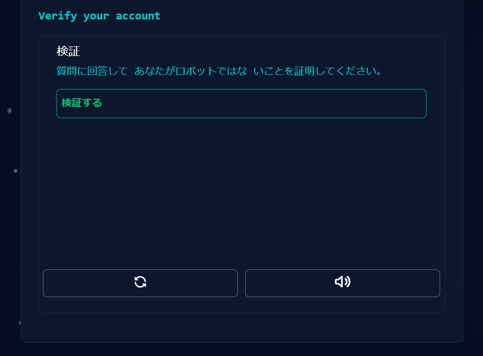

# 第3回 バージョン管理入門

- [第3回 バージョン管理入門](#第3回-バージョン管理入門)
  - [バージョン管理とは](#バージョン管理とは)
  - [ローカルとリモート](#ローカルとリモート)
  - [GitHubアカウントの作成](#githubアカウントの作成)
  - [EmailアドレスのPrivate設定](#emailアドレスのprivate設定)
  - [リモート課題レポジトリの作成](#リモート課題レポジトリの作成)
  - [Gitの初期設定](#gitの初期設定)
  - [sshの設定](#sshの設定)
    - [鍵の作成](#鍵の作成)
    - [秘密鍵の登録](#秘密鍵の登録)
    - [公開鍵の登録](#公開鍵の登録)
  - [ホストの登録](#ホストの登録)
  - [ローカル課題リポジトリの作成(ダウンロード)](#ローカル課題リポジトリの作成ダウンロード)
  - [ローカル課題リポジトリの編集](#ローカル課題リポジトリの編集)
  - [変更のステージング](#変更のステージング)
  - [変更のコミット](#変更のコミット)
  - [リモートをローカルに同期(プッシュ)](#リモートをローカルに同期プッシュ)
  - [ローカルをリモートに同期(プル)](#ローカルをリモートに同期プル)
  - [その他の操作](#その他の操作)
  - [主なGitコマンドまとめ](#主なgitコマンドまとめ)
  - [まとめ](#まとめ)
  - [参考書](#参考書)
  - [補遺](#補遺)
    - [sshポートの設定](#sshポートの設定)

## バージョン管理とは

プログラミングをしていると、しばしば、以前の状態に戻したいということがあります。これを実現する最も単純な方法は、ときどきファイルにバージョン入りで別名をつけ、別ファイルとして保存しておくことでしょう。

たとえば、code.pyというソースコードを編集している開発者がいるとします。ある時点で機能が安定したら、さらに機能を追加する前に、開発者はいつでもこのバージョンに戻ってこられるようにするために、code_ver1.pyという別名を付けてバージョン1として保存しておけば良いでしょう。同様に、code_ver2.py、code_ver3.pyというファイルが次々と出来上がっていくでしょう。

開発期間が短ければ、これでも何とかなるかもしれません。しかし、比較的小さなプロジェクトでも、時間が経つにつれてファイルの数は膨大になるのが普通です。そうすると、どのバージョンがどんな状態だったかすぐに分からなくなります。

これを解決するために、開発者は、たとえばエクセルのようなスプレッドシードに、バージョン名とその内容、作成者の氏名、作成日時を記録していくかもしれません。


これはある種のバージョン管理であると言えます。これに、さらに以下のような機能を追加すればもっと便利でしょう。

- 関連する複数のファイルのバージョンを一括して管理できる
- バージョン間の親子関係を表示できる
- 異なるバージョンの内容を比較できる
- 複数人が独立に作業できる

Gitはこうした機能を実現する仕組みです。Gitは、Linuxの開発者であるLinus TorvaldsがLinuxの共同開発を進めるために開発したツールです。Gitでは、アプリケーション開発など、一つのプロジェクトに関わる全てのファイルを**リポジトリ**という特別な装置によって管理します。

リポジトリは、通常、**作業ディレクトリ**とよばれる一つのディレクトリの中に収められた状態で存在し、作業ディレクトリの中にあるファイルの現在の状態や過去のバージョンを管理しています。リポジトリの正体は、作業ディレクトリの中にある.gitという隠しフォルダです。


## ローカルとリモート

一方GitHubはインターネット上にリポジトリを置くためのサービスです。インターネット上のリポジトリを**リモートリポジトリ**と呼びます。


**リモートリポジトリ**に対して、開発者のパソコン上に存在するリポジトリを**ローカルリポジトリ**と呼びます。GitHubを用いると、複数の開発者が共通のリモートリポジトリを介して共同開発を行うことができます。

Gitを用いると、リモートリポジトリとローカルリポジトリを同期させることができます。リモートリポジトリをローカルと同じ状態に同期させることを**プッシュ**、その逆を**プル**と言います。共同開発者は、プルによってローカルの状態を最新にしたあと、自分の担当部分の作業を進め、作業が終わったらプッシュによって作業の結果をリモートにアップロードすることができます。

|おもなGit用語|意味|
|--|--|
|プッシュ|リモートの状態をローカルの状態に同期|
|プル|ローカルの状態をリモートの状態に同期|
|コミット|作業をリポジトリの履歴に記録する|

GitHubのリモートリポジトリには、プライベートリポジトリとパブリックリポジトリがあります。パブリックリポジトリは誰でも見ることができ、パッケージ公開などに用いられます。一方パブリックリポジトリは自分と共同開発者だけが閲覧できるので、個人的な用途や、グループでの研究開発などに用いられます。

|リポジトリの種類|書き込み権限|閲覧権限|
|--|--|--|
|プライベート|自分と共同開発者|自分と共同開発者|
|パブリック|自分と共同開発者|誰でも|

本講義では、課題の提出にGitHub classroomというGitHubの教育用サービスを活用します。GitHubは、課題をリモートリポジトリとして学生に配布する機能を提供します。本講義では、課題リポジトリはプライベートリポジトリにしますので、学生個人と担当教員だけが閲覧できます。

## GitHubアカウントの作成

Gitは今すぐにでも使うことができますが、GitHubを利用するには、まずGitHubのサイトでユーザー登録をしてアカウントを作成する必要があります。すでにアカウントをお持ちの方は本節を読み飛ばして構いません。

インターネットブラウザで[GitHub](https://github.com/)のサイトに行き、画面右上の"Sign up"をクリックします。

"Create your account"という画面になりますので、以下の項目を入力します。

   1. Emailアドレス(原則として大学のアドレスを入力)
   2. パスワード(紛失しないよう厳重に管理すること)
   3. ユーザー名
   4. 広告の受け取りの可否(不要ならチェックしない)


ユーザーネームを作成するときは、以下の点にご注意ください。

- 一度アカウントを作成したらユーザー名は(少なくとも在学中は)変更しないでください。
- 長く使うものなので、よく考えて命名してください。
- 他人の名前を使わないでください。
- 生年月日などの個人情報は含めないでください。
- すべて**英数字**にしてください。
- アルファベットは小文字にすることをお勧めします。
- 途中に連続しない**ハイフン**を使うことができます。

パスワードを決めるときは、以下の点にご注意ください。

- 全て半角の英数字もしくは記号で構成してください。
- 次の条件の少なくともどちらかを満たしてください。
  - 15文字以上。
  - 8文字以上で数字と小文字アルファベットを両方含む。
- パスワードは紛失しないように管理してください。

ユーザー名等の入力を終えたら、"Verify your account"の項目でロボットでないことを証明してください。



"Create account"をクリックします。


登録に用いたアドレスに8桁の検証コードが送信されるので、メールボックスを確認してコードを入力してください。


これでアカウントが作成されました。ユーザー名とパスワードを求められますので、入力してください。


次に"How many..."などパーソナライゼーションのための質問を幾つかされますが、画面下部の`skip personalization`をクリックすれば全てスキップできます。


<!--


"What specific features...?"と聞かれますが、何もチェックせずにcontinueボタンをクリックしてください。


FreeかProかを聞いてくるので、Freeを選択してください。


これでアカウント作成完了です。今後GitHubにログインするときは、GitHubのページの右上の"Sign in"をクリックしてユーザー名とパスワードを入力してください。
-->

## EmailアドレスのPrivate設定

アカウントを作成したら、Emailの公開設定をします。GitHubにログインして、[GitHubのemail設定](https://github.com/settings/emails)を開き、**Keep my email address private**をONにしてください。これにより、Emailアドレスは非公開になります。Primary email addressの欄に次のように表示されていることを確認してください。

>Because you have email privacy enabled, xxxx@xxxx.xx.xx will be used for account-related notifications as well as password resets. ????????+kouka-taro@users.noreply.github.com will be used for web-based Git operations, e.g., edits and merges.

ここで、xxxx@xxxx.xx.xxは大学のメールアドレスで、各種認証やGitHubからの連絡に用いられます。一方、????????+kouka-taro@users.noreply.github.comは、Gitのemailアドレスに設定するためのものです。

なお、授業では非公開設定を推奨しますが、公開する必要がある場合は自己責任で行ってください。

## リモート課題レポジトリの作成

GitHub classroomの課題を行うに当たっては、まず課題の招待を受け入れ、自分専用の課題リポジトリをGitHub上に作成する必要があります。Moodleに記載されている「課題0の招待リンク」をクリックしましょう。

以下のような画面になり、GitHub ClassroomがあなたのGitHubアカウントにアクセスする許可を求めてきますので、Authorize Classroomをクリックして許可します。


"Join the classroom"という画面に切り替わりますので、"Identifiers"の一覧から自分の名前を選択します。(万が一自分の名前がない場合はご連絡ください。Moodleにユーザー登録されていない可能性があります。)**ここで間違った名前を選択すると、教員による取り消し操作が必要になりますのでご注意ください**。


画面が切り替わりますので、"Accept this assignment"をクリックして課題を受け入れます。


これであなた専用の課題のリモートリポジトリが作成されました。リモートリポジトリの名前は、アカウント名がkouka-taroならば、

```none
assignment-pr21-0-kouka-taro
```

のようになっているはずです。
[KUT Econ Programming Course](https://github.com/kut-econ)にアクセスして、自分の課題リポジトリが出来ているか確認してください。

## Gitの初期設定

次は、GitHubのアカウント上に作成したリモートのリポジトリをパソコン(ローカル)にダウンロードしましょう。これ以降は、Gitというアプリケーションを使っていくことになります。

以前作成した**GitHubディレクトリを右クリック**し、"Git bash here"を選びます。すると、真っ暗なコンソールが開きます。bashというのは元々Linuxのコンソールで用いられているコマンド入力システム([コマンドラインシェル](https://ja.wikipedia.org/wiki/%E3%82%B7%E3%82%A7%E3%83%AB)と呼ばれます)であり、Git bashはgitをWindows上で使いやすくするためにWindowsに移植されたWindows版bashです。Gitには色んな操作方法がありますが、Git bashのようなコンソールからコマンドを打ち込んで操作するのが最も基本的な操作方法ですので、ここではそれに従います。(使える機能は限定されていますが、VS Code上でGitの操作を行うこともできます)

Gitは使用前に以下の項目に関する初期設定が必要です。

- ユーザー名
- Emailアドレス（GitHubのダミーemail）
- エディタにVSCodeを指定する
- sshの設定

ユーザー名を設定するには、次のようにコンソールに打ち込みます。注意: `Taro Kouka`のところは、自分の本名をアルファベット半角で入力してください!また、`#`記号に続く行は単なる説明なので、入力する必要はありません!

```bash
# ユーザー名設定
git config --global user.name "Taro Kouka"
```

Emailアドレスを設定するには、次のようにコンソールに打ち込みます。注意: `????????+kouka-taro@users.noreply.github.com`のところには、githubが作成したダミーのemailアドレスを入力してください!

```bash
# Email設定
git config --global user.email ????????+kouka-taro@users.noreply.github.com
```

Gitでは、「コミット」という操作を行う際にエディタを起動する必要があります。その際に用いるエディタをcodeにしておきましょう。**ただし、Gitをインストールする際にVSCodeをエディターに設定した人は、この操作は必要ありませんのでスキップしてください。**

```bash
# エディタの設定
git config --global core.editor "code --wait"
```

"--wait"オプションをつけないとうまく動作しないので気を付けてください。

なお、**VS Codeのパス**を通していない人は、この設定も必要です。パスが通っているかどうか調べるには、git bash上で、次のように入力してみてください。バージョン番号が出力されれば、パスが通っています。

```bash
# パスの確認
code --version
```

バージョン番号が出力されずエラーが出る人はパスが通っていませんので、以下のようにしてパスを設定してください。VS Codeのショートカットを右クリックして、プロパティを選択し、「リンク先」に書いてあるパスを**ユーザー環境変数**の**PATH**に追加します(システム環境変数ではありません)。実行ファイル名"Code.exe"はパスに含めないでください。これによってGitからも起動できるようになります。

設定がうまく行ったか次のコマンドを入力して調べておきましょう。

```bash
# 設定項目をリストアップ
git config --global --list
```

出力が次のようになっていれば設定完了です。

```bash
user.name=Taro Kouka
user.email=????????-kouka-taro@users.noreply.github.com
core.editor=code --wait
```

## sshの設定

### 鍵の作成

githubはhttpsとsshという２つの方法で接続できますが、ここではssh接続を解説することにします。まず、git bashのコンソールで、次のように入力してください。注意: `kouka.taro@*****.ac.jp`は、**Githubに登録したあなたの真のEmailアドレス**に設定します。オプション`-C`は**大文字**なので注意。

```bash
ssh-keygen -t rsa -b 4096 -C "kouka.taro@*****.ac.jp"
```

秘密鍵ファイルの名前やパスフレーズなどを尋ねられますが、今回初めてSSHを使う人は全て空欄のまま`Enter`キーを押して大丈夫です。(SSHを普段から使っていて詳しい人は、適切に設定してください。)合計3回`Enter`キーを押せば鍵が作られます。

これにより**ホームパス**の下の`.ssh`というフォルダの中に秘密鍵と公開鍵が作られます。ホームパスがわからない人は、gitで

```bash
echo $HOMEPATH
```

もしくはコマンドプロンプトで

```cmd
echo %HOMEPATH%
```

と入力すれば出てきます。

`.ssh`フォルダの中にあるファイルは次の4つになります。

|ファイル名|機能|
|--|--|
|id_rsa|秘密鍵|
|id_rsa.pub|公開鍵|
|config|設定ファイル|
|known_hosts|アクセスを許可する接続先のリスト|

このうち、`id_rsa`と`id_rsa.pub`がすでに存在していれば無事に秘密鍵と公開鍵が作成できています。他のファイルはまだ無いかもしれません。

### 秘密鍵の登録

鍵をつくったら、秘密鍵をパソコンに登録する必要があります。bashで次のように入力して、`ssh-agent`を起動してください。

```bash
eval "$(ssh-agent)"
```

`Pid ...`というようにプロセスIDが出力されればOKです。

次に、秘密鍵の登録は次のように入力してください。

```bash
ssh-add ~/.ssh/id_rsa
```

これで秘密鍵がローカルのパソコンに登録されました。秘密鍵を登録するときは、必ず毎回`ssh-agent`を起動しないと駄目なので注意してください。

### 公開鍵の登録

次は、Githubに公開鍵を登録する必要があります。[こちら](https://github.com/settings/keys)にアクセスして、`New SSH key`をクリックしてください。

`Title`は分かりやすい名前なら何でも構いませんが、たとえば`class`,`university`,`campus`などといったものにしておけば、どこで作った鍵だったか分かりやすくて良いかと思います。
`Key`の欄に、`id_rsa.pub`(公開鍵)ファイルの中身をまるごとコピー＆ペーストしてください。

ファイルの中身をコピーするには、メモ帳やVS Codeで開いて全て選択してコピーする方法と、コマンドラインからクリップボードに貼り付ける方法があります。

Windowsの場合、コマンドラインでやるときは、bashのコンソールで

```bash
clip < ~/.ssh/id_rsa.pub
```

と入力すればクリップボードに貼り付けられます。一文字でも欠けると接続できませんので、コピー＆ペーストは慎重にしてください。

`Title`と`Key`が入力できたら、`Add SSH Key`をクリックして登録完了です。


## ホストの登録

bashにて、

```bash
ssh -T git@github.com
```

と入力してください。

```cmd
The authenticity of host 'github.com (52.69.186.44)' can't be established.
RSA key fingerprint is ...
Are you sure you want to continue connecting (yes/no)? 
```

と出たら、yesと入力します。これでGitHubが`knownhosts`ファイルに登録されます。そのあと、

```cmd
Hi kouka-taro! You've successfully authenticated, but ...
```

と出たらssh接続成功です。

## ローカル課題リポジトリの作成(ダウンロード)

基本設定が完了したら、先ほど作成したリモート課題リポジトリをローカルにコピーしましょう。先程の手順で、**Githubディレクトリでgit bashを開いてください**。課題リポジトリをリモートからローカルにコピーするにはbashコンソールに次のように入力します。

```bash
git clone git@github.com:kut-econ/assignment-pr21-0-kouka-taro.git
```

kouka-taroのところはご自身のGitHubアカウント名にしてください。これによってリモートのリポジトリが、ローカルのGitHubディレクトリ下にコピーされますので、エクスプローラで確認してみましょう。GitHubディレクトリの下に、assignment-...という名前のディレクトリが作成されていれば成功です。

このように、リモートリポジトリをローカルにコピーする操作を**クローン**と呼びますので覚えておきましょう。クローンするコマンドの一般形は次のようになります。

```bash
git clone repository_url
```

repository_urlはリモートリポジトリのurlです。このurlは、自分のリモート課題リポジトリにインターネットブラウザでアクセスすることにより調べることができます。[KUT Econ Programming Course](https://github.com/kut-econ)のサイトで自分のリモート課題リポジトリのリンクを見つけ、クリックしてください。以下のようにリポジトリの内容が表示されます。


右上の緑色の"Code"というボタンから、クローンのためのリポジトリのurlをコピーできます。(sshリンクを選んでください。https接続している人は、httpsリンクで構いません。)

## ローカル課題リポジトリの編集

ローカルにリポジトリをクローンできたら、編集してみましょう。一度git bashを閉じてください(exitと入力します)。Windowsエクスプローラでローカルにコピーした課題リポジトリのフォルダを開いてください。以下三つのファイルがあるはずです。

- README.md
- assignment-text-0.md
- assignment-code-0.py

エクスプローラ上で右クリックして「Codeで開く」を選択し、VS Codeを起動しましょう。上記3つのファイルをVS Codeで開いて内容を確認してみましょう。

さて、これから、これらのファイルに編集を加えて、リモートリポジトリに変更をアップロードするという作業を行いますが、Gitの挙動を理解するために、慎重におこなってください。

ここでリポジトリの構造を説明しておきます。クローンによって作成されたディレクトリは**作業ディレクトリ**と呼ばれ、リポジトリの本体はその中にあります。実際には、リポジトリの本体は.gitという隠しフォルダとして存在しています。リポジトリは、作業ディレクトリ内のファイルの過去の状態を記録しており、現在の状態と過去の状態を比較したり、作業ディレクトリの内容を過去の状態に戻したりする機能を提供します。この意味で、作業ディレクトリは、リポジトリの**管理下にある**と表現されることがあります。

リポジトリの管理下にある作業ディレクトリの内部は、次の三つの領域から構成されています。

- 作業エリア
- ステージングエリア
- コミット履歴


Windowsエクスプローラによって閲覧できる作業ディレクトリ内のファイルは、(隠しフォルダ.gitを除き)すべて**作業エリア**内に存在します。ステージングエリアとコミット履歴は、gitコマンドによってのみ内容を確かめることができます。

上記のうち、**コミット履歴**がリポジトリの中核部分であり、過去に記録したファイルの状態を全て収めています。

一方ステージングエリアは作業エリアとコミット履歴を結ぶ中間的な領域であり、しばしば**インデックス**と(いう若干分かりにくい名前で)呼ばれることもあるので注意してください。ステージングエリアは、ファイルの変更をコミット履歴に記録するまえに、一時的に待機させる役割を持ちます。

## 変更のステージング

それでは、作業エリア内のファイルを修正して、ステージングエリアに入れてみましょう。現在皆さんは、ローカル課題リポジトリの作業ディレクトリの中でVS Codeを起動ている状態にあるかと思います。assignment-0-code.pyを開いて、若干の修正を加えます。


これは変数xに1を代入してその値を画面に出力するだけのコードです。x=1の下にy=2という行を挿入してみましょう。


すると、画面左のサイドバーにある三つ目のボタンが変化して、1というマークがつきます。これは、変更箇所が1箇所存在するということを表します。


このボタンをクリックしましょう。すると、エクスプローラに変更のあったファイルの一覧が表示されますので、assignment-0-code.pyを選択します。すると、ウィンドウが二つに分かれて、変更前と変更後を比較する画面になります。このように、リポジトリの管理下にある作業ディレクトリで追跡管理されているファイルを変更すると、どこに変化があったのかいつもチェックすることができます。


それでは、この変更をステージングエリアに登録しましょう。bashコンソールで次のように入力してみてください。

```bash
$ git status
On branch master
Changes not staged for commit:
  (use "git add <file>..." to update what will be committed)
  (use "git restore <file>..." to discard changes in working directory)
        modified:   assignment-0-code.py

no changes added to commit (use "git add" and/or "git commit -a")
```

"Changes not staged for commit"と表示されていますが、これは、「まだステージングされていない変更」という意味です。modified:の行には、変更があったファイル名(assignment-0-code.py)が表示されます。

ステージングするファイルは個別に選択することもできますが、ここでは変更の有ったファイルを全てステージングすることにしましょう。そのためには、次のように入力します。

```bash
git add -A
```

これでステージング完了です。ためしにgit statusしてみましょう。

```bash
$ git status
On branch master
Changes to be committed:
  (use "git restore --staged <file>..." to unstage)
        modified:   assignment-0-code.py
```

上記のように表示が"Changes to be comitted"に変わっています。これは、「ステージングされたけど、まだコミットされていない変更」という意味です。

この時点で、assignment-0-code.pyの変更は、作業ディレクトリからステージングエリアに入れられました。この状態では、まだ変更はリポジトリに記録されていません。記録する変更の候補としてノミネートされただけです。ステージングエリアに入れられた変更をリポジトリに記録するには、コミットという作業によって変更をコミット履歴に登録する必要があります。

ステージングエリアに入ったがまだコミットされていない変更は次のようにリセット(アンステージ)することができます。

```bash
$ git reset
Unstaged changes after reset:
M       assignment-0-code.py
```

ためしに`git status`して、状態がもとに戻っていることを確認してください。確認をおえたら、もう一度`git add -A`によりステージングしておきましょう。

なお、新しく作成したファイルは、作業エリア内にのみ存在しますが、一度もステージングしていないと、リポジトリはこのファイルに関する記録を何も持たないことになります(それが存在するということを除いて)。従って、新規ファイルはステージングして初めて内容の変更を追跡管理されることを覚えておいてください。

## 変更のコミット

ステージングエリアに入れた変更をリポジトリに記録するには、コミットする必要があります。コミットには、常に1行以上のメッセージを付ける必要があります。1行だけのメッセージをつけるときは、次のようにします。

```bash
$ git commit -m "My first commit"
[master c70dbc9] My first commit
 1 file changed, 1 insertion(+)
```

ここで"My first commit"がメッセージです。メッセージは、後からコミット履歴を調べたときに、個々のコミットが何のためのコミットであったか分かりやすくするためのものです。

では状態がどのように変化したか、git statusで調べてみましょう。

```bash
$ git status
On branch master
nothing to commit, working tree clean
```

"nothing to commit"、つまり、コミットすべきものはもう何もない、と表示されています。これにより、ステージングエリア、コミット履歴が全て最新の状態、すなわち作業スペースと同じ状態になったことが分かります。

コミットを取り消してコミット前(ステージングした状態)に戻すには、次のようにします。

```bash
$ git reset --soft HEAD^
Unstaged changes after reset:
M       assignment-0-code.py
```

ここで"--soft"は、「コミット履歴だけ戻すけど、ステージングエリアまでは元にもどさない」という意味です。HEAD^は大雑把に言うと「現在地点より一つ前」という意味です。ステージングエリアも元に戻したい場合はさらに`git reset`すれば良いでしょう。

それではせっかくもとに戻したので、別の方法でコミットしてみます。メッセージなしでgit commitしてみてください。

```bash
git commit
```

すると、(Gitの初期設定とVS Codeのパス設定を正しくしていれば)VS Codeが起動して、コミットメッセージの入力を求められます。この状態では、複数行のメッセージをつけることができます。


その際、最初の1行にはシンプルなメッセージを書き、1行あけてより詳しいメッセージを書くようにしてください。


メッセージを書き終わったら、保存してVS Codeを終了すると、bashに戻ります。git statusしてコミット履歴とステージングエリアがともに最新になっているか確かめておいてください。

なお、「面倒くさいのでステージングとコミットをまとめてやってしまいたい」という場合は、次のようにします。

```bash
git commit -a
```

同様に、1行メッセージで済ませるときは、

```bash
git commit -a -m "My message"
```

です。

## リモートをローカルに同期(プッシュ)

リポジトリの変更をコミットしたら、次はこれをリモートリポジトリにアップロードして課題提出完了となります。この作業を**プッシュ**といいます。言い変えると、リモートの状態をローカルに同期させる作業ということになります。

プッシュする前に、次のコマンドを実行しておくと便利です。

```bash
$ git branch --set-upstream-to=origin/master
Branch 'master' set up to track remote branch 'master' from 'origin'.
```

このコマンドを正確に説明するのは難しいですが、ごく大雑把にいうとoriginはリモートリポジトリを、masterはリモートの最新のコミットを表します。上記のコマンドは、(大雑把に言うと)「このリポジトリは、リモートリポジトリoriginのmasterと繋げてくださいね」といった意味合いになります。ちょっと不正確ですが、正しく説明しようとすると**ブランチ**の概念が必要になってきます(本講義ではブランチを詳しく説明することはしません)。

`origin/master`を**上流ブランチ**といいます。上流ブランチが正しく設定されているかを確認するには、次のようにします。

```bash
$ git status -sb
## master...origin/master
```

上記のように`## master...origin/master`と出ていれば成功です。

プッシュは次のコマンドでおこないます。

```bash
$ git push
Enumerating objects: 5, done.
Counting objects: 100% (5/5), done.
Delta compression using up to 4 threads
Compressing objects: 100% (2/2), done.
Writing objects: 100% (3/3), 379 bytes | 379.00 KiB/s, done.
Total 3 (delta 0), reused 0 (delta 0), pack-reused 0
To https://github.com/kut-econ/assignment-pr21-0-kouka-taro.git
   cb907d6..16ae7e9  master -> master
```

なお"--set-upstream-to"の設定を行わなかった場合は、代わりに

```bash
git push origin master
```

もしくは

```bash
git push -u origin master
```

と入力する必要があります。前者は上流ブランチの設定をしませんが、後者は`push`と同時に上流ブランチを`origin/master`に設定します。

プッシュの際にパスワードを尋ねられた場合は、GitHubのパスワードを入力してください。

上記で、originはリモートリポジトリを表します。masterはリモートリポジトリの最新のコミットを表します。"git push origin master"は、リモートリポジトリ(origin)に保存されている最新のコミット(master)に、ローカルリポジトリの最新版をプッシュして上乗せ更新せよ、という意味になります。

プッシュが完了すれば、課題提出成功となります。ちゃんとプッシュできたか確認するには、GitHubのサイトで確認するのが最も確実です。全ての課題リポジトリが保存されている[KUT Econ Programming Course](https://github.com/kut-econ)のサイトにアクセスして、目当ての課題リポジトリ名を見つけましょう。課題リポジトリ名をクリックすると、リモートの中身を閲覧できますので、ちゃんとプッシュが成功しているか確かめておいてください。

## ローカルをリモートに同期(プル)

2台以上のパソコン(たとえば家と大学など)で同じ課題を行う場合、両方のパソコンで同じリモートリポジトリをクローンし、2台の作業を同期させたい場合があります。そのためには、プッシュするだけではなく、ローカルの状態をリモートの状態に同期させる逆の作業が必要になります。これをプルといいます。


2台目に初めてローカルリポジトリを作る時は、単にクローンすれば良いだけです。そのあとは、リモートに変更があるたびに、**プル**して同期します。プルは非常に簡単で、次のように入力するだけです。

```bash
git fetch
git pull
```

これだけです。`fetch`はリモートの状態を確かめるコマンドです。`git fetch`のあとに`git status`すれば、ローカルが何コミット分遅れているかが表示されますので、確かに**ローカルの方がリモートより遅れている**ことを確認しましょう。

確かにリモートのほうが新しければ、git pullによってローカルをリモートに同期させることができます。

## その他の操作

次は、Gitのさらに発展的な操作について学んでいきましょう。次のパブリックリポジトリを`GitHub`ディレクトリの下にクローンしてください。

[practice-pr21-0](https://github.com/kut-econ/practice-pr21-0)

ここから先は、VS CodeでリポジトリのREADMEを読んでください。

## 主なGitコマンドまとめ

最後に主要なGitコマンドをリストアップしておきましょう。

|コマンド|用途|
|--|--|
|`git clone`|リモートリポジトリをローカルにコピー|
|`git status`|リポジトリの状態をチェック|
|`git add -A`|作業エリアの変更をすべてステージ|
|`git add filename`|ファイルfilenameの変更をステージ|
|`git commit -m "Message"`|メッセージ"Message"をつけてコミット|
|`git commit`|コミット(メッセージはエディタで入力)|
|`git branch --set-upstream-to=origin/master`|ローカルと同期させるリモートを設定|
|`git push`|リモートをローカルに同期|
|`git pull`|ローカルをリモートに同期|
|`git reset`|ステージングエリアをコミットせずに破棄|
|`git reset --hard HEAD`|作業エリアとステージングエリアをコミットせずに共に破棄|
|`git reset --soft HEAD^`|コミット履歴だけ一つ前に戻す|
|`git reset --mixed HEAD^`|コミット履歴を一つ前に戻してステージングエリアもそれに合わせる|
|`git reset --hard HEAD^`|コミット履歴を一つ前に戻して作業エリアとステージングエリアもそれに合わせる|
|`git log`|コミット履歴を閲覧する|

Gitには便利なコマンドが無数に存在しますので、インターネット等で調べ、少しずつGitの構造を理解していきましょう。

## まとめ

本講義では、以下のことを学びました。

- バージョン管理の意義
- GitHubの登録
- リポジトリの操作
  - クローン
  - ステージング
  - コミット
  - プッシュ
  - プル
  - 各種リセット

今回の講義では、課題を提出するために必要最低限のGitコマンドだけ学びました。本格的な開発にGitを使うためには、参考書を手に入れてより深く学ぶことをお勧めします(『独習Git』がお勧めです)。

## 参考書

- [『1日で基本が身に付く!Git超入門』](https://www.amazon.co.jp/%E3%81%9F%E3%81%A3%E3%81%9F1%E6%97%A5%E3%81%A7%E5%9F%BA%E6%9C%AC%E3%81%8C%E8%BA%AB%E3%81%AB%E4%BB%98%E3%81%8F-Git%E8%B6%85%E5%85%A5%E9%96%80-%E3%83%AA%E3%83%96%E3%83%AD%E3%83%AF%E3%83%BC%E3%82%AF%E3%82%B9/dp/4297114402) (リブロワークス著) (2020) 技術評論社. ISBN-13 : 978-4297114404.
- [『独習Git』](https://www.amazon.co.jp/%E7%8B%AC%E7%BF%92Git-%E3%83%AA%E3%83%83%E3%82%AF%E3%83%BB%E3%82%A6%E3%83%9E%E3%83%AA/dp/4798144614/ref=tmm_other_meta_binding_swatch_0?_encoding=UTF8&qid=1621179493&sr=8-1) (Rick Umali著、吉川邦夫 訳) (2016) 翔泳社. ISBN-13 : 978-4798144610.

<!--
## 宿題(ホームワーク)

1. GitHubを研究し、新しいリモートリポジトリを作ってみなさい。また、新しく作成したリモートリポジトリをローカルにクローンし、変更を加えてプッシュしてみなさい。
2. 自作したリモートリポジトリを別のパソコンでクローンし、2台のパソコンで相互にプッシュ・プルを試してみなさい。
3. リポジトリの状態を特定時点のコミットに戻す方法を調べなさい。
4. リポジトリ内のファイル名を変更する方法について調べなさい。すなわち、ファイルの内容ではなく「ファイル名の変更」をステージするにはどうすればいいか？
5. リポジトリ内のファイルを削除する方法について調べなさい。すなわち、「ファイルの削除」をステージするにはどうすればいいか？
6. `git log`コマンドについて研究しなさい。これは過去のコミット履歴を表示するものです。
7. `git checkout`コマンドについて調べなさい。`HEAD`と`master`が分離する(detach)とはどのような状態を表すか？
8. Gitの「ブランチ」について調べなさい。それはどのようなものか？
-->

<!--[def]: img/signup5_modified.PNG-->

## 補遺

### sshポートの設定

大学の**有線LAN**に繋がっているパソコンの場合は、sshのポートを正しく設定する必要があります。ただし、コンピュータールームのパソコンは、講義の中で自動プログラムにより設定を行ないますので、本項目の作業は不必要です。

`.ssh`フォルダの中に、`config`という名前のテキストファイルを作って、中に次のように記述して保存してください(コピペして整形し、プロキシの情報を正しく編集してください)。

```cmd
Host github.com
  User git
  HostName ssh.github.com
  Port 443
  IdentityFile ~/.ssh/id_rsa
  ProxyCommand connect -H http://proxy.addr:0000 %h %p
```

ここで、`http://proxy.addr:0000`は適切なプロキシサーバーのアドレスとポート番号です。
